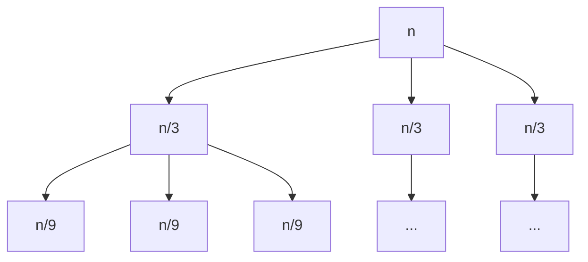
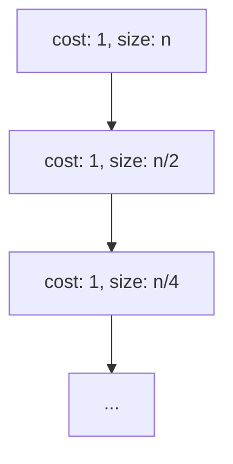
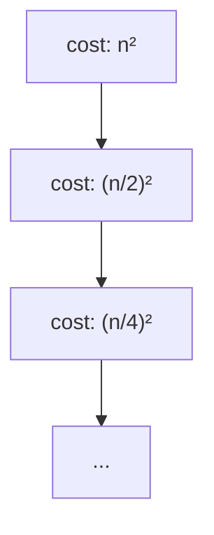
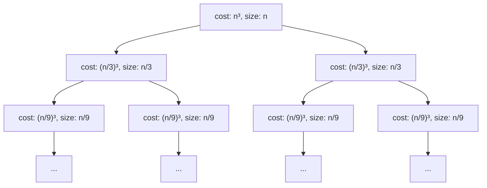
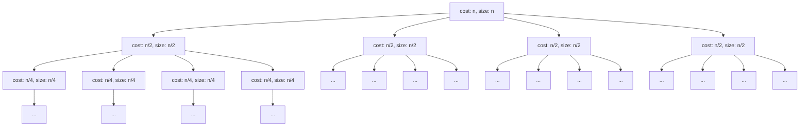
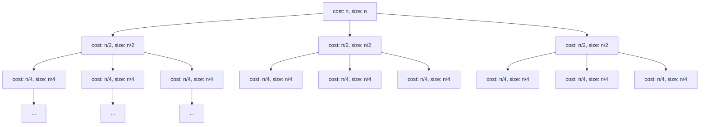
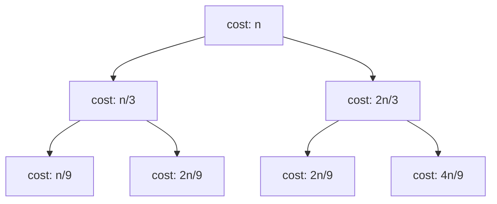
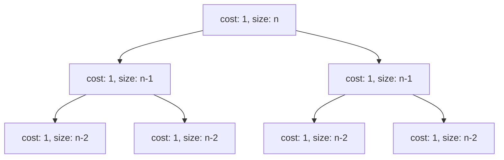

# Time Complexity in 1 hour

## **Chapter 1: The #1 Skill for Coding Interviews: Why Time Complexity Matters**

Imagine you're in a coding interview. The problem is "Two Sum":

> Given an array of integers `nums` and an integer `target`, return `True` if any two numbers in the array sum up to the `target`.

You provide a correct, brute-force solution:

```python
def two_sum_brute_force(nums, target):
    """
    Checks if any two numbers in the list sum up to the target.
    """
    n = len(nums)
    # Outer loop iterates through each element
    for i in range(n):
        # Inner loop checks it against every other element
        for j in range(i + 1, n): 
            if nums[i] + nums[j] == target:
                return True
    return False

# --- Example Usage ---
# Input:
my_nums = [3, 5, 2, 8, 11, 7]
my_target = 10

# Output:
# True (because 3 + 7 = 10)
two_sum_brute_force(my_nums, my_target)
```

The interviewer nods and asks the inevitable question: **"What is the time complexity of this solution?"**

This question is the gateway to a deeper technical discussion. It tests whether you can analyze performance and think about trade-offs. Answering it correctly for complex recursive algorithms is a non-negotiable skill for top engineering roles.

#### Your Goal & Our Promise

This guide is designed to make you an expert at analyzing recursive time complexity. By the end, you will be able to look at a recursive function, confidently derive its performance characteristics, and articulate it clearly to an interviewer.

You will master a powerful toolkit, turning intimidating concepts into practical skills:

*   **Big O Notation:** The core language of algorithmic efficiency.
*   **Recurrence Relations:** The mathematical models of recursive algorithms (e.g., $T(n) = 2T(n/2) + n$).
*   **The Recursion Tree Method:** A visual, intuitive technique for solving these recurrence relations.
*   **The Master Theorem & Characteristic Equation:** Advanced shortcuts for specific patterns you'll encounter.

Let's begin by quantifying why one solution is better than another.

## **Chapter 2: A Tale of Two Solutions: From Brute-Force to Brilliant**

Let's stick with our interview scenario. You've presented the `two_sum_brute_force` solution. The interviewer might say, "It works. But can you do better?"

This is a prompt to find a more *efficient* algorithm. The measure of "better" is almost always about time complexity. Let's explore a second solution to the "Two Sum" problem.

#### The Problem Redefined

**Problem:** Given an array `nums` and a `target`, find if a pair sums to `target`.
**Input:** `nums = [3, 5, 2, 8, 11, 7]`, `target = 10`
**Expected Output:** `True` (because 3 + 7 = 10)

---

#### Solution 1: The Brute-Force $O(n^2)$ Approach

This is the nested loop solution from Chapter 1. Let's analyze its performance intuitively.

```python
def two_sum_brute_force(nums, target):
    n = len(nums)
    operations = 0 # Let's count the checks
    for i in range(n):
        for j in range(i + 1, n):
            operations += 1
            if nums[i] + nums[j] == target:
                print(f"Brute-force took {operations} operations.")
                return True
    print(f"Brute-force took {operations} operations.")
    return False
```

For our input of 6 elements, this code performs $(5 + 4 + 3 + 2 + 1) = 15$ comparison operations. If the list had 100 elements, it would be around $100 \times 100 / 2 \approx 5,000$ operations. If it had 10,000 elements, we're looking at roughly **50 million operations**. The number of operations grows quadratically with the size of the input, $n$. We call this **$O(n^2)$** (pronounced "Big O of n squared").

---

#### Solution 2: The Optimized $O(n)$ Approach

How can we avoid the nested loop? We can use a hash set (or a dictionary/hash map in Python) to store the numbers we've already seen.

The logic is simple: for each number $x$ in the array, we check if $target - x$ is already in our set of seen numbers.
*   If it is, we've found a pair!
*   If not, we add $x$ to the set and continue.

```python
def two_sum_optimized(nums, target):
    seen = set()
    operations = 0 # Let's count the checks
    for num in nums:
        operations += 1
        potential_match = target - num
        if potential_match in seen:
            print(f"Optimized took {operations} operations.")
            return True
        seen.add(num)
    print(f"Optimized took {operations} operations.")
    return False
```

Let's trace this with our input: `nums = [3, 5, 2, 8, 11, 7]`, `target = 10`

| Current `num` | `potential_match` (10 - num) | `seen` Set         | Action                               |
| :------------ | :--------------------------- | :----------------- | :----------------------------------- |
| **3**         | 7                            | `{}`               | 7 not in `seen`. Add 3 to `seen`.    |
| **5**         | 5                            | `{3}`              | 5 not in `seen`. Add 5 to `seen`.    |
| **2**         | 8                            | `{3, 5}`           | 8 not in `seen`. Add 2 to `seen`.    |
| **8**         | 2                            | `{3, 5, 2}`        | **Found!** 2 is in `seen`. Return `True`. |

This algorithm only needed **4 operations**. If the list had 10,000 elements, it would take at most 10,000 operations—a massive improvement over 50 million! The work scales linearly with the input size $n$. We call this **$O(n)$** (pronounced "Big O of n").

#### The "Aha!" Moment: Why This Matters

| Input Size (n) | $O(n^2)$ Approx. Operations | $O(n)$ Approx. Operations | Performance Difference |
| :------------- | :------------------------- | :------------------------ | :--------------------- |
| 10             | 50                         | 10                        | 5x faster              |
| 100            | 5,000                      | 100                       | 50x faster             |
| 1,000          | 500,000                    | 1,000                     | 500x faster            |
| 10,000         | 50,000,000                 | 10,000                    | **5,000x faster**      |
| 1,000,000      | 500,000,000,000            | 1,000,000                 | **500,000x faster**    |

The optimized $O(n)$ solution isn't just a little better; it's in a completely different league. For a million items, the $O(n^2)$ solution would take minutes or hours, while the $O(n)$ solution finishes in a fraction of a second.

This is the core of complexity analysis. We need a formal way to describe this "growth rate" so we can compare algorithms without having to run them. That language is Big O notation.

## **Chapter 3: The Language of Growth: A Practical Intro to Big O Notation**

In the last chapter, we saw that $O(n)$ is dramatically better than $O(n^2)$. But what do these notations actually mean?

**Big O notation describes the upper bound of an algorithm's runtime.** It answers the question: "As the input size $n$ grows towards infinity, what is the worst-case growth rate of the number of operations?"

It’s a way of classifying algorithms by how they respond to changes in input size. Let's skip the dense mathematical proofs for now and focus on the practical rules you'll use 99% of the time in an interview.

#### The Rules of the Game: Simplifying Complexity

##### Rule 1: Drop the Constants

Big O only cares about the rate of growth, not the exact number of operations. If you have an algorithm that performs $2n$ operations and another that performs $n$ operations, we consider them both to have the same complexity: $O(n)$. The $2$ is a constant factor that doesn't change the fundamental linear growth.

*   $O(2n)$ simplifies to $O(n)$
*   $O(500)$ simplifies to $O(1)$ (This is called "constant time")
*   $O(n/3)$ simplifies to $O(n)$

**Code Example:**
This function has roughly $2n$ operations, but its complexity is $O(n)$.

```python
def print_items_twice(items):
    # This loop runs n times
    for item in items:
        print(item)
    
    # This loop also runs n times
    for item in items:
        print(item)
```

##### Rule 2: Keep the Most Dominant Term

When your operation count has multiple terms, you only keep the one that grows the fastest. Think about what happens when $n$ is a million. The term $n^2$ (a trillion) is so much larger than $n$ (a million) that the $n$ becomes insignificant.

*   $O(n^2 + n)$ simplifies to $O(n^2)$.
*   $O(2^n + n^3)$ simplifies to $O(2^n)$.
*   $O(n + \log n)$ simplifies to $O(n)$.

**Code Example:**
This function has $O(n)$ work followed by $O(n^2)$, so the total is dominated by $O(n^2)$.

```python
def mixed_operations(items):
    n = len(items)
    # This part is O(n)
    for item in items:
        print(item)

    # This part is O(n^2)
    for i in range(n):
        for j in range(n):
            print(i, j)
```
Its complexity is $O(n + n^2)$, which simplifies to $O(n^2)$.

#### The Growth Rate Hierarchy

This leads to a clear hierarchy of common complexities. You should know this chart by heart.

| Big O       | Name              | Example                                    | Performance                  |
| :---------- | :---------------- | :----------------------------------------- | :--------------------------- |
| **$O(1)$**      | **Constant**      | Accessing an array element `arr[i]`        | **Excellent**                |
| **$O(\log n)$**  | **Logarithmic**   | Binary Search                              | **Excellent**                |
| **$O(n)$**      | **Linear**        | Looping through an array once              | **Good**                     |
| **$O(n \log n)$**| **Log-Linear**    | Efficient sorting (Merge Sort, Quick Sort) | **Good**                     |
| **$O(n^2)$**     | **Quadratic**     | Nested loops (`for i... for j...`)       | **Okay** for small $n$         |
| **$O(n^3)$**     | **Cubic**         | Triple nested loops                        | **Poor**                     |
| **$O(2^n)$**    | **Exponential**   | Recursive Fibonacci calculation            | **Terrible**, often unusable |
| **$O(n!)$**     | **Factorial**     | Traveling Salesperson (brute-force)        | **Unusably Bad**             |

With this language established, we can now start analyzing code more formally. In the next chapter, we'll apply these rules to basic code structures before we tackle the main event: recursion.

## **Chapter 3: The Language of Growth: A Formal Introduction to Big O**

In the last chapter, we saw that an $O(n)$ algorithm is fundamentally better than an $O(n^2)$. But this is just a label. To use it correctly, we need to understand its formal mathematical definition.

#### The Core Idea: Asymptotic Analysis (Why "Towards Infinity"?)

Why do we care about what happens when the input size $n$ gets very large?

Consider two algorithms with the following exact operation counts:
*   **Algorithm A:** $f(n) = n^2$
*   **Algorithm B:** $f(n) = 100n + 500$

Let's see who wins for small vs. large inputs:
*   **When $n = 10$:**
    *   Algorithm A: $10^2 = 100$ operations. **(Wins)**
    *   Algorithm B: $100 \times 10 + 500 = 1500$ operations.
*   **When $n = 200$:**
    *   Algorithm A: $200^2 = 40,000$ operations.
    *   Algorithm B: $100 \times 200 + 500 = 20,500$ operations. **(Wins)**
*   **When $n = 1,000,000$:**
    *   Algorithm A: $(10^6)^2 = 10^{12}$ (one trillion) operations.
    *   Algorithm B: $100 \times 10^6 + 500 \approx 10^8$ (100 million) operations. **(Wins decisively)**

For small inputs, the constants ($100$) and lower-order terms ($500$) in Algorithm B make it seem slow. But as $n$ grows, the $n^2$ term in Algorithm A completely dominates everything else. Its inherent *growth rate* is worse.

**Asymptotic analysis** is the study of this long-term behavior. We analyze algorithms as $n$ approaches infinity to understand their true, scalable nature, ignoring the distracting noise of constant factors and behavior at small input sizes.

#### The Formal Definition of Big O

Now for the math. We say a function $f(n)$ is in the set $O(g(n))$, written as **$f(n) = O(g(n))$**, if:

> There exist positive constants **$c$** and **$n_0$** such that **$0 \leq f(n) \leq c \cdot g(n)$** for all $n \geq n_0$.

Let's break this down:
*   $f(n)$ is your actual, messy function for the number of operations (e.g., $3n^2 + 10n + 5$).
*   $g(n)$ is your simple, clean approximation (e.g., $n^2$).
*   **$c$** is a constant factor. It's our "wiggle room." We're allowed to scale up $g(n)$ to make it a valid upper bound.
*   **$n_0$** is a threshold for $n$. It means "we only care about this relationship for inputs that are large enough (i.e., bigger than $n_0$)."

In plain English: **$f(n) = O(g(n))$ means that $f(n)$ is "less than or equal to" $g(n)$ in the long run, up to a constant factor.**

#### Applying the Definition: From Math to Practical Rules

Let's use the formal definition to prove the "rules" we mentioned earlier.

**Example 1: Justifying "Drop the Constants"**
Let's prove that $f(n) = 3n$ is $O(n)$.
*   Here, $f(n) = 3n$ and our guess is $g(n) = n$.
*   We must find $c$ and $n_0$ such that $3n \leq c \cdot n$ for all $n \geq n_0$.
*   Let's choose $c = 4$. The inequality becomes $3n \leq 4n$. This is true for all $n \geq 1$.
*   **Proof:** We found the constants! We can choose $c = 4$ and $n_0 = 1$. Since they exist, the definition holds. Therefore, $3n = O(n)$.

**Example 2: Justifying "Keep the Dominant Term"**
Let's prove that $f(n) = n^2 + 5n$ is $O(n^2)$.
*   Here, $f(n) = n^2 + 5n$ and our guess is $g(n) = n^2$.
*   We must find $c$ and $n_0$ such that $n^2 + 5n \leq c \cdot n^2$ for all $n \geq n_0$.
*   This looks trickier. Let's try to make the right side bigger. What if we try $c = 2$?
    *   $n^2 + 5n \leq 2n^2$
    *   Subtract $n^2$ from both sides: $5n \leq n^2$
    *   Divide by $n$ (we can assume $n > 0$): $5 \leq n$
*   **Proof:** The inequality $n^2 + 5n \leq 2n^2$ holds true for all $n \geq 5$. So we found our constants: $c = 2$ and $n_0 = 5$. The definition is satisfied. Therefore, $n^2 + 5n = O(n^2)$.

#### The Growth Rate Hierarchy (Revisited)

This concept of dominance gives us a clear hierarchy. Let's see it with numbers.

| n         | $\log n$ (approx) | $n$         | $n \log n$ (approx) | $n^2$        | $2^n$ (approx)               |
| :-------- | :--------------- | :---------- | :----------------- | :---------- | :--------------------------- |
| 10        | 3                | 10          | 33                 | 100         | 1,024 (1 thousand)           |
| 100       | 7                | 100         | 664                | 10,000      | 1.26 x 10³⁰ (a huge number)  |
| 1,000     | 10               | 1,000       | 9,965              | 1,000,000   | ... (unimaginably large)     |
| 1,000,000 | 20               | 1,000,000   | 2 x 10⁷ (20M)      | 10¹² (1T)   | ... (don't even think about it) |

As you can see, for large $n$, the value of a faster-growing function completely dwarfs the others. This is why we only care about the most dominant term. Now, with this solid foundation, we're ready to analyze real code.

## **Chapter 4: Basic Training: Analyzing Loops and Conditionals**

Before we dive into the complexities of recursion, we must be able to instantly analyze the runtime of non-recursive code. Every recursive algorithm ultimately breaks down into basic operations, loops, and conditional statements.

#### The Building Block: $O(1)$ - Constant Time

An operation is $O(1)$ if it takes the same amount of time to execute regardless of the input size $n$. These are the atoms of our runtime analysis.

**Common $O(1)$ operations:**
*   Arithmetic operations (`+`, `-`, `*`, `/`).
*   Variable assignment.
*   Accessing an element in an array or hash map (`my_array[i]`, `my_map['key']`).
*   A single `if` statement.
*   Calling a function (just the call itself, not the work inside it).

```python
def get_first_element(items):
    # This is one O(1) operation
    first = items[0]
    # This is another O(1) operation
    print(first)

# Total complexity: O(1) + O(1) = O(2) => O(1)
# No matter if items has 10 or 10 million elements, this function does the same amount of work.
```

---

#### $O(n)$ - Linear Time

This is the most common complexity for simple loops. The runtime grows in direct proportion to the size of the input.

**How to spot it:** A single `for` loop that iterates from $0$ to $n-1$.

```python
def find_sum(nums):
    total = 0  # O(1)
    # The loop body runs 'n' times, where n = len(nums)
    for num in nums:
        # Inside the loop, we have O(1) work
        total += num # O(1)
    return total # O(1)

# Total complexity: O(1) + n * O(1) + O(1) = O(2 + n) => O(n)
```
The total work is dominated by the loop, which is directly tied to the input size $n$.

---

#### $O(n^2)$ - Quadratic Time

The runtime grows proportionally to the square of the input size. This is typical of algorithms that need to compare every element of a collection to every other element.

**How to spot it:** Nested loops where both loops iterate up to $n$.

```python
def create_pairs(items):
    pairs = [] # O(1)
    n = len(items) # O(1)
    # Outer loop runs n times
    for i in range(n):
        # Inner loop also runs n times
        for j in range(n):
            # The work inside is O(1)
            pairs.append((items[i], items[j]))
    return pairs # O(1)

# Total complexity: n * n * O(1) = O(n²)
```
Our `two_sum_brute_force` example from Chapter 1 was slightly different (`for j in range(i + 1, n)`), but the asymptotic complexity is the same. The total number of operations was $(n-1) + (n-2) + \ldots + 1$, which is the sum of an arithmetic series and equals $n(n-1)/2 = 0.5n^2 - 0.5n$. Applying our Big O rules (drop constants, keep dominant term), this simplifies to $O(n^2)$.

---

#### Practice Set #1: Analyze These Snippets

Use the rules we've learned to determine the time complexity of the following functions.

**Question 1:**
```python
def check_middle(items):
    n = len(items)
    middle_index = n // 2
    if items[middle_index] == "hello":
        return True
    return False
```

**Answer: $O(1)$**

Finding the length, calculating the middle, and accessing that one element are all constant time operations. The function's runtime does not depend on the size of `items`.


**Question 2:**
```python
def count_matches(list_a, list_b):
    count = 0
    for item_a in list_a:
        for item_b in list_b:
            if item_a == item_b:
                count += 1
    return count
```
*(Hint: What are the input sizes? Let $N$ be the length of `list_a` and $M$ be the length of `list_b$.)*

**Answer: $O(N \times M)$**

The outer loop runs $N$ times, and for each of those iterations, the inner loop runs $M$ times. If $N$ and $M$ are the same size, this becomes $O(N^2)$.
s
**Question 3:**
```python
def process_data(items):
    n = len(items)
    # First loop
    for i in range(n):
        print(items[i])

    # Second loop
    for i in range(n):
        for j in range(n):
            print(i, j)
```

**Answer: $O(n^2)$**

The total work is the sum of the work from both parts: $O(n) + O(n^2)$. We apply the rule of keeping the most dominant term, so the final complexity is $O(n^2)$.

With these fundamentals locked in, we are now ready to tackle the main challenge: translating a recursive function into a mathematical expression we can solve.

## **Chapter 5: Entering the Maze: From Code to Recurrence Relation**

We can analyze loops, but how do we handle a function that calls itself? The runtime isn't a simple sequence; it's a chain of calls. To solve this, we will learn to turn recursive code into a mathematical equation—a **recurrence relation**—and then solve it.

#### Our First Case: Factorial

Let's start with the classic recursive `factorial` function. Our goal is to find its Big O complexity.

```python
def factorial(n):
    # Base Case
    if n <= 1:
        return 1
    
    # Recursive Step
    return n * factorial(n - 1) 
```

**Step 1: Define the Relation**
Let $T(n)$ be the time it takes to run `factorial(n)`. We can break down the work:
*   **Work inside the current call:** The function performs one comparison (`n <= 1`) and one multiplication (`n * ...`). This is a constant amount of work, which we'll call $c$. It is $O(1)$.
*   **Work from the recursive call:** The function calls itself once on a smaller input, `factorial(n-1)`. The time this subproblem takes is, by our definition, $T(n-1)$.

Combining these gives us the total time:
*   **Recurrence:** $T(n) = T(n-1) + c$
*   **Base Case:** When $n=1$, the function does a constant amount of work and stops. So, $T(1) = c$.

**Step 2: Solve by Expansion (Substitution)**
Now we have a formula. To solve it, we can repeatedly substitute the formula into itself to find a pattern.

*   $T(n) = T(n-1) + c$
*   We know from the formula that $T(n-1) = T(n-2) + c$. Let's plug that in:
*   $T(n) = (T(n-2) + c) + c = T(n-2) + 2c$
*   Let's do it again. We know $T(n-2) = T(n-3) + c$:
*   $T(n) = (T(n-3) + c) + 2c = T(n-3) + 3c$

A clear pattern is emerging. After $k$ steps of expansion, we get:
$T(n) = T(n-k) + k \cdot c$

This expansion stops when we hit the base case, $T(1)$. This happens when $n-k = 1$, which means we must have performed $k = n-1$ expansions.

Now, we substitute $k = n-1$ back into our pattern:
$T(n) = T(n-(n-1)) + (n-1) \cdot c$
$T(n) = T(1) + (n-1) \cdot c$
$T(n) = c + (n-1) \cdot c = c + nc - c = nc$

The total work is $n$ multiplied by some constant $c$. In Big O notation, we drop the constant.

**Conclusion: The time complexity of `factorial(n)` is $O(n)$.**

---

#### The General Process: Define, Expand, Conquer

What we just did is a repeatable process for solving simple recurrences.

1.  **Define the Relation:** Analyze the recursive function to produce a recurrence $T(n) = \ldots$ and a base case $T(1) = \ldots$.
2.  **Expand the Relation:** Use substitution to expand the recurrence several times until you identify a general pattern after $k$ steps.
3.  **Conquer the Pattern:**
    *   Find the value of $k$ that makes the recursion hit its base case.
    *   Substitute this value of $k$ back into your generalized pattern.
    *   Simplify the final equation to find the Big O complexity.

---

#### Applying the Process to Binary Search

Let's use our new process on a different kind of algorithm: binary search. It reduces the problem size by half each time.

**The Recurrence:** From the last chapter, we know the relation for binary search is:
*   $T(n) = T(n/2) + c$
*   $T(1) = c$

**Step 2: Expand the Relation**
*   $T(n) = (T(n/4) + c) + c = T(n/4) + 2c$
*   $T(n) = (T(n/8) + c) + 2c = T(n/8) + 3c$
*   After $k$ steps, the pattern is: $T(n) = T(n / 2^k) + k \cdot c$

**Step 3: Conquer the Pattern**
The recursion stops when the problem size is 1. So, we set $n / 2^k = 1$.
To solve for $k$:
$n = 2^k$
$k = \log_2(n)$

The recursion is $\log_2(n)$ levels deep. Now, substitute this value of $k$ back into the pattern:
$T(n) = T(1) + (\log_2 n) \cdot c$
$T(n) = c + c \cdot \log_2 n$

Dropping constants and lower-order terms gives us the final answer.

**Conclusion: The time complexity of binary search is $O(\log n)$.**

---

This substitution method is powerful, but it gets messy for more complex recurrences, like $T(n) = 2T(n/2) + n$. For those, we need a more visual and organized approach, which we will introduce next: The Recursion Tree Method.

## **Chapter 7: Practice Run #1 - The "Balanced" Tree (Divide and Conquer)**

We have established our 4-step Recursion Tree Method. Now, let's put it into practice to build our skills. The most common type of recurrence you'll see in interviews is the "divide and conquer" pattern, where the work done at each level of the recursion tree is roughly the same. We've already seen this with Merge Sort ($T(n) = 2T(n/2) + n$), which resulted in $O(n \log n)$.

Let's see what happens when we slightly change the recurrence.

#### Main Example: $T(n) = 3T(n/3) + n$

Imagine an algorithm that works as follows:
*   It takes a problem of size $n$.
*   It divides the problem into **three** subproblems, each **one-third** of the original size.
*   The work to divide the problem and combine the results is $O(n)$.

This gives us the recurrence $T(n) = 3T(n/3) + n$. Let's analyze it with our 4-step method.

**Step 1: Draw the Tree**

*   **Level 0:** A single node of size $n$ does $n$ work.
*   **Level 1:** It spawns three subproblems, each of size $n/3$. Each of these nodes does $n/3$ work.
*   **Level 2:** Each of the three $n/3$ nodes spawns three $n/9$ nodes, for a total of nine nodes. Each $n/9$ node does $n/9$ work.



**Step 2: Calculate Work Per Level**

*   **Level 0:** $n$
*   **Level 1:** $3 \times (n/3) = n$
*   **Level 2:** $9 \times (n/9) = n$
*   **Level k:** At level $k$, there are $3^k$ nodes, each working on a problem of size $n/3^k$.
    *   Total work = $3^k \times (n/3^k) = n$

Just like with Merge Sort, we have a **balanced tree**. The work at every level is consistently $n$.

**Step 3: Determine the Tree Height**

The recursion stops when the problem size is 1. At level $k$, the problem size is $n/3^k$.
Set $n/3^k = 1 \Rightarrow n = 3^k$.
To solve for $k$, we take the logarithm base 3:
$k = \log_3(n)$

The tree is $\log_3(n)$ levels deep.

**Step 4: Sum the Work Across All Levels**

*   Total Levels = $\log_3(n)$
*   Work per Level = $n$

Total Work $T(n) = (\text{Number of Levels}) \times (\text{Work per Level})$
$T(n) = \log_3(n) \times n$

**Conclusion: $T(n) = O(n \log n)$**. Notice that the base of the logarithm ($3$ in this case) is dropped in Big O notation. Whether you split into 2, 3, or 20 subproblems, if the work per level is balanced, the complexity remains $O(n \log n)$.

---

#### Practice Problem: Analyze Binary Search

Let's re-analyze a problem we solved in Chapter 5, this time using the Recursion Tree Method to see if we get the same answer.

**Recurrence:** $T(n) = T(n/2) + 1$

**Step 1: Draw the Tree**
The tree is very simple. Each node has only one child.

*   **Level 0:** One node does $1$ unit of work.
*   **Level 1:** It spawns one subproblem of size $n/2$, which does $1$ unit of work.
*   **Level 2:** It spawns one subproblem of size $n/4$, which does $1$ unit of work.



**Step 2: Calculate Work Per Level**
This is trivial. At every level, there is exactly one node doing $1$ unit of work.
*   Work at Level $k$ = $1$.

**Step 3: Determine the Tree Height**
The problem size at level $k$ is $n/2^k$. We stop when $n/2^k = 1$.
$k = \log_2(n)$

**Step 4: Sum the Work Across All Levels**
*   Total Levels = $\log_2(n)$
*   Work per Level = $1$

Total Work $T(n) = (\text{Number of Levels}) \times (\text{Work per Level})$
$T(n) = \log_2(n) \times 1$

**Conclusion:** The recursion tree confirms our previous result: **$T(n) = O(\log n)$**.

In the next chapters, we will explore what happens when the work per level is *not* balanced.

## **Chapter 8: Practice Run #2 - The "Root-Heavy" Tree**

In the last chapter, we saw "balanced" trees where the work at each level was the same, leading to $O(n \log n)$ complexity. But what happens if the non-recursive work (the $+ f(n)$ part of the recurrence) is very expensive?

This leads to a "root-heavy" or "top-heavy" recursion tree, where the work done in the very first call dominates the total runtime.

#### Main Example: $T(n) = T(n/2) + n^2$

Imagine an algorithm with the following structure:
*   It does $O(n^2)$ work.
*   Then, it makes a *single* recursive call on a problem that is *half* the size.

This seems inefficient, but let's prove its complexity using our 4-step method.

**Step 1: Draw the Tree**

*   **Level 0:** A single node of size $n$ does $n^2$ work.
*   **Level 1:** It spawns one subproblem of size $n/2$. This node does $(n/2)^2 = n^2/4$ work.
*   **Level 2:** The $n/2$ node spawns one $n/4$ node. This node does $(n/4)^2 = n^2/16$ work.



**Step 2: Calculate Work Per Level**

Since there is only one node at each level, the work per level is just the work of that single node.

*   **Level 0:** $n^2$
*   **Level 1:** $n^2/4$
*   **Level 2:** $n^2/16$
*   **Level k:** The work is $(n / 2^k)^2 = n^2 / 4^k$

This is a **geometrically decreasing series**. The work is shrinking rapidly at each level.

**Step 3: Determine the Tree Height**

The recursion stops when the problem size is 1. At level $k$, the problem size is $n/2^k$.
Set $n/2^k = 1 \Rightarrow n = 2^k \Rightarrow k = \log_2(n)$.
The tree is $\log_2(n)$ levels deep.

**Step 4: Sum the Work Across All Levels**

We need to sum the work from all levels:
Total Work $T(n) = n^2 + n^2/4 + n^2/16 + n^2/64 + \ldots$
We can factor out the $n^2$:
$T(n) = n^2 \times (1 + 1/4 + 1/16 + 1/64 + \ldots)$

The expression in the parentheses is an infinite geometric series with a ratio $r = 1/4$. The sum of such a series is given by the formula $1 / (1 - r)$.
Sum = $1 / (1 - 1/4) = 1 / (3/4) = 4/3$.

So, the total work is $T(n) = n^2 \times (4/3)$.

Using Big O notation, we drop the constant factor $4/3$.

**Key Insight:** The very first term, $n^2$, accounts for $3/4$ of the total work! The root level completely dominates the runtime.

**Conclusion: $T(n) = O(n^2)$**.

---

#### Practice Problem: Analyze $T(n) = 2T(n/3) + n^3$

Let's apply the same logic to a slightly more complex recurrence.
*   Two subproblems, each 1/3 the size.
*   $O(n^3)$ work at each step.

**Step 1: Draw the Tree**
*   Level 0 has one node doing $n^3$ work.
*   Level 1 has two nodes, each doing $(n/3)^3 = n^3/27$ work.
*   Level 2 has four nodes, each doing $(n/9)^3 = n^3/729$ work.



**Step 2: Calculate Work Per Level**
*   **Level 0:** $n^3$
*   **Level 1:** $2 \times (n^3/27) = (2/27) \times n^3$
*   **Level 2:** $4 \times (n^3/729) = (4/729) \times n^3$

The work is decreasing very quickly. The ratio between the work at level 1 and level 0 is $2/27$, which is much less than 1.

**Step 3: Determine the Tree Height**
The problem size at level $k$ is $n/3^k$. We stop when this is 1.
$n = 3^k \Rightarrow k = \log_3(n)$

**Step 4: Sum the Work Across All Levels**
The total work is $T(n) = n^3 + (2/27)n^3 + (4/729)n^3 + \ldots$
This is another geometric series dominated by the first term. We don't even need to calculate the full sum. Because the work is geometrically decreasing, the root level's work, $n^3$, provides a tight asymptotic bound.

**Conclusion: $T(n) = O(n^3)$**.

This "root-heavy" pattern is a crucial one to recognize: **If the work done at each level is geometrically decreasing, the total complexity is determined by the work done at the root level.**

## **Chapter 9: Practice Run #3 - The "Leaf-Heavy" Tree**

We've seen what happens when the work per level is constant (balanced) or decreasing (root-heavy). Now we'll investigate the third major pattern: what if the work *increases* at each level?

This happens when a recursive call creates many subproblems relative to the reduction in problem size. The result is a "leaf-heavy" or "bottom-heavy" tree, where the vast majority of the work happens in the final, deepest level of the recursion.

#### Main Example: $T(n) = 4T(n/2) + n$

Consider an algorithm that:
*   Takes a problem of size $n$ and does $O(n)$ work.
*   Then, it breaks the problem into **four** subproblems, each **half** the original size.

Let's use our 4-step method to analyze $T(n) = 4T(n/2) + n$.

**Step 1: Draw the Tree**

*   **Level 0:** A single node of size $n$ does $n$ work.
*   **Level 1:** It spawns **four** subproblems of size $n/2$. Each does $n/2$ work.
*   **Level 2:** Each of the four $n/2$ nodes spawns four $n/4$ nodes, for a total of $4 \\times 4 = 16$ nodes. Each does $n/4$ work.



**Step 2: Calculate Work Per Level**

*   **Level 0:** $n$
*   **Level 1:** $4 \\times (n/2) = 2n$
*   **Level 2:** $16 \\times (n/4) = 4n$
*   **Level k:** At level $k$, there are $4^k$ nodes, each working on a problem of size $n/2^k$.
    *   Total work = $4^k \\times (n/2^k) = n \\times (4^k / 2^k) = n \\times 2^k$

This is a **geometrically increasing series**. The work at each level is doubling!

**Step 3: Determine the Tree Height**

The recursion path follows the problem size reduction. At level $k$, the size is $n/2^k$.
Set $n/2^k = 1 \Rightarrow n = 2^k \Rightarrow k = \log_2(n)$.
The tree is $\log_2(n)$ levels deep.

**Step 4: Sum the Work Across All Levels**

The total work is the sum of a geometric series:
$T(n) = n + 2n + 4n + \ldots + n \cdot 2^{\log_2 n}$ (summing over all levels up to the height)

The last term is the work at the leaf level. Let's simplify that last term: $n \cdot 2^{\log_2 n}$.
Using the logarithm identity $a^{\log_a b} = b$, we have $2^{\log_2 n} = n$.
So, the work at the last level is $n \cdot n = n^2$.

The total work is $n \times (1 + 2 + 4 + \ldots + 2^{\log_2 n})$. The sum of a geometric series $1+r+r^2+\ldots+r^k$ is $(r^{k+1}-1)/(r-1)$. In our case, $r=2$ and $k = \log_2(n)$. The sum is approximately $2^{k+1}$, which is $2^{\log_2 n + 1} = 2 \times 2^{\log_2 n} = 2n$.
So the total work is $n \times (2n - 1) = 2n^2 - n$.
However, an easier way to think about it is that in a geometrically *increasing* series, the last term dominates the sum.

**Key Insight:** The work at the leaf level ($O(n^2)$) is asymptotically larger than the sum of the work at all previous levels combined. Therefore, the complexity is determined entirely by the number of leaves.

Number of leaves = $4^{\text{height}} = 4^{\log_2 n} = (2^2)^{\log_2 n} = 2^{2 \log_2 n} = 2^{\log_2(n^2)} = n^2$.
Since the work at each leaf node is $O(1)$, the total work at the leaves is $n^2 \times O(1) = O(n^2)$.

**Conclusion: $T(n) = O(n^2)$**.

---

#### Practice Problem: Analyze $T(n) = 3T(n/2) + n$

*   Three subproblems, each half the size.
*   $O(n)$ work at each step.

**Step 1: Draw the Tree**



**Step 2: Calculate Work Per Level**
*   **Level 0:** $n$
*   **Level 1:** $3 \times (n/2) = (3/2) \times n$
*   **Level 2:** $9 \times (n/4) = (9/4) \times n$
*   **Level k:** $3^k \times (n/2^k) = n \times (3/2)^k$
The work is geometrically increasing with a ratio of $3/2$. This tells us it's a leaf-heavy tree.

**Step 3: Tree Height**
Problem size is $n/2^k$. Height $k = \log_2(n)$.

**Step 4: Sum the Work (Focus on the Leaves)**
Since it's a leaf-heavy tree, the complexity is determined by the number of leaves.
Number of leaves = $(\text{Number of branches})^{\text{height}} = 3^{\log_2 n}$
This is a tricky term. We can use the logarithm change of base rule: $a^{\log_b(c)} = c^{\log_b(a)}$.
So, $3^{\log_2 n} = n^{\log_2 3}$.
Since $\log_2 3 \approx 1.58$, the complexity is $O(n^{1.58})$.

**Conclusion: $T(n) = O(n^{\log_2 3})$**. This is the formal statement of the Master Theorem's third case, but we've derived it from scratch with the recursion tree.

This "leaf-heavy" pattern is the last of the three major archetypes. You can now analyze most divide-and-conquer recurrences by identifying if they are **balanced, root-heavy, or leaf-heavy**.

## **Chapter 10: The Master Theorem - A Shortcut for Divide & Conquer**

After analyzing recurrences with the Recursion Tree method, you've likely noticed three distinct patterns: root-heavy, leaf-heavy, and balanced. The **Master Theorem** is a powerful theorem that formalizes this intuition into a quick and easy-to-use formula. It's a direct recipe for solving most divide-and-conquer recurrences you'll encounter.

#### The Master Theorem Formula

The Master Theorem provides a solution for recurrences of the form:

**$T(n) = a \cdot T(n/b) + f(n)$**

where:
*   $a \geq 1$ is the number of subproblems (branches).
*   $b > 1$ is the factor by which the input size is reduced.
*   $f(n)$ is the work done outside the recursive calls.

First, you calculate a critical value: **$c_{\text{crit}} = \log_b(a)$**. This value represents the "tipping point" for the work distribution in the tree. You then compare the growth of $f(n)$ to $n^{c_{\text{crit}}}$.

The solution for $T(n)$ falls into one of three cases:

---

| Case  | Condition                                                      | Result (The Answer)                        | Intuition (from previous chapters) |
| :---- | :------------------------------------------------------------- | :----------------------------------------- | :--------------------------------- |
| **1** | If $f(n)$ grows **slower than** $n^{c_{\text{crit}}}$                       | $T(n) = \Theta(n^{\log_b a})$                     | **Leaf-Heavy Tree**                |
| **2** | If $f(n)$ grows at the **same rate as** $n^{c_{\text{crit}}}$               | $T(n) = \Theta(n^{\log_b a} \cdot \log n)$              | **Balanced Tree**                  |
| **3** | If $f(n)$ grows **faster than** $n^{c_{\text{crit}}}$                       | $T(n) = \Theta(f(n))$                           | **Root-Heavy Tree**                |

*(Note: There are more formal definitions with $\varepsilon$ and regularity conditions, but this simplified version works for nearly all polynomial $f(n)$ you'll see in interviews.)*

---

#### Applying the Formula: Solving Problems in Seconds

Let's use this formula on the examples we've already solved the long way.

**Example 1: Merge Sort ($T(n) = 2T(n/2) + n$)**
1.  **Identify parameters:** $a = 2$, $b = 2$, $f(n) = n$.
2.  **Calculate critical value:** $c_{\text{crit}} = \log_b(a) = \log_2(2) = 1$.
3.  **Compare:** $f(n) = n$ grows at the same rate as $n^{c_{\text{crit}}} = n^1$.
4.  **Conclusion:** This is **Case 2**. The result is $T(n) = \Theta(n^1 \cdot \log n) = \Theta(n \log n)$.

**Example 2: Leaf-Heavy ($T(n) = 4T(n/2) + n$)**
1.  **Identify parameters:** $a = 4$, $b = 2$, $f(n) = n$.
2.  **Calculate critical value:** $c_{\text{crit}} = \log_b(a) = \log_2(4) = 2$.
3.  **Compare:** $f(n) = n$ grows slower than $n^{c_{\text{crit}}} = n^2$.
4.  **Conclusion:** This is **Case 1**. The result is $T(n) = \Theta(n^{\log_2 4}) = \Theta(n^2)$.

**Example 3: Root-Heavy ($T(n) = T(n/2) + n^2$)**
1.  **Identify parameters:** $a = 1$, $b = 2$, $f(n) = n^2$.
2.  **Calculate critical value:** $c_{\text{crit}} = \log_b(a) = \log_2(1) = 0$.
3.  **Compare:** $f(n) = n^2$ grows faster than $n^{c_{\text{crit}}} = n^0 = 1$.
4.  **Conclusion:** This is **Case 3**. The result is $T(n) = \Theta(f(n)) = \Theta(n^2)$.

#### Practice Table: Master the Patterns

Use the Master Theorem to quickly solve these common recurrences.

| Recurrence Relation           | a | b | f(n)    | $c_{\text{crit}} = \log_b(a)$ | Comparison                         | Case | Big O Complexity       |
| :---------------------------- | :-: | :-: | :------ | :------------------ | :--------------------------------- | :--: | :--------------------- |
| $T(n) = 8T(n/2) + n^2$         | 8 | 2 | $n^2$    | $\log_2(8) = 3$       | $n^2$ is slower than $n^3$           |  1   | $\Theta(n^3)$                |
| $T(n) = T(n/4) + 1$           | 1 | 4 | $1$     | $\log_4(1) = 0$       | $1$ is same as $n^0$              |  2   | $\Theta(\log n)$             |
| $T(n) = 2T(n/2) + n \log n$    | 2 | 2 | $n \log n$| $\log_2(2) = 1$       | $n \log n$ is faster than $n^1$     |  3   | $\Theta(n \log n)$           |
| $T(n) = 7T(n/2) + n^2$         | 7 | 2 | $n^2$    | $\log_2(7) \approx 2.8$     | $n^2$ is slower than $n^{2.8}$        |  1   | $\Theta(n^{\log_2 7})$          |
| $T(n) = 3T(n/2) + n^2$         | 3 | 2 | $n^2$    | $\log_2(3) \approx 1.58$    | $n^2$ is faster than $n^{1.58}$       |  3   | $\Theta(n^2)$                |
| $T(n) = T(n/3) + T(2n/3) + n$ | - | - | -       | -                   | **Unequal splits**                 |  -   | Use Recursion Tree     |

The Master Theorem is an essential shortcut. However, it's not a silver bullet. What happens when recursive calls split the problem unequally, like $T(n) = T(n/3) + T(2n/3) + n$? This doesn't fit the standard $aT(n/b)$ format because the subproblem sizes are different. When the Master Theorem doesn't apply, we must return to our fundamental tool: the Recursion Tree Method. We will explore this in the next chapter.

## **Chapter 11: When the Shortcut Fails - Analyzing Unbalanced Trees**

The Master Theorem is an incredible tool, but its power comes with a strict condition: it only works for recurrences of the form $T(n) = aT(n/b) + f(n)$. This template assumes that the problem is broken into $a$ subproblems of *equal size* ($n/b$).

What happens when a recursive algorithm divides the problem into chunks of *unequal* size?

#### The Problem: An Unbalanced Split

Consider an algorithm with the following recurrence relation:

**$T(n) = T(n/3) + T(2n/3) + n$**

This represents a process that:
1.  Takes a problem of size $n$ and does $O(n)$ work.
2.  Makes a recursive call on a subproblem of size $n/3$.
3.  Makes another recursive call on a subproblem of size $2n/3$.

This **cannot** be solved by the Master Theorem because the subproblem sizes are different. When the shortcut fails, we must return to our most reliable and fundamental tool: the **Recursion Tree Method**.

#### Applying the Recursion Tree to an Unbalanced Split

Let's analyze $T(n) = T(n/3) + T(2n/3) + n$ with our 4-step method.

**Step 1: Draw the Tree**

The tree will no longer be symmetrical. It will be "lopsided," with the right side being much deeper than the left.

*   **Level 0:** A single node of size $n$ does $n$ work.
*   **Level 1:** It spawns two subproblems, one of size $n/3$ and one of size $2n/3$. They do $n/3$ and $2n/3$ work, respectively.
*   **Level 2:** The $n/3$ node splits into $n/9$ and $2n/9$. The $2n/3$ node splits into $2n/9$ and $4n/9$.



**Step 2: Calculate Work Per Level**

Let's sum the work at each level.
*   **Level 0:** $n$
*   **Level 1:** $n/3 + 2n/3 = n$
*   **Level 2:** $n/9 + 2n/9 + 2n/9 + 4n/9 = 9n/9 = n$

A familiar pattern emerges! Despite the unbalanced nature of the splits, the total work done at each level is still $n$. This is because the sum of the fractional parts at each level always adds up to 1: $(1/3 + 2/3) = 1$, $(1/9 + 2/9 + 2/9 + 4/9) = 1$, and so on.

**Step 3: Determine the Tree Height**

This is the trickiest part for an unbalanced tree. The tree has different path lengths. The recursion down the left path terminates much faster than the recursion down the right path. For a worst-case (Big O) analysis, we must consider the **longest possible path**.

The longest path follows the largest subproblem: $n \to 2n/3 \to (2/3)^2 n \to \ldots \to 1$.
At level $k$, the problem size along this path is $(2/3)^k \times n$.
We find the height $k$ by setting the problem size to 1:
$(2/3)^k \times n = 1$
$n = (3/2)^k$
$k = \log_{3/2}(n)$

So, the height of the tree (its maximum depth) is $O(\log n)$.

**Step 4: Sum the Work Across All Levels**

Now we combine our findings:
*   Work per level = $n$
*   Number of levels (height) = $\log_{3/2}(n)$

Total Work $T(n) \approx (\text{Work per Level}) \times (\text{Number of Levels})$
$T(n) \approx n \times \log_{3/2}(n)$

**Conclusion: $T(n) = O(n \log n)$**.

This result is profound. It shows that even if a divide-and-conquer algorithm splits work unevenly, as long as the split is by a constant factor and the work at each level is linear, the complexity remains $O(n \log n)$. This is why algorithms like Randomized Quick Sort perform so well on average.

This example proves why the Recursion Tree Method is the most essential tool in your kit. It handles cases that simpler shortcuts cannot.

## **Chapter 12: A Different Beast: Subtract-and-Conquer Recurrences**

So far, we have focused on "divide-and-conquer" algorithms, where the problem size is reduced by a factor (e.g., $n/2$, $n/3$). The Master Theorem is designed for these scenarios.

However, there is another major class of recursive algorithms: **"subtract-and-conquer."** In these algorithms, the problem size is reduced by a constant amount (e.g., $n-1$, $n-2$).

These recurrences create tall, skinny recursion trees and often lead to exponential complexities. They **cannot** be solved with the Master Theorem. We must use the Recursion Tree Method or direct substitution.

#### Main Example: $T(n) = 2T(n-1) + 1$

Imagine an algorithm that:
*   Does $O(1)$ work.
*   Then makes **two** recursive calls on a problem of size $n-1$.

This pattern appears in naive recursive solutions to problems like the Tower of Hanoi or generating all binary strings of length $n$. Let's analyze $T(n) = 2T(n-1) + 1$ with our 4-step method.

**Step 1: Draw the Tree**

*   **Level 0:** A single node of size $n$ does $1$ unit of work.
*   **Level 1:** It spawns **two** subproblems of size $n-1$. Each does $1$ work.
*   **Level 2:** Each $n-1$ node spawns two $n-2$ nodes, for a total of **four** nodes. Each does $1$ work.



**Step 2: Calculate Work Per Level**

*   **Level 0:** $1$ node $\times$ 1 work/node = $1 = 2^0$
*   **Level 1:** $2$ nodes $\times$ 1 work/node = $2 = 2^1$
*   **Level 2:** $4$ nodes $\times$ 1 work/node = $4 = 2^2$
*   **Level k:** At level $k$, there are $2^k$ nodes, each doing $1$ unit of work. The total work is $2^k$.

The work per level is **geometrically increasing**.

**Step 3: Determine the Tree Height**

The problem size is reduced by 1 at each level. We start at size $n$ and stop at the base case, say $T(1)$.
The path is $n \to n-1 \to n-2 \to \ldots \to 1$.
This takes $n-1$ steps. Therefore, the height of the tree is $n-1$, or $O(n)$.

**Step 4: Sum the Work Across All Levels**

We are summing a geometric series where the number of terms is the height of the tree ($n$).
Total Work $T(n) = 2^0 + 2^1 + 2^2 + 2^3 + \ldots + 2^{n-1}$

The sum of a geometric series $1 + r + r^2 + \ldots + r^k$ is $(r^{k+1} - 1) / (r-1)$.
Here, $r=2$ and $k = n-1$.
Sum = $(2^{(n-1)+1} - 1) / (2-1) = (2^n - 1) / 1 = 2^n - 1$

**Conclusion: $T(n) = O(2^n)$**. This is an exponential time complexity, indicating that the algorithm is very slow for even moderately large $n$.

---

#### Practice Problem: $T(n) = T(n-1) + n$

This recurrence represents an algorithm that iterates through $n$ elements and then makes one recursive call on a problem of size $n-1$. A classic example is a simple recursive selection sort.

**Step 1 & 2: Draw Tree and Find Work Per Level**
*   **Level 0:** Work is $n$.
*   **Level 1:** Work is $n-1$.
*   **Level 2:** Work is $n-2$.
*   ...
*   **Last Level:** Work is $1$.

**Step 3: Determine Tree Height**
The height is $n-1$ or $O(n)$.

**Step 4: Sum the Work**
Total Work $T(n) = n + (n-1) + (n-2) + \ldots + 1$
This is the sum of an arithmetic series, which is $n \times (n+1) / 2 = 0.5n^2 + 0.5n$.

**Conclusion: $T(n) = O(n^2)$**.

This demonstrates that not all subtract-and-conquer recurrences are exponential. The number of recursive calls ($a$) is the critical factor. If $a > 1$, the complexity is often exponential. If $a = 1$, it's often polynomial.

## **Chapter 13: A Special Case - The Characteristic Equation**

We've covered general-purpose methods like the Recursion Tree. Now we'll learn a highly specialized shortcut for a specific, but common, pattern found in problems like the recursive Fibonacci sequence.

The naive Fibonacci algorithm has the recurrence: **`T(n) = T(n-1) + T(n-2)`**.

Solving this with a recursion tree is difficult. Instead, we can use a direct algebraic method called the **Characteristic Equation**.

#### When to Use This Method

This method only works for **linear homogeneous recurrence relations with constant coefficients**. This sounds complex, but the rules are simple.

*   **Linear:** `T(n)` and its recursive terms are not raised to a power.
*   **Homogeneous:** There is no extra term that isn't a recursive call (like `+ n` or `+ log n`).
*   **Constant Coefficients:** The recursive terms are multiplied by fixed numbers.

Let's make this crystal clear with examples:

| Recurrence Relation           | Does it Apply?                               | Why?                                                                |
| :---------------------------- | :------------------------------------------- | :------------------------------------------------------------------ |
| `T(n) = T(n-1) + 2T(n-2)`     | **Yes**                                      | Linear, homogeneous, coefficients are `1` and `2`.                   |
| `T(n) = 3T(n-1)`              | **Yes**                                      | Linear, homogeneous, coefficient is `3`.                           |
| `T(n) = 4T(n-2)`              | **Yes**                                      | Linear, homogeneous, coefficient is `4`.                           |
| `T(n) = T(n-1) + n`           | **No**                                       | Not homogeneous. It has an extra term `+ n`.                        |
| `T(n) = T(n-1) * T(n-2)`      | **No**                                       | Not linear. The terms are multiplied together.                       |
| `T(n) = 2T(n/2) + n`          | **No**                                       | Not a subtract-and-conquer form. `T(n/2)` is not a linear term.       |
| `T(n) = n * T(n-1)`           | **No**                                       | Not constant coefficient. `T(n-1)` is multiplied by a variable `n`. |

#### The 3-Step Recipe

1.  **Assume a Solution:** Assume the solution is of the form `T(n) = x^n`.
2.  **Find the Characteristic Equation:** Substitute `x^n` into the recurrence, simplify, and solve for `x`.
3.  **Find the Dominant Root:** The Big O complexity is determined by the root `x` with the largest absolute value.

---

#### Solving the Fibonacci Recurrence: `T(n) = T(n-1) + T(n-2)`

**Step 1: Assume a Solution**
Assume the solution is `T(n) = x^n`.

**Step 2: Find the Characteristic Equation**
Substitute into the recurrence:
`x^n = x^(n-1) + x^(n-2)`

Divide by `x^(n-2)`:
`x² = x + 1`

Rearrange to get the characteristic equation:
**`x² - x - 1 = 0`**

Solve using the quadratic formula `x = (-b ± √(b²-4ac)) / 2a`:
`x = (1 ± √((-1)² - 4*1*(-1))) / 2 = (1 ± √5) / 2`

This gives two roots:
*   `x₁ = (1 + √5) / 2 ≈ 1.618` (The Golden Ratio, `φ`)
*   `x₂ = (1 - √5) / 2 ≈ -0.618`

**Step 3: Find the Dominant Root**
We compare the absolute values: `|1.618| > |-0.618|`. The dominant root is `φ`.

**Conclusion:** `T(n) = O(φ^n) = O(1.618^n)`. The naive Fibonacci algorithm has exponential complexity.

---

#### Practice Table: More Examples

Let's apply the recipe to other valid recurrences.

| Recurrence Relation           | Characteristic Equation | Roots (x)                         | Dominant Root | Big O Complexity     |
| :---------------------------- | :---------------------- | :-------------------------------- | :------------ | :------------------- |
| `T(n) = T(n-1) + 2T(n-2)`     | `x² - x - 2 = 0`        | `(x-2)(x+1) = 0` => `x=2, x=-1`   | `2`           | `O(2^n)`             |
| `T(n) = 4T(n-2)`              | `x² - 4 = 0`            | `(x-2)(x+2) = 0` => `x=2, x=-2`   | `2`           | `O(2^n)`             |
| `T(n) = 5T(n-1) - 6T(n-2)`    | `x² - 5x + 6 = 0`       | `(x-2)(x-3) = 0` => `x=2, x=3`    | `3`           | `O(3^n)`             |
| `T(n) = 2T(n-1)`              | `x - 2 = 0`             | `x=2`                             | `2`           | `O(2^n)`             |

## **Chapter 14: The Characteristic Equation, Part 2: The Case of Repeated Roots**

In the last chapter, we saw how the characteristic equation method provides a quick solution when the roots of the polynomial are distinct. For example, $x^2 - 5x + 6 = 0$ gave us two different roots, $x=2$ and $x=3$, leading to a complexity dominated by the larger root, $O(3^n)$.

But what happens if the characteristic equation gives us the same root multiple times? This is a crucial variance you need to know.

#### The Scenario: A Recurrence with Repeated Roots

Consider the following recurrence relation:
**$T(n) = 4T(n-1) - 4T(n-2)$**

This is a valid linear homogeneous recurrence with constant coefficients, so we can use our method.

**Step 1 & 2: Find the Characteristic Equation and its Roots**
*   The equation is $x^2 - 4x + 4 = 0$.
*   Factoring this, we get $(x-2)^2 = 0$.
*   The only root is $x = 2$, which has a **multiplicity of 2** (it appears twice).

If we followed the old rule, we might guess the answer is $O(2^n)$. However, this is incorrect. The repeated root introduces a new factor.

#### The Rule for Repeated Roots

When a root $r$ has a multiplicity of $k$ (meaning it appears $k$ times), it doesn't just contribute $r^n$ to the solution. It contributes $k$ terms, each multiplied by an increasing power of $n$:

**$r^n, n \cdot r^n, n^2 \cdot r^n, \ldots, n^{k-1} \cdot r^n$**

The Big O complexity will be determined by the largest of these terms.

#### Solving Our Example: $T(n) = 4T(n-1) - 4T(n-2)$

1.  **Find Roots:** We found a single root $r=2$ with multiplicity $k=2$.
2.  **Apply the Rule:** The two terms contributed by this root are $2^n$ and $n \cdot 2^n$.
3.  **Form the Solution:** The general solution is $T(n) = c_1 \cdot 2^n + c_2 \cdot n \cdot 2^n$.
4.  **Find the Dominant Term:** As $n$ grows large, the $n \cdot 2^n$ term grows much faster than $2^n$.

**Conclusion: $T(n) = O(n \cdot 2^n)$.** The repeated root added a linear $n$ factor to the complexity.

---

#### A Surprising Example: From Recurrence to Polynomial

Let's look at $T(n) = 2T(n-1) - T(n-2)$.

1.  **Characteristic Equation:** $x^2 - 2x + 1 = 0$.
2.  **Roots:** $(x-1)^2 = 0$. The only root is $x=1$ with multiplicity 2.
3.  **Apply Rule:** The terms are $1^n$ and $n \times 1^n$.
4.  **Dominant Term:** $n \times 1^n = n$.

**Conclusion: $T(n) = O(n)$**. This is a critical insight: a complex-looking recurrence can resolve to a simple polynomial complexity if the dominant root is 1.

---

#### Practice Table: Handling Repeated Roots

| Recurrence Relation              | Characteristic Equation       | Roots (x) and Multiplicity        | Dominant Term           | Big O Complexity        |
| :------------------------------- | :---------------------------- | :-------------------------------- | :---------------------- | :---------------------- |
| $T(n) = 6T(n-1) - 9T(n-2)$       | $x^2 - 6x + 9 = 0$             | $x=3$ (mult 2)                    | $n \times 3^n$               | $O(n \times 3^n)$            |
| $T(n) = 3T(n-1) - 3T(n-2) + T(n-3)$| $x^3 - 3x^2 + 3x - 1 = 0$       | $(x-1)^3 = 0 \Rightarrow x=1$ (mult 3)      | $n^2 \times 1^n$              | $O(n^2)$                 |
| $T(n) = 5T(n-1) - 8T(n-2) + 4T(n-3)$| $x^3 - 5x^2 + 8x - 4 = 0$       | $(x-1)(x-2)^2 = 0 \Rightarrow x=1,2,2$      | $n \times 2^n$               | $O(n \times 2^n)$            |

This completes your knowledge of the characteristic equation method. By checking for distinct vs. repeated roots, you can solve a wide range of linear recurrences that are common in more advanced algorithm analysis.

## **Chapter 15: Conclusion and Your Interview Cheat Sheet**

Let's return to where we started: you're in a coding interview. You've just written a brilliant recursive solution. The interviewer looks at you and asks, "What is the time complexity of this solution?"

You don't panic. You don't guess. You have a systematic toolkit to build your answer from the ground up, and the confidence to explain your reasoning. You've mastered the single most important skill for analyzing algorithms.

#### Your Analyst Toolkit: A Recap

Throughout this guide, you have acquired a powerful set of tools, moving from fundamental principles to expert shortcuts:

1.  **Big O Notation:** You learned the formal language used to describe an algorithm's growth rate, focusing on the dominant term and ignoring constants.
2.  **The Recursion Tree Method:** This is your fundamental, most reliable tool. By drawing the tree, calculating work per level, finding the height, and summing it all up, you can solve *any* recurrence relation you are likely to face.
3.  **The Master Theorem:** You mastered the ultimate shortcut for divide-and-conquer algorithms, allowing you to solve recurrences like $T(n) = aT(n/b) + f(n)$ in seconds by comparing the forces of recursion $(n^{\log_b a})$ and local work $(f(n))$.
4.  **The Characteristic Equation:** You learned a specialized algebraic recipe to solve linear homogeneous recurrences with constant coefficients, like the one for Fibonacci, handling both distinct and repeated roots.

#### A Unified Strategy for Analysis

When faced with a new recursive algorithm, follow this mental flowchart:

1.  **Write the Recurrence Relation:** First, translate the code into its mathematical form, $T(n) = \ldots$.
2.  **Check for Shortcuts:**
    *   Does it fit the $T(n) = aT(n/b) + f(n)$ template? If yes, **use the Master Theorem**.
    *   Is it a linear homogeneous recurrence with constant coefficients (e.g., $T(n) = c_1T(n-1) + c_2T(n-2)$)? If yes, **use the Characteristic Equation**.
3.  **Default to the Recursion Tree:** If neither shortcut applies (e.g., unbalanced splits like $T(n/3) + T(2n/3)$, or non-homogeneous subtract-and-conquer like $T(n-1) + n$), your fundamental tool will always work. **Use the Recursion Tree Method.**

---

#### The Ultimate Interview Cheat Sheet

This table summarizes the key patterns we've learned. Memorize it.

| Pattern Name                | Recurrence Example              | Key Method(s)              | Big O Complexity                 |
| :-------------------------- | :------------------------------ | :------------------------- | :------------------------------- |
| **Balanced Tree**           | $T(n) = 2T(n/2) + n$            | Tree / Master (Case 2)     | $O(n \log n)$                     |
| **Root-Heavy Tree**         | $T(n) = T(n/2) + n^2$            | Tree / Master (Case 3)     | $O(n^2)$                          |
| **Leaf-Heavy Tree**         | $T(n) = 4T(n/2) + n$            | Tree / Master (Case 1)     | $O(n^2)$                          |
| **Unbalanced Tree**         | $T(n) = T(n/3) + T(2n/3) + n$   | **Recursion Tree Only**    | $O(n \log n)$                     |
| **Logarithmic (Binary Search)** | $T(n) = T(n/2) + 1$             | Tree / Master (Case 2)     | $O(\log n)$                       |
| **Linear Subtraction**      | $T(n) = T(n-1) + n$             | **Recursion Tree Only**    | $O(n^2)$                          |
| **Exponential Subtraction** | $T(n) = 2T(n-1) + 1$            | Tree / Char. Eq.           | $O(2^n)$                         |
| **Fibonacci-style**         | $T(n) = T(n-1) + T(n-2)$        | **Characteristic Eq. Only**| $O(\phi^n) \approx O(1.618^n)$          |
| **Repeated Root**           | $T(n) = 4T(n-1) - 4T(n-2)$      | Characteristic Eq.         | $O(n \cdot 2^n)$                     |

You now have the knowledge and the framework to confidently analyze a wide range of recursive algorithms. The final step is practice. Take these tools, apply them to new problems, and turn this knowledge into an instinct. Good luck.