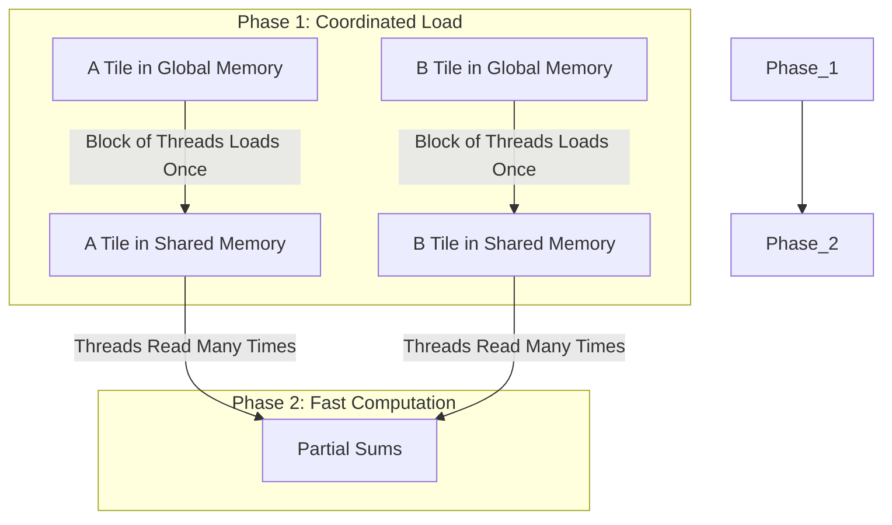

## **Title: A Quick CUDA Tutorial: From Zero to Optimized Matrix Multiplication**

### **Introduction: Unleash the Power of Parallelism in 40 Minutes**

In the next 40 minutes, you will learn the fundamentals of massively parallel computing with CUDA. We will demystify the core terminology of GPU programming, including **kernels**, **threads**, **blocks**, **grids**, and the critical role of the memory hierarchy, specifically **global** and **shared memory**.

You will learn to think in parallel and understand the architecture that makes GPUs so powerful. By the end of this tutorial, you will have written and optimized a CUDA kernel for one of the most fundamental operations in computing: matrix multiplication.

**The Power You'll Unlock**

This is what massively parallel computing looks like. By the end of this tutorial, you will understand every line of this code—and you'll know exactly why it can be **50-100x faster** than CPU code:

```cpp
__global__ void matmul_tiled(float* C, const float* A, const float* B, int M, int N, int K) {
    __shared__ float a_tile[16][16];  // Fast shared memory
    __shared__ float b_tile[16][16];

    int tx = threadIdx.x, ty = threadIdx.y;
    int row = blockIdx.y * 16 + ty;
    int col = blockIdx.x * 16 + tx;
    float sum = 0.0f;

    // Process tiles cooperatively across thousands of threads
    for (int phase = 0; phase < (K + 15) / 16; ++phase) {
        a_tile[ty][tx] = A[row * K + phase * 16 + tx];
        b_tile[ty][tx] = B[(phase * 16 + ty) * N + col];
        __syncthreads();  // Coordinate 256 threads at once

        for (int i = 0; i < 16; ++i)
            sum += a_tile[ty][i] * b_tile[i][tx];
        __syncthreads();
    }

    C[row * N + col] = sum;
}
```

Right now, this might look cryptic. **That's exactly the point.** In 40 minutes, this will make complete sense. You will understand what `__shared__` means, why `__syncthreads()` is critical, how the tile-based algorithm eliminates memory bottlenecks, and most importantly—you will know how to write this yourself.

This isn't just about understanding CUDA. This is about understanding **the fundamental principles that power modern AI, scientific computing, and high-performance systems.**

**The Problem: The Computational Bottleneck**

Consider the task of multiplying two matrices, A and B, to produce a third matrix, C.

`C = A * B`

For each element `C[i,j]` in the output matrix, we must compute a dot product of a row from A and a column from B. The formula is:

`C[i, j] = Σ (A[i, k] * B[k, j])` for all `k`

A standard single-threaded CPU computes each of these dot products one by one. If A and B are 1000x1000 matrices, this requires 1 billion multiplications and 1 billion additions. This is computationally expensive and slow.

**Scale of the Performance Gap:**
- **CPU (single-threaded)**: ~0.5 GFLOPS - computes one element at a time
- **CPU (multi-threaded, 16 cores)**: ~8 GFLOPS - limited parallelism
- **GPU (naive CUDA)**: ~15 GFLOPS - thousands of threads, but memory-bound
- **GPU (optimized CUDA)**: ~800+ GFLOPS - efficient memory usage
- **GPU (highly-tuned libraries)**: ~20,000+ GFLOPS - professional optimization

The journey from 0.5 to 800 GFLOPS is what you'll learn in this tutorial. **That's a 1600× speedup.**

**The Solution: Massive Parallelism**

The key observation is that the calculation for each element `C[i,j]` is completely independent of the calculation for any other element `C[x,y]`. We don't need to compute `C[0,0]` before we compute `C[5,5]`. We can, in theory, compute all of them simultaneously.

This is where the GPU excels. A modern GPU contains thousands of simple processing cores designed to execute the same instruction on different data in parallel.

Our strategy will be:
1.  **Launch a Grid of Threads:** Assign one GPU thread to be responsible for calculating a single element of the output matrix C.
2.  **Distribute the Work:** Each thread will use its unique ID to identify which row `i` from matrix A and which column `j` from matrix B it needs to process.
3.  **Execute in Parallel:** All threads will perform the dot product calculation `Σ (A[i, k] * B[k, j])` at the same time.
4.  **Optimize:** We will then identify performance bottlenecks related to memory access and introduce an optimization using **tiled matrix multiplication with shared memory**.

This tutorial will guide you through this entire process, from understanding the hardware to writing and refining the code. Let's begin with the architecture of the GPU itself.

## **Chapter 1: The GPU Architecture: A Bird's Eye View**

**Big Picture:** We are now looking at the physical hardware. Understanding how a GPU is structured is essential to programming it effectively. Its design is fundamentally different from a CPU, and this difference is the key to its power.

**Concrete Example: The Kitchen Analogy**

*   A **CPU** is like a single, master chef. This chef is incredibly skilled and can perform any complex cooking task (like a difficult multi-step sauce) very quickly and efficiently, one task at a time.
*   A **GPU** is like a massive commercial kitchen staffed with thousands of junior chefs. Each junior chef can only perform simple, repetitive tasks (like chopping a single vegetable). While any individual junior chef is much slower and less versatile than the master chef, they can all chop vegetables simultaneously. If you need to chop 10,000 carrots, the army of junior chefs will finish the job orders of magnitude faster than the single master chef.

**Real Hardware Numbers (NVIDIA RTX 3090 example):**
- **10,496 CUDA cores** (the "junior chefs")
- **82 Streaming Multiprocessors** (the "cooking stations")
- Each SM can manage up to **2,048 threads** concurrently
- **Maximum concurrent threads**: ~170,000 threads simultaneously
- **24 GB global memory** (the "main pantry")
- **128 KB shared memory per SM** (the "workbench per station")

CUDA programming is the art of breaking down a large problem into thousands of simple, identical tasks that can be assigned to these junior chefs.

---

### **The CUDA Hierarchy: Organizing the Work**

To manage our "army of chefs," CUDA imposes a three-level hierarchy. This is how you, the programmer, will organize the parallel work.

1.  **Thread:** The most basic unit of execution. A single "junior chef" that executes a piece of code called a **kernel**.
2.  **Block:** A group of threads. The "chefs" within a single block can cooperate and communicate with each other using a fast, shared workspace. A block is a team of chefs working together at one station.
3.  **Grid:** A collection of blocks. The entire "kitchen" is a grid of all the cooking stations (blocks).

When you run a program on the GPU, you launch a **kernel function** with a specific grid and block structure.

```
This is a 2D Grid of Blocks, and each Block is a 3D arrangement of Threads.

Image description:
A large rectangle represents the 'Grid'.
This Grid is tiled with smaller rectangles, each representing a 'Block'. For example, Grid(0,0), Grid(0,1), Grid(1,0), Grid(1,1).
Zoom into one 'Block'. This block is a 3D cube filled with small dots, where each dot is a 'Thread'. For example, Thread(0,0,0), Thread(0,0,1), etc.
Arrow from Grid -> Block -> Thread illustrates the hierarchy.
```

---

### **A Simplified Hardware Model**

Now let's map this programming hierarchy onto the physical GPU hardware.

*   **Host & Device:** In CUDA terminology, the **Host** is the CPU and its memory (RAM). The **Device** is the GPU and its memory (VRAM). Your main program runs on the host, and it launches kernels on the device.

*   **Streaming Multiprocessor (SM):** The GPU is composed of several Streaming Multiprocessors. Think of an SM as a fully-equipped cooking station in our kitchen analogy. An SM is responsible for scheduling and executing entire blocks of threads.

*   **CUDA Cores:** Each SM contains numerous CUDA cores, the actual "junior chefs." These are the simple processing units that execute the instructions for the threads.

*   **Memory Hierarchy:** This is one of the most critical concepts for performance.
    *   **Global Memory:** This is the large, primary memory of the GPU (VRAM). It is accessible by all threads from all blocks. However, it is relatively slow. Think of it as the main, large pantry in the kitchen. Any chef can access it, but it takes a long walk to get ingredients.
    *   **Shared Memory:** Each SM has a small, extremely fast memory space called shared memory. It is only accessible to the threads within the block currently running on that SM. This is like a small, shared workbench or spice rack at a single cooking station. The team of chefs at that station can share ingredients very quickly without walking to the main pantry.

| Component         | Analogy              | Scope                   | Speed (Bandwidth)     | Size                    | Latency      |
| ----------------- | -------------------- | ----------------------- | --------------------- | ----------------------- | ------------ |
| **CUDA Core**     | Junior Chef          | Executes thread         | -                     | -                       | -            |
| **SM**            | Cooking Station      | Executes blocks         | -                     | -                       | -            |
| **Global Memory** | Main Pantry          | All threads in the grid | ~10-50 GB/s           | 8-80 GB (entire GPU)    | ~400-800 cycles |
| **Shared Memory** | Shared Workbench     | Threads within a block  | ~1-10 TB/s (200x faster!) | 48-164 KB per SM     | ~20-30 cycles  |
| **Registers**     | Chef's hands         | Individual thread       | ~19 TB/s              | 64 KB per SM            | ~1 cycle     |

The goal of many CUDA optimizations, as we will see, is to minimize slow trips to global memory by using fast shared memory as much as possible.

Now that we understand the basic structure of the kitchen and its staff, let's write the first recipe—our first CUDA kernel.

## **Chapter 2: Your First CUDA Kernel: A Parallel "Hello, World!"**

**Big Picture:** We are now moving from the abstract hardware model to writing our first lines of code. The goal is to write a complete program that allocates memory on the GPU, executes a simple calculation in parallel, and brings the result back to the CPU.

**Concrete Example: Vector Addition**

The classic "Hello, World!" prints a line of text. A GPU, however, doesn't directly print to the console. The equivalent introductory program in parallel computing is **vector addition**.

The problem is simple: Given two vectors (arrays of numbers), A and B, compute a third vector, C, where each element is the sum of the corresponding elements in A and B.

`C[i] = A[i] + B[i]`

This operation is "embarrassingly parallel" because the calculation for `C[0]` is completely independent of the calculation for `C[1]`, `C[2]`, and so on. We can assign one thread to each index `i`, and all threads can perform their addition simultaneously.

---

### **Step-by-Step Code Walkthrough**

A complete CUDA program involves both code for the Host (CPU) and code for the Device (GPU).

#### **1. The Device Code: The Kernel**

This is the function that each of our GPU threads will execute. In CUDA, we define it using the `__global__` keyword.

*   **`__global__ void addKernel(int *c, const int *a, const int *b)`**:
    *   `__global__` tells the compiler this is a kernel function that can be called from the host and will run on the device.
    *   It takes pointers to arrays in the GPU's global memory.

Inside this function, each thread needs to determine which element `i` it is responsible for. CUDA provides built-in variables for this:
*   `threadIdx.x`: The thread's index within its block.
*   `blockIdx.x`: The block's index within the grid.
*   `blockDim.x`: The number of threads in each block.

The unique global index `i` for any thread is calculated with the formula:
`int i = blockIdx.x * blockDim.x + threadIdx.x;`

**Code Snippet 1: The Kernel Function**
```cpp
// CUDA Kernel function to add the elements of two arrays
__global__ void addKernel(int *c, const int *a, const int *b)
{
    int i = blockIdx.x * blockDim.x + threadIdx.x;
    c[i] = a[i] + b[i];
}
```
*   **Input**: Pointers `a`, `b`, and `c` to integer arrays residing in GPU global memory.
*   **Output**: The array `c` is modified in place on the GPU.

#### **2. The Host Code: Managing the Operation**

The `main()` function of our program runs on the CPU. Its job is to set up the data, tell the GPU to run the kernel, and then retrieve the results.

**a. Allocate Memory on the GPU**

We need to allocate separate memory on the device for our three vectors. We use `cudaMalloc`.

**Code Snippet 2: Allocating GPU Memory**
```cpp
int *dev_a = 0;
int *dev_b = 0;
int *dev_c = 0;

// Allocate memory on the GPU device
cudaMalloc((void**)&dev_a, size * sizeof(int));
cudaMalloc((void**)&dev_b, size * sizeof(int));
cudaMalloc((void**)&dev_c, size * sizeof(int));
```
*   **Input**: Pointers to device pointers (`&dev_a`) and the number of bytes to allocate.
*   **Output**: The `dev_a`, `dev_b`, and `dev_c` pointers now point to allocated memory on the GPU.

**b. Transfer Data from Host to Device**

Now we copy our input vectors (let's call them `h_a` and `h_b` on the host) to the newly allocated GPU memory.

**Code Snippet 3: Copying Data to the GPU**
```cpp
// Copy arrays h_a and h_b from host (CPU) to device (GPU)
cudaMemcpy(dev_a, h_a, size * sizeof(int), cudaMemcpyHostToDevice);
cudaMemcpy(dev_b, h_b, size * sizeof(int), cudaMemcpyHostToDevice);
```
*   **Input**: Destination (device pointer), Source (host pointer), size, and a flag indicating the direction of copy.
*   **Output**: The data from `h_a` and `h_b` is now duplicated in `dev_a` and `dev_b` on the GPU.

**⚠️ Performance Note: The PCIe Bottleneck**

Data transfer between CPU and GPU happens over the PCIe bus. This is significantly slower than GPU internal memory:

| Connection Type | Transfer Speed        | Real-world Performance |
| --------------- | --------------------- | ---------------------- |
| **PCIe 3.0 x16** | ~12 GB/s theoretical | ~10 GB/s actual        |
| **PCIe 4.0 x16** | ~25 GB/s theoretical | ~22 GB/s actual        |
| **PCIe 5.0 x16** | ~50 GB/s theoretical | ~45 GB/s actual        |
| **For comparison:** GPU Global Memory | ~10-50 GB/s | (internal) |
| **For comparison:** GPU Shared Memory | ~1-10 TB/s | (internal) |

**Key Insight**: Copying 1 GB of data from CPU to GPU over PCIe 3.0 takes ~100ms. This is why efficient CUDA programs:
1. Minimize the number of transfers between CPU and GPU
2. Keep data on the GPU as long as possible
3. Overlap computation with data transfer when unavoidable

This is why we batch operations: transferring data once and running many GPU operations is far more efficient than repeatedly copying small amounts of data back and forth.

**c. Launch the Kernel**

This is the moment we tell the GPU to execute our `addKernel`. We use the special `<<<...>>>` syntax to specify the grid and block dimensions. For a vector of size `N`, we might choose 256 threads per block.

**Code Snippet 4: Launching the Kernel**
```cpp
// Define the number of threads in each block
int threadsPerBlock = 256;

// Calculate the number of blocks needed in the grid
int blocksPerGrid = (size + threadsPerBlock - 1) / threadsPerBlock;

// Launch the kernel on the GPU
addKernel<<<blocksPerGrid, threadsPerBlock>>>(dev_c, dev_a, dev_b);
```
*   **Input**: The kernel function, grid dimensions (`blocksPerGrid`), block dimensions (`threadsPerBlock`), and the kernel arguments (`dev_c`, `dev_a`, `dev_b`).
*   **Output**: The GPU begins executing the `addKernel`. The CPU code continues to the next line.

**d. Copy Results from Device to Host**

After the kernel finishes, the result vector `dev_c` exists only in GPU memory. To verify or use it on the CPU, we must copy it back.

**Code Snippet 5: Copying Data from the GPU**
```cpp
// Allocate memory for the result on the host
int *h_c = (int*)malloc(size * sizeof(int));

// Copy the result array from device (GPU) to host (CPU)
cudaMemcpy(h_c, dev_c, size * sizeof(int), cudaMemcpyDeviceToHost);
```
*   **Input**: Destination (host pointer), Source (device pointer), size, and a flag indicating the direction.
*   **Output**: The host array `h_c` now contains the result of the GPU computation.

**e. Free GPU Memory**

Finally, it's good practice to clean up and free the memory we allocated on the device.

**Code Snippet 6: Freeing GPU Memory**
```cpp
// Free memory on the device
cudaFree(dev_a);
cudaFree(dev_b);
cudaFree(dev_c);
```

We have now seen all the essential steps: allocate, copy, launch, copy back, and free. Now we are ready to apply this pattern to a more complex problem: matrix multiplication.

## **Chapter 3: Naive Matrix Multiplication: Unleashing the Threads**

**Big Picture:** We are now ready to tackle our main problem: matrix multiplication. We will apply the concepts from the previous chapter—defining a kernel and using thread indices to manage work—to create our first, straightforward solution. This "naive" approach is a direct translation of the mathematical formula to CUDA.

**Concrete Example:** We want to multiply two matrices, A (size M x K) and B (size K x N), to get matrix C (size M x N).

Our strategy remains the same: **launch a grid of threads where each thread is responsible for calculating exactly one element of the output matrix C.**

```
Image Description:
A grid of threads is shown on the left.
Matrix C is shown on the right.
An arrow points from a single thread, Thread(row, col), in the grid to a single cell, C[row, col], in the matrix.
This illustrates a one-to-one mapping between threads and output elements.
```

### **The Algorithm: From Math to Parallel Logic**

The mathematical formula is: `C[row, col] = Σ (A[row][k] * B[k][col])`

For a thread assigned to compute `C[row, col]`, its task is:
1.  Initialize a temporary sum variable to zero.
2.  Loop `k` from 0 to K-1.
3.  In each step of the loop, fetch one element from its assigned row in A (`A[row, k]`).
4.  Fetch one element from its assigned column in B (`B[k, col]`).
5.  Multiply them and add to the temporary sum.
6.  After the loop finishes, write the final sum to its assigned position in the output matrix `C[row, col]`.

### **Step-by-Step Implementation**

#### **1. Mapping Threads to the 2D Matrix**

Since our output is a 2D matrix, it's natural to organize our threads in a 2D grid of 2D blocks. This makes the indexing logic cleaner.

*   `blockIdx.x` and `blockIdx.y`: The 2D index of the block in the grid.
*   `threadIdx.x` and `threadIdx.y`: The 2D index of the thread in the block.
*   `blockDim.x` and `blockDim.y`: The dimensions of the block.

A thread can find its unique `(row, col)` coordinate in the global output matrix with this formula:

**Code Snippet 1: Calculating Global Row and Column**
```cpp
int row = blockIdx.y * blockDim.y + threadIdx.y;
int col = blockIdx.x * blockDim.x + threadIdx.x;
```

#### **2. Memory Access in a 1D Array**

While we think of matrices as 2D, they are stored in computer memory as a contiguous 1D array. This is typically done in **row-major order**. An element at `Matrix[row][col]` in a matrix with `WIDTH` columns is found at index `row * WIDTH + col` in the 1D array.

*   For matrix A (M x K), element `A[row][k]` is at index `row * K + k`.
*   For matrix B (K x N), element `B[k][col]` is at index `k * N + col`.
*   For matrix C (M x N), element `C[row][col]` is at index `row * N + col`.

#### **3. The Naive Kernel**

Here is the complete kernel. It combines the thread indexing with the matrix multiplication logic.

**Code Snippet 2: The Naive Matrix Multiplication Kernel**
```cpp
__global__ void matmul_naive(float* C, const float* A, const float* B, int M, int N, int K) {
    // 1. Calculate the global row and column for this thread
    int row = blockIdx.y * blockDim.y + threadIdx.y;
    int col = blockIdx.x * blockDim.x + threadIdx.x;

    // Boundary check: ensure the thread is within the matrix dimensions
    if (row < M && col < N) {
        float sum = 0.0f;

        // 2. Compute the dot product
        for (int k = 0; k < K; ++k) {
            sum += A[row * K + k] * B[k * N + col];
        }

        // 3. Write the result to the output matrix C
        C[row * N + col] = sum;
    }
}
```
*   **Input**: Pointers to the three matrices in global memory (`C`, `A`, `B`) and their dimensions (`M`, `N`, `K`).
*   **Output**: The output matrix `C` is written to by each thread in parallel.

#### **4. The Host Code (Structure)**

The host code for launching this kernel is very similar to the vector addition example. The main difference is that we define our grid and block dimensions as 2D structures using `dim3`.

**Code Snippet 3: Launching a 2D Kernel**
```cpp
// Define block dimensions (e.g., 16x16 threads per block)
dim3 threadsPerBlock(16, 16);

// Define grid dimensions needed to cover the entire output matrix C
dim3 numBlocks((N + threadsPerBlock.x - 1) / threadsPerBlock.x,
               (M + threadsPerBlock.y - 1) / threadsPerBlock.y);

// Launch the kernel
matmul_naive<<<numBlocks, threadsPerBlock>>>(d_C, d_A, d_B, M, N, K);
```

### **The Inefficiency: The Global Memory Bottleneck**

This kernel works, but it is slow. The reason lies in how it accesses memory.

Consider two threads in the same block:
*   `Thread (0, 0)` computes `C[0,0]`. It reads all of `A[0, k]` and `B[k, 0]`.
*   `Thread (0, 1)` computes `C[0,1]`. It also reads all of `A[0, k]` and `B[k, 1]`.

Both threads read the **entire first row of A** from slow global memory. This is highly redundant. As we saw in Chapter 1, trips to global memory are expensive. Our naive kernel makes `2 * M * N * K` reads from global memory.

**Concrete Example: 1024×1024 Matrix Multiplication**
- **Total global memory reads**: 2 × 1024 × 1024 × 1024 = **2.15 billion reads**
- **Data volume**: ~8 GB of memory traffic (at 4 bytes per float)
- **Time at 50 GB/s**: ~160 milliseconds just for memory access
- **Problem**: Each element of A is read N times (1024×), each element of B is read M times (1024×)
- **Result**: Memory bandwidth becomes the bottleneck, not compute power

```mermaid
graph TD
    subgraph "Global Memory (Slow Pantry)"
        A[Matrix A];
        B[Matrix B];
    end

    subgraph "Computation"
        T1(Thread 0,0) --> C00[C(0,0)];
        T2(Thread 0,1) --> C01[C(0,1)];
    end

    A -- "Reads row 0" --> T1;
    B -- "Reads col 0" --> T1;

    A -- "Reads row 0 (again!)" --> T2;
    B -- "Reads col 1" --> T2;

```

To achieve high performance, we must reduce these redundant trips to the "main pantry." The solution is to have a team of threads (a block) cooperate to bring a piece of the data to their fast, shared "workbench." This is the subject of our next chapter.

### **Chapter 4: Optimization with Shared Memory: The Tiling Technique**

**Big Picture:** Our naive kernel was functionally correct but slow because of massive, redundant access to slow global memory. We are now at the most critical optimization step. By using the fast **shared memory** available to each thread block, we can dramatically reduce global memory traffic and improve performance.

**The Bottleneck Revisited:** In our naive approach, every thread independently fetched all the data it needed from the "main pantry" (global memory). If 16 threads in a block all needed the same row from matrix A, they would perform 16 separate, slow walks to the pantry to get it.

**The Solution: Tiling**

The core idea is **cooperative data fetching**. A block of threads will work together as a team.

*   **The Plan:** The entire block will load small, square sub-matrices of A and B—called **tiles**—into their shared workbench (shared memory). They do this *once* per tile.
*   **The Execution:** Once the tiles are in the fast shared memory, all threads in the block can perform the necessary calculations by accessing this fast memory, avoiding the slow trip to global memory. They will process one pair of tiles, accumulate the partial results, then move on to the next pair of tiles until the final dot product is complete.



---

### **The Tiled Algorithm**

Let's define a `TILE_SIZE`, for example, 16. Our thread blocks will be 16x16.

1.  Each thread block is responsible for computing one 16x16 tile of the output matrix C.
2.  To do this, it must iterate through the tiles of A and B.
3.  **For each iteration (phase):**
    a.  **Load:** Each thread in the block grabs *one* element from a tile of A and *one* element from a tile of B from global memory and places them into two shared memory arrays.
    b.  **Synchronize:** Wait for **all** threads in the block to finish loading. This is a critical barrier to ensure the shared memory tiles are fully populated before anyone uses them.
    c.  **Compute:** Each thread calculates a partial dot product by looping through the `TILE_SIZE` elements now in the fast shared memory, accumulating the results in a private register.
    d.  **Synchronize again** before proceeding to the next phase to load the next tiles.

### **Step-by-Step Optimized Kernel**

#### **1. Declaring Shared Memory**

We use the `__shared__` keyword to declare arrays that will be allocated in the fast shared memory space of an SM. These arrays are visible to all threads within the same block. Let's assume `TILE_SIZE` is a compile-time constant.

**Code Snippet 1: Shared Memory Declaration**
```cpp
// Define the size of the tile and the thread block
#define TILE_SIZE 16

// ... inside the kernel ...

// Declare shared memory tiles
__shared__ float a_tile[TILE_SIZE][TILE_SIZE];
__shared__ float b_tile[TILE_SIZE][TILE_SIZE];
```

#### **2. Loading Tiles from Global to Shared Memory**

Each thread uses its local `threadIdx` to calculate which element it is responsible for loading into the shared tiles.

**Code Snippet 2: Loading the Tiles**
```cpp
// Get the thread's local 2D index within the block
int tx = threadIdx.x;
int ty = threadIdx.y;

// 'phase' is the outer loop iterating through the tiles
int a_col = phase * TILE_SIZE + tx;
int a_row = row; // row is the global row index for this thread's C element

// Load one element of A's tile
a_tile[ty][tx] = A[a_row * K + a_col];

int b_col = col; // col is the global col index for this thread's C element
int b_row = phase * TILE_SIZE + ty;

// Load one element of B's tile
b_tile[ty][tx] = B[b_row * N + b_col];
```

#### **3. Synchronization**

To prevent a thread from starting computation with incomplete data, we must place a barrier. `__syncthreads()` forces every thread in the block to wait at this line until all other threads in the same block have also reached it.

**Code Snippet 3: The Synchronization Barrier**
```cpp
// Wait until all threads in the block have finished loading the tiles
__syncthreads();
```

#### **4. The Full Optimized Kernel**

Putting it all together, the kernel now has an outer loop that iterates through the tiles and an inner loop for computation from shared memory.

**Code Snippet 4: The Tiled Matrix Multiplication Kernel**
```cpp
__global__ void matmul_tiled(float* C, const float* A, const float* B, int M, int N, int K) {
    // Declare shared memory tiles
    __shared__ float a_tile[TILE_SIZE][TILE_SIZE];
    __shared__ float b_tile[TILE_SIZE][TILE_SIZE];

    // Get thread indices
    int tx = threadIdx.x;
    int ty = threadIdx.y;
    int row = blockIdx.y * TILE_SIZE + ty;
    int col = blockIdx.x * TILE_SIZE + tx;

    float sum = 0.0f;
    
    // Loop over the tiles of A and B required to compute the C tile
    for (int phase = 0; phase < (K + TILE_SIZE - 1) / TILE_SIZE; ++phase) {
        // Load tiles from global memory to shared memory
        // (Boundary checks are needed here for non-perfect matrix sizes, omitted for clarity)
        a_tile[ty][tx] = A[(row * K) + (phase * TILE_SIZE + tx)];
        b_tile[ty][tx] = B[(phase * TILE_SIZE + ty) * N + col];

        // Synchronize to make sure the tiles are loaded
        __syncthreads();

        // Multiply the two tiles from shared memory and accumulate the result
        for (int i = 0; i < TILE_SIZE; ++i) {
            sum += a_tile[ty][i] * b_tile[i][tx];
        }

        // Synchronize again before loading the next tile
        __syncthreads();
    }

    // Write the final result to global memory
    if (row < M && col < N) {
        C[row * N + col] = sum;
    }
}
```

### **The Performance Improvement: Quantifying the Speedup**

Let's see the concrete impact of this optimization:

**Memory Access Reduction (1024×1024 matrices, 16×16 tiles):**
- **Naive kernel**: 2.15 billion global memory reads
- **Tiled kernel**: ~134 million global memory reads (each element loaded once per tile, not once per dot product)
- **Reduction**: **16× fewer global memory accesses**

**Real-world Performance (NVIDIA RTX 3090 example):**
- **Naive kernel**: ~15 GFLOPS (gigaflops) - memory-bound
- **Tiled kernel**: ~800 GFLOPS - more compute-bound
- **Speedup**: **~53× faster**
- **Theoretical peak**: ~35,000 GFLOPS (still room for further optimization!)

**Why the massive improvement?**
- Global memory (50 GB/s) → Shared memory (1-10 TB/s) for most accesses
- **Latency hiding**: While one warp waits for memory, other warps compute
- **Bandwidth utilization**: Coalesced memory access patterns

### **Connecting Back to Reality**

We just implemented a foundational technique in high-performance computing. The naive kernel was memory-bound; its speed was limited by how fast it could fetch data from slow global memory. The tiled kernel is compute-bound; its speed is now much more dependent on the raw processing power of the CUDA cores.

This exact principle is used everywhere:
*   **Machine Learning:** Training a deep neural network involves countless matrix multiplications. Libraries like NVIDIA's cuBLAS (Basic Linear Algebra Subroutines) and cuDNN (Deep Neural Network library) have highly-optimized versions of this tiled algorithm as their backbone.
*   **Scientific Computing:** Simulating weather patterns, fluid dynamics, or astrophysical phenomena requires solving systems of equations that rely on matrix operations.
*   **Image Processing:** Applying complex filters or transformations (like a 2D convolution) can be expressed as matrix multiplications, where this memory-caching strategy is crucial for real-time performance.

We just optimized a small matrix multiplication. The real-world version is just a bigger version of this. Instead of a 1024x1024 matrix, it might be a 16384x16384 matrix, making the reduction in global memory traffic even more critical.

---

### **Conclusion: Your Journey into Parallel Computing**

In this tutorial, we have moved from the fundamental difference between a CPU and a GPU to writing and significantly optimizing a parallel program.

You learned about the CUDA hierarchy of **threads, blocks, and grids**. You saw the critical importance of the memory hierarchy, understanding that minimizing access to **global memory** by effectively using **shared memory** is the key to performance. You have successfully implemented a naive matrix multiplication kernel and then optimized it using the tiling technique—a pattern used in professional, high-performance libraries.

This is the starting point. The world of parallel computing is deep and rewarding. From here, you can explore more advanced optimization techniques, specialized CUDA libraries, and the application of these powerful concepts to solve complex problems in science, engineering, and artificial intelligence.