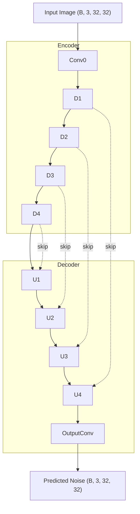

# **Title: Diffusion Models From Scratch in 40 Minutes**

> Diffusion Models Simply Explained

## **Introduction: The Promise**

You've heard of Stable Diffusion. You've seen DALL-E and Midjourney generate fascinating images from nothing but a text prompt. It feels like magic—an unknowable black box of artificial intelligence.

But it's not magic. The core engine behind these models is a Denoising Diffusion Probabilistic Model (DDPM), and its core idea is surprisingly simple.

1.  **Destroy:** First, we take a beautiful, clean image and systematically destroy it by adding step-by-step Gaussian noise until only static remains. This is a fixed, mathematical process called the **Forward Process**.
2.  **Teach:** Second, we train a neural network on a single, focused task: to look at a noisy image and predict the noise that was added to it. It learns to undo one small step of the destruction.
3.  **Create:** Finally, to create something new, we give the trained network a canvas of pure static and tell it: "Heal this." The network applies its knowledge step-by-step, progressively removing noise until a clean, original image emerges. This is the **Reverse Process**.

The entire secret is in the Python code below.

```python
# diffusion_min.py
import math
import torch
import torch.nn as nn
import torch.nn.functional as F
from dataclasses import dataclass

@dataclass
class DiffusionConfig:
    image_size: int = 32
    in_channels: int = 3
    base_channels: int = 64
    time_emb_dim: int = 256
    timesteps: int = 1000
    beta_start: float = 1e-4
    beta_end: float = 0.02
    device: str = "cuda" if torch.cuda.is_available() else "cpu"

class SinusoidalPositionEmbeddings(nn.Module):
    def __init__(self, dim):
        super().__init__()
        self.dim = dim

    def forward(self, time):
        device = time.device
        half_dim = self.dim // 2
        embeddings = math.log(10000) / (half_dim - 1)
        embeddings = torch.exp(torch.arange(half_dim, device=device) * -embeddings)
        embeddings = time[:, None] * embeddings[None, :]
        embeddings = torch.cat((embeddings.sin(), embeddings.cos()), dim=-1)
        return embeddings

class Block(nn.Module):
    """Simple Conv -> GroupNorm -> GELU block"""
    def __init__(self, in_ch, out_ch, time_emb_dim, up=False):
        super().__init__()
        self.time_mlp = nn.Linear(time_emb_dim, out_ch)
        if up:
            self.conv1 = nn.Conv2d(2 * in_ch, out_ch, 3, padding=1)
            self.transform = nn.ConvTranspose2d(out_ch, out_ch, 4, 2, 1)
        else:
            self.conv1 = nn.Conv2d(in_ch, out_ch, 3, padding=1)
            self.transform = nn.Conv2d(out_ch, out_ch, 4, 2, 1)
        
        self.conv2 = nn.Conv2d(out_ch, out_ch, 3, padding=1)
        self.bnorm1 = nn.GroupNorm(8, out_ch)
        self.bnorm2 = nn.GroupNorm(8, out_ch)
        self.relu = nn.GELU()

    def forward(self, x, t):
        h = self.bnorm1(self.relu(self.conv1(x)))
        time_emb = self.relu(self.time_mlp(t))
        time_emb = time_emb[(..., ) + (None, ) * 2]
        h = h + time_emb
        h = self.bnorm2(self.relu(self.conv2(h)))
        return self.transform(h)

class SimpleUNet(nn.Module):
    """A minimal U-Net to predict noise"""
    def __init__(self, config: DiffusionConfig):
        super().__init__()
        image_channels = config.in_channels
        down_channels = (64, 128, 256, 512, 1024)
        up_channels = (1024, 512, 256, 128, 64)
        out_dim = config.in_channels 
        time_emb_dim = config.time_emb_dim

        self.time_mlp = nn.Sequential(
            SinusoidalPositionEmbeddings(time_emb_dim),
            nn.Linear(time_emb_dim, time_emb_dim),
            nn.GELU()
        )

        self.conv0 = nn.Conv2d(image_channels, down_channels[0], 3, padding=1)

        self.downs = nn.ModuleList([Block(down_channels[i], down_channels[i+1], time_emb_dim) \
                                    for i in range(len(down_channels)-1)])
        
        self.ups = nn.ModuleList([Block(up_channels[i], up_channels[i+1], time_emb_dim, up=True) \
                                  for i in range(len(up_channels)-1)])

        self.output = nn.Conv2d(up_channels[-1], out_dim, 1)

    def forward(self, x, timestep):
        t = self.time_mlp(timestep)
        x = self.conv0(x)
        
        residual_inputs = []
        for down in self.downs:
            x = down(x, t)
            residual_inputs.append(x)
            
        for up in self.ups:
            residual_x = residual_inputs.pop()
            x = torch.cat((x, residual_x), dim=1)
            x = up(x, t)
            
        return self.output(x)

class Diffusion(nn.Module):
    def __init__(self, config: DiffusionConfig):
        super().__init__()
        self.config = config
        self.model = SimpleUNet(config).to(config.device)
        
        self.beta = torch.linspace(config.beta_start, config.beta_end, config.timesteps).to(config.device)
        self.alpha = 1. - self.beta
        self.alpha_hat = torch.cumprod(self.alpha, dim=0)

    def noise_images(self, x, t):
        sqrt_alpha_hat = torch.sqrt(self.alpha_hat[t])[:, None, None, None]
        sqrt_one_minus_alpha_hat = torch.sqrt(1 - self.alpha_hat[t])[:, None, None, None]
        ε = torch.randn_like(x)
        return sqrt_alpha_hat * x + sqrt_one_minus_alpha_hat * ε, ε

    def sample_timesteps(self, n):
        return torch.randint(low=1, high=self.config.timesteps, size=(n,), device=self.config.device)

    def forward(self, x):
        t = self.sample_timesteps(x.shape[0])
        x_t, noise = self.noise_images(x, t)
        predicted_noise = self.model(x_t, t)
        return F.mse_loss(noise, predicted_noise)

    @torch.no_grad()
    def sample(self, n_samples):
        self.model.eval()
        x = torch.randn((n_samples, self.config.in_channels, self.config.image_size, self.config.image_size)).to(self.config.device)
        
        for i in reversed(range(1, self.config.timesteps)):
            t = (torch.ones(n_samples) * i).long().to(self.config.device)
            predicted_noise = self.model(x, t)
            
            alpha = self.alpha[t][:, None, None, None]
            alpha_hat = self.alpha_hat[t][:, None, None, None]
            beta = self.beta[t][:, None, None, None]
            
            if i > 1:
                noise = torch.randn_like(x)
            else:
                noise = torch.zeros_like(x)
            
            x = (1 / torch.sqrt(alpha)) * (x - ((1 - alpha) / (torch.sqrt(1 - alpha_hat))) * predicted_noise) + torch.sqrt(beta) * noise
            
        self.model.train()
        x = (x.clamp(-1, 1) + 1) / 2
        return x
```

**Our Promise:** In the next 40 minutes, this file will be completely demystified. You will understand not just what each line does, but *why* it's there.

**Key Formulas & Concepts You Will Master:**

*   The Forward Process "Shortcut" Formula:
    $$ \mathbf{x}_t = \sqrt{\bar{\alpha}_t} \mathbf{x}_0 + \sqrt{1 - \bar{\alpha}_t} \boldsymbol{\epsilon} $$
*   The Reverse Process (DDPM Sampling) Formula:
    $$ \mathbf{x}_{t-1} = \frac{1}{\sqrt{\alpha_t}} \left( \mathbf{x}_t - \frac{1 - \alpha_t}{\sqrt{1 - \bar{\alpha}_t}} \boldsymbol{\epsilon}_\theta(\mathbf{x}_t, t) \right) + \sigma_t \mathbf{z} $$
*   The Training Objective: A simple Mean Squared Error, `MSE($\epsilon$, $\epsilon_\theta$)`.
*   The `SimpleUNet` architecture, `SinusoidalPositionEmbeddings`, and how to condition a model on time.


## **Chapter 1: Our Blueprint - The `DiffusionConfig`**

Every complex project, from a skyscraper to a neural network, starts with a blueprint. This blueprint defines the key parameters and dimensions that guide the entire construction. In our `diffusion_min.py` file, this role is played by the `DiffusionConfig` class.

Let's look at the code we are about to build.

```python
# diffusion_min.py (lines 7-17)
from dataclasses import dataclass
import torch

@dataclass
class DiffusionConfig:
    image_size: int = 32
    in_channels: int = 3
    base_channels: int = 64
    time_emb_dim: int = 256
    timesteps: int = 1000
    beta_start: float = 1e-4
    beta_end: float = 0.02
    device: str = "cuda" if torch.cuda.is_available() else "cpu"
```

This is a Python `@dataclass`, which is just a clean and simple way to group variables together. It's a container that holds all the knobs we can turn to change the size, speed, and behavior of our diffusion model.

Before we write a single line of logic, we define these core parameters. Let's go through them one by one.

| Parameter | What it Controls | Intuition | `diffusion_min.py` Value |
| :--- | :--- | :--- | :--- |
| `image_size` | The height and width of the images we will generate. | The size of our digital canvas. | `32` (e.g., 32x32 pixels) |
| `in_channels`| The number of color channels in our input images. | Is it a grayscale image (1) or a color image (3 for RGB)? | `3` |
| `base_channels`| The initial number of channels in the first layer of our U-Net. | Controls the **width** and overall size of our neural network. A larger number means a more powerful (and slower) model. | `64` |
| `time_emb_dim`| The dimensionality of the vector that will represent the timestep `t`. | We need to tell our network whether we're at the beginning, middle, or end of the denoising process. This defines the "size" of that time signal. | `256` |
| `timesteps` | The total number of noising steps in the forward process (`T`). | How many steps of destruction will we apply? This also defines the number of steps our model will take to generate an image. | `1000` |
| `beta_start` | The noise variance ($\beta$) for the very first timestep (`t=1`). | How much noise do we add at the very beginning? | `0.0001` (a tiny amount) |
| `beta_end` | The noise variance ($\beta$) for the final timestep (`t=T`). | How much noise do we add at the very end? | `0.02` (a larger amount) |
| `device` | Standard PyTorch boilerplate for device management. | Do we run on the GPU (`cuda`) or CPU? | `"cuda" if available` |

These parameters are the foundation of our entire model. The `timesteps`, `beta_start`, and `beta_end` are especially important, as they define the "noise schedule" which is the heart of the forward process.

With our blueprint defined, we are now ready to build the first major component of our model: the fixed, mathematical process of destroying an image with noise.

## **Chapter 2: The Forward Process: Math & Intuition**

The forward process destroys an image by adding noise, one step at a time. Here's the formula for a single step:

$$ \mathbf{x}_t = \sqrt{\alpha_t} \mathbf{x}_{t-1} + \sqrt{\beta_t} \boldsymbol{\epsilon} $$

| Term | What it is | Intuition |
|:-----|:-----------|:----------|
| $x_t$ | The noisy image at step $t$ | Our output—slightly noisier than before |
| $x_{t-1}$ | The image from the previous step | What we're corrupting |
| $\epsilon$ | Fresh Gaussian noise $\sim \mathcal{N}(0, 1)$ | Pure random static |
| $\beta_t$ | Noise variance at step $t$ | How much noise to add (small, e.g. 0.0001 to 0.02) |
| $\alpha_t = 1 - \beta_t$ | Signal retention rate | How much of the previous image to keep (close to 1) |
| $\sqrt{\alpha_t}$ | Scale factor for image | We scale down the image slightly... |
| $\sqrt{\beta_t}$ | Scale factor for noise | ...and add a small amount of noise |

**Why square roots?** We're working with *variances*, not standard deviations. When you scale a random variable by $c$, its variance scales by $c^2$. So to add noise with variance $\beta_t$, we multiply by $\sqrt{\beta_t}$. The square roots ensure the total variance stays controlled: $(\sqrt{\alpha_t})^2 + (\sqrt{\beta_t})^2 = \alpha_t + \beta_t = 1$.

#### The Variance Schedule ($\beta_t$)

The key to the forward process is the **variance schedule**, denoted $\beta_t$ (beta). This schedule dictates exactly how much noise we add at each timestep $t$. In the original DDPM paper, this is a simple linear schedule:

*   At $t=1$, we add a tiny amount of noise: $\beta_1 = 0.0001$
*   At $t=1000$, we add more noise: $\beta_{1000} = 0.02$
*   The values for $\beta_2$, $\beta_3$, etc. are evenly spaced between these endpoints.

This means we start by adding just a whisper of noise, and gradually add more at each subsequent step.

From $\beta_t$, we derive $\alpha_t = 1 - \beta_t$. If $\beta_t$ is the noise rate, then $\alpha_t$ is the **signal rate**—how much of the previous image we keep. Since $\beta_t$ is always small, $\alpha_t$ is always close to 1 (e.g., 0.9999).

#### The Problem: This is Slow

To get a noisy image $x_t$ from the original $x_0$, we'd have to apply the formula $t$ times in sequence:

$$x_0 \rightarrow x_1 \rightarrow x_2 \rightarrow \cdots \rightarrow x_t$$

For $t = 500$, that's 500 sequential operations. This would make training painfully slow.

#### The Shortcut

Let's derive a formula that jumps directly from $x_0$ to $x_t$. Start with the one-step formula and expand it:

$$\mathbf{x}_1 = \sqrt{\alpha_1} \mathbf{x}_0 + \sqrt{\beta_1} \boldsymbol{\epsilon}_1$$

$$\mathbf{x}_2 = \sqrt{\alpha_2} \mathbf{x}_1 + \sqrt{\beta_2} \boldsymbol{\epsilon}_2$$

Substitute $x_1$ into the equation for $x_2$:

$$\mathbf{x}_2 = \sqrt{\alpha_2} \left( \sqrt{\alpha_1} \mathbf{x}_0 + \sqrt{\beta_1} \boldsymbol{\epsilon}_1 \right) + \sqrt{\beta_2} \boldsymbol{\epsilon}_2$$

$$= \sqrt{\alpha_1 \alpha_2} \mathbf{x}_0 + \sqrt{\alpha_2 \beta_1} \boldsymbol{\epsilon}_1 + \sqrt{\beta_2} \boldsymbol{\epsilon}_2$$

Here's the key insight: when you add two independent Gaussian random variables, the result is also Gaussian, with variances that add. So the two noise terms combine:

$$\sqrt{\alpha_2 \beta_1} \boldsymbol{\epsilon}_1 + \sqrt{\beta_2} \boldsymbol{\epsilon}_2 \sim \mathcal{N}(0, \alpha_2 \beta_1 + \beta_2)$$

Since $\beta_1 = 1 - \alpha_1$, we can simplify:
$$\alpha_2 \beta_1 + \beta_2 = \alpha_2(1 - \alpha_1) + (1 - \alpha_2) = 1 - \alpha_1 \alpha_2$$

So we can write:
$$\mathbf{x}_2 = \sqrt{\alpha_1 \alpha_2} \mathbf{x}_0 + \sqrt{1 - \alpha_1 \alpha_2} \boldsymbol{\epsilon}$$

The pattern is clear. Continuing this for $t$ steps gives us:

$$ \mathbf{x}_t = \sqrt{\bar{\alpha}_t} \mathbf{x}_0 + \sqrt{1 - \bar{\alpha}_t} \boldsymbol{\epsilon} $$

where $\bar{\alpha}_t = \alpha_1 \times \alpha_2 \times \cdots \times \alpha_t$ is the cumulative product.

This is the single most important equation for the forward process. Let's break it down:

*   $x_0$ is our original, clean image.
*   $\epsilon$ is a single sample of pure Gaussian noise.
*   $\bar{\alpha}_t$ (alpha-bar) is the cumulative product: $\bar{\alpha}_t = \alpha_1 \times \alpha_2 \times \cdots \times \alpha_t$

The term $\bar{\alpha}_t$ tells us how much of the original image signal remains at timestep $t$. As $t$ increases, $\bar{\alpha}_t$ decays from 1.0 toward 0.0—the original signal fades away and only noise remains.

The formula is just a weighted sum: we take $\sqrt{\bar{\alpha}_t}$ of the original image and add $\sqrt{1 - \bar{\alpha}_t}$ of pure noise. When $t$ is small, we keep most of the image. When $t$ is large, we keep almost none—just noise.

This shortcut is essential for efficient training. We can generate a training sample $(x_t, \epsilon)$ for any random $t$ on the fly, without any iteration. In the next chapter, we'll translate this formula directly into PyTorch code.

## **Chapter 3: The Forward Process: Code Implementation**

We need to implement this formula in PyTorch:

$$ \mathbf{x}_t = \sqrt{\bar{\alpha}_t} \mathbf{x}_0 + \sqrt{1 - \bar{\alpha}_t} \boldsymbol{\epsilon} $$

Looking at this formula, we need three things:
1. $\bar{\alpha}_t$ — the cumulative signal rate, precomputed for all timesteps
2. $x_0$ — the clean image (input)
3. $\epsilon$ — fresh Gaussian noise (we'll sample this on the fly)

Since $\bar{\alpha}_t$ depends only on the timestep (not the image), we can precompute it once and reuse it. Our implementation has two pieces:
1.  The pre-computation of our noise schedules ($\beta_t$, $\alpha_t$, $\bar{\alpha}_t$).
2.  The "shortcut" function that generates a noisy image $x_t$ for any given $x_0$ and $t$.

#### Part 1: Pre-computing the Schedules in `Diffusion.__init__`

Recall that $\bar{\alpha}_t = \alpha_1 \times \alpha_2 \times \cdots \times \alpha_t$, where $\alpha_t = 1 - \beta_t$. We need to:
1. Create the $\beta_t$ schedule (linearly spaced values)
2. Compute $\alpha_t = 1 - \beta_t$
3. Compute $\bar{\alpha}_t$ as the cumulative product of $\alpha$

These are fixed constants, so we compute them once at initialization:

```python
# diffusion_min.py (lines 118-124)
class Diffusion(nn.Module):
    def __init__(self, config: DiffusionConfig):
        super().__init__()
        self.config = config
        self.model = SimpleUNet(config).to(config.device)

        # Precompute noise schedule terms
        self.beta = torch.linspace(config.beta_start, config.beta_end, config.timesteps).to(config.device)
        self.alpha = 1. - self.beta
        self.alpha_hat = torch.cumprod(self.alpha, dim=0)
```

This code directly implements the definitions from Chapter 2.

*   `self.beta = torch.linspace(...)`
    This creates our $\beta_t$ variance schedule. `torch.linspace` generates a 1D tensor of `timesteps` (e.g., 1000) values, evenly spaced from `beta_start` to `beta_end`:
    ```python
    >>> torch.linspace(0.0001, 0.02, 5)  # 5 values from 0.0001 to 0.02
    tensor([0.0001, 0.0051, 0.0101, 0.0150, 0.0200])
    ```

*   `self.alpha = 1. - self.beta`
    This creates the $\alpha_t$ signal rate schedule. It's a simple element-wise subtraction.

*   `self.alpha_hat = torch.cumprod(self.alpha, dim=0)`
    This creates our cumulative signal rate schedule, $\bar{\alpha}_t$. `torch.cumprod` performs a cumulative product along a given dimension. It's the perfect tool for calculating $\bar{\alpha}_t = \prod \alpha_i$. For example:
    ```python
    >>> a = torch.tensor([0.9, 0.8, 0.7])
    >>> torch.cumprod(a, dim=0)
    tensor([0.9000, 0.7200, 0.5040]) # [0.9, 0.9*0.8, 0.9*0.8*0.7]
    ```
    Our `self.alpha_hat` is the code representation of $\bar{\alpha}_t$.

**Why store all three?** For the forward process, we only need $\bar{\alpha}_t$. But as we'll see in Chapter 9, the reverse process (sampling) uses $\alpha_t$, $\bar{\alpha}_t$, and $\beta_t$ separately—so we precompute and store all of them.

#### Part 2: Implementing the Shortcut in `noise_images`

Now we implement the shortcut formula: $x_t = \sqrt{\bar{\alpha}_t} x_0 + \sqrt{1 - \bar{\alpha}_t} \epsilon$. This function takes a batch of clean images `x` and a batch of corresponding timesteps `t`, and returns the corrupted images $x_t$.

Let's examine the code.

```python
# diffusion_min.py (lines 126-131)
    def noise_images(self, x, t):
        """Adds noise to images at timestep t"""
        sqrt_alpha_hat = torch.sqrt(self.alpha_hat[t])[:, None, None, None]
        sqrt_one_minus_alpha_hat = torch.sqrt(1 - self.alpha_hat[t])[:, None, None, None]
        ε = torch.randn_like(x)
        return sqrt_alpha_hat * x + sqrt_one_minus_alpha_hat * ε, ε
```

Before diving in, let's track the shape of every variable (assuming batch size = 8):

| Variable | Shape | Description |
|:---------|:------|:------------|
| `x` | `(8, 3, 32, 32)` | Batch of clean images (B, C, H, W) |
| `t` | `(8,)` | Random timesteps, e.g., `[50, 120, 345, 800, ...]` |
| `self.alpha_hat` | `(1000,)` | Precomputed $\bar{\alpha}$ for all 1000 timesteps |
| `self.alpha_hat[t]` | `(8,)` | The $\bar{\alpha}_t$ value for each image's timestep |
| `sqrt_alpha_hat` | `(8, 1, 1, 1)` | After reshaping for broadcasting |
| $\epsilon$ | `(8, 3, 32, 32)` | Fresh Gaussian noise $\epsilon$, same shape as `x` |

Now let's walk through the code:

1.  **`sqrt_alpha_hat = torch.sqrt(self.alpha_hat[t])`**
    Here, `t` is a 1D tensor of random timesteps for each image in our batch (e.g., `[50, 120, 345, 800]`). We use `t` to index into our pre-computed `self.alpha_hat` schedule to get the correct $\bar{\alpha}_t$ value for each image.

2.  **The `[:, None, None, None]` Slicing**
    This is a crucial step for broadcasting. Let's track our tensor shapes:
    *   Our image batch `x` has shape `(Batch, Channels, H, W)`, e.g., `(8, 3, 32, 32)`.
    *   Our timestep tensor `t` has shape `(Batch)`, e.g., `(8)`.
    *   Therefore, `self.alpha_hat[t]` also has shape `(Batch)`.

    We cannot multiply a `(8, 3, 32, 32)` tensor by a `(8)` tensor directly. We need to reshape the schedule values to `(8, 1, 1, 1)`. The `[:, None, None, None]` syntax does exactly this. PyTorch's broadcasting rules then automatically expand this to match the `(8, 3, 32, 32)` shape for the element-wise multiplication.

3.  **`ε = torch.randn_like(x)`**
    This line generates our noise $\epsilon$. `torch.randn_like(x)` is a convenient function that creates a tensor of random numbers from a standard normal distribution with the *exact same shape and device* as the input tensor `x`.

4.  **`return sqrt_alpha_hat * x + ..., ε`**
    This is a direct, one-to-one implementation of the shortcut formula. We return two things:
    *   The first value is the noisy image $x_t$.
    *   The second value is the noise $\epsilon$ we used to create it. We return this because it is the **ground truth** that our U-Net model will be trained to predict.

We have now fully implemented the forward process. We have a deterministic and efficient way to take any image and produce a noisy version for any timestep `t`. With these training samples in hand, we are ready to define the reverse process and teach our U-Net how to predict the noise.

## **Chapter 4: The Reverse Process & Training: Math & Intuition**

We have mastered the art of controlled destruction. Now, we must learn the art of creation. The reverse process is about starting with pure noise (`x_T`) and incrementally denoising it, step-by-step, until we have a clean image ($x_0$).

#### The Problem: Reversing the Irreversible

The forward process adds noise at each step `t` using a conditional probability distribution, $q(x_t | x_{t-1})$. To reverse this, we need to calculate the probability of the previous image given the current one, $p(x_{t-1} | x_t)$.

**Q: But isn't the noise at each step independent? Why is reversing hard?**

Yes, each $\epsilon_t$ is independent. But going backward, you don't know *which* noise was added—you can't just subtract it. The reverse conditional $p(x_{t-1} | x_t)$ requires integrating over all possible original images, which is intractable.

Unfortunately, calculating this distribution directly is mathematically intractable. It would require using the entire dataset for every single step, which is computationally impossible.

#### The Solution: Train a Neural Network to Approximate It

If we can't calculate the reverse step, we can train a powerful neural network to *learn* an approximation of it. Our goal is to create a model that takes a noisy image $x_t$ and tells us what $x_{t-1}$ should look like.

#### The "Aha!" Moment: Re-parameterize to Predict the Noise

The authors of the original DDPM paper made a groundbreaking discovery. Instead of training the network to directly predict the pixels of the slightly-less-noisy-image $x_{t-1}$, it is far more effective and stable to re-parameterize the problem.

The network's task is simplified: **Instead of predicting the image, predict the noise.**

Think about our forward process shortcut formula:
$$ \mathbf{x}_t = \sqrt{\bar{\alpha}_t} \mathbf{x}_0 + \sqrt{1 - \bar{\alpha}_t} \boldsymbol{\epsilon} $$
This equation contains all three key components: the noisy image $x_t$, the original image $x_0$, and the noise $\epsilon$. If we know $x_t$ and the timestep `t` (which gives us $\bar{\alpha}_t$), and we can somehow guess the noise $\epsilon$ that was added, we can rearrange the formula to get an estimate of the original image $x_0$.

This reframes the entire problem. Our neural network, which we'll call $\epsilon_\theta$ (epsilon-theta), will have one job:
*   **Input:** A noisy image $x_t$ and its corresponding timestep `t`.
*   **Output:** A prediction of the noise $\epsilon$ that was used to create $x_t$.

#### The Objective Function: A Simple Comparison

This re-framing makes our loss function—the metric that tells us how "wrong" the model is—incredibly simple.

1.  During training, we pick a real image $x_0$ and a random timestep `t`.
2.  We use our `noise_images` function from Chapter 3. This function gives us two things: the noisy image $x_t$ and the **actual noise $\epsilon$** that was used to generate it.
3.  We feed $x_t$ and `t` into our network $\epsilon_\theta$ to get the **predicted noise**.
4.  The loss is simply the difference between the actual noise and the predicted noise.

For images, the most common way to measure this difference is the **Mean Squared Error (MSE)**.

Our training objective is:
$$ L = \mathbb{E}_{x_0, t, \epsilon} \left[ ||\boldsymbol{\epsilon} - \boldsymbol{\epsilon}_\theta(\mathbf{x}_t, t)||^2 \right] $$

Let's translate this into plain English:
*   `E[...]`: "On average, over many examples..."
*   $x_0$, `t`, $\epsilon$: "...where we take a real image $x_0$, a random timestep `t`, and random noise $\epsilon$..."
*   `|| ... ||²`: "...calculate the Mean Squared Error between..."
*   $\epsilon$: "...the real noise..."
*   $\epsilon_\theta(x_t, t)$: "...and the noise predicted by our model when it looks at the noisy image $x_t$ at timestep `t`."

That's it. The entire training process boils down to this: show the model a corrupted image and ask it, "What noise did I add?" The closer its prediction is to the real noise, the lower the loss. In the next chapter, we'll see how this beautifully simple objective is implemented in the model's `forward` pass.

## **Chapter 5: The Reverse Process & Training: Code Implementation**

We have our training objective: teach a model, $\epsilon_\theta$, to predict the noise $\epsilon$ that was added to an image. Now, we will implement this logic in PyTorch. The training step for a neural network is defined within its `forward` method. Therefore, the `Diffusion.forward` method is where we will bring the theory from Chapter 4 to life.

Let's look at the two methods that implement our training loop.

```python
# diffusion_min.py (lines 133-141)
    def sample_timesteps(self, n):
        """Randomly sample timesteps for training"""
        return torch.randint(low=1, high=self.config.timesteps, size=(n,), device=self.config.device)

    def forward(self, x):
        """Training: Calculate Loss (MSE between predicted noise and actual noise)"""
        # 1. Sample timesteps
        t = self.sample_timesteps(x.shape[0])
        # 2. Create noisy images and get the real noise
        x_t, noise = self.noise_images(x, t)
        # 3. Predict the noise using the U-Net
        predicted_noise = self.model(x_t, t)
        # 4. Calculate the loss
        return F.mse_loss(noise, predicted_noise)
```

#### The `sample_timesteps` Helper Function

First, let's look at the simple helper function.
```python
def sample_timesteps(self, n):
    return torch.randint(low=1, high=self.config.timesteps, size=(n,), device=self.config.device)
```
*   Its purpose is to generate a batch of random timesteps. `n` is the batch size (e.g., 8).
*   `torch.randint` creates a 1D tensor of `n` random integers. The `low` is 1 and the `high` is `self.config.timesteps` (1000).
*   **Why random?** During training, we want our model to become a robust noise predictor, capable of handling *any* noise level. By sampling `t` randomly for each image in every batch, we ensure the model sees examples from the full spectrum of noise levels (`t=1` to `t=999`) and doesn't overfit to any specific one.

*   **Why not all timesteps per image?** You could, but it's wasteful. Training on all 1000 timesteps for one image means 1000 forward passes before a single gradient update. Random sampling gives you the same coverage over time with 1000x less compute per step. Stochastic gradient descent works.

#### The `forward` Method: The Training Step in Four Lines

The `forward` method is the heart of our training. It takes a batch of clean images `x` (from our dataset) and calculates the single loss value that will be used to update all the model's weights. It follows the logic from Chapter 4 perfectly.

**Line 1: `t = self.sample_timesteps(x.shape[0])`**
We start by getting a random timestep `t` for each image in our input batch `x`. `x.shape[0]` is the batch size. If our batch contains 8 images, `t` will be a tensor of 8 random integers, e.g., `[150, 27, 843, ...]`.

**Line 2: `x_t, noise = self.noise_images(x, t)`**
This is where we generate our training data on the fly. We call the `noise_images` function we built in Chapter 3.
*   **Input:** The clean images `x` and the random timesteps `t`.
*   **Output:**
    *   `x_t`: A batch of noisy images, where each image is corrupted according to its corresponding timestep in `t`. This will be the **input to our U-Net**.
    *   `noise`: The batch of pure Gaussian noise $\epsilon$ that was used to create `x_t`. This is our **ground truth target**.

**Line 3: `predicted_noise = self.model(x_t, t)`**
This is the prediction step. `self.model` is our `SimpleUNet`.
*   **Input:** The noisy images `x_t` and the timesteps `t` that tell the model the noise level.
*   **Output:** `predicted_noise`, which is the U-Net's best guess for the noise that was added. This tensor has the same shape as `x_t`.

**Line 4: `return F.mse_loss(noise, predicted_noise)`**
This is the final, elegant step. We use PyTorch's built-in Mean Squared Error loss function.
*   It directly compares the `noise` (the real noise $\epsilon$) with the `predicted_noise` (the model's guess $\epsilon_\theta$).
*   It computes the squared difference for every single pixel, then averages them all to produce a single scalar loss value.

This single number is then passed to the PyTorch optimizer, which calculates the gradients and updates all the weights inside our `SimpleUNet` to nudge its predictions closer to the real noise.

#### Shape Reference

| Variable | Shape | Description |
|:---------|:------|:------------|
| `x` | `(B, 3, 32, 32)` | Clean images from dataset |
| `t` | `(B,)` | Random timesteps, e.g., `[150, 27, 843, ...]` |
| `x_t` | `(B, 3, 32, 32)` | Noisy images at timestep `t` |
| `noise` | `(B, 3, 32, 32)` | Ground truth noise $\epsilon$ |
| `predicted_noise` | `(B, 3, 32, 32)` | U-Net's prediction $\epsilon_\theta$ |
| `loss` | scalar | MSE between `noise` and `predicted_noise` |

We have now defined the complete training procedure. The next step is to open up the "black box" of `self.model` and understand how the `SimpleUNet` actually makes its prediction.

## **Chapter 6: The Noise Predictor's Architecture: `SimpleUNet`**

We've established that we need a model, $\epsilon_\theta$, that can look at a noisy image $x_t$ and predict the noise that was added. The architecture chosen for this task is a **U-Net**. This chapter will explain *why* a U-Net is the perfect tool for the job and walk through its high-level structure and data flow.

Let's look at the class signature and the `forward` pass first, as this reveals the overall data journey.

```python
# diffusion_min.py (lines 68-116, abbreviated)
class SimpleUNet(nn.Module):
    """A minimal U-Net to predict noise"""
    def __init__(self, config: DiffusionConfig):
        # ... (layer definitions) ...

    def forward(self, x, timestep):
        t = self.time_mlp(timestep)
        x = self.conv0(x)
        
        residual_inputs = []
        for down in self.downs:
            x = down(x, t)
            residual_inputs.append(x)
            
        for up in self.ups:
            residual_x = residual_inputs.pop()
            # Add skip connection
            x = torch.cat((x, residual_x), dim=1)
            x = up(x, t)
            
        return self.output(x)
```

#### Why a U-Net?

A U-Net is an encoder-decoder architecture with a special feature called a "skip connection." It's exceptionally good at image-to-image tasks, which is exactly what we're doing: our input is an image (noisy) and our output is an image (the predicted noise map).

Here's a visual blueprint of its structure:



1.  **Encoder (Downsampling Path):** The left side of the "U". The network progressively reduces the image's spatial dimensions (`H`, `W`) while increasing the number of channels. This forces the model to learn compressed, high-level features and understand the *context* of the image. This is the `self.downs` module list in our code.
    ```
    (B, 64, 32, 32) → (B, 128, 16, 16) → (B, 256, 8, 8) → (B, 512, 4, 4) → (B, 1024, 2, 2)
    ```

2.  **Decoder (Upsampling Path):** The right side of the "U". The network progressively increases the spatial dimensions back to the original size. This reconstructs the output image from the compressed features. This is the `self.ups` module list.
    ```
    (B, 1024, 2, 2) → (B, 512, 4, 4) → (B, 256, 8, 8) → (B, 128, 16, 16) → (B, 64, 32, 32)
    ```

3.  **Skip Connections (The Magic):** This is the crucial feature. Instead of only relying on the highly compressed information from the bottleneck, the decoder gets a direct "cheat sheet" from the encoder at each corresponding level. It concatenates the high-resolution feature maps from the downsampling path with its current low-resolution maps. This allows the model to use both high-level context and fine-grained, low-level details to make a very precise pixel-level prediction.

#### High-Level Walkthrough of the Code

Let's trace a tensor `x` through the `forward` method.

1.  **`t = self.time_mlp(timestep)`:** First, we process the integer timestep `t` into a meaningful vector embedding. We'll examine how this works in the next chapter.

2.  **`x = self.conv0(x)`:** A standard initial convolution that maps the input image (with 3 channels) into the model's `base_channels` (64). This is `nn.Conv2d(3, 64, 3, padding=1)`—a 3×3 kernel that slides over the image, combining RGB values into 64 learned feature channels. Shape: `(B, 3, 32, 32)` → `(B, 64, 32, 32)`. Spatial size stays the same because `padding=1` compensates for the kernel size.

    **Quick example:** A 3×3 kernel on a 4×4 input (1 channel → 1 channel):
    ```
    Input:          Kernel:         Output (no padding, 2×2):
    1  2  3  4      1 0 1           30  38
    5  6  7  8      0 1 0           62  70
    9  10 11 12     1 0 1
    13 14 15 16

    Top-left: 1*1 + 3*1 + 6*1 + 9*1 + 11*1 = 30
    ```
    The kernel slides across, computing a weighted sum at each position. With `padding=1`, we pad the input with zeros so the output stays 4×4.

3.  **The Downsampling Loop:**
    ```python
    residual_inputs = []
    for down in self.downs:
        x = down(x, t)
        residual_inputs.append(x)
    ```
    Here, `x` passes through each `Block` in the `downs` list. Each block performs convolutions and downsamples the image (e.g., from 32x32 to 16x16). We save the output of each block in the `residual_inputs` list. This list is our "cheat sheet" for the decoder.

4.  **The Upsampling Loop:**
    ```python
    for up in self.ups:
        residual_x = residual_inputs.pop()
        x = torch.cat((x, residual_x), dim=1)
        x = up(x, t)
    ```
    This is where the magic happens.
    *   `residual_x = residual_inputs.pop()`: We get the saved feature map from the corresponding level in the encoder path.
    *   `x = torch.cat(...)`: **This is the skip connection.** We concatenate the feature maps along the channel dimension (`dim=1`). For example, if `x` is `(B, 512, 4, 4)` and `residual_x` is `(B, 512, 4, 4)`, the result is `(B, 1024, 4, 4)`.

    **Why concatenate instead of add?** Addition forces the network to merge information destructively—you lose the ability to distinguish what came from where. Concatenation preserves both signals separately and lets the next convolution layer learn *how* to combine them. The network can learn to weight encoder vs decoder features differently per channel.
    *   `x = up(x, t)`: This combined tensor is then processed by the upsampling `Block`, which performs convolutions and increases the spatial resolution (e.g., from 16x16 to 32x32).

5.  **`return self.output(x)`:** A final 1x1 convolution maps the feature channels from the last upsampling block back down to our desired output channels (3 for an RGB noise map), completing the prediction.

#### Shape Reference

| Variable | Shape | Description |
|:---------|:------|:------------|
| `x` (input) | `(B, 3, 32, 32)` | Noisy image |
| `timestep` | `(B,)` | Integer timesteps |
| `t` | `(B, 256)` | Time embedding after `time_mlp` |
| After `conv0` | `(B, 64, 32, 32)` | Initial feature map |
| After `downs[0]` | `(B, 128, 16, 16)` | Downsampled |
| After `downs[1]` | `(B, 256, 8, 8)` | Downsampled |
| After `downs[2]` | `(B, 512, 4, 4)` | Downsampled |
| After `downs[3]` | `(B, 1024, 2, 2)` | Bottleneck |
| After `ups[3]` | `(B, 64, 32, 32)` | Back to original size |
| `output` | `(B, 3, 32, 32)` | Predicted noise |

Now that we understand the U-Net's overall structure, the next step is to zoom in on its fundamental component: the `Block`, and understand how it incorporates the crucial time information.

## **Chapter 7: U-Net Guts: The `Block` and Time Embedding**

In the last chapter, we saw the high-level architecture of our `SimpleUNet`. Now, we will zoom in on its two most fundamental components:
1.  `SinusoidalPositionEmbeddings`: The clever mechanism for encoding the timestep `t` into a useful vector.
2.  `Block`: The reusable workhorse module that performs the convolutions and integrates the time information.

#### Part A: Encoding Time with `SinusoidalPositionEmbeddings`

A critical piece of information for our model is the timestep `t`. The model needs to know if it's dealing with a slightly noisy image (low `t`) or a very noisy one (high `t`), as its denoising strategy should change accordingly.

**The Problem:** We cannot just feed the integer `t` (e.g., 5, 250, 900) directly into a neural network. These are just scalar values and don't provide a rich enough signal for the model to interpret the subtle differences and relationships between timesteps.

**The Solution:** We use **Sinusoidal Position Embeddings**, a technique introduced in the original "Attention Is All You Need" Transformer paper. It maps a single integer `t` into a high-dimensional vector.

```python
# diffusion_min.py (lines 19-32)
class SinusoidalPositionEmbeddings(nn.Module):
    def __init__(self, dim):
        super().__init__()
        self.dim = dim

    def forward(self, time):
        device = time.device
        half_dim = self.dim // 2
        embeddings = math.log(10000) / (half_dim - 1)
        embeddings = torch.exp(torch.arange(half_dim, device=device) * -embeddings)
        embeddings = time[:, None] * embeddings[None, :]
        embeddings = torch.cat((embeddings.sin(), embeddings.cos()), dim=-1)
        return embeddings
```

**Intuition:** This module creates the embedding vector by passing the timestep `t` through a series of `sin` and `cos` functions with different, geometrically progressing frequencies. This gives each timestep a unique, wave-like "fingerprint". The model can easily learn to interpret the patterns in these fingerprints to understand the noise level `t`.

#### Part B: Dissecting the `Block`

The `Block` is the core building block of our U-Net's encoder and decoder paths. It has two main jobs: process the image features with convolutions, and inject the time embedding information.

```python
# diffusion_min.py (lines 34-66)
class Block(nn.Module):
    """Simple Conv -> GroupNorm -> GELU block"""
    def __init__(self, in_ch, out_ch, time_emb_dim, up=False):
        super().__init__()
        self.time_mlp = nn.Linear(time_emb_dim, out_ch)
        if up:
            self.conv1 = nn.Conv2d(2 * in_ch, out_ch, 3, padding=1)
            self.transform = nn.ConvTranspose2d(out_ch, out_ch, 4, 2, 1)
        else:
            self.conv1 = nn.Conv2d(in_ch, out_ch, 3, padding=1)
            self.transform = nn.Conv2d(out_ch, out_ch, 4, 2, 1)
        
        self.conv2 = nn.Conv2d(out_ch, out_ch, 3, padding=1)
        self.bnorm1 = nn.GroupNorm(8, out_ch)
        self.bnorm2 = nn.GroupNorm(8, out_ch)
        self.relu = nn.GELU()

    def forward(self, x, t):
        # First Conv
        h = self.bnorm1(self.relu(self.conv1(x)))
        # Time embedding injection
        time_emb = self.relu(self.time_mlp(t))
        # Broadcast time_emb (B, C) -> (B, C, H, W)
        time_emb = time_emb[(..., ) + (None, ) * 2]
        h = h + time_emb
        # Second Conv + Downsample/Upsample
        h = self.bnorm2(self.relu(self.conv2(h)))
        return self.transform(h)
```

**The `__init__` Method:**
*   `self.time_mlp`: A simple `nn.Linear` layer. Its job is to project the sinusoidal time embedding into a vector that has the same number of channels (`out_ch`) as our image feature map.

    **Quick example:** `nn.Linear(3, 2)` transforms a 3D vector to 2D:
    ```
    Input: [1, 2, 3]    Weights:        Bias:     Output:
                        [[0.1, 0.2],    [0.5,     [1*0.1 + 2*0.4 + 3*0.7 + 0.5,  = [3.5,
                         [0.4, 0.5],     0.6]      1*0.2 + 2*0.5 + 3*0.8 + 0.6]     4.2]
                         [0.7, 0.8]]
    ```
    It's just `output = input @ weights + bias`. Each output dimension is a learned weighted sum of all inputs.
*   `if up:`: This handles the skip connections. If we are in the upsampling path (`up=True`), the first convolution (`conv1`) must accept `2 * in_ch` because we will have concatenated the feature maps from the skip connection.
*   `self.transform`: This is the layer that changes the image size. It's either a `Conv2d` with a `stride` of 2 (for downsampling) or a `ConvTranspose2d` (for upsampling).

    **What's `ConvTranspose2d`?** It's the "reverse" of convolution—it upsamples by spreading each input pixel through a learned kernel.
    ```
    Input (2×2):    Kernel (2×2):     Output (3×3, stride=1, no padding):
    1  2            1  2              1  4  4
    3  4            1  1              4  12 8
                                      3  7  4

    How: Each input pixel "stamps" the kernel onto the output, scaled by that pixel's value.
    Pixel 1 stamps: [[1,2],[1,1]] at top-left
    Pixel 2 stamps: [[2,4],[2,2]] shifted right (overlaps add up)
    Pixel 3 stamps: [[3,6],[3,3]] shifted down
    Pixel 4 stamps: [[4,8],[4,4]] shifted diagonally
    ```
    With `stride=2`, the stamps spread further apart → output grows to 4×4.

**The `forward` Method: The Data's Journey**
This is where the magic happens. Let's trace the data `x` and the time embedding `t`.

1.  **`h = self.bnorm1(self.relu(self.conv1(x)))`**
    The input `x` goes through a standard sequence of Convolution -> GroupNorm -> Activation.

2.  **`time_emb = self.relu(self.time_mlp(t))`**
    In parallel, our processed time embedding `t` (from the `SimpleUNet`'s `time_mlp`) is passed through this block's own linear layer to prepare it for injection.

3.  **`time_emb = time_emb[(..., ) + (None, ) * 2]`**
    This is the broadcasting trick we've seen before. The `time_emb` has a shape of `(Batch, Channels)`. We reshape it to `(Batch, Channels, 1, 1)`.

4.  **`h = h + time_emb`**
    **This is the key step.** We add the time embedding directly to the image feature map `h`. PyTorch broadcasts the `(B, C, 1, 1)` time embedding, adding it to every single pixel in the `(B, C, H, W)` feature map. This is how we **condition** the network's behavior on the timestep. The network learns that this added "bias" from the time embedding is a signal about the noise level, and it adjusts how it processes the image features accordingly.

5.  **`h = self.bnorm2(self.relu(self.conv2(h)))`**
    The combined feature map goes through a second standard convolution block.

6.  **`return self.transform(h)`**
    Finally, the result is passed through the downsampling or upsampling layer, and the block's work is done.

We have now completely dissected the U-Net. We understand its overall architecture, how it handles time, and the mechanics of its core `Block`. We are now ready to move on to the final and most exciting part: using our trained model to generate new images.

## **Chapter 8: Generation & Sampling: Math & Intuition**

The training is complete. Our U-Net, $\epsilon_\theta$, is now a master at one specific task: looking at a noisy image $x_t$ and predicting the noise $\epsilon$ within it. Now, we will use this master skill in a powerful, iterative loop to reverse the diffusion process and create a new image from pure chaos.

**The Goal:** To start with a tensor of pure Gaussian noise, $x_T$, and apply our model $T$ times to progressively denoise it, stepping from $x_T \rightarrow x_{T-1} \rightarrow \cdots \rightarrow x_1 \rightarrow x_0$.

**The Trick:** We don't have a "real" noisy image $x_T$ from the forward process—we're generating from scratch! But here's the cheat: after $T=1000$ steps of adding noise, $\bar{\alpha}_T \approx 0$, so $x_T \approx$ pure Gaussian noise. Any random noise tensor is statistically indistinguishable from a "real" $x_T$. So we just sample `torch.randn()` and pretend it came from destroying some image.

#### The Core Logic: From Noise Prediction to Image Denoising

How can we use a *noise predictor* to actually *denoise an image*?

Recall the forward process "shortcut" formula:
$$ \mathbf{x}_t = \sqrt{\bar{\alpha}_t} \mathbf{x}_0 + \sqrt{1 - \bar{\alpha}_t} \boldsymbol{\epsilon} $$
If we have $x_t$ and our model gives us a good prediction for $\epsilon$ (let's call it $\epsilon_\theta$), we can simply rearrange this equation to solve for $x_0$:
$$ \text{predicted } \mathbf{x}_0 = \frac{1}{\sqrt{\bar{\alpha}_t}}(\mathbf{x}_t - \sqrt{1 - \bar{\alpha}_t}\boldsymbol{\epsilon}_\theta(\mathbf{x}_t, t)) $$
This is a powerful insight: **predicting the noise is equivalent to predicting the original clean image.**

But why not just jump straight to $x_0$? Because our prediction is imperfect—especially early on when $x_t$ is mostly noise. Instead of trusting one noisy estimate, we take small steps: use the predicted $x_0$ to compute what $x_{t-1}$ should look like, then repeat. Each step refines the estimate.

#### The DDPM Sampling Formula

The authors of the DDPM paper derived a formula that does exactly this. It takes the current noisy image $x_t$ and the predicted noise $\epsilon_\theta$ to calculate the distribution of the previous image, $x_{t-1}$. The formula to sample from that distribution is:

$$ \mathbf{x}_{t-1} = \frac{1}{\sqrt{\alpha_t}} \left( \mathbf{x}_t - \frac{1 - \alpha_t}{\sqrt{1 - \bar{\alpha}_t}} \boldsymbol{\epsilon}_\theta(\mathbf{x}_t, t) \right) + \sigma_t \mathbf{z} $$

**Q: How to derive it?**

The full proof uses Bayes' theorem on Gaussians, but the intuition is simple. We know:
- Forward: $x_t = \sqrt{\bar{\alpha}_t} x_0 + \sqrt{1-\bar{\alpha}_t} \epsilon$
- Our model predicts $\epsilon$, so we can estimate $x_0$

The formula just says: "given your estimate of $x_0$, what's the most likely $x_{t-1}$?" For Gaussians, this has a closed-form answer. The messy coefficients come from matching the variances correctly.

This equation looks intimidating, but its job is simple. Let's break it down into an intuitive recipe for getting $x_{t-1}$ from $x_t$:

1.  **$\epsilon_\theta(x_t, t)$:** First, we ask our U-Net to predict the noise in the current image $x_t$.

2.  **$x_t - (\cdots \times \epsilon_\theta)$:** We subtract a scaled version of this predicted noise from our current image. This is the "denoising" part. The term $(1 - \alpha_t) / \sqrt{1 - \bar{\alpha}_t}$ is the scaling factor. This gives us a raw prediction for the clean image.

3.  **$1 / \sqrt{\alpha_t} \times (\cdots)$:** We then scale this raw result up. This corrects for the fact that during the forward process, we scaled the image down by $\sqrt{\alpha_t}$ at each step. This is the "correction" part.

4.  **$+ \sigma_t z$:** Finally, we add back a small amount of new noise.
    *   $z$ is a fresh sample of Gaussian noise (if $t > 1$) or zeros (if $t=1$).
    *   $\sigma_t$ (sigma) is the standard deviation, which is a fixed value derived from our $\beta$ schedule.
    *   **Why add noise back?** The reverse process is also stochastic. This small injection of randomness at each step (except the very last one) improves the quality of the final samples and prevents the model from getting "stuck" in a deterministic path.

#### The Generation Loop

The entire generation process is just a loop that repeatedly applies this formula.

```
Imagine a timeline from t=1000 down to t=0.
1.  Start at t=1000 with x_1000, which is pure random noise.
2.  Set t = 999. Use x_1000 and the formula to calculate x_999. The image is now 99.9% noise.
3.  Set t = 998. Use x_999 and the formula to calculate x_998. The image is now 99.8% noise.
4.  ...
5.  Set t = 1. Use x_2 and the formula to calculate x_1. The image now looks almost clean.
6.  Set t = 0. Use x_1 and the formula to calculate x_0. The final, clean image emerges.
```

In the next chapter, we will see how this elegant mathematical loop is implemented in the `sample` method of our `Diffusion` class.

## **Chapter 9: Generation & Sampling: Code Implementation**

We have our trained U-Net and the mathematical formula for taking one step backward in the denoising process. Now, we will implement the full generation loop in the `Diffusion.sample` method. This method will orchestrate the entire creative process, from a canvas of pure noise to a finished image.

Let's look at the code we are about to dissect.

```python
# diffusion_min.py (lines 143-165)
    @torch.no_grad()
    def sample(self, n_samples):
        """Inference: Generate images from pure noise"""
        self.model.eval()
        x = torch.randn((n_samples, self.config.in_channels, self.config.image_size, self.config.image_size)).to(self.config.device)
        
        for i in reversed(range(1, self.config.timesteps)):
            t = (torch.ones(n_samples) * i).long().to(self.config.device)
            predicted_noise = self.model(x, t)
            
            alpha = self.alpha[t][:, None, None, None]
            alpha_hat = self.alpha_hat[t][:, None, None, None]
            beta = self.beta[t][:, None, None, None]
            
            if i > 1:
                noise = torch.randn_like(x)
            else:
                noise = torch.zeros_like(x)
            
            # Standard DDPM sampling formula
            x = (1 / torch.sqrt(alpha)) * (x - ((1 - alpha) / (torch.sqrt(1 - alpha_hat))) * predicted_noise) + torch.sqrt(beta) * noise
            
        self.model.train()
        x = (x.clamp(-1, 1) + 1) / 2 # Scale to [0, 1]
        return x
```

#### Dissecting the `sample` Method

Let's walk through the code in logical blocks.

**1. Setup and Initialization**
```python
@torch.no_grad()
def sample(self, n_samples):
    self.model.eval()
    x = torch.randn((n_samples, ...)).to(self.config.device)
```
*   `@torch.no_grad()`: This is a PyTorch decorator that disables gradient calculation. It's a crucial optimization for inference, as it significantly reduces memory usage and speeds up computation.
*   `self.model.eval()`: This puts our U-Net into evaluation mode. This is important for layers like `Dropout` or `BatchNorm` (though our simple U-Net doesn't use them) to behave correctly during inference.
*   `x = torch.randn(...)`: This is our starting canvas. We create a batch of `n_samples` images filled with pure Gaussian noise. This is our initial `x_T` (where `T` is `timesteps-1` in our loop).

**2. The Denoising Loop**
```python
for i in reversed(range(1, self.config.timesteps)):
    t = (torch.ones(n_samples) * i).long().to(self.config.device)
    ...
```
*   `for i in reversed(range(1, self.config.timesteps))`: This sets up our main loop. It iterates backward from `T-1` down to `1`. `i` is our current timestep.
*   `t = (torch.ones(...) * i).long()`: We need to create a tensor `t` of shape `(n_samples,)` where every element is the current timestep `i`. This is the `t` we will pass to our U-Net.

**3. The Core Sampling Formula**
This is a direct, line-by-line translation of the math from Chapter 8.
$$ \mathbf{x}_{t-1} = \frac{1}{\sqrt{\alpha_t}} \left( \mathbf{x}_t - \frac{1 - \alpha_t}{\sqrt{1 - \bar{\alpha}_t}} \boldsymbol{\epsilon}_\theta(\mathbf{x}_t, t) \right) + \sigma_t \mathbf{z} $$

```python
    # Get the model's prediction for the noise
    predicted_noise = self.model(x, t)
    
    # Get the pre-computed schedule values for the current timestep t
    alpha = self.alpha[t][:, None, None, None]
    alpha_hat = self.alpha_hat[t][:, None, None, None]
    beta = self.beta[t][:, None, None, None]

    # Prepare the new noise to add back in
    if i > 1:
        noise = torch.randn_like(x)
    else:
        noise = torch.zeros_like(x)
    
    # The full formula in one line of code
    x = (1 / torch.sqrt(alpha)) * (x - ((1 - alpha) / (torch.sqrt(1 - alpha_hat))) * predicted_noise) + torch.sqrt(beta) * noise
```
*   Each term in the code (`alpha`, `alpha_hat`, `predicted_noise`) maps directly to its mathematical counterpart ($\alpha_t$, $\bar{\alpha}_t$, $\epsilon_\theta$).
*   The `if i > 1:` logic handles the $\sigma_t z$ term. For all steps except the very last one, we add new random noise. For the final step (`i=1`), we add no noise (`zeros_like(x)`) to get our final clean image. `sqrt(beta)` is our $\sigma_t$.

**4. Finalization and Return**
```python
    self.model.train()
    x = (x.clamp(-1, 1) + 1) / 2 # Scale to [0, 1]
    return x
```
*   `self.model.train()`: It's good practice to set the model back to training mode after sampling is complete.
*   `x = (x.clamp(-1, 1) + 1) / 2`: Our U-Net was trained on images whose pixel values were normalized to the range `[-1, 1]`. The output of our sampling loop will also be in this range. To make it a viewable image, we need to transform it back to the standard pixel range of `[0, 1]`.
    *   `clamp(-1, 1)` ensures there are no out-of-bounds values.
    *   `+ 1` shifts the range to `[0, 2]`.
    *   `/ 2` scales the range to `[0, 1]`.
*   `return x`: We return the batch of newly generated, clean images.

With this final piece of the puzzle, our `diffusion_min.py` is no longer a mystery. We have successfully implemented a complete Denoising Diffusion Probabilistic Model from scratch.

## **Conclusion: You've Built a Diffusion Model**

We have reached the end of our 40-minute journey. We started with a file, `diffusion_min.py`, that represented a seemingly magical technology. We made a promise: to take it apart, piece by piece, until the magic dissolved into understandable, elegant engineering.

And that is exactly what we did. You now understand the complete lifecycle of a diffusion model, not as an abstract concept, but through the concrete implementation of every component.

Let's recap the core logic one last time:

1.  **The Forward Process:** We established a fixed, mathematical procedure to gradually destroy an image with noise. We mastered the concept of the variance schedule ($\beta_t$), the signal rates ($\alpha_t$, $\bar{\alpha}_t$), and the crucial "shortcut" formula that lets us corrupt any image to any timestep `t` instantly.

2.  **The Training Process:** We reframed the problem of reversing the process into a simple, supervised learning task. We taught a `SimpleUNet`, our $\epsilon_\theta$, to do one thing: predict the noise that was added to an image, using a straightforward Mean Squared Error loss between the real noise and the predicted noise.

3.  **The Generation Process:** We implemented the `sample` loop, which weaponizes our trained noise predictor. By repeatedly applying the DDPM sampling formula, we orchestrated the creation of a new image, step-by-step, from a canvas of pure random static.

#### Connecting to the Real World: What's the difference between this and Stable Diffusion?

You may be wondering, if it's this simple, why are models like Stable Diffusion so massive and complex? The answer is that they are built on the *exact same fundamental principles* you just implemented, but with two key additions for efficiency and control.

| Feature | Our `diffusion_min.py` Model | Stable Diffusion (Latent Diffusion Model) |
| :--- | :--- | :--- |
| **Diffusion Space** | Operates directly on pixels (e.g., 32x32 image). | **Operates in a compressed latent space.** An autoencoder first compresses a 512x512 image into a smaller 64x64 "latent" representation. The diffusion process happens on this small latent, saving immense computation. A decoder then converts the final denoised latent back into a full-resolution image. |
| **Guidance** | **Unconditional.** It generates random images based on its training data. | **Conditional.** The U-Net is given extra information—typically a text embedding from a model like CLIP. This embedding *guides* the denoising process at every step, forcing the output to match the text prompt. This is often implemented using a mechanism called cross-attention. |

The crucial takeaway is that the core engine—the iterative denoising of a noisy signal using a trained noise predictor—is identical. The `sample()` loop you built is the heart of Stable Diffusion. They just do it on a compressed "idea" of an image instead of the image itself, and they give the U-Net a text prompt to guide its predictions.

The black box is open. The fundamental principles of modern generative AI are no longer a mystery. You have built one from scratch.