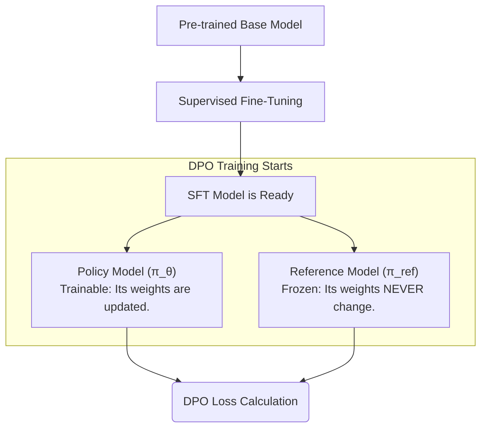

# **Title: Direct Preference Optimization (DPO): From Preference to Policy**

## **Chapter 1: The Alignment Problem: Judging is Easier than Creating**

A pre-trained Large Language Model (LLM) is a modern marvel. Trained on a vast expanse of the internet, it's a master of language, grammar, and knowledge. However, out of the box, it's not a helpful assistant; it's a **statistical parrot**. Its only goal is to predict the next word in a sequence, which can lead to some very unhelpful behavior.

For instance, if you ask a raw base model a question, you might get this:

**Your Prompt:**
```
What is the primary cause of Earth's seasons?
```

**The Base Model's Likely Response:**
```
What is the primary cause of Earth's seasons?
A) The Earth's distance from the sun.
B) The tilt of the Earth's axis.
C) The speed of the Earth's rotation.
D) Ocean currents and wind patterns.
```

The model didn't answer your question. It continued your text by turning it into a multiple-choice quiz. Why? Because it has seen countless quizzes online and, from a statistical standpoint, this is a highly probable pattern. It has no concept of your *intent*.

#### The First Solution: Supervised Fine-Tuning (SFT)

The first step in fixing this is **Supervised Fine-Tuning (SFT)**. The core idea is simple: we teach the model to be a helpful assistant by showing it thousands of high-quality examples. We curate a dataset of `(prompt, ideal_response)` pairs and train the model to imitate the ideal responses.

This process is incredibly effective. It takes the raw, aimless parrot and turns it into a capable apprentice that understands conversational structure and follows instructions.

| Characteristic | Pre-trained Base Model (The Parrot) | SFT Model (The Apprentice) |
| :--- | :--- | :--- |
| **Training Goal** | Predict the next word in any text. | Imitate expert-written responses to specific prompts. |
| **Training Data**| Unstructured internet text (books, websites, code).| Curated `(prompt, ideal_response)` pairs. |
| **Behavior** | Completes text patterns; no sense of user intent. | Follows instructions; adopts a helpful persona. |
| **Key Weakness** | Doesn't know how to be a helpful assistant. | Assumes there is only one "perfect" answer for every prompt. |

#### The SFT Limitation: The "Shades of Gray" Problem

SFT is a huge leap forward, but it has a fundamental weakness: it treats alignment as a black-and-white problem. The provided response in the dataset is considered 100% correct, and any deviation is implicitly wrong.

The real world, however, is full of nuance. Often, there isn't one "perfect" answer. Consider these two AI-generated summaries of an article:

*   **Response A:** "The article discusses climate change, focusing on rising sea levels and CO2 emissions. It mentions policy solutions." (Factually correct, but basic).
*   **Response B:** "The article provides a detailed analysis of climate change, attributing rising sea levels primarily to thermal expansion and glacial melt. It contrasts market-based policy solutions, like carbon taxes, with regulatory approaches." (More detailed, nuanced, and helpful).

As a human, you can instantly state a preference: **B is better than A**. SFT has no way to learn this relative judgment. It can only imitate.

This brings us to the core economic and practical insight that powers the next generation of alignment techniques:

> **It is exponentially easier for a human to *judge* which of two responses is better than it is to *create* a single perfect response from scratch.**

Creating a "perfect" response for an SFT dataset is time-consuming and expensive. Simply choosing `A` or `B` is fast and cheap. If we could build an algorithm that learns directly from these simple preferences, we could align our models more efficiently and effectively.

That algorithm is **Direct Preference Optimization (DPO)**.

By the end of this tutorial, you will understand every single component of the DPO formula. It may look intimidating now, but we are going to build it together, piece by piece, starting from this simple idea of human preference.

$$ \mathcal{L}_{\text{DPO}}(\pi_\theta; \pi_{\text{ref}}) = - \mathbb{E}_{(x, y_w, y_l) \sim \mathcal{D}} \left[ \log \sigma \left( \beta \left( \log \frac{\pi_\theta(y_w|x)}{\pi_{\text{ref}}(y_w|x)} - \log \frac{\pi_\theta(y_l|x)}{\pi_{\text{ref}}(y_l|x)} \right) \right) \right] $$

Our journey begins in the next chapter, where we will translate the simple human judgment "B is better than A" into our first piece of the mathematical puzzle.


## **Chapter 2: From Scores to Probabilities: The Bradley-Terry Model**

In the last chapter, we established that human preference data—simply judging "A is better than B"—is a powerful and efficient way to align LLMs. But how do we take a qualitative judgment like "Response B is better than Response A" and turn it into something a computer can understand and learn from? We need a mathematical model.

#### The Intuition: Hidden Quality Scores

The most intuitive way to model a preference is to assume that each option possesses an underlying, hidden **quality score**. Let's call this score **$r$**. When a human expresses a preference, they are implicitly stating that the chosen option has a higher quality score than the rejected one.

Let's revisit our example from Chapter 1:

*   **Response B:** "The article provides a detailed analysis of climate change, attributing rising sea levels primarily to thermal expansion and glacial melt. It contrasts market-based policy solutions, like carbon taxes, with regulatory approaches." (The preferred one)
*   **Response A:** "The article discusses climate change, focusing on rising sea levels and CO2 emissions. It mentions policy solutions." (The rejected one)

If a human judges **B > A**, we can assume:
*   $r_{\text{B}}$ (quality score for Response B) > $r_{\text{A}}$ (quality score for Response A)

For our tutorial, let's assign some hypothetical scores to make this concrete:
*   $r_{\text{winner}}$ (for Response B): **2.5**
*   $r_{\text{loser}}$ (for Response A): **0.8**

Our goal is to build a system that, given these scores, can predict the human's preference with a probability.

#### Formalizing Preferences: The Bradley-Terry Model

A simple yet powerful mathematical framework for modeling pairwise comparisons like this is the **Bradley-Terry model**. It states that the probability of one item (the winner) being preferred over another (the loser) is a function of the *difference* in their underlying quality scores.

The formula is:

$$ P(\text{winner} \succ \text{loser}) = \sigma(r_{\text{winner}} - r_{\text{loser}}) $$

Let's break down this formula:

*   **$P(\text{winner} \succ \text{loser})$:** This is the probability that the winner is indeed preferred over the loser, according to our model.
*   **$r_{\text{winner}}$ and $r_{\text{loser}}$:** These are the quality scores we just discussed.
*   **$\sigma$:** This is the **sigmoid function**. It's a fundamental tool in machine learning for converting any real number into a probability between 0 and 1.
    *   The sigmoid function is defined as: $\sigma(x) = \frac{1}{1 + e^{-x}}$
    *   It squashes values:
        *   Large positive `x` (big score difference) -> `σ(x)` approaches 1.0 (high probability)
        *   `x = 0` (no score difference) -> `σ(x)` is 0.5 (50/50 probability)
        *   Large negative `x` (loser's score is much higher) -> `σ(x)` approaches 0.0 (low probability)

#### Step-by-Step Calculation with Our Example

Let's apply the Bradley-Terry model to our concrete example:

1.  **Calculate the score difference ($\Delta r$):**
    $\Delta r = r_{\text{winner}} - r_{\text{loser}} = 2.5 - 0.8 = 1.7$

2.  **Apply the sigmoid function:**
    $P(\text{winner} \succ \text{loser}) = \sigma(1.7) = \frac{1}{1 + e^{-1.7}} = \frac{1}{1 + 0.1827} \approx 0.845$

Our model predicts an **84.5% probability** that Response B would be preferred over Response A. This makes intuitive sense: a larger positive difference in quality scores should correspond to a higher probability of preference.

The sigmoid function's behavior for different score differences is crucial to grasp:

| Score Difference ($\Delta r$) | Sigmoid($\Delta r$) | Interpretation |
| :--- | :--- | :--- |
| Large Positive (e.g., 5.0) | ~0.993 | Almost certain winner is preferred. |
| **Our Example (1.7)** | **~0.845** | **Confident winner is preferred.** |
| Zero (e.g., 0.0) | 0.500 | Completely uncertain; a 50/50 toss-up. |
| Negative (e.g., -1.7) | ~0.155 | Confident *loser* is preferred (our scores are "wrong" for the human judgment). |
| Large Negative (e.g., -5.0)| ~0.007 | Almost certain loser is preferred. |

We have successfully taken a simple human preference and converted it into a quantifiable probability. This `P(winner > loser)` is the first critical piece of our DPO puzzle. In the next chapter, we'll see how to turn this probability into a "loss" that our LLM can learn from.

## **Chapter 3: From Probability to a Loss Function: Negative Log-Likelihood**

In the last chapter, we successfully used the Bradley-Terry model to convert a pair of abstract "quality scores" into a probability. We called this `P(winner ≻ loser)`, and for our example, we calculated its value to be `0.845`.

This is a great first step, but a probability is just a prediction. To train a machine learning model, we need an **error signal**—a single number that tells the model how wrong its prediction was. This error signal is called a **loss function**, and the model's entire goal during training is to minimize this value.

The standard, time-tested method for converting a probability into a loss is to calculate the **Negative Log-Likelihood (NLL)**.

The formula is beautifully simple:

$$ \mathcal{L} = -\log \left( P(\text{winner} \succ \text{loser}) \right) $$

Now, we can combine this with the Bradley-Terry formula from Chapter 2 to create the complete loss function for our abstract scores:

$$ \mathcal{L} = -\log(\sigma(r_{\text{winner}} - r_{\text{loser}})) $$

#### A Quick Detour: Why Use the Negative Logarithm?

Why not use a simpler function, like `Loss = 1 - P`? The negative logarithm has a specific, powerful property that makes it perfect for training models.

Let's compare the two:

| Model's Probability `P` | Simpler Loss (`1 - P`) | **NLL Loss (`-log(P)`)** |
| :--- | :--- | :--- |
| 0.99 (Very Confident & Correct) | 0.01 | **0.01** |
| 0.50 (Uncertain) | 0.50 | **0.69** |
| 0.10 (Confident & Wrong) | 0.90 | **2.30** |
| 0.01 (Very Confident & Wrong) | 0.99 | **4.61** |
| 0.001 (Extremely Confident & Wrong) | 0.999 | **6.91** |

Notice the difference in the last few rows. With the simpler `1 - P` loss, the penalty for being wrong (`0.90`) and *very* wrong (`0.99`) is quite similar.

The **Negative Log-Likelihood**, however, *explodes* towards infinity as the probability approaches zero. It **aggressively penalizes** the model for being both confident and wrong. This creates a much stronger "error signal" (a steeper gradient) that forces the model to correct its biggest mistakes, leading to faster and more stable training. In information theory, `-log(P)` is a measure of "surprisal" — a highly improbable event is very surprising and contains a lot of information for the model to learn from.

#### Step-by-Step Calculation with Our Example

Let's calculate the loss for our ongoing example. In Chapter 2, we found that `P(winner ≻ loser)` was `0.845`.

1.  **Take the natural logarithm:**
    $\log(0.845) \approx -0.168$

2.  **Negate the result:**
    $\mathcal{L} = -(-0.168) = \mathbf{0.168}$

This single number, `0.168`, is our error signal for this specific preference pair. The job of a machine learning optimizer (like Adam) is to adjust the underlying parameters (in our case, the scores `r`) to push this loss value as close to zero as possible.

We have now built a complete, self-contained **preference modeling engine**. It takes two abstract scores, `r_winner` and `r_loser`, and produces a single, trainable loss value.

We are now ready to leave the world of abstract scores behind and connect this engine to a real Large Language Model. The critical question we must answer next is: how do we calculate these quality scores, `r`, for a sequence of text generated by an LLM? That is the subject of the next part of our journey.

## **Chapter 4: A Naive Reward for LLMs: Using Log-Probabilities**

In the last three chapters, we built a powerful "preference engine." It takes two numerical quality scores, `r_winner` and `r_loser`, and computes a loss that can be used for training.

This engine is abstract and general-purpose. Now, we must connect it to our specific problem: aligning a Large Language Model. The critical question we need to answer is:

> How do we define a numerical "quality score" (`r`) for a sequence of text generated by an LLM?

#### The Intuition: Confidence as a Proxy for Quality

Let's start with the most direct and intuitive idea. A "good" response should be one that our trainable language model is highly confident in generating. Conversely, a "bad" response should be one the model finds unlikely. If we can encourage the model to become more confident in the responses humans prefer, we should be able to steer its behavior in the right direction.

How do we measure an LLM's confidence in a given sequence of text? We use its **sequence log-probability**.

This leads us to our first, naive hypothesis for the reward function.

**Naive Reward Hypothesis:** The quality score `r` of a response `y` given a prompt `x` is the total log-probability of generating that response, as calculated by our trainable policy model, $\pi_{\theta}$.

#### The Formal Math

This hypothesis translates into the following mathematical formula for our score, `r`:

$$ r(x, y) = \log \pi_{\theta}(y|x) $$

Let's break this down. The probability of an entire sequence `y` (which consists of tokens $y_1, y_2, ..., y_N$) is the product of the probabilities of generating each token one by one:

$$ \pi_{\theta}(y|x) = \pi_{\theta}(y_1|x) \times \pi_{\theta}(y_2|x, y_1) \times \dots \times \pi_{\theta}(y_N|x, y_{<N}) $$

Multiplying many small probabilities together is numerically unstable in a computer. To fix this, we work in log space, where products become simple sums:

$$ r(x, y) = \log \pi_{\theta}(y|x) = \sum_{t=1}^{N} \log \pi_{\theta}(y_t | x, y_{<t}) $$

*   **What this means:** The total score of a response is the **sum** of the log-probabilities of each of its individual tokens.

Let's make this concrete with a simple example:

*   **Prompt `x`:** "The capital of France"
*   **Response `y`:** " is Paris"

The model calculates the score in two steps:
1.  Given the context "The capital of France", it calculates the log-probability of the next token being " is". Let's say it's `-0.2`.
2.  Given the context "The capital of France is", it calculates the log-probability of the next token being "Paris". Let's say it's `-0.3`.

The final score for the response " is Paris" would be the sum:
$r(x, y) = (-0.2) + (-0.3) = \mathbf{-0.5}$

This approach seems perfectly logical. To make the model prefer a winning response `y_w` over a losing one `y_l`, we just need to train it to produce a higher log-probability (a less negative score) for `y_w`.

We now have our first concrete proposal for an LLM reward function. But to use it, we need to know how to actually compute this value in code. In the next chapter, we will do exactly that, writing a PyTorch function from scratch to calculate the sequence log-probability for any given response.

## **Chapter 5: Code Deep Dive: Calculating Sequence Log-Probabilities**

In the last chapter, we defined our first reward function for an LLM: the sequence log-probability. Now, we need to translate that mathematical concept into working PyTorch code. Our goal is to create a single, robust function that can calculate this score for any given prompt and response.

Before we build our function, let's have a quick refresher on how a language model generates a single token. This will help us understand where the probabilities we need come from.

#### A Quick Refresher: From Logits to Probabilities

When you give a language model a sequence of input tokens, it performs a single "forward pass" and produces a final tensor called **logits**.

1.  **Input:** A sequence of token IDs, e.g., `input_ids = [1, 2, 3, 4]` ("The capital of France").
2.  **Model Forward Pass:** The model processes these IDs and outputs `logits`.
3.  **Logits:** This is a large tensor of raw, unnormalized scores. Its shape is typically `(batch_size, sequence_length, vocab_size)`. For our input, the shape would be `(1, 4, 50257)` if we use a GPT-2 sized vocabulary. The key part is the last logit vector, `logits[0, -1, :]`, which contains a score for every single word in the vocabulary for being the *next* token.
4.  **Probabilities:** To turn these raw scores into probabilities, we apply the **softmax function**.

```python
import torch
import torch.nn.functional as F

# A mock logit vector for the last token. High score for "is".
# Shape: (vocab_size)
mock_logits = torch.tensor([0.1, 3.0, 0.5, 0.2]) # Vocab: {"The":0, "is":1, "Paris":2, "Lyon":3}

# Convert logits to probabilities
probabilities = F.softmax(mock_logits, dim=-1)
print(f"Probabilities: {probabilities.numpy()}")
# Output: Probabilities: [0.045... 0.819... 0.061... 0.049...]
```
During generation, the model would *sample* from this probability distribution to pick the next token. But for DPO, we don't want to sample. We already have the response. We just need to find the probability the model assigned to the specific tokens that were *actually in that response*.

#### The `get_sequence_log_probs` Function

Now we're ready to build our core function. It will take a batch of prompts and responses and return the total log-probability for each response.

```python
def get_sequence_log_probs(model, prompt_tokens, response_tokens):
    """
    Calculates the total log-probability of generating the response given the prompt.
    """
    # 1. Combine prompt and response for a single forward pass
    input_ids = torch.cat([prompt_tokens, response_tokens], dim=1)

    # 2. Get the model's predictions (logits)
    # The model's forward pass returns logits (and optionally other things)
    outputs = model(input_ids)
    logits = outputs.logits # Assuming a Hugging Face-style model output

    # 3. Slice the logits to only include predictions for the response tokens.
    # The logit for the first response token is predicted from the last prompt token.
    prompt_len = prompt_tokens.size(1)
    # We ignore the logit for the very last token, as it predicts what comes *after* our response.
    response_logits = logits[:, prompt_len - 1:-1, :]

    # 4. Calculate the log-probabilities of the actual response tokens using log_softmax
    # for better numerical stability than log(softmax(x)).
    log_probs = F.log_softmax(response_logits, dim=-1)

    # 5. Gather the log-probs for the specific tokens that were in our response.
    # response_tokens.unsqueeze(-1) adds a dimension to match log_probs shape for gather.
    token_log_probs = torch.gather(log_probs, 2, response_tokens.unsqueeze(-1)).squeeze(-1)

    # 6. Sum up the log-probabilities for each sequence in the batch to get the total score.
    return token_log_probs.sum(dim=1)
```

#### A Concrete Example: "is Paris"

Let's trace this function with a real example to see exactly what's happening.
*   **Prompt `x`:** "The capital of France"
*   **Response `y`:** " is Paris"

First, we need our tokenized inputs.
```python
# Assume a simple tokenizer
# vocab: {"The":1, "capital":2, "of":3, "France":4, " is":5, "Paris":6, "Lyon":7}
prompt = torch.tensor([[1, 2, 3, 4]])      # Shape: (1, 4)
response = torch.tensor([[5, 6]])          # Shape: (1, 2)

# Assume we have a 'policy_model' and mock its output logits for this walkthrough
```

Now, let's trace the execution of `get_sequence_log_probs(policy_model, prompt, response)`.

**Step 1-3: Get `response_logits`**
*   `input_ids` becomes `[1, 2, 3, 4, 5, 6]` ("The capital of France is Paris").
*   The model outputs `logits` of shape `(1, 6, vocab_size)`.
*   `prompt_len` is 4.
*   We slice the logits at `[:, 3:5, :]`. This gives us the logits from two positions:
    1.  The prediction after the context `...France` (at index 3).
    2.  The prediction after the context `...France is` (at index 4).

Let's assume the relevant mock logits (for tokens 5, 6, 7) from these two positions are:
```
# Logits from context "...France":  Scores for [" is", "Paris", "Lyon"] -> [3.0, 0.5, 0.2]
# Logits from context "...France is": Scores for [" is", "Paris", "Lyon"] -> [0.1, 4.0, 1.0]
```

**Step 4 & 5: Calculating `token_log_probs`**
The code converts these logits to log-probabilities and then uses `gather` to pick out the ones corresponding to our target tokens (`[5, 6]`).

| Context | Target Token | Logits `[5,6,7]` | Log-Probs `[5,6,7]` | Gathered `log P(token)` |
| :--- | :--- | :--- | :--- |:--- |
| "... France" | `is` (idx 5) | `[3.0, 0.5, 0.2]` | `[-0.23, -2.73, -3.03]` | **-0.23** |
| "... France is" | `Paris` (idx 6)| `[0.1, 4.0, 1.0]` | `[-4.08, -0.18, -3.18]` | **-0.18** |

**Step 6: Summing to get the final score**
*   Final Score $r = (-0.23) + (-0.18) = \mathbf{-0.41}$

We have successfully built a function that implements our naive reward. It takes a prompt and response and returns a single score. On the surface, this seems perfect. We can now get a score for both the winning and losing responses, plug them into our preference loss function from Chapter 3, and start training.

However, as we will see in the next chapter, this seemingly logical reward function has subtle but catastrophic flaws.

## **Chapter 6: The Failure of Naivety: Why Log-Probs Aren't Enough**

In the last two chapters, we built what seems like a perfect system. We defined a reward for an LLM response as its sequence log-probability, and we implemented a PyTorch function to calculate it. The system is simple, intuitive, and appears to create the right incentives. It feels like we should be done.

So, why isn't this the final solution?

The naive reward function, $r(x, y) = \log \pi_{\theta}(y|x)$, fails because it creates unintended and deeply undesirable incentives. It has two subtle but critical flaws that can severely degrade the model's quality, teaching it to be lazy and unhelpful. We will now explore both with concrete examples.

#### Failure Mode 1: The Length Bias -> A Tendency for Short Answers

The sequence log-probability is a **sum** of individual token log-probabilities. Since probabilities are always between 0 and 1, their logarithms are always negative (e.g., `log(0.9) ≈ -0.105`). This leads to a simple, inescapable mathematical fact:

> **Every token you add to a sequence makes its total score lower (more negative).**

This creates a severe bias against longer, more detailed, and often more helpful responses, even when the human labeler explicitly preferred them.

Let's consider a preference pair where the human chose the more verbose answer.

*   **Prompt `x`:** "What is DPO?"
*   **Winner `y_w` (Helpful, 7 tokens):** "An algorithm for aligning language models"
*   **Loser `y_l` (Terse, 2 tokens):** "An algorithm"

Let's assume our policy model, $\pi_{\theta}$, is reasonably good. It's confident in all these tokens, assigning each a high probability of 0.9, which has a log-probability of approximately **-0.105**.

**Calculating the Naive Score for the Terse Loser (`y_l`)**
This response has 2 tokens.
*   Total Score $r_l = 2 \times (-0.105) = \mathbf{-0.21}$

**Calculating the Naive Score for the Helpful Winner (`y_w`)**
This response has 7 tokens.
*   Total Score $r_w = 7 \times (-0.105) = \mathbf{-0.735}$

Now, let's compare the scores our naive reward function has produced:
*   Score of (Preferred) Winner `r_w`: **-0.735**
*   Score of (Rejected) Loser `r_l`: **-0.21**

The result is a disaster. Since `-0.21 > -0.735`, our reward function has assigned a **higher score to the worse answer**. If we train our model using this objective, it will learn a clear lesson: **shorter is better**. The model's outputs will become terse and unhelpful, directly contradicting the human feedback, simply to satisfy this flawed mathematical incentive.

#### Failure Mode 2: The "Bland Prior" Bias -> A Tendency for Repetitive Filler

This second failure mode is more subtle but equally damaging. The model's weights are shared globally. The optimizer's goal is to improve the DPO objective across the entire dataset. It has a limited "gradient budget" and will spend it where it gets the best return on investment.

The naive reward function incentivizes the model to simply make its own predictions more likely. The easiest and "cheapest" way to do this is to slightly increase the probability of tokens that are **already common and easy to predict** (like "is", "a", "the"), rather than spending a lot of effort learning specific, rare, and difficult facts.

Let's do some "gradient budget" accounting. The optimizer must choose between two ways to improve the total loss:

1.  **Option A (Hard):** Learn a specific, helpful fact. For example, in the 10 dataset examples where the prompt is about the capital of France, increase the log-probability of "Paris" from -2.0 to -1.0 (a `+1.0` gain per example).
2.  **Option B (Easy):** Polish what's already known. For example, in the 50,000 places across the dataset where the common token "the" appears, slightly increase its already-high log-probability from -0.05 to -0.04 (a tiny `+0.01` gain per example).

Let's calculate the total "reward" the optimizer gets from each choice:
*   **Total Gain from Option A (Learning "Paris"):** `10 examples × 1.0 gain/example =` **+10**
*   **Total Gain from Option B (Polishing "the"):** `50,000 examples × 0.01 gain/example =` **+500**

The optimizer gets **50 times more reward** for making a generic word slightly more probable than for learning a useful fact.

**What does a model trained with this bias look like?**
It learns that the optimal strategy to get a high score is to generate text full of high-frequency, statistically "safe" words. The ultimate expression of this is **repetition and filler**.

Consider this preference pair:
*   **Prompt:** "What are the risks of AI?"
*   **Winner:** "Some risks include job displacement and algorithmic bias."
*   **Loser:** "That is a very interesting question."

The model trained with the naive objective might discover it can get an even higher score than the "winner" by generating something like this:
*   **Model's Hacked Response:** "It is a fact that it is a fact that it is..."

Why? Because the sequence of tokens `P("It") * P("is") * P("a") * P("fact") * P("that")` might consist of tokens that are individually *extremely* high-probability (`>0.99`), leading to a total sequence log-probability (e.g., `-0.1`) that is much better than the more nuanced, human-preferred answer (e.g., `-1.5`). The model has "hacked" the reward by exploiting this bias. It outputs filler because filler is statistically easy and therefore high-probability.

We have now seen that our simple, intuitive reward function is fundamentally broken. It punishes helpful verbosity, leading to **short answers**, and it rewards statistical safety, leading to **repetitive filler**. To fix this, we need a more sophisticated reward function that can measure a response's quality *relative to a stable baseline*. This is the role of the reference model, which we will introduce in the next chapter.

## **Chapter 7: The Hero Arrives: The Reference Model**

In the last chapter, our naive reward function crashed and burned. We proved that using raw log-probability as a score leads to a model that writes short, repetitive, and unhelpful answers. It learns to chase statistical safety instead of human preference.

The core problem is that we are measuring an **absolute score**. We need to shift our thinking. Instead of asking, "How good is this response in a vacuum?", we should be asking a much smarter question:

> "How much *better* is this response compared to what my model would have said at the beginning of training?"

By measuring **relative improvement**, we can build a much more stable and robust reward system. To do this, we need a consistent baseline—a "measuring stick" to compare against.

Enter the hero of our story: the **Reference Model**.

#### What is a Reference Model? A Frozen Snapshot in Time

The reference model is deceptively simple: it is a **frozen, read-only copy of our model from the beginning of DPO training**.

The entire DPO training lifecycle looks like this:



1.  We start with our capable SFT model (the "apprentice" from Chapter 1).
2.  Before the first DPO training step, we create **two identical copies** of it in memory.
3.  One copy becomes the **Policy Model ($\pi_{\theta}$)**. This is the model we will actively train and improve.
4.  The other copy becomes the **Reference Model ($\pi_{\text{ref}}$)**. We freeze it immediately (`requires_grad=False`). It will never learn or change for the entire duration of DPO training.

The reference model acts as a perfect anchor, a memory of our model's "best self" right after SFT. It provides a stable, consistent baseline against which we can measure the policy model's progress.

#### Why Use the SFT Model as the Reference? (Not the Base Model)

This is a critical question. Why copy the SFT model? Why not use the original, pre-trained base model as our reference?

| Reference Choice | Feasibility | Why It's a Good/Bad Idea |
| :--- | :--- | :--- |
| **Base Model** | **Poor Choice** | The base model is a "parrot" that doesn't understand instructions. Comparing our helpful policy model's response to the base model's nonsensical text completion is like comparing an apple to an engine part. The baseline is too different and provides a meaningless, noisy signal. |
| **SFT Model** | **Excellent Choice** | The SFT model is our starting point for preference tuning. It already knows how to be a helpful assistant. Using it as a reference ensures we are measuring *how much the policy has improved at following preferences*, relative to an already-strong starting point. It acts as a **guardrail**, preventing the policy from "forgetting" its SFT training in pursuit of a high preference score. |

Using the SFT model as the reference keeps the DPO training process grounded. The goal isn't just to satisfy preferences, but to do so while remaining a helpful, instruction-following assistant.

#### The New DPO Reward Function

With our reference model in place, we can define our new, robust reward function. The score of a response is no longer its raw log-probability. Instead, it is the **scaled difference between the policy and reference model log-probabilities.**

$$ r(x, y) = \beta \left( \log \pi_{\theta}(y|x) - \log \pi_{\text{ref}}(y|x) \right) $$

Let's break this down:
*   $\log \pi_{\theta}(y|x)$: The log-probability of the response from our trainable **policy model**.
*   $\log \pi_{\text{ref}}(y|x)$: The log-probability of the *same response* from our frozen **reference model**.
*   The difference $(\dots - \dots)$: This measures the **relative improvement** or *divergence* of the policy from its SFT starting point. A response only gets a high score if the policy finds it significantly *more* probable than the reference model did.
*   $\beta$ (beta): This is a hyperparameter (typically a small number like 0.1) that acts like a knob. It controls how much we penalize the policy for straying too far from the reference model. It's a safety brake that keeps the policy from becoming too different from its well-behaved SFT version.

We have now introduced our hero and its powerful new tool. In the next chapter, we will see this robust reward function in action, and watch as it single-handedly defeats the two villains—Length Bias and Bland Prior Bias—that doomed our naive approach.

## **Chapter 8: How the DPO Reward Solves Everything**

In the last chapter, we introduced our hero: the reference model (`π_ref`). We then crafted a new, robust reward function based on the *relative improvement* of our trainable policy model (`π_θ`) over this frozen baseline.

The DPO Reward: $$ r(x, y) = \beta \left( \log \pi_{\theta}(y|x) - \log \pi_{\text{ref}}(y|x) \right) $$

Now it's time for the payoff. Let's revisit the two catastrophic failure modes from Chapter 6—the Length Bias and the Bland Prior Bias—and watch as this elegant formula single-handedly solves them both.

#### 1. Solving the Length Bias

*   **The Problem Recap:** The naive reward (raw log-probability) punishes longer responses because summing more negative numbers always results in a lower (worse) score. This incorrectly favored a terse, 2-token response over a helpful, 7-token one.
*   **The DPO Fix:** The reference model, being a copy of the SFT model, is also a language model. It has the *exact same architectural bias*. The log-probabilities for a long answer will be low for *both* the policy and the reference model. When we take their difference, the bias largely cancels out.

Let's re-run the numbers from our "What is DPO?" example, now using the DPO reward. We'll set `β = 0.1`.

*   $y_w$ (Helpful Winner, 7 tokens)
*   $y_l$ (Terse Loser, 2 tokens)

To calculate the DPO reward, we now need log-probabilities from both models. Let's assume the following values:

| Response | `log π_θ` (Policy) | `log π_ref` (Reference) | DPO Reward `β(log π_θ - log π_ref)` |
| :--- | :--- | :--- | :--- |
| **$y_w$ (Winner)** | -0.735 | -0.750 | `0.1 * (-0.735 - (-0.750)) = ` **+0.0015** |
| **$y_l$ (Loser)** | -0.210 | -0.200 | `0.1 * (-0.210 - (-0.200)) = ` **-0.0010** |

Look at the result! The magic is in the `DPO Reward` column.

Even though the policy's raw log-prob for the winner (`-0.735`) is much lower than for the loser (`-0.210`), its DPO reward is now **positive**, while the loser's is **negative**. The reward now correctly reflects the human preference. The model is properly incentivized to produce the longer, more helpful answer because that's where its *relative improvement* over the reference model is greatest.

#### 2. Solving the "Bland Prior" Bias

*   **The Problem Recap:** The naive reward gave a massive return on investment for slightly improving the probability of already-common words (like "the"), encouraging repetitive filler instead of useful facts.
*   **The DPO Fix:** Common, generic words are already highly probable for the SFT-trained reference model. Therefore, the difference in log-probabilities (`log π_θ - log π_ref`) will be tiny, and the resulting reward will be close to zero. The DPO reward function offers almost no incentive for polishing what's already easy and well-known.

Let's re-run our "gradient budget" accounting with the DPO reward, again with `β = 0.1`.

| Optimization Target | `log π_θ` (Policy, after small update) | `log π_ref` (Reference, the fixed starting point) | DPO Reward Gain `β * Δ(log_ratio)` |
| :--- | :--- | :--- | :--- |
| **Generic word "the"** | -0.0408 (Improved) | -0.0513 (Already High) | `0.1 * ((-0.0408) - (-0.0513)) = ` **+0.00105** |
| **Specific word "Paris"**| -0.105 (Improved)| -0.916 (Was Low) | `0.1 * ((-0.105) - (-0.916)) = ` **+0.0811** |

The tables have turned completely. The DPO reward for learning the specific, helpful fact ("Paris") is now **~77 times greater** than the reward for polishing the generic word ("the").

The optimizer's gradient budget will now flow exactly where we want it: towards learning the novel, specific, and useful information that distinguishes a preferred response from a rejected one. The incentive to generate bland, repetitive filler has vanished.

With two elegant strokes, the reference-aware DPO reward has fixed the fundamental flaws of our naive approach. We now have a reward signal that is robust, stable, and correctly aligned with our goal. In the next chapter, we will take this final piece and assemble the complete DPO loss function, connecting all the dots from our journey so far.

## **Chapter 9: Assembling the Final DPO Formula**

Our journey is nearing its end. We have built all the necessary components, piece by piece, and now it's time to assemble them into the final, complete Direct Preference Optimization loss function.

This chapter is the grand synthesis. We will see how the preference modeling engine from Part I and the robust LLM reward function from Part III fit together perfectly.

Let's quickly recap our building blocks:

1.  **The Preference Model (Chapters 2 & 3):** We learned how to convert a preference between two items with scores `r_winner` and `r_loser` into a trainable loss. This formed the outer shell of our algorithm.
    $$ \mathcal{L} = -\log(\sigma(r_{\text{winner}} - r_{\text{loser}})) $$

2.  **The Robust LLM Reward (Chapters 7 & 8):** We developed a reference-aware reward function that correctly scores an LLM's response `y` by measuring its improvement over a frozen baseline `π_ref`.
    $$ r(x, y) = \beta \left( \log \pi_{\theta}(y|x) - \log \pi_{\text{ref}}(y|x) \right) $$

Now, we perform the final step: we **substitute** our robust LLM reward function into the preference model's loss function.

#### The Final Formula, Step-by-Step

Let's start with the core of the preference loss, which is the difference in scores:
$$ r_{\text{winner}} - r_{\text{loser}} $$

Now, let's replace `r_winner` with the full DPO reward for the winning response, `y_w`, and `r_loser` with the reward for the losing response, `y_l`:

$$ \underbrace{\beta \left( \log \pi_{\theta}(y_w|x) - \log \pi_{\text{ref}}(y_w|x) \right)}_{\text{Score for the Winner}} - \underbrace{\beta \left( \log \pi_{\theta}(y_l|x) - \log \pi_{\text{ref}}(y_l|x) \right)}_{\text{Score for the Loser}} $$

For convenience, we can factor out the `β` and rearrange the terms:

$$ \beta \left( \left( \log \pi_{\theta}(y_w|x) - \log \pi_{\text{ref}}(y_w|x) \right) - \left( \log \pi_{\theta}(y_l|x) - \log \pi_{\text{ref}}(y_l|x) \right) \right) $$

Finally, we plug this entire expression back into our original loss function from Chapter 3:

$$ \mathcal{L}_{\text{DPO}} = -\log \sigma \left( \beta \left( \left( \log \pi_{\theta}(y_w|x) - \log \pi_{\text{ref}}(y_w|x) \right) - \left( \log \pi_{\theta}(y_l|x) - \log \pi_{\text{ref}}(y_l|x) \right) \right) \right) $$

This is the final DPO loss function. It might look complex, but you now understand the origin and purpose of every single component.

There is no more magic. We have successfully derived the entire DPO algorithm from first principles, starting with the simple idea of "judging is easier than creating." We have a robust, theoretically sound, and powerful formula for aligning a language model directly on human preferences.

In the final chapter, we will translate this complete formula into a working PyTorch implementation and watch the numbers flow through it one last time.

## **Chapter 10: The Grand Finale: A Full PyTorch Implementation**

We have completed the full theoretical journey. We started with the simple idea of human preference, built a mathematical engine to model it, stress-tested a naive reward function, and finally arrived at the robust, reference-aware solution that defines DPO.

Now, it's time to translate that final, robust theory into a single, working PyTorch function. This is the moment where all the abstract concepts become concrete code.

By the end of this chapter, you will see how our `get_sequence_log_probs` function from Chapter 5 becomes the engine for the final DPO training step, and you will walk through a full numerical example, tracing a single preference pair from input tokens to a final, trainable loss value.

#### The DPO Training Step

The core of the implementation is a function that takes a batch of preference data, our two models, and an optimizer, and performs one full DPO update. It cleanly orchestrates all the logic we've developed.

```python
import torch
import torch.nn.functional as F
# We assume our function from Chapter 5 is available
# from chapter5 import get_sequence_log_probs 

def dpo_training_step(policy_model, ref_model, optimizer, batch, beta=0.1):
    """
    Performs a single DPO optimization step on a batch of preference data.
    'batch' is a dictionary with keys: 'prompt', 'chosen', 'rejected'.
    """
    policy_model.train()
    optimizer.zero_grad()

    # --- 1. Get log-probs for chosen and rejected responses from the POLICY model ---
    # Gradients will flow through these calculations.
    pi_chosen_logps = get_sequence_log_probs(policy_model, batch['prompt'], batch['chosen'])
    pi_rejected_logps = get_sequence_log_probs(policy_model, batch['prompt'], batch['rejected'])

    # --- 2. Get log-probs from the FROZEN REFERENCE model ---
    # We use torch.no_grad() for efficiency as we don't need gradients for the ref model.
    with torch.no_grad():
        ref_chosen_logps = get_sequence_log_probs(ref_model, batch['prompt'], batch['chosen'])
        ref_rejected_logps = get_sequence_log_probs(ref_model, batch['prompt'], batch['rejected'])

    # --- 3. Calculate the DPO rewards (the inner part of the DPO loss) ---
    # r_chosen = beta * (log_pi_chosen - log_ref_chosen)
    # r_rejected = beta * (log_pi_rejected - log_ref_rejected)
    chosen_rewards = beta * (pi_chosen_logps - ref_chosen_logps)
    rejected_rewards = beta * (pi_rejected_logps - ref_rejected_logps)
    
    # --- 4. Calculate the final loss ---
    # This is -log_sigmoid(r_chosen - r_rejected)
    loss = -F.logsigmoid(chosen_rewards - rejected_rewards).mean()

    # --- 5. Backpropagation ---
    loss.backward()
    optimizer.step()

    # (Optional) For logging, calculate the accuracy of the rewards
    reward_accuracies = (chosen_rewards > rejected_rewards).float()
    return loss.item(), reward_accuracies.mean().item()
```

#### A Full Numerical Walkthrough

Let's trace a single preference pair through this function to see every number come to life. We'll use our familiar example.

*   **Prompt:** "Capital of France?"
*   **Chosen `y_w`:** " is Paris"
*   **Rejected `y_l`:** " is Lyon"
*   **`beta`:** 0.1

**Step 1 & 2: Get Log-Probabilities**
Our `get_sequence_log_probs` function is called four times. Let's assume it returns the following values. Notice how the policy is more confident in the chosen response than the reference is, and less confident in the rejected one.

| Log-Probability | `pi_logps` (Policy) | `ref_logps` (Reference) |
| :--- | :--- | :--- |
| **Chosen (`y_w`)** | -10.0 | -12.0 |
| **Rejected (`y_l`)**| -15.0 | -14.0 |

**Step 3: Calculate the DPO Rewards**
The code now calculates the robust DPO reward for both responses.

*   **`chosen_rewards` ($r_w$):**
    `0.1 * (-10.0 - (-12.0)) = 0.1 * (2.0) = 0.2`
*   **`rejected_rewards` ($r_l$):**
    `0.1 * (-15.0 - (-14.0)) = 0.1 * (-1.0) = -0.1`

The model's rewards (`0.2` vs `-0.1`) correctly align with the human preference. The `reward_accuracy` for this example is 1.0.

**Step 4: Calculate the Final Loss**
The final step is to compute the negative log-sigmoid of the reward difference.

1.  **Reward Difference (`chosen_rewards - rejected_rewards`):**
    `0.2 - (-0.1) = 0.3`

2.  **Log-Sigmoid:**
    `F.logsigmoid(torch.tensor(0.3))` calculates `log(sigmoid(0.3))`, which is `log(0.574) ≈ -0.555`.

3.  **Final Loss (negated):**
    `loss = -(-0.555) = 0.555`

The final scalar loss for this training example is **0.555**.

**Step 5: Backpropagation**
The `loss.backward()` call will now compute the gradients of this `0.555` loss value with respect to the policy model's parameters. The optimizer will then take a small step to adjust the model's weights in a direction that would have:
*   Increased `pi_chosen_logps` (e.g., from -10.0 towards -9.9)
*   Decreased `pi_rejected_logps` (e.g., from -15.0 towards -15.1)

This change would increase the `reward_difference`, making the `logsigmoid` term less negative, and thus pushing the final `loss` value closer to zero.

Here is a table summarizing the entire data flow for our single example:

| Variable | `chosen` (`y_w`) | `rejected` (`y_l`) | Notes |
| :--- | :--- | :--- |:--- |
| `pi_logps` | -10.0 | -15.0 | Differentiable output from policy model |
| `ref_logps` | -12.0 | -14.0 | Fixed output from reference model |
| **`rewards` ($r$)** | **0.2** | **-0.1** | `beta * (pi_logps - ref_logps)` |
| `reward_difference` | \multicolumn{2}{c|}{`0.2 - (-0.1) = 0.3`} | The argument to the loss function |
| **`loss`** | \multicolumn{2}{c|}{`-F.logsigmoid(0.3) = 0.555`} | Final scalar loss to be minimized |

#### Conclusion: From Preference to Policy

We have now successfully built a complete, robust, and efficient implementation of Direct Preference Optimization from the ground up. This technique is a cornerstone of modern LLM alignment, offering a powerful way to steer model behavior directly from human preferences without the complexity of training a separate reward model or using a full reinforcement learning loop.

You have seen how a simple, practical insight—that judging is easier than creating—can be systematically translated into a robust mathematical formula and, finally, into clean, working code. The real-world application of DPO is simply this exact logic, scaled up to massive preference datasets and state-of-the-art language models.