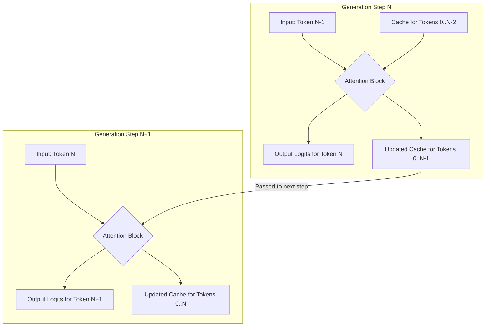

# **Give me 30 min, I will make KV cache click forever**

## **Introduction: The Bottleneck in Our Transformer**

In our last session, we built a complete, working GPT model from scratch. We demystified every component, from embeddings to the final prediction head. The result was this minimal, understandable implementation:

```python
class GPT2(nn.Module):
    def __init__(self, config: GPTConfig):
        super().__init__()
        self.config = config
        self.wte = nn.Embedding(config.vocab_size, config.n_embd)
        self.wpe = nn.Embedding(config.block_size, config.n_embd)
        self.drop = nn.Dropout(config.dropout)
        self.h = nn.ModuleList([Block(config) for _ in range(config.n_layer)])
        self.ln_f = nn.LayerNorm(config.n_embd)
        self.lm_head = nn.Linear(config.n_embd, config.vocab_size, bias=False)
        self.lm_head.weight = self.wte.weight
    def forward(self, idx, targets=None):
        B, T = idx.size()
        pos = torch.arange(0, T, dtype=torch.long, device=idx.device).unsqueeze(0)
        x = self.wte(idx) + self.wpe(pos)
        x = self.drop(x)
        for block in self.h:
            x = block(x)
        x = self.ln_f(x)
        logits = self.lm_head(x)
        loss = F.cross_entropy(logits.view(-1, logits.size(-1)), targets.view(-1)) if targets is not None else None
        return logits, loss
```

This code works. It trains, and it generates text. But it has a secret, critical flaw: the generation process is painfully inefficient. Generating text one token at a time is slow, and the reason lies in a massive amount of redundant computation hidden within our self-attention mechanism.

You should be familiar with the core attention formula. If not, I highly recommend watching our previous video on the Transformer architecture.
$$ \text{Attention}(Q, K, V) = \text{softmax}\left(\frac{QK^T}{\sqrt{d_k}} + M\right)V $$
The bottleneck is this: every time we generate a single new token, we re-calculate the **Key (K)** and **Value (V)** vectors for *every single token that came before it*. This is incredibly wasteful.

#### Our Promise and The Solution

In the next 30 minutes, this inefficiency will not only make perfect sense, but you will have fixed it. We are going to implement the **KV Cache**, a simple and elegant optimization that is fundamental to every modern large language model.

The idea is straightforward: instead of re-computing old Key and Value vectors, we will cache them. This one change will dramatically accelerate our model's generation speed by transforming the computational complexity from quadratic to linear.

Here is exactly how we will do it, presented as the code changes we are going to make.

**This is the change we will make to `CausalSelfAttention`:**
```diff
--- a/gpt2_min.py
+++ b/gpt2_min_kv_cache.py
@@ -23,17 +23,26 @@
         self.c_proj = nn.Linear(config.n_embd, config.n_embd)
         self.resid_drop = nn.Dropout(config.dropout)
         self.register_buffer("bias", torch.tril(torch.ones(config.block_size, config.block_size)).view(1, 1, config.block_size, config.block_size))
-    def forward(self, x):
-        B, T, C = x.size()
+
+    def forward(self, x, past_kv=None):
+        B, T, C = x.size() # T is the new sequence length (usually 1)
         qkv = self.c_attn(x)
         q, k, v = qkv.split(self.n_embd, dim=2)
         head_dim = C // self.n_head
         q = q.view(B, T, self.n_head, head_dim).transpose(1, 2)
         k = k.view(B, T, self.n_head, head_dim).transpose(1, 2)
         v = v.view(B, T, self.n_head, head_dim).transpose(1, 2)
+
+        if past_kv is not None:
+            past_k, past_v = past_kv
+            k = torch.cat((past_k, k), dim=-2)
+            v = torch.cat((past_v, v), dim=-2)
+
+        present_kv = (k, v)
+        T_total = k.size(-2)
+
         att = (q @ k.transpose(-2, -1)) * (1.0 / math.sqrt(head_dim))
-        att = att.masked_fill(self.bias[:, :, :T, :T] == 0, float("-inf"))
+        att = att.masked_fill(self.bias[:, :, T_total-T:T_total, :T_total] == 0, float("-inf"))
         att = F.softmax(att, dim=-1)
         y = att @ v
         y = y.transpose(1, 2).contiguous().view(B, T, C)
-        return self.resid_drop(self.c_proj(y))
+        return self.resid_drop(self.c_proj(y)), present_kv

```
Don't worry if this `diff` seems cryptic. By the end of this tutorial, you will understand the purpose of every single added line. Let's begin by dissecting the problem.

## **Chapter 1: The Anatomy of Wasteful Generation**

To understand the problem, we must first appreciate it. The inefficiency isn't in a bug or a mistake; it's inherent to the simple, stateless design of our `generate` loop and `CausalSelfAttention` module. Let's look at the exact code responsible.

#### The Code in Question

First, the generation loop. Its job is to repeatedly call the model with a progressively longer sequence.

```python
# Simplified from gpt2_min.py's generate() method
def generate(self, idx, max_new_tokens):
    # The core generation loop
    for _ in range(max_new_tokens):
        # 1. At each step, we pass the ENTIRE sequence `idx` to the model
        logits, _ = self(idx)
        
        # 2. We only use the prediction from the very last time step
        last_token_logits = logits[:, -1, :]
        
        # 3. Sample a new token
        probs = F.softmax(last_token_logits, dim=-1)
        next_token = torch.multinomial(probs, num_samples=1)
        
        # 4. Append the new token and repeat
        idx = torch.cat((idx, next_token), dim=1)
    return idx
```

Second, the attention mechanism. This is where the actual computation happens when the model is called.

```python
# The original, stateless CausalSelfAttention.forward method
def forward(self, x):
    B, T, C = x.size() # T is the full sequence length
    
    # 1. We project the entire input sequence `x` to get Q, K, and V
    qkv = self.c_attn(x)
    q, k, v = qkv.split(self.n_embd, dim=2)
    
    # ... (rest of the attention calculation)
    # The key is that q, k, and v are re-calculated from scratch every time.
    # ...
    return y
```

The inefficiency arises from the interaction between these two pieces of code. The loop repeatedly calls the attention module with a sequence that is almost identical to the previous one, forcing the attention module to redo almost all of its work.

#### A Concrete Example: The Waste in Action

Let's trace the generation process step-by-step. Imagine our prompt is the two-word sequence "A cat".
*   **Prompt Token IDs:** `idx = [10, 3]`

**Step 1: Generating the 3rd token**

The `generate` loop begins its first iteration.

1.  **Input:** The model is called with the current sequence: `idx` of shape `(1, 2)`, containing `[10, 3]`.
2.  **Inside `CausalSelfAttention.forward`:**
    *   The input `x` (the embeddings for "A cat") has a shape of `(B=1, T=2, C=768)`.
    *   The line `q, k, v = qkv.split(...)` executes.
    *   The variable `k` is now a tensor of shape `(1, 2, 768)`. Let's visualize its contents:
        `k = [ k_vector("A"), k_vector("cat") ]`
    *   Similarly, `v` contains:
        `v = [ v_vector("A"), v_vector("cat") ]`
3.  **Output:** After the attention calculation, the model predicts the most likely next token is "sat" (ID `8`).
4.  **Append:** The `generate` loop appends this new token. Our sequence is now `idx = [10, 3, 8]`.

**Step 2: Generating the 4th token**

The `generate` loop begins its second iteration.

1.  **Input:** The model is called with the **new, longer** sequence: `idx` of shape `(1, 3)`, containing `[10, 3, 8]`.
2.  **Inside `CausalSelfAttention.forward`:**
    *   The input `x` (embeddings for "A cat sat") has a shape of `(B=1, T=3, C=768)`.
    *   The line `q, k, v = qkv.split(...)` executes **again**.
    *   The variable `k` is now a tensor of shape `(1, 3, 768)`. Its contents are:
        `k = [ k_vector("A"), k_vector("cat"), k_vector("sat") ]`
    *   Similarly, `v` contains:
        `v = [ v_vector("A"), v_vector("cat"), v_vector("sat") ]`

This is the moment the inefficiency becomes clear. **We just re-calculated `k_vector("A")` and `k_vector("cat")`.** We already computed these in the previous step, but because our `forward` function is stateless, it doesn't remember them. It threw them away and did the expensive matrix multiplication all over again.

#### Visualizing the Waste with a Grid

Let's visualize this redundant work over several generation steps. We'll use "✅" to mark a Key/Value vector that is newly computed and "🔄" to mark one that was wastefully re-computed.

| Token     | Step 1 (Gen "sat") <br/> `T=2` | Step 2 (Gen "on") <br/> `T=3` | Step 3 (Gen "the") <br/> `T=4` | Step 4 (Gen "mat") <br/> `T=5` |
| :-------- | :--------------------------: | :-------------------------: | :--------------------------: | :--------------------------: |
| K/V("A")  |              ✅              |       🔄 **Waste**        |       🔄 **Waste**         |       🔄 **Waste**         |
| K/V("cat")|              ✅              |       🔄 **Waste**        |       🔄 **Waste**         |       🔄 **Waste**         |
| K/V("sat")|                              |             ✅              |       🔄 **Waste**         |       🔄 **Waste**         |
| K/V("on") |                              |                             |              ✅              |       🔄 **Waste**         |
| K/V("the")|                              |                             |                              |              ✅              |

This grid makes the problem painfully obvious. At each step, we only need to compute the K/V pair for the newest token. All the previous ones are redundant work. The amount of waste grows linearly with each new token.

To generate the `T`-th token, we are performing `T-1` unnecessary computations for the Key and `T-1` for the Value. Over the course of generating a long sequence, this adds up to a quadratic O(T²) complexity. This is why generation starts fast and gets progressively slower.

Now that we have pinpointed the exact source of the waste, we can design a solution. The solution is simple: what if, instead of throwing away the Key and Value vectors at the end of each `forward` pass, we just... saved them? This is the core idea of the KV Cache.

## **Chapter 2: The Solution - A Simple Caching Idea**

The problem is redundant computation. The solution, therefore, is to stop re-computing things. Instead of throwing away the Key and Value tensors after every generation step, we will save them in a **cache**. This cache will act as the memory for our `CausalSelfAttention` layer.

#### The New, Efficient Workflow

With a cache, our generation process for each new token transforms from "re-compute everything" to "compute only what's new". Here is the new step-by-step logic:

1.  **Minimal Input:** At each step, we only pass the **single newest token** into the model. The input sequence length `T` will always be 1.
2.  **Minimal Computation:** Inside the attention layer, we compute the Query, Key, and Value vectors for **only this one new token**.
3.  **Retrieve from Cache:** We retrieve the Key and Value tensors from all the previous steps, which we have saved in our `past_kv` cache.
4.  **Concatenate:** We append the newly computed Key and Value vectors to the cached ones.
    *   `K_full = concatenate(K_past, K_new)`
    *   `V_full = concatenate(V_past, V_new)`
5.  **Attend:** We perform the attention calculation using the query from our new token (`Q_new`) and the full, combined Key and Value tensors (`K_full`, `V_full`).
6.  **Update Cache:** We save the full `K_full` and `V_full` tensors as the new cache, ready for the next generation step.

Let's revisit our "A cat sat..." example with this new workflow.

*   **Prompt:** "A cat" (`idx = [10, 3]`)
*   **Initial Cache:** `past_kv` contains the `K` and `V` tensors for "A cat".
    *   `K_past = [ k("A"), k("cat") ]`
    *   `V_past = [ v("A"), v("cat") ]`

**Step 1: Generating the 3rd token ("sat")**

The `generate` loop begins its next iteration.

1.  **Minimal Input:** The model is called with only the *last* token from our sequence: "sat" (ID `8`). The input `idx` has a shape `(1, 1)`.
2.  **Minimal Computation:** Inside `CausalSelfAttention.forward`:
    *   The input `x` (embeddings for just "sat") has `T=1`.
    *   We compute the new Q, K, and V:
        *   `Q_new = [ q("sat") ]`
        *   `K_new = [ k("sat") ]`
        *   `V_new = [ v("sat") ]`
3.  **Retrieve & Concatenate:** We combine the past and present.
    *   `K_full = concatenate([ k("A"), k("cat") ], [ k("sat") ])` -> `[ k("A"), k("cat"), k("sat") ]`
    *   `V_full = concatenate([ v("A"), v("cat") ], [ v("sat") ])` -> `[ v("A"), v("cat"), v("sat") ]`
4.  **Attend:** The attention calculation `(Q_new @ K_full.T) @ V_full` proceeds. We are querying with the new information ("sat") against the full context ("A cat sat").
5.  **Update Cache:** The model predicts the next token is "on". The new cache `present_kv` now stores the K and V tensors for all three tokens, ready for the next step.

Notice the critical difference: we arrived at the *exact same* `K_full` and `V_full` tensors as in the wasteful method, but we only performed the expensive projection for a single token.

#### Visualizing the Efficiency with a New Grid

Let's recreate our work grid. "✅" still means new work, but "💾" now means we are efficiently loading a vector from our cache.

| Token     | Step 1 (Gen "sat") <br/> `T=1` | Step 2 (Gen "on") <br/> `T=1` | Step 3 (Gen "the") <br/> `T=1` | Step 4 (Gen "mat") <br/> `T=1` |
| :-------- | :--------------------------: | :-------------------------: | :--------------------------: | :--------------------------: |
| K/V("A")  |              💾              |              💾             |              💾              |              💾              |
| K/V("cat")|              💾              |              💾             |              💾              |              💾              |
| K/V("sat")|              ✅              |              💾             |              💾              |              💾              |
| K/V("on") |                              |             ✅              |              💾              |              💾              |
| K/V("the")|                              |                             |              ✅              |              💾              |

The contrast is stunning. The amount of new work (`✅`) at each step is now **constant**. We do one unit of work to generate one new token. We have successfully transformed the computation from O(T²) to O(T).

#### A Blueprint for Our Code

This new data flow can be visualized as a stateful loop. The cache is passed into the attention block and an updated version is passed out, ready for the next iteration.



With this clear logical blueprint, we are now ready to translate this efficient workflow into PyTorch code. In the next chapter, we will modify the `CausalSelfAttention` module to implement this caching mechanism.

## **Chapter 3: Code Implementation - Modifying Self-Attention**

The heart of our change lies within the `CausalSelfAttention` module. This is where the Key and Value tensors are created, and therefore, it's where they must be cached. We will modify its `forward` method to become *stateful*—it will now accept the cache from the previous step and return an updated cache for the next.

#### The Code Diff: Before and After

Here is a complete diff of the `CausalSelfAttention` class. The code on the left (marked with `-`) is our original, stateless implementation. The code on the right (marked with `+`) is our new, cache-aware implementation.

```diff
class CausalSelfAttention(nn.Module):
    def __init__(self, config: GPTConfig):
        super().__init__()
        assert config.n_embd % config.n_head == 0
        self.n_head, self.n_embd = config.n_head, config.n_embd
        self.c_attn = nn.Linear(config.n_embd, 3 * config.n_embd)
        self.c_proj = nn.Linear(config.n_embd, config.n_embd)
        self.resid_drop = nn.Dropout(config.dropout)
        self.register_buffer("bias", torch.tril(torch.ones(config.block_size, config.block_size)).view(1, 1, config.block_size, config.block_size))

-   def forward(self, x):
+   def forward(self, x, past_kv=None):
-       B, T, C = x.size()
+       B, T, C = x.size() # Note: T is the new sequence length, usually 1 during generation
        qkv = self.c_attn(x)
        q, k, v = qkv.split(self.n_embd, dim=2)
        head_dim = C // self.n_head
-       q = q.view(B, T, self.n_head, head_dim).transpose(1, 2)
-       k = k.view(B, T, self.n_head, head_dim).transpose(1, 2)
-       v = v.view(B, T, self.n_head, head_dim).transpose(1, 2)
+       q = q.view(B, T, self.n_head, head_dim).transpose(1, 2) # (B, nh, T, hs)
+       k = k.view(B, T, self.n_head, head_dim).transpose(1, 2) # (B, nh, T, hs)
+       v = v.view(B, T, self.n_head, head_dim).transpose(1, 2) # (B, nh, T, hs)
+
+       # NEW: Concatenate with past key-values if they exist
+       if past_kv is not None:
+           past_k, past_v = past_kv
+           k = torch.cat((past_k, k), dim=-2) # Concatenate along the sequence length dimension
+           v = torch.cat((past_v, v), dim=-2)
+
+       # NEW: The present key-value pair is the full sequence
+       present_kv = (k, v)
+
+       # Get the total sequence length
+       T_total = k.size(-2)
+
+       # Perform the attention calculation
        att = (q @ k.transpose(-2, -1)) * (1.0 / math.sqrt(head_dim))
-       att = att.masked_fill(self.bias[:, :, :T, :T] == 0, float("-inf"))
+       # MODIFIED: Masking logic needs to account for the total sequence length
+       att = att.masked_fill(self.bias[:, :, T_total-T:T_total, :T_total] == 0, float("-inf"))
        att = F.softmax(att, dim=-1)
        y = att @ v
        y = y.transpose(1, 2).contiguous().view(B, T, C)
-       return self.resid_drop(self.c_proj(y))
+
+       # Return the output AND the updated key-value cache
+       return self.resid_drop(self.c_proj(y)), present_kv

```

### A Running Example: Tracing the Tensors

Let's trace the data flow for a single generation step to make this concrete.

**Our Scenario:**
*   **Prompt:** "A cat"
*   **Action:** We are generating the **3rd** token.
*   **Tiny Model Config:** `B=1`, `C=4`, `n_head=2`. This means `head_dim=2`.

---

#### Step 1: Entering the `forward` method

The `generate` loop calls our new `forward` method. It has already processed "A cat", so it provides two arguments:

1.  `x`: The embeddings for the **single new token** we are processing. Let's call it "sat".
    *   Shape of `x`: `(B=1, T=1, C=4)`.
2.  `past_kv`: A tuple containing the Key and Value tensors for the **previous two tokens** ("A cat").
    *   Shape of `past_k`: `(B=1, n_head=2, T=2, head_dim=2)`.
    *   Shape of `past_v`: `(B=1, n_head=2, T=2, head_dim=2)`.

```python
def forward(self, x, past_kv=None):
    B, T, C = x.size() # B=1, T=1, C=4
```

---

#### Step 2: Calculating Q, K, V for the New Token

The model performs the projection, but only on our tiny `T=1` input.

```python
    qkv = self.c_attn(x)
    q, k, v = qkv.split(self.n_embd, dim=2)
    # ... reshape and transpose ...
```

*   The `q`, `k`, and `v` tensors are for the token "sat" only.
*   Shape of `q`: `(1, 2, 1, 2)` i.e., `(B, n_h, T, h_d)`
*   Shape of new `k`: `(1, 2, 1, 2)`
*   Shape of new `v`: `(1, 2, 1, 2)`

---

#### Step 3: The Caching Logic - `torch.cat` in Action

This is the core of the cache. The `if past_kv is not None:` block executes.

```python
    if past_kv is not None:
        past_k, past_v = past_kv
        # past_k shape: (1, 2, 2, 2)
        # new k shape:  (1, 2, 1, 2)
        k = torch.cat((past_k, k), dim=-2)
        v = torch.cat((past_v, v), dim=-2)
```

The `torch.cat` operation appends the new `k` to the `past_k` along the sequence dimension (`dim=-2`).

*   Shape of `k` after `cat`: `(1, 2, 3, 2)`. It now contains `[ k("A"), k("cat"), k("sat") ]`.
*   Shape of `v` after `cat`: `(1, 2, 3, 2)`. It now contains `[ v("A"), v("cat"), v("sat") ]`.

We have successfully constructed the full Key and Value tensors with minimal new computation.

---

#### Step 4: The Attention Calculation & Masking

Now the query from our new token "sat" needs to attend to the full history "A cat sat".

```python
    present_kv = (k, v) # The cache for the NEXT step
    T_total = k.size(-2) # T_total is now 3

    att = (q @ k.transpose(-2, -1))
    # Shape of q: (1, 2, 1, 2)
    # Shape of k.transpose: (1, 2, 2, 3)
    # Shape of att: (1, 2, 1, 3)
```

The attention score matrix `att` has shape `(1, 2, 1, 3)`. It represents the scores from our single query ("sat") against the three keys ("A", "cat", "sat").

Now for the subtle masking change:
```python
    # T_total = 3, T = 1
    # Slice becomes: self.bias[:, :, 2:3, :3]
    att = att.masked_fill(self.bias[:, :, T_total-T:T_total, :T_total] == 0, float("-inf'))
```
This correctly selects the **3rd row** of our 3x3 causal mask `[[1,0,0], [1,1,0], [1,1,1]]`. The relevant part is `[1,1,1]`, which allows our query for "sat" to attend to all three tokens.

---

#### Step 5: The Output and New Return Value

The rest of the calculation proceeds as normal. The final output `y` will have shape `(B=1, T=1, C=4)`.

```python
    y = att @ v 
    # Shape of att: (1, 2, 1, 3)
    # Shape of v: (1, 2, 3, 2)
    # Shape of y before reshape: (1, 2, 1, 2)
    
    y = y.transpose(1, 2).contiguous().view(B, T, C) # Final y shape: (1, 1, 4)

    return self.resid_drop(self.c_proj(y)), present_kv
```

The function returns two things:
1.  The final output vector `y` for the token "sat".
2.  The `present_kv` cache, which contains the Key and Value tensors for the full "A cat sat" sequence. This will become the `past_kv` for the *next* generation step.

| Variable             | Shape in this Step `(B, n_h, T, h_d)` | Contains Info For... |
| :------------------- | :------------------------------------ | :------------------- |
| `x` (input)          | `(1, -, 1, -)`                        | "sat"                |
| `past_k` (input cache) | `(1, 2, 2, 2)`                        | "A cat"              |
| `q`, new `k`, new `v`| `(1, 2, 1, 2)`                        | "sat"                |
| full `k` (after cat) | `(1, 2, 3, 2)`                        | "A cat sat"          |
| `y` (output)         | `(1, -, 1, -)`                        | "sat" (context-aware)|
| `present_k` (output cache)| `(1, 2, 3, 2)`                        | "A cat sat"          |

We have successfully modified the core engine and understand how the KV cache works within the attention mechanism.

## **Chapter 4: A Final Trace of the Efficient Workflow**

Let's trace a single generation step to see how the cache flows through the attention layer in action.

**Scenario:** We are generating the 4th token. Our current sequence is "A cat sat".

This table summarizes the state of our key variables as data flows through the attention layer during this single step.

| Location in Code          | Variable Name       | Tensor Shape / Data Structure        | Description                                                          |
| :------------------------ | :------------------ | :----------------------------------- | :------------------------------------------------------------------- |
| **Attention (input)**     | `x`                 | `(1, 1, C)`                          | The embedding for the single new token "sat".                        |
|                           | `past_kv`           | `(k, v)` tuple                       | The cache from the previous step, holding K/V for "A cat".           |
| **Attention (compute)**   | `new_k`, `new_v`    | `(1, n_h, 1, h_d)`                   | New K/V vectors are computed for "sat".                              |
|                           | `full_k`, `full_v`  | `(1, n_h, 3, h_d)`                   | The new K/V are concatenated with the cached K/V for "A cat".        |
| **Attention (output)**    | `y`                 | `(1, 1, C)`                          | The attention output for "sat" with full context.                    |
|                           | `present_kv`        | `(k, v)` tuple                       | The updated cache for "A cat sat", ready for the next step.          |

And with that pattern, the cache grows with each new token generated.

#### Conclusion: From O(T²) to O(T)

We have successfully transformed our Transformer. By identifying the massive redundant computation in the original stateless design, we implemented a simple and elegant caching mechanism.

*   **Before:** Generating the 1000th token required re-computing K and V for the 999 previous tokens.
*   **After:** Generating the 1000th token requires computing K and V for **only one** new token and retrieving the rest from memory.

You have now implemented one of the most critical optimizations for large language models, transforming an algorithm with quadratic complexity into one with linear complexity. The KV cache has clicked.