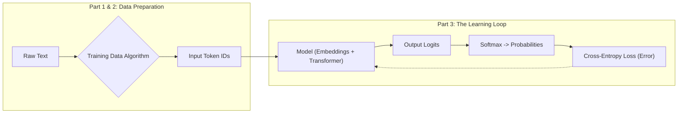

# **Title: LLM Pre-Training in 30 Minutes**

### Introduction: The Magic is Just Math

You've mastered how a neural network learns. You've seen the elegant dance of gradient descent and backpropagation, the mathematical engine that allows a machine to get progressively better at a task by minimizing its error. But that was with numbers. Clean, predictable, logical numbers.

Now we tackle language.

When a model like ChatGPT writes code, explains quantum physics, or composes a sonnet, it seems like magic. Here's the secret: it's the *exact same learning process*, applied relentlessly to one deceptively simple task: **predict the next token.**

In this tutorial, we will deconstruct the GPT-2 pre-training pipeline step by step. You will learn the exact algorithms and mathematics that allow a machine to teach itself from the raw, unlabeled text of the internet. We will build the entire conceptual pipeline, showing you exactly how "The cat sat on the" becomes a prediction for "mat," and how doing this billions of times creates the emergent intelligence you see today.

We will cover three key stages, anchored by this roadmap:



By the end, you will understand:
1.  **Data Preparation:** How we turn the entire internet into an infinite source of free training examples.
2.  **The Learning Loop:** How the model makes a prediction, measures its own error, and systematically corrects itself.

Let's begin by tackling the single biggest bottleneck in the history of AI: data.

## **Part 1: The Data Revolution - Learning Without Labels**

#### The Problem: The Expensive Reality of Supervised Learning

You've seen neural networks master tasks through supervised learning. The recipe is simple: give the model an input (like an image) and a correct output (the label "cat"), and it learns to map one to the other.

But there's a massive bottleneck: getting that labeled training data is painfully expensive and fundamentally limiting. Consider the real-world costs:

*   **Medical Imaging:** Radiologists, who charge hundreds of dollars per hour, are needed to label tumors in MRI scans.
*   **Legal Documents:** Lawyers, billing even more, are required to classify contracts or find evidence in discovery documents.
*   **Scientific Research:** PhD researchers can spend months or years meticulously annotating datasets for their experiments.

This creates two fundamental problems:

1.  **The Scale Ceiling:** The famous ImageNet dataset, with its 14 million labeled images, took years and millions of dollars to create. Yet, this is a tiny fraction of the billions of unlabeled images on the internet that we can't use.
2.  **The "Garbage In, Garbage Out" Problem:** The quality of the model is capped by the quality of its labels. Getting high-quality annotations requires true experts, making the process even more expensive and less scalable.

Supervised learning, for all its power, hits a wall. How do you get to billions or trillions of training examples if every single one requires an expensive human expert?

#### The Breakthrough: The Self-Supervised Engine

The genius of models like GPT-2 wasn't just a bigger architecture—it was abandoning the need for human labels entirely. Instead of asking a human, "What is the right answer?", it asks the text itself.

The task is deceptively simple: **predict the next word.**

That's it. No human annotation is needed. The text provides both the input (the sequence of words so far) and the "label" (the very next word in the sequence). This is the core of **self-supervised learning**.

We promised you an algorithm, and here is the simple, powerful engine that turns any document into an almost unlimited supply of training data.

```
// ALGORITHM: CreateTrainingData

INPUT: A document of text, broken into a list of words/tokens T.
       T = [t_1, t_2, t_3, ..., t_n]

OUTPUT: A set of (input, output) pairs for training.

FOR k FROM 1 TO n-1:
  input_sequence = [t_1, ..., t_k]
  target_word = t_{k+1}
  
  ADD (input_sequence, target_word) TO output_set

RETURN output_set
```

#### Step-by-Step Example: Slicing a Sentence

Let's see this algorithm in action. Take the simple sentence: **"The cat sat on the mat."**

The training process doesn't see this sentence just once. It systematically slides a window across it, turning one sentence into a full curriculum.

| | Input Sequence (What the model sees) | Target Output (What it must predict) |
| :--- | :--- | :--- |
| **Example 1** | ["The"] | `cat` |
| **Example 2** | ["The", "cat"] | `sat` |
| **Example 3** | ["The", "cat", "sat"] | `on` |
| **Example 4** | ["The", "cat", "sat", "on"] | `the` |
| **Example 5** | ["The", "cat", "sat", "on", "the"]| `mat` |

One sentence just generated five high-quality, perfectly labeled training examples for free.

#### Why Does Predicting the Next Word Create Intelligence?

At first, this seems too simple. How can guessing the next word teach a model to reason, write code, or explain science?

Because to get *consistently good* at this task across billions of examples, the model is forced to build a deep, internal understanding of the world. Imagine the model is given the following input text and must predict the single next word:

**"In Paris, the capital of France, the primary language spoken is..."**

What must the model learn to accurately predict the word `French`?

1.  **It needs to understand grammar:** It recognizes that the verb "is" will likely be followed by a noun or adjective.
2.  **It needs to handle long-distance context:** It must connect the end of the sentence back to the subject, "Paris," which appeared many words earlier.
3.  **It needs to learn facts about the world:** It must know that Paris is the capital of France, and that the language spoken in France is French.
4.  **It needs to ignore distractors:** It must realize that the word "primary" is less important than "France" for determining the language.

The only way for the model to minimize its prediction error across trillions of examples like this is to develop a rich internal model of concepts, facts, and the relationships between them. It's not memorizing; it's learning the underlying patterns of reality as reflected in human language.

#### Connecting to Reality: The Power of Scale

This self-supervised approach caused a paradigm shift in the scale of AI.

| Era | Dataset Example | Size | Parameters | Human Labeling? |
| :--- | :--- | :--- | :--- | :--- |
| **Traditional ML** | MNIST Digits | ~60,000 images (Megabytes) | 1-10 Million | **Yes** |
| **Deep Learning** | ImageNet | 14 Million images (Gigabytes) | 25-150 Million | **Yes** |
| **GPT-2 Era** | WebText | 40GB of text (~8M pages) | **1.5 Billion** | **No** |

The leap is staggering. A single 2,000-word Wikipedia article is automatically converted into **1,999** individual training examples. Scale that across the 40GB of text GPT-2 was trained on, and you have **billions** of learning opportunities, all for free.

We've solved the data problem by turning the internet into an infinitely large, self-labeling textbook.

Now that we understand the *task*, let's tackle the next critical step: how do we turn these words into numbers our neural network can actually process? This is where we move to **Tokenization**.

## **Part 2: Tokenization - Turning Language into LEGO Bricks**

We've established our learning task: predict the next piece of text. But our neural network doesn't understand "text"; it understands numbers. The process of converting raw text into a list of numbers the model can process is called **Tokenization**.

At first glance, this seems simple. Why not just split sentences by spaces? Or go even smaller and use individual characters? Let's explore why these naive approaches fail.

Consider the sentence: **"The cat quickly jumped."**

*   **Word-level tokenization** would give us: `["The", "cat", "quickly", "jumped."]`
*   **Character-level tokenization** would give us: `["T", "h", "e", " ", "c", "a", "t", ...]`

Both of these simple methods create immediate and severe problems.

| Problem | Word-Level Issues | Character-Level Issues |
| :--- | :--- | :--- |
| **Massive Vocabulary** | Is "The" different from "the"? Are "jump", "jumps", and "jumping" all unique words? The vocabulary would need to store every single variation, making it enormous. | Solved. The vocabulary is tiny (A-Z, 0-9, punctuation). |
| **Unknown Words** | What happens with a new word like "hyper-threading" or a typo like "awesommmme"? The model has no entry for it. This is a critical failure point known as the **Out-of-Vocabulary (OOV)** problem. | Solved. Any word can be constructed from characters. |
| **Sequence Length** | Sequences are short and manageable. "The cat jumped." is 4 tokens. | **Massive Inefficiency.** A 4-word sentence becomes over 20 tokens. A paragraph becomes thousands. The model must process each character one by one, making learning patterns across long distances slow and difficult. |

We need a solution that gives us the best of both worlds: a manageable vocabulary that can still represent any word without creating absurdly long sequences. Modern language models solve this with a clever technique called **Subword Tokenization**.

#### The LEGO Brick Approach: Subword Tokenization

The core idea is brilliant: **Don't treat words as the smallest unit.** Instead, break them down into smaller, common pieces, just like building things with LEGO bricks. The tokenizer learns these common pieces from the training data itself.

Let's see how a real subword tokenizer might handle our examples:

*   The common word "cat" is treated as a single token: `["cat"]`
*   The word "quickly" is broken into two common pieces: `["quick", "##ly"]`
*   The word "jumping" becomes two familiar parts: `["jump", "##ing"]`

The `##` is a special symbol that simply means "this token is attached to the previous one." This elegant solution solves all of our earlier problems:

1.  **It Creates an Efficient Vocabulary:** Instead of needing separate entries for `jump`, `jumps`, `jumping`, and `jumper`, the tokenizer only needs to know the common stem `jump` and the common subwords `##s`, `##ing`, and `##er`. This keeps the vocabulary size manageable (GPT-2 uses about 50,000 tokens).
2.  **It Eliminates Unknown Words:** How does it handle a new, complex word like "hyper-threading"? It can build it from its LEGO bricks: `["hyper", "-", "thread", "##ing"]`. What about a typo like "awesommmme"? It might break it down into `["awesome", "##m", "##m", "##e"]`. The model can represent **any** word by breaking it down into a combination of known subwords and, in the worst case, individual characters.

#### The Final Output: Integer IDs

After the text is broken into these subword tokens, the tokenizer looks up each token in its vocabulary to get a unique integer ID. These IDs are what actually get fed into our model as the **Input Tokens** in our architecture diagram.

Let's imagine a small part of a learned vocabulary:

| Token | Token ID |
| :--- | :---: |
| "The" | 5 |
| "cat" | 8 |
| "quick" | 73 |
| "##ly" | 152 |
| "jump" | 311 |
| "##ed" | 94 |

The full tokenization process for "The cat quickly jumped" would look like this:

1.  **Input Text:** "The cat quickly jumped"
2.  **Subword Splitting:** `["The", "cat", "quick", "##ly", "jump", "##ed"]`
3.  **Final Output (Token IDs):** `[5, 8, 73, 152, 311, 94]`

This final list of numbers is what represents our sentence. But these numbers are just labels. ID `73` doesn't have any mathematical relationship to ID `8`. They are just arbitrary pointers.

***
*A quick clarification: In Part 1, when we said the model predicts the next "word," it's more precise to say it predicts the next **token**. The process is the same, but the model is often working with these subword pieces, not just full words. This allows for a much more flexible and powerful system.*
***

#### The Dirty Secret of Tokenization

Tokenization is a brilliant engineering compromise, but it can confuse models in surprising ways. For example, ask a powerful LLM how many 'r's are in the word "strawberry" and it might struggle.

Why?

A human sees the word "strawberry"—one complete object where you can easily count three 'r's.

But the model might see three abstract, alien symbols: `[$, %, &]`, where:
*   `$` means "str"
*   `%` means "aw"
*   `&` means "berry"

Now, imagine someone asks you: "How many 'r's are in `$ % &`?"

You would have to mentally decode each symbol back to its letters, keep track of where the 'r's are across the symbol boundaries, and then count them. That's exactly what the model has to do. The letters 'r' are hidden inside tokens `$` and `&`, split across the token boundaries. The model doesn't naturally "see" individual characters—it sees these learned chunks.

This is why language models can write beautiful poetry about strawberries but might stumble when counting the letters in the word. The tokenization that makes them efficient also creates blind spots.

Now that we've turned our text into a clean sequence of token IDs, we need to convert these meaningless IDs into rich, meaningful vectors that our neural network can actually understand. This is the **Embeddings** layer, the input to the Transformer model itself. Let's now jump past the model's internal workings and see how it produces an output.

## **Part 3: The Output - From Probabilities to Actual Words**

We've turned our text into token IDs and fed them through the massive neural network. Now comes the moment of truth: the model must make a prediction. This is where we see the final, elegant math that drives both learning and creativity.

#### Critical Distinction: Training vs. Generation

Here is what 90% of people misunderstand about how these models work. There are two distinct processes:

1.  **During Training,** the model's goal is to output a **probability distribution** over all 50,257 possible tokens. This distribution is then compared to the single correct answer to calculate an error (loss), which is used to update the model's weights. The goal is to get better.
2.  **During Generation** (when you use ChatGPT or an API), the model still produces this probability distribution, but instead of calculating error, it **samples** from this distribution to pick the next word. The goal is to create new text.

Let's break down each step, starting with the part they have in common.

---

### **Section 1: Making a Prediction - The Softmax Function**

After all the complex internal calculations, the model's final layer produces a raw output score—a **logit**—for every single token in its vocabulary. For GPT-2, with its 50,257-token vocabulary, you get 50,257 logits.

These are just raw numbers. They aren't probabilities yet.

*   They can be positive or negative.
*   They don't sum to 1.

For example, after seeing "The cat sat on the", the logits might look like this:

`{"mat": 3.2, "rug": 1.3, "floor": 0.5, "moon": -2.1, ... (and 50,253 other scores)}`

To turn these messy logits into clean probabilities, we use a crucial function called **Softmax**.

The Softmax formula is:
`probability_of_token_i = exponent(logit_i) / sum_of_all_exponentiated_logits`

For each token, we raise *e* to the power of its logit, and then divide that by the sum of all the exponentiated logits. This operation guarantees two things:
1.  Every probability will be between 0 and 1.
2.  All the probabilities will sum to exactly 100%.

Let's see this in action with our simplified example vocabulary:

| Token | Step 1: Logit Score | Step 2: Exponentiate (e^logit) | Step 3: Divide by Sum (28.32) | Final Probability |
| :--- | :---: | :---: | :---: | :---: |
| "mat" | **3.2** | 24.53 | 24.53 / 28.32 | **86.6%** |
| "rug" | **1.3** | 3.67 | 3.67 / 28.32 | **13.0%** |
| "moon"| **-2.1**| 0.12 | 0.12 / 28.32 | **0.4%** |
| **Total**| | **28.32** | | **100%** |

The model's official prediction is now a clean probability distribution. We've reached the **Output Probabilities** stage in our diagram. Now, what we do with this depends on whether we are training or generating.

---

### **Section 2: The Learning Process (Training Only)**

During training, we know the correct answer was "mat". Our model assigned an 86.6% probability to it. Was that good? How do we turn this into a single error number to drive learning?

We use a loss function called **Cross-Entropy**.

The intuition behind Cross-Entropy is to measure **"surprise."**
*   If you predict the correct answer with high confidence, you are not surprised (low loss).
*   If you predict the correct answer with low confidence, you are very surprised (high loss).

The full Cross-Entropy formula looks complex, but for next-token prediction, it simplifies beautifully to:

**`Loss = -log(probability_of_the_correct_token)`**

That's it. We only care about the probability the model assigned to the single right answer. All other probabilities are ignored because their "true" probability was 0.

Let's calculate it for our two scenarios:

1.  **A Good Prediction:**
    *   The model assigned **86.6%** to the correct token ("mat").
    *   Loss = -log(0.866) ≈ **0.14**
    *   This is a small number, which is good! It tells the network it did a good job.

2.  **A Terrible Prediction:**
    *   Imagine the model had only assigned **1%** to "mat".
    *   Loss = -log(0.01) ≈ **4.6**
    *   This is a much larger number, reflecting high surprise and creating a large error signal to drive learning.

This single loss number is the starting point for backpropagation. When combined with Softmax, the initial gradient (the direction for correction) simplifies to `Predicted_Probability - True_Probability`. This clean, simple error signal flows backward through the entire network, updating billions of weights to make a slightly better prediction next time.

---

### **Section 3: Creating Text (Generation Only)**

When you actually use ChatGPT or call the OpenAI API, you're not training—you're generating text. The model produces the same probabilities, but instead of calculating loss, it has to pick a single word.

Simply picking the word with the highest probability every time would lead to deterministic, boring, and repetitive text. To create interesting and creative output, the model **samples** from the probability distribution, and we can control this sampling with parameters.

Here is a typical API call:
```python
import openai

response = openai.ChatCompletion.create(
    model="gpt-4",
    messages=[{"role": "user", "content": "The weather today is"}],
    temperature=0.7,      # Controls randomness
    top_p=0.9,            # Controls diversity
)
```

What do these parameters actually do?

**Temperature (Range: 0 to 2)**
*   **Intuition:** Controls the "creativity" or randomness of the output.
*   **Mechanism:** It modifies the logits *before* the Softmax function: `adjusted_logits = logits / temperature`.
    *   `temperature < 1.0` (e.g., 0.5): Divides by a smaller number, making the gap between logits larger. This *sharpens* the probabilities, making the model more confident and deterministic. Good for factual answers.
    *   `temperature > 1.0` (e.g., 1.5): Divides by a larger number, shrinking the gap between logits. This *flattens* the probabilities, increasing the chance of picking a less likely, more "creative" word.

**Top-p (Nucleus Sampling) (Range: 0 to 1)**
*   **Intuition:** Controls the diversity of the output by preventing the model from picking truly nonsensical words.
*   **Mechanism:** Instead of considering all 50,257 tokens, it samples from the smallest possible set of tokens whose cumulative probability exceeds the `top_p` value.
    *   `top_p = 0.1`: Only sample from the most likely tokens that make up the top 10% of the probability mass. This is very focused and safe.
    *   `top_p = 0.9`: Sample from a much wider "nucleus" of plausible tokens. This allows for more diversity without considering the garbage tokens in the long tail of the distribution.

Let's see how temperature changes the output for the prompt "The weather today is":

| Token | Base Prob. (temp=1.0) | Prob. at temp=0.5 (Sharper) | Prob. at temp=2.0 (Flatter) |
| :--- | :---: | :---: | :---: |
| `sunny` | 40% | **~63%** | ~25% |
| `cloudy`| 30% | ~28% | ~22% |
| `rainy` | 20% | ~7% | ~19% |
| `beautiful`| 10% | ~2% | ~14% |

As you can see, lowering the temperature makes "sunny" an almost certain choice. Raising it makes the probabilities more even, giving a creative word like "beautiful" a real chance to be selected.

And that is the complete output pipeline: from raw logits to the probabilities that drive both self-correction during training and creative text generation during inference.

## **Conclusion: From Raw Knowledge to a Useful Assistant**

You have now mastered the fundamentals of **pre-training**. You've journeyed through the entire pipeline, from a raw text file on the internet to a sophisticated model capable of predicting the next token with remarkable accuracy.

Let's recap the core concepts:

1.  **The Self-Supervised Engine:** We started by solving the biggest problem in AI: the need for expensive, human-labeled data. By framing the task as simple **next-token prediction**, we turned the vast, unlabeled text of the internet into an infinite, free source of training examples.
2.  **The Language-to-Number Bridge:** We saw how **subword tokenization** acts like a set of LEGO bricks, efficiently breaking down any word into manageable pieces that the model can process, represented as a simple list of integer IDs.
3.  **The Learning and Generation Loop:** Finally, we deconstructed the model's output. We learned how the **Softmax** function creates clean probabilities from raw logits, how **Cross-Entropy Loss** uses those probabilities to calculate a "surprise" score that drives learning, and how sampling parameters like **Temperature** and **Top-p** use the very same probabilities to generate creative and coherent text.

You started this journey seeing language models as magic. But now you know the truth. It's a cascade of brilliant, interconnected ideas, all powered by the simple, elegant process of learning from mistakes on an astronomical scale.

But our journey isn't over. This pre-trained model is a raw engine of knowledge, not a helpful assistant. This leads to the two crucial questions of what comes next.

#### What's Next 1: Opening the Black Box - The Transformer

Throughout this tutorial, we've treated the core of the network—the part that turns input tokens into output logits—as a "black box."

*   *How* does the model actually remember the word "Paris" from ten tokens ago to correctly predict "French"?
*   *How* does it weigh the importance of different words in a sentence to understand the true context?

In the next tutorial, we will finally open that box and explore the revolutionary **Transformer architecture** and its core mechanism: **Self-Attention**. This is the engine that truly understands context, and it's the final piece of the architectural puzzle.

#### What's Next 2: From Predictor to Assistant - Post-Training

A next-token predictor is not a chatbot. If you give our pre-trained model the prompt, "What is the capital of France?", its training on internet text might lead it to complete the sentence with another common question, like "...and what is its population?". It's completing a pattern, not answering a question.

How do we turn this powerful but raw model into a helpful assistant that can follow instructions, answer questions, and refuse to perform harmful tasks?

That requires a second, crucial stage called **Post-Training**. This involves techniques like:
*   **Supervised Fine-Tuning (SFT):** Training the model on a smaller, high-quality dataset of human-written instructions and their ideal responses.
*   **Reinforcement Learning from Human Feedback (RLHF):** Allowing humans to rank the model's different answers, teaching it what "helpfulness" and "safety" actually mean through trial and error.

This is the process that aligns the model with human values—the topic for a future tutorial.

You now have a solid foundation in how these incredible models are built. The magic has been replaced by understanding, and you're ready to explore the deeper layers of modern artificial intelligence.