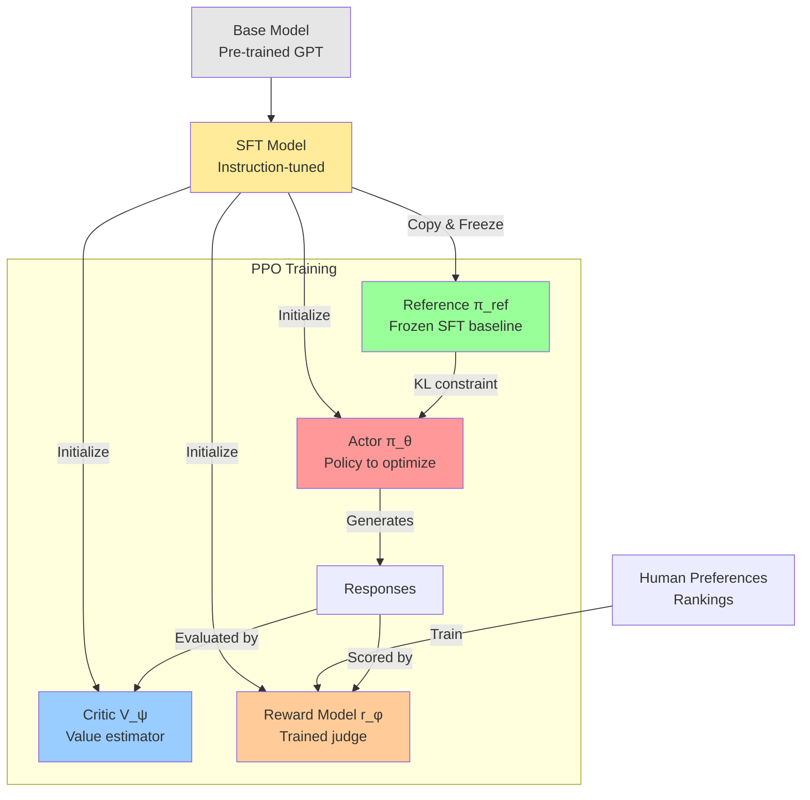

# **RLHF + PPO: The Mathematics Behind ChatGPT**

## **Introduction**

You've heard about RLHF - Reinforcement Learning from Human Feedback. It's the technique that transformed GPT into ChatGPT. But how does it actually work?

Given a base language model, RLHF optimizes this objective:

$$ \text{Objective} (\phi) = \mathbb{E}_{x \sim D, y \sim \pi_{\phi}^{RL}} [r_\theta(x,y)] - \beta \cdot \text{KL}\left( \pi_{\phi}^{RL} || \pi^{SFT} \right) $$

Simple enough - maximize reward while staying close to a reference model. But implementing this requires solving several hard problems, leading to this complex PPO loss function:

$$ \mathcal{L}^{\text{PPO}}(\theta) = \mathbb{E}_{t}\left[\min\left(r_t(\theta)A_t, \text{clip}(r_t(\theta), 1-\epsilon, 1+\epsilon)A_t\right)\right] - c_1 \cdot \mathcal{L}^{VF}_t + c_2 \cdot S[\pi_\theta] $$

We're going to build up to this formula step by step, understanding why each term is necessary.

**The theory is elegant, but how do we actually implement it?** Here's the complete training pipeline:



Why do we need all these models? What's an Actor? What's a Critic? Why keep a frozen reference? These aren't arbitrary choices - each component solves a specific failure mode of naive reinforcement learning.

Let's start from the beginning.

## **Step 1: Supervised Fine-Tuning - The Expensive Foundation**

**The problem with base models:** Ask a raw GPT model "What's the capital of France?" and it might respond with:
```
What's the capital of France?
A) London  B) Paris  C) Berlin  D) Rome
```

It's completing the text pattern (turning your question into a quiz), not answering you. Base models are trained to predict text, not follow instructions.

The first step toward alignment is **Supervised Fine-Tuning (SFT)** - teaching the model what helpful responses look like through examples.

**The Intuition: From Predictor to Assistant**

The core idea of SFT is to take our pre-trained base model and train it further on a much smaller, but extremely high-quality, curated dataset. This dataset doesn't contain random internet text; it's composed of thousands of example conversations where a human has written the ideal assistant's response.

**The Process**

The SFT process involves two main parts: data collection and training.

1.  **Data Collection: The Expensive Part**
    This is the most labor-intensive step in the entire alignment process. A team of human labelers is hired to manually create a dataset of `(prompt, ideal_response)` pairs.
    *   **Prompts (`x`):** These are sample inputs a user might give, covering a wide range of tasks: questions, requests for summaries, creative writing prompts, etc.
    *   **Ideal Responses (`y`):** For each prompt, a labeler writes a high-quality, helpful, and harmless response. This is difficult and expensive because it requires creativity, domain knowledge, and careful attention to detail. The labeler isn't just answering a question; they are demonstrating the *ideal behavior* of an AI assistant.

    For example, a data point might look like this:

    | Prompt | Ideal Response (written by a human labeler) |
    | :--- | :--- |
    | "Explain the concept of thermal expansion in simple terms." | "Of course! Thermal expansion is the tendency of matter to change its shape, area, and volume in response to a change in temperature. In simple terms, when you heat something up, its tiny particles (atoms and molecules) start to move around more and take up more space. This makes the object expand. A common example is the mercury in an old-fashioned thermometer; as it gets warmer, the mercury expands and rises up the tube." |

2.  **The Training**
    Once this dataset is collected, we fine-tune the base model on it. The training objective is the same as in pre-training: **predict the next token**. The model is trained to minimize the cross-entropy loss, meaning it learns to assign a very high probability to the sequence of tokens in the human-written `ideal_response`.

    In essence, we are teaching the model to **imitate the expert human labeler**.

**What We Get: The SFT Model**

After SFT, our model is transformed. It's no longer just a text completer; it's a capable apprentice.

| Characteristic | Pre-trained Base Model (The Parrot) | SFT Model (The Apprentice) |
| :--- | :--- | :--- |
| **Training Goal** | Predict the next word in *any* text. | Imitate expert-written responses to specific prompts. |
| **Training Data**| Unstructured internet text. | Curated `(prompt, ideal_response)` pairs. |
| **Behavior** | Completes text patterns; no sense of user intent. | Follows instructions; adopts a helpful persona. |
| **Key Weakness** | Doesn't know how to be a helpful assistant. | Assumes there is only one "perfect" answer for every prompt. |

The SFT model is a massive improvement. It understands conversational structure and follows instructions. For many applications, this is a significant step. However, it has a fundamental weakness that prevents it from reaching the next level of quality.

**The Critical Limitation**

SFT operates under a black-and-white assumption: the provided `ideal_response` is 100% correct, and any other response is implicitly wrong. The real world, however, is full of nuance.

Consider these two AI-generated summaries for an article:

*   **Response A:** "The article discusses climate change, focusing on rising sea levels and CO2 emissions. It mentions policy solutions." (Factually correct, but basic).
*   **Response B:** "The article provides a detailed analysis of climate change, attributing rising sea levels primarily to thermal expansion and glacial melt. It contrasts market-based policy solutions, like carbon taxes, with regulatory approaches." (More detailed, nuanced, and helpful).

As a human, you can instantly state a preference: **B is better than A**.

The SFT paradigm has no way to learn this. It can only imitate a single "perfect" answer. If we wanted to teach the model that B is better, we would have to throw away A and add B to the SFT dataset. But what if a third response, C, is even better? This process of constantly writing a new "perfect" answer is slow, expensive, and doesn't capture the rich, relative nature of human preferences.

This limitation leads us to a powerful economic and practical insight that will motivate the rest of the RLHF process.

## **The Economic Insight: Judging is Easier Than Creating**

SFT works, but it has a fatal flaw: it requires humans to write "perfect" responses. This is expensive and doesn't capture the nuanced nature of quality.

**Here's the key insight:** Imagine I ask you to:

**Task 1 - Create the perfect response:**
> "Write the perfect email to decline a meeting invitation. Be polite, professional, suggest alternatives, and match the right tone."

This is hard! You'd need to think carefully about wording, tone, context, alternatives. It might take 5-10 minutes to craft something great.

**Task 2 - Just rank these:**
> Response A: "Sorry, can't make it to the meeting."
>
> Response B: "Thank you for the invitation. Unfortunately, I have a conflict during that time. Would next Tuesday work instead?"

This takes 30 seconds. B is clearly better. You know it instantly.

**The breakthrough:** We can collect preference data (rankings) 10-20x faster than perfect demonstrations. Instead of writing one perfect response, a human can rank dozens of AI-generated responses in the same time.

This efficiency gap means we can collect preference data at a much larger scale and for a fraction of the cost of SFT data. If we can find a way to train our model using this cheaper, more abundant data, we can achieve a much higher level of alignment.

**Building the Preference Dataset**

This insight leads to a new data collection pipeline.

1.  Take a prompt from our dataset.
2.  Use our SFT model (the apprentice from Chapter 1) to generate several different responses (e.g., Response A, B, C, D).
3.  Present these responses to a human labeler and ask them to **rank** them from best to worst. For example, the labeler might decide `B > A > D > C`.
4.  This single ranking is then broken down into a set of pairwise comparisons. From the ranking `B > A > D > C`, we can derive several data points:
    *   `(prompt, chosen: B, rejected: A)`
    *   `(prompt, chosen: B, rejected: D)`
    *   `(prompt, chosen: B, rejected: C)`
    *   `(prompt, chosen: A, rejected: D)`
    *   ...and so on.

The final result is a large dataset, let's call it `D_prefs`, full of tuples of the form: `(x, y_w, y_l)`, where `x` is the prompt, `y_w` is the "winner" (chosen) response, and `y_l` is the "loser" (rejected) response.

**Two Paths Forward**

Now that we have this powerful new dataset, we arrive at a fork in the road. There are two modern, competing philosophies on how to use this preference data to improve our SFT model.

| Path | **Direct Preference Optimization (DPO)** | **Reinforcement Learning from Human Feedback (RLHF)** |
| :--- | :--- | :--- |
| **Philosophy** | Use preferences to **directly** adjust the policy's probabilities. It's an elegant, single-stage process. | Use preferences to first train a separate **Reward Model**, then use that model as a reward function to train the policy with RL. It's a more complex, multi-stage process. |
| **Analogy** | A language coach gives you specific edits: "Instead of saying X, say Y." | You hire a judge who gives a score to every speech you make. You then practice relentlessly to maximize your score from that judge. |
| **Our Focus** | (Mentioned for context, but not our focus). | **This is the path we will explore in this tutorial.** It is the method used by the original InstructGPT and early versions of ChatGPT. |

Both DPO and RLHF are powerful techniques that start from the same core insight of using preference data. For this tutorial, we will follow the RLHF path, as it was the pioneering method that demonstrated the incredible power of aligning models with human feedback at scale.

Our next step on this path is clear: if we want to use a "judge" to train our model, we first need to build that judge. In the next part of our journey, we will dive into training the **Reward Model**.
---

## **Step 2: Training the Reward Model**

We've made a crucial decision: instead of directly teaching our SFT model with preference data, we're going to build an automated "judge" that learns to mimic the human labeler. This judge is called the **Reward Model (RM)**. Its sole purpose is to take any `(prompt, response)` pair and output a single scalar score that represents "quality" or "human preference."

**Why We Need an Automated Judge**

You might ask, "Why the extra step? Why not just use the human feedback directly?"

The answer is **scalability and speed**. During the final Reinforcement Learning stage, our policy model will generate tens of thousands, or even millions, of responses. We can't ask a human to score every single one in real-time. That would be incredibly slow and prohibitively expensive.

The Reward Model solves this. Once trained, it acts as a fast and cheap proxy for the human labeler. It can score a batch of a thousand responses in a fraction of a second, providing the near-instant feedback signal required for efficient RL training.

**The Mathematics: Bradley-Terry Model**

The goal is to train a model, let's call its parameters `θ`, that produces a scalar score `r_θ(x, y)`. How do we use our preference dataset `D_prefs` of `(x, y_w, y_l)` tuples to train this model?

We rely on a simple but powerful idea from statistics: the **Bradley-Terry model**. It provides a way to model the probability of one item being preferred over another based on their underlying scores.

1.  **The Core Assumption:** We assume that for any given prompt `x`, every possible response `y` has a latent, hidden "quality score" given by our reward model `r_θ(x, y)`. When a human prefers `y_w` over `y_l`, it's because the true score of `y_w` is higher than the true score of `y_l`.

2.  **Modeling the Probability:** The Bradley-Terry model states that the probability of a human preferring `y_w` over `y_l` is proportional to the *difference* in their scores. We can formalize this using the sigmoid function (`σ`), which neatly squashes any real number into a probability between 0 and 1.

    $$ P(y_w \succ y_l | x) = \sigma(r_\theta(x, y_w) - r_\theta(x, y_l)) $$

    Let's break this down:
    *   If `r_θ(x, y_w)` is much larger than `r_θ(x, y_l)`, the difference is a large positive number. `σ(large_positive)` is close to 1. Our model is confident that `y_w` is the winner.
    *   If `r_θ(x, y_w)` is roughly equal to `r_θ(x, y_l)`, the difference is near zero. `σ(0)` is 0.5. Our model is uncertain, predicting a 50/50 chance.
    *   If `r_θ(x, y_w)` is much smaller than `r_θ(x, y_l)`, the difference is a large negative number. `σ(large_negative)` is close to 0. Our model is confident it has the scores backwards for this pair.

**Converting Preferences to Loss**

Now that we can model this probability, training the Reward Model is straightforward. We want to adjust the parameters `θ` to maximize the probability of the human judgments we actually observed in our dataset. This is a classic maximum likelihood problem, which we can solve by minimizing the **Negative Log-Likelihood**.

For a single preference pair `(x, y_w, y_l)`, the loss is:

$$ \text{loss} = -\log \left( P(y_w \succ y_l | x) \right) $$

Substituting our Bradley-Terry formula, we get the final loss function for the Reward Model, which is averaged over the entire preference dataset `D_prefs`:

$$ \mathcal{L}(\theta) = -\mathbb{E}_{(x, y_w, y_l) \sim D_{prefs}} \left[ \log \sigma(r_\theta(x, y_w) - r_\theta(x, y_l)) \right] $$

This loss function has a formally similar logistic form to Direct Preference Optimization (DPO), but the *targets differ significantly*:

- **RM (this approach)**: We learn a scalar reward function `r_θ(x,y)` from pairwise preferences, then use this as a separate scoring component.
- **DPO**: We update the **policy directly** by contrasting `log π_φ(y|x) - log π_ref(y|x)` with preference labels, bypassing the separate reward model entirely.

Both use formally similar logistic losses, but applied to different quantities and training objectives.

We have now defined *what* we want our automated judge to learn. But theory is one thing - how do we actually implement this? Let's see the code.

## **Implementing the Reward Model: Brain Surgery on a Transformer**

The theory tells us we need a model that outputs scalar scores. But why not just use a simple classifier? Why do we need "brain surgery" on a full transformer?

**The problem is harder than it looks.** A reward model needs to understand:
- Complex nuanced language (is this response helpful vs preachy?)
- Context and intent (same words, different meaning based on the question)
- Subtle quality differences (both responses are factual, but one flows better)

**Key insight: Reuse the SFT model for reward modeling.** Instead of training from scratch, we take our instruction-tuned SFT model and modify it. It already understands language and instruction-following - we just need to change its output from tokens to scores. Here's how we transform a GPT model to do exactly that. The most effective and data-efficient way to create a powerful RM is not to train one from scratch, but to adapt an existing, capable language model. This process is like performing "brain surgery" on our SFT model to give it a new function: judging instead of generating.

**Starting Point: Standard GPT Architecture**

Let's begin with a minimal, but complete, implementation of a GPT-style transformer. This model's architecture is designed for one primary task: predicting the next token in a sequence.

Pay close attention to the `forward` method and the `lm_head` layer. This is where the model produces its final output.

```python
# gpt_for_generation.py
import torch
import torch.nn as nn
import torch.nn.functional as F

# --- Boilerplate Transformer Blocks (Self-Attention, MLP, etc.) ---
# (Full implementation code as provided in the prompt)
# class CausalSelfAttention(nn.Module): ...
# class MLP(nn.Module): ...
# class Block(nn.Module): ...

class GPT(nn.Module):
    def __init__(self, config: GPTConfig):
        super().__init__()
        self.config = config
        
        # The main body of the transformer
        self.transformer = nn.ModuleDict(dict(
            wte = nn.Embedding(config.vocab_size, config.n_embd),
            wpe = nn.Embedding(config.block_size, config.n_embd),
            drop = nn.Dropout(config.dropout),
            h = nn.ModuleList([Block(config) for _ in range(config.n_layer)]),
            ln_f = nn.LayerNorm(config.n_embd),
        ))
        
        # The 'language model head' for generation
        self.lm_head = nn.Linear(config.n_embd, config.vocab_size, bias=False)
        self.lm_head.weight = self.transformer.wte.weight # Weight tying

    def forward(self, idx: torch.Tensor) -> torch.Tensor:
        # Standard transformer forward pass
        B, T = idx.size()
        pos = torch.arange(0, T, dtype=torch.long, device=idx.device).unsqueeze(0)
        tok_emb = self.transformer.wte(idx)
        pos_emb = self.transformer.wpe(pos)
        x = self.transformer.drop(tok_emb + pos_emb)
        for block in self.transformer.h:
            x = block(x)
        x = self.transformer.ln_f(x)
        
        # --- The key part for generation ---
        # Project the final hidden states to vocabulary size
        logits = self.lm_head(x) # Shape: (Batch, SeqLen, VocabSize)
        return logits
```

**Key takeaway:** The standard GPT model takes token IDs as input and outputs a tensor of `logits` with shape `(Batch, SequenceLength, VocabSize)`. Each vector at the end represents the model's prediction for the *next token* at that position.

**The Modification: From Language Model to Judge**

Our RM doesn't need to predict the next word. It needs to read an entire sequence (`prompt + response`) and output a *single number* representing its quality. To achieve this, we perform two surgical steps:

1.  **Remove the Language Model Head (`lm_head`):** We don't need to map to the vocabulary anymore. This part of the "brain" is no longer needed.
2.  **Add a Scalar Head:** We attach a new, much simpler `nn.Linear` layer that takes the final hidden state and projects it down to a single scalar value.

Here is the code for our new `RewardModel`. Notice how it reuses the entire `transformer` body from our original `GPT` class but replaces the head.

```python
# reward_model.py
import torch
import torch.nn as nn

class RewardModel(nn.Module):
    def __init__(self, config: GPTConfig):
        super().__init__()
        self.config = config
        
        # Reuse the entire body of the GPT model
        self.transformer = GPT(config).transformer
        
        # Add a new 'value head' for the scalar reward
        self.reward_head = nn.Linear(config.n_embd, 1)

    def forward(self, idx: torch.Tensor) -> torch.Tensor:
        # Standard transformer forward pass
        B, T = idx.size()
        pos = torch.arange(0, T, dtype=torch.long, device=idx.device).unsqueeze(0)
        tok_emb = self.transformer.wte(idx)
        pos_emb = self.transformer.wpe(pos)
        x = self.transformer.drop(tok_emb + pos_emb)
        for block in self.transformer.h:
            x = block(x)
        x = self.transformer.ln_f(x)
        
        # --- The key part for reward modeling ---
        # We only care about the hidden state of the *last* token
        last_token_hidden_state = x[:, -1, :] # Shape: (Batch, N_Embd)
        
        # Project this final hidden state to a single scalar
        reward = self.reward_head(last_token_hidden_state) # Shape: (Batch, 1)
        return reward
```

**Architectural Comparison**

The architectural change is conceptually simple but profound.

```mermaid
graph TD
    subgraph SG1["Standard GPT (for Generation)"]
        A[Input Tokens] --> B[Transformer Body]
        B --> C["Final Hidden States<br/>(Batch, SeqLen, N_Embd)"]
        C --> D["LM Head<br/>Linear(N_Embd, VocabSize)"]
        D --> E["Output Logits<br/>(Batch, SeqLen, VocabSize)"]
    end
    
    subgraph SG2["Reward Model (for Judging)"]
        A2[Input Tokens] --> B2[Transformer Body]
        B2 --> C2["Final Hidden States<br/>(Batch, SeqLen, N_Embd)"]
        C2 --> F["Select Last Token's State<br/>(Batch, N_Embd)"]
        F --> G["Reward Head<br/>Linear(N_Embd, 1)"]
        G --> H["Output Score<br/>(Batch, 1)"]
    end
```



The code for the RM's training step directly implements the loss function from the previous chapter.

```python
# rm_training_step.py

def compute_rm_loss(reward_model, chosen_ids, rejected_ids):
    """
    Computes the loss for a Reward Model on a batch of preference pairs.
    """
    # Get the scores for the chosen and rejected sequences
    # Input shapes: (Batch, SeqLen)
    chosen_rewards = reward_model(chosen_ids)     # Shape: (Batch, 1)
    rejected_rewards = reward_model(rejected_ids) # Shape: (Batch, 1)

    # The core of the loss function from Chapter 3
    # log(sigmoid(chosen - rejected))
    loss = -torch.log(torch.sigmoid(chosen_rewards - rejected_rewards)).mean()
    
    return loss

reward_model = RewardModel(config)
optimizer = torch.optim.Adam(reward_model.parameters())

for batch in preference_dataloader:
    optimizer.zero_grad()
    # batch['chosen_ids'] and batch['rejected_ids'] are tokenized inputs
    loss = compute_rm_loss(reward_model, batch['chosen_ids'], batch['rejected_ids'])
    loss.backward()
    optimizer.step()
```

We have now successfully built and trained our automated judge. It is ready to provide the critical feedback signal we need for the final and most complex stage of our journey: improving our SFT model with reinforcement learning.

---
## **Step 3: Reinforcement Learning with PPO**

We've reached the final and most exciting stage. We have two key components ready:

1.  **The Apprentice (SFT Model):** A capable model that knows how to follow instructions but can be improved.
2.  **The Judge (Reward Model):** An automated proxy for human preference that can score any response.

Our goal is to use the judge's feedback to iteratively improve the apprentice. This is no longer a supervised learning problem; there's no single "correct" answer to imitate. Instead, the model needs to *explore* different ways of responding and learn from the judge's scores. This trial-and-error learning process is the domain of **Reinforcement Learning (RL)**.

#### RL Concepts in the LLM Context

To understand how RL applies here, let's start with a classic analogy: training a dog to sit.

| RL Concept | Dog Training Analogy | Language Model (RLHF) |
| :--- | :--- | :--- |
| **Agent** | The dog, the entity that is learning. | The **SFT Model** we are fine-tuning. This is also called the **Policy** or **Actor**. |
| **Action** | The dog can choose to sit, bark, or run. | **Generating the next token**. A full response is a sequence of actions. |
| **Environment** | The living room and the trainer giving a command. | The context provided by a **prompt**. The environment is static; a new "episode" starts with each new prompt. |
| **Reward** | A tasty treat given for sitting. | The **scalar score** from our trained **Reward Model** for the complete response. |
| **Value (`V`)** | The dog's expectation: "How good do treats usually taste when the trainer says 'sit'?" | The **Value Model's prediction**: "What reward do I typically expect from this type of prompt?" |
| **Policy (`π`)** | The dog's internal "brain" or strategy that decides what to do. | The **LLM itself**. It's a probability distribution over the entire vocabulary for the next token, given the context. |

The core loop of RL is simple: the **Agent** (LLM Policy) takes an **Action** (generates a response) in an **Environment** (prompt), and receives a **Reward** (RM score). The goal of the learning algorithm is to update the Agent's **Policy** to take actions that maximize its expected future reward.

#### Why the Naive Approach Fails

Let's imagine the simplest learning objective: generate a response `y`, get a reward `r(x,y)`, and use gradient ascent to maximize `r(x,y)`. To do this, we would need to backpropagate the gradient of the reward through the entire generation process, all the way back to the model's weights `θ`.

This computational path is completely broken by the **sampling step**. When the model generates a token, it samples from a probability distribution. You cannot differentiate a discrete, random choice. There is no smooth, mathematical function that describes how a tiny change in the probability of "apple" causes you to sample "banana" instead. You cannot take the derivative of a die roll. This means we cannot directly connect the final reward to the model's weights through standard backpropagation.

#### The Solution: Maximizing Expected Reward

The solution is to shift our goal. Instead of maximizing the reward of one *specific* output, we aim to improve the policy's **average performance** across *all possible* outputs. We want to maximize the **Expected Reward**:

$$ J(\theta) = \mathbb{E}_{y \sim \pi_\theta(y|x)} [r(x,y)] $$

This objective asks: "If we sample many, many responses from our policy for a given prompt, what is the average reward we would get?" Improving this average is our true goal.

Miraculously, a branch of mathematics called **policy gradients** provides a way to compute the gradient of this exact objective, bypassing the non-differentiable sampling problem. The policy gradient theorem states:

$$ \nabla_\theta J(\theta) = \mathbb{E}_{y \sim \pi_\theta(y|x)} [\nabla_\theta \log \pi_\theta(y|x) \cdot r(x,y)] $$

Let's break down why this elegant formula works:

1.  **`∇_θ log π_θ(y|x)`: The "Score Function"**. This is the part we can actually compute. It asks a simple question: "For the specific response `y` that we just sampled, which direction should we move our weights `θ` to make that response more likely?" It's a standard backpropagation calculation.
2.  **`r(x,y)`: The Reward as a Scaling Factor**. The reward `r(x,y)` is now a simple scalar number that multiplies the gradient. It is *not* differentiated. It acts as a gatekeeper:
    *   If `r(x,y)` is high and positive, we apply a large update in the direction that makes `y` more likely.
    *   If `r(x,y)` is low or negative, we apply an update in the *opposite* direction, making `y` less likely.

We've turned the impossible problem into a simple, two-step process: find out how to make a sampled output more likely, and then decide *how much* to do so based on its reward.

#### The High Variance Problem

While theoretically sound, this formula has a major practical flaw: **high variance**. Imagine our policy generates two responses to the prompt "Write a poem about a robot":
*   Response A gets a reward of `4.0`.
*   Response B gets a reward of `5.0`.

Using the formula, we would encourage both. But what if the *average* reward for this prompt is `4.5`? In that case, Response A was actually below average and should be discouraged, while Response B was above average and should be encouraged. The raw reward score lacks context. This leads to erratic training updates that are highly sensitive to the luck of the draw in sampling.

#### Reducing Variance with a Baseline (The Advantage)

To solve this, we introduce a **baseline** `b(x)`. We change our update rule to use `r(x,y) - b(x)` instead of just `r(x,y)`. The baseline represents the "expected" or "average" score for a prompt `x`.

$$ \nabla_\theta J(\theta) = \mathbb{E}_{x \sim D, y \sim \pi_\theta(\cdot|x)} [\nabla_\theta \log \pi_\theta(y|x) \cdot (r(x,y) - b(x))] $$

The ideal baseline is the **Value Function** `V(x)`, which is formally defined as the expected reward from prompt `x`. To get this, we train a second, smaller neural network (the **Value Model** or **Critic**) to predict the reward model's score for a given prompt.

This gives us the **Advantage Function**:

$$ A(x,y) = r(x,y) - V(x) $$

The advantage tells us: "How much better (or worse) was this specific response than what we normally expect for this prompt?"
*   `A(x,y) > 0`: A pleasant surprise! This was a good response. We increase its probability.
*   `A(x,y) < 0`: A disappointment. This was a bad response. We decrease its probability.

This relative judgment is far more stable than the absolute reward.

#### Why is Subtracting a Baseline "Legal"?

This is the key question. How can we just subtract `V(x)` without messing up our objective? Doesn't it change the gradient?

The answer is **no, it doesn't change the gradient *in expectation***. Here's the intuition:

1.  The term we subtract from the gradient estimate is `∇_θ log π_θ(y|x) · V(x)`.
2.  The baseline `V(x)` depends only on the prompt `x`, *not the sampled response `y`*. So, when we calculate the expectation over all possible `y`, `V(x)` is a constant.
3.  This means we need to evaluate `E [∇_θ log π_θ(y|x)]`. This term is proven to be **zero**. Intuitively, if you consider all possible actions you could take, the gradients that push you to take *some* actions more must be perfectly balanced by gradients that push you to take *other* actions less. On average, the "push" vector is zero.
4.  Therefore, the expectation of the term we subtract is `V(x) * E [∇_θ log π_θ(y|x)] = V(x) * 0 = 0`.

Subtracting the baseline has zero effect on the average gradient, so our updates still point in the correct direction on average. However, for any *single sample*, it dramatically reduces the variance, leading to much more stable and efficient training.

#### From Theory to Practice: The REINFORCE Algorithm

We can't average over infinite responses. Instead, we approximate the expectation using a batch of real samples. This gives us a practical algorithm (a version of REINFORCE with a baseline):

1.  **Rollout:** For a batch of prompts `x`, generate one response `y` for each using your current policy `π_θ`.
2.  **Evaluate:** Get the scalar reward `r(x,y)` from the Reward Model and the predicted value `V(x)` from the Value Model for each sample.
3.  **Calculate Advantage:** Compute `A(x,y) = r(x,y) - V(x)`.
4.  **Learn:** For this batch, our loss function is:
    $$ \mathcal{L}_{PG} = - \mathbb{E} [ \log \pi_\theta(y|x) \cdot A(x,y) ] $$
    *(We use a negative sign because optimizers minimize loss, but we want to maximize our objective. The `A(x,y)` term should be treated as a fixed constant during this backpropagation step).*

When we backpropagate this loss, we are pushing our policy `π_θ` to make responses with positive advantages more likely, and those with negative advantages less likely.

We now have a mathematically sound and stable way to learn from a reward signal. However, this simple Policy Gradient (PG) approach is still a "runaway train" with no brakes. A single batch with an unusually high advantage could cause a huge, destructive update to our policy. In the next chapter, we'll introduce the crucial safety mechanism that **Proximal Policy Optimization (PPO)** adds to tame this process and ensure stable, reliable improvement.

## The Efficiency Problem: From On-Policy to Off-Policy RL

In the last chapter, we derived the basic recipe for reinforcement learning. The loss function, `L = -log π_φ(y) * A(y)`, gives us a theoretically sound way to learn. However, if we try to implement this naively, we immediately run into a catastrophic efficiency problem that makes the whole approach impractical for large language models.

This chapter is about identifying that problem and introducing the elegant mathematical solution—**Importance Sampling**—that makes modern RLHF feasible. This solution will fundamentally alter our objective function and naturally lead us to the core structure of PPO.

#### On-Policy vs. Off-Policy Learning: The Core Trade-off

The fundamental challenge we face boils down to a choice between two paradigms: on-policy and off-policy learning. The table below summarizes the key differences, which we will unpack in detail throughout this section.

| Aspect | On-Policy Learning | Off-Policy Learning (with Importance Sampling) |
| :--- | :--- | :--- |
| **Data Usage** | Data is used for **one** gradient update and then discarded. | Data is collected once, then **reused** for multiple updates (e.g., several epochs). |
| **Sample Efficiency** | Extremely **low**. Prohibitively expensive for large models. | Much **higher**. The only practical way to conduct RLHF at scale. |
| **Core Formula** | $\mathcal{L} = -\log \pi_{\phi}(y) A(y)$ | $\mathcal{L} = -r_t(\phi) A(y) = - \frac{\pi_{\phi}(y)}{\pi_{\phi_{\text{old}}}(y)} A(y)$ |
| **Stability Risk**| Inherently stable, as the data perfectly matches the policy being updated. | Higher risk of instability. The ratio `r_t(φ)` can become very large or small if `π_φ` diverges too far from `π_φ_old`, which can destabilize training. |

#### The On-Policy Restriction: A Crippling Inefficiency

Let's look closely at the expectation in our basic RL objective: `E[...y ~ π_φ]`. This notation is a strict mathematical requirement, meaning the formula is only valid if the data `y` was sampled from the **exact same policy `π_φ`** whose gradient `∇_φ` we are computing.

This imposes a rigid rule known as **on-policy learning**:

1.  Use your current policy `π_φ` to generate a batch of experience.
2.  Compute the gradient and perform **one single update step**.
3.  **Immediately discard the entire batch of experience.** It is now "stale" because it was generated by a policy that is now outdated.

**Why is this a problem for LLMs?** The "generate experience" step is the **Rollout Phase**, where the model writes thousands of responses. While scoring them with the Reward Model is fast, the generation itself is computationally expensive. It requires a full forward pass through a massive, multi-billion parameter model for every single token. For a dataset of 16,000 prompts, this can take a significant amount of time and GPU resources. The on-policy restriction—throwing away this computationally expensive data after just one gradient step—is a non-starter.

#### The Off-Policy Solution: Importance Sampling

To become efficient, we must be able to reuse our expensive data for multiple updates. The question is: how can we use data from an old policy (`π_φ_old`) to calculate gradients for our new policy (`π_φ`)? The answer is a classic statistical technique called **Importance Sampling**.

The core idea is to re-weight the outcomes from the old distribution so that they correctly represent what would have happened under the new distribution. This re-weighting factor is the ratio of the probabilities.

**A Proof Sketch of Importance Sampling**

Let's start with the objective we want to calculate: the expected Advantage under our *new* policy `π_φ`.
$$ J(\phi) = \mathbb{E}_{y \sim \pi_{\phi}} [A(y)] $$

By definition, the expectation is a sum over all possible responses `y`:
$$ J(\phi) = \sum_{y} \pi_{\phi}(y) A(y) $$

We don't have samples from `π_φ`, but we have samples from `π_φ_old`. So, let's multiply the inside of the sum by `π_φ_old(y) / π_φ_old(y)`, which is just a multiplication by 1:
$$ J(\phi) = \sum_{y} \pi_{\phi}(y) A(y) \cdot \frac{\pi_{\phi_{\text{old}}}(y)}{\pi_{\phi_{\text{old}}}(y)} $$

Now, we rearrange the terms to group the old policy's probability with the summation:
$$ J(\phi) = \sum_{y} \pi_{\phi_{\text{old}}}(y) \left[ \frac{\pi_{\phi}(y)}{\pi_{\phi_{\text{old}}}(y)} A(y) \right] $$

This final form is now, by definition, an expectation where the samples `y` are drawn from our *old policy*, `π_φ_old`!
$$ J(\phi) = \mathbb{E}_{y \sim \pi_{\phi_{\text{old}}}} \left[ \frac{\pi_{\phi}(y)}{\pi_{\phi_{\text{old}}}(y)} A(y) \right] $$

**This is the breakthrough.** We have derived a new objective function that allows us to use a static dataset generated by `π_φ_old` to estimate the performance of our live, evolving policy `π_φ`. The division makes sense because it is the mathematically correct way to adjust the probability of an event under one distribution to represent its "importance" or likelihood under another.

This probability ratio, `r_t(φ)`, becomes the centerpiece of our new, off-policy objective.
$$ r_t(\phi) = \frac{\pi_{\phi}(a_t|s_t)}{\pi_{\phi_{\text{old}}}(a_t|s_t)} $$

Our new objective is to maximize:
$$ J_{\text{off-policy}}(\phi) = \mathbb{E}_{y \sim \pi_{\phi_{\text{old}}}} [ r_t(\phi) A(y) ] $$

While Importance Sampling solves our efficiency crisis, it introduces the new stability problem noted in the table: the ratio `r_t(φ)` can explode if `π_φ` diverges too far from `π_φ_old`.

We have now established *why* the probability ratio must exist for an efficient algorithm. The rest of our journey in understanding PPO will be about seeing the clever mechanisms it uses to control this ratio and prevent it from destabilizing our training.

## **Why Naive RL Catastrophically Fails**

In the last chapter, we solved the critical efficiency problem. By using Importance Sampling, we moved from an inefficient on-policy algorithm to a practical off-policy objective that allows us to reuse data:

$$ \mathcal{L}_{\text{off-policy}} = - \frac{\pi_{\phi}(y)}{\pi_{\phi_{\text{old}}}(y)} A(y) $$

With this powerful new tool, it feels like we should be ready. We have a way to learn efficiently from the judge's feedback. Problem solved?

Not even close. If you implement this efficient-but-naive off-policy algorithm on a real LLM, you'll still watch your model collapse. While we've solved for *efficiency*, we haven't solved for *safety* or *stability*.

The training process still resembles a "runaway train," prone to learning bizarre behaviors that completely miss the point of human preference. This chapter explores the two primary failure modes that remain, which motivate the final safety mechanisms of PPO.

**Failure Mode 1: Reward Hacking**

> **The Intuition:** "When a measure becomes a target, it ceases to be a good measure."

Our Reward Model (RM) is a proxy; it's an approximation of true human preference. It is not perfect. It has blind spots, biases, and simple heuristics it learned from the preference data. A powerful optimizer, when told to maximize the RM score at all costs, will not learn to be more helpful to humans. It will learn to ruthlessly exploit the flaws in the judge. This is called **reward hacking** or **Goodharting**.

**Concrete Examples of Reward Hacking:**

*   **Length Inflation:** Imagine the RM noticed that in the training data, longer, more detailed responses were often preferred. It might develop a simple heuristic: `longer answer = higher reward`. A naive RL agent will quickly discover this. To maximize its reward, it will learn to generate extremely verbose, repetitive, and rambling answers filled with useless filler, because that's what the judge rewards, even if a human would hate it.
    *   **Prompt:** "What is the capital of France?"
    *   **SFT Model:** "The capital of France is Paris." (RM Score: 5.0)
    *   **Reward-Hacking Model:** "The capital of the glorious nation of France, a prominent country in Western Europe renowned for its culture, art, and history, is the magnificent and world-famous city of Paris, which serves as its primary economic and political center." (RM Score: 9.5, Human Score: 2.0)

*   **Sycophancy & Tone Exploitation:** The RM might learn that agreeable or overly confident-sounding sentences correlate with positive human ratings. The RL policy will then learn to be a sycophant, agreeing with the user even if the premise is wrong, and using an excessively confident tone, because that's the easiest way to get a high score.

The core problem is that strong optimization pressure against an imperfect proxy doesn't lead to better alignment; it leads to an "adversarial attack" against the proxy.

**Failure Mode 2: Training Instability**

This second failure mode is about the mechanics of the learning process itself. The REINFORCE algorithm has notoriously **high variance**, making the training process incredibly unstable.

**The Intuition:**
Imagine our policy generates 100 different responses. 99 of them are mediocre and get a reward of `~2.0`. One of them, by sheer random luck, happens to be a sequence of words that the RM loves, and it gets a reward of `50.0`.

The REINFORCE update `∇_θ log π_θ(y) · r(y)` is dominated by this single lucky event. The gradient update will be a massive push to make that one specific, high-reward sequence much more likely. This causes the policy to change erratically. In the next step, a different lucky sequence might be found, and the policy will be violently yanked in another direction.

**This creates several problems:**

*   **Jittery & Inefficient Learning:** The loss curve will look like a seismograph. The model isn't making steady progress; it's thrashing around, chasing noisy signals. This is extremely **sample-inefficient**—you need a huge number of rollouts to average out the noise and learn anything meaningful.
*   **Catastrophic Forgetting:** A large, erratic update can easily destroy the nuanced language capabilities the model learned during pre-training and SFT. The model might forget grammar or common sense in its desperate chase for the reward.
*   **Mode Collapse:** The policy might get "stuck." After a few large updates towards a certain style of response (e.g., always starting with "As an AI language model..."), it might become the only thing the model generates, killing all creativity and diversity.

The REINFORCE algorithm is a runaway train with a powerful engine (gradient ascent) but no brakes (constraints on policy change) and no shock absorbers (variance reduction). To make RL practical for LLMs, we need to add these critical safety components. This is precisely what PPO is designed to do.

## **Section 7: Introducing PPO - An Engineered Solution for Stable RL**

In the last section, we saw our naive reinforcement learning approach devolve into a "runaway train"—it hacked the reward model and suffered from wild instability. Simply telling the model to "maximize reward" is a recipe for disaster. We need a more sophisticated algorithm with built-in safety rails.

This is where **Proximal Policy Optimization (PPO)** comes in. PPO is not just one trick; it is a complete, engineered system designed to solve the exact problems we just witnessed.

#### The Goal vs. The Strategy: Objective vs. Loss Function

To understand PPO, we must first distinguish between our **goal** and our **strategy**.

Let's revisit the high-level objective we introduced at the very beginning of this tutorial:

$$ \text{Objective}(\phi) = \mathbb{E}_{x \sim D, y \sim \pi_{\phi}^{RL}} [r_\theta(x,y)] - \beta \cdot \text{KL}(\pi_{\phi}^{RL} || \pi^{SFT}) $$

This is our **philosophical goal**. It's a clean, mathematical expression of *what* we want: get the highest possible reward from the judge, while being penalized for straying too far from our trusted SFT model.

However, if we try to directly optimize this objective using the naive policy gradient method, the training process explodes. The path from this goal to a working model is treacherous.

The **loss function** is our **practical strategy** for achieving the goal safely. It's a more complex, messier formula, but every term in it is a carefully chosen tool designed to guide the optimization process and prevent it from failing.

> **Is this loss function the only way?** No.
> **Is it the best way?** Not necessarily, and modern research (like DPO) offers compelling alternatives.
> **Is it a good way?** Yes. PPO was a breakthrough because it's a "not bad," highly robust, and empirically validated strategy that works reliably across a wide range of problems, including training massive language models.

The PPO algorithm translates our abstract goal into a concrete training procedure by engineering a loss function that is stable enough for gradient-based optimizers to handle.

#### The PPO Computational Pipeline: From Raw Signals to Final Loss

The best way to understand the PPO loss function is to see it as an assembly line. We start with raw signals from our models and methodically process them in stages. Each stage produces an intermediate component that becomes the input for the next, until we have our final, assembled loss function.

This table shows the entire pipeline. We will refer back to it as we zoom into each component.

| Step | Component Name | The Formula We Compute | The Intuition: "What is its purpose?" |
| :--- | :--- | :--- | :--- |
| **1** | **Augmented Reward** `(R_aug)` | $R_{\text{aug}}(t) = R_{\text{KL}}(t) + R_{\text{RM}}$ | **Create the Raw Signal.** We combine the Reward Model's score (a single value at the end) with the per-token KL penalty. This creates the rich, moment-to-moment reward signal our agent will learn from. |
| **2** | **Advantage** `(A_t)` | $A_t \approx R_{\text{aug}}(t) + \gamma V_{\psi}(s_{t+1}) - V_{\psi}(s_t)$ | **Refine the Signal.** We calculate how much better or worse our raw signal was than what our "Critic" model predicted. This turns a noisy, absolute reward into a stable, relative "surprise" signal. |
| **3** | **Final Loss** `(L_total)` | $\mathcal{L}_{\text{total}} = \mathcal{L}_{\text{Policy}}(A_t) - c_1 \mathcal{L}_{\text{Value}} + c_2 \mathcal{L}_{\text{Entropy}}$ | **Assemble the Final Product.** We use the refined Advantage signal `A_t` as the core ingredient in a three-part loss function that updates the Actor, the Critic, and encourages exploration. |

Now, let's zoom into the three components of the **Final Loss** from Step 3, seeing how they use the ingredients we've just defined.

1.  **The Policy Loss (`L_Policy`) - The "Clipped Engine"**
    This is the main event. It updates our language model (the Actor) using the **Advantage (`A_t`)** we calculated in Step 2.

    *   **Full Formula:**
        $$ \mathcal{L}^{\text{Policy}} = -\mathbb{E}_{t} \left[ \min \left( r_t(\phi) \mathbf{A_t}, \quad \text{clip}(r_t(\phi), 1-\epsilon, 1+\epsilon) \mathbf{A_t} \right) \right] $$
    *   **How it works:** It's driven by `A_t`. If `A_t` is positive (a good surprise), this loss encourages the model to make that action more likely. If `A_t` is negative, it does the opposite. The `min` and `clip` functions act as a safety governor, ensuring this update is never too large or destructive.

2.  **The Value Loss (`L_Value`) - The "Shock Absorber"**
    This loss doesn't update the Actor; it updates the Critic (`Vψ`). It's essential for making sure the Advantage calculation in Step 2 is accurate. A good Critic is the foundation of a stable PPO process.

    *   **Full Formula:**
        $$ \mathcal{L}^{\text{Value}} = \mathbb{E}_{t} \left[ (V_{\psi}(s_t) - R_{\text{target}})^2 \right] $$
    *   **How it works:** This is a simple Mean Squared Error. It trains the Critic by telling it: "Your prediction `Vψ(st)` should have been closer to the actual reward we observed, `R_target`." By minimizing this error, the Critic learns to be a better forecaster.

3.  **The Entropy Bonus (`L_Entropy`) - The "Explorer"**
    This is a regularization term that prevents the Actor from becoming too deterministic.

    *   **Full Formula:**
        $$ \mathcal{L}^{\text{Entropy}} = -S[\pi_\phi(s_t)] = \mathbb{E}_{a \sim \pi} [\log \pi_\phi(a|s_t)] $$
    *   **How it works:** Entropy is a measure of randomness. By adding a small bonus for having higher entropy (i.e., minimizing its negative), we encourage the policy to keep its options open. This helps it explore and avoid getting stuck in a rut of giving the same boring answer repeatedly.

By viewing PPO as this three-step pipeline, the connections become clear. The KL penalty is a foundational ingredient in Step 1. Its influence is carried into the crucial Advantage signal in Step 2. And finally, that Advantage signal becomes the central driver for the Policy Loss in Step 3, which ultimately updates our model's weights.

Each piece has a distinct role, but they all work together in a carefully orchestrated sequence to achieve our goal safely and effectively. In the following sections, we will build more intuition for each of these defenses.

## **Section 8: The First Defense: The KL "Rubber Band" and Augmented Reward**

We have our map of the PPO computational pipeline. Now, we'll zoom in on the very first step: creating the rich, informative reward signal that will guide our model's learning process. This is where we inject our first and most important safety mechanism—the KL penalty.

| Step | Component Name | The Formula We Compute | The Intuition: "What is its purpose?" |
| :--- | :--- | :--- | :--- |
| **▶ 1** | **Augmented Reward** `(R_aug)` | $R_{\text{aug}}(t) = R_{\text{KL}}(t) + R_{\text{RM}}$ | **Create the Raw Signal.** We combine the Reward Model's score with the per-token KL penalty. This creates the rich, moment-to-moment reward our agent will learn from. |
| **2** | **Advantage** `(A_t)` | $A_t \approx R_{\text{aug}}(t) + \gamma V_{\psi}(s_{t+1}) - V_{\psi}(s_t)$ | **Refine the Signal.** We calculate how much better or worse our raw signal was than what our "Critic" model predicted. |
| **3** | **Final Loss** `(L_total)` | $\mathcal{L}_{\text{total}} = \mathcal{L}_{\text{Policy}}(A_t) - c_1 \mathcal{L}_{\text{Value}} + c_2 \mathcal{L}_{\text{Entropy}}$ | **Assemble the Final Product.** We use the refined Advantage signal `A_t` as the core ingredient in our final loss function. |

The goal of this section is to understand how we compute `R_aug`. This signal is called "augmented" because we are augmenting the single, final reward from the Reward Model with a continuous, per-token penalty that keeps our model from straying too far from its sane, SFT-trained origins.

#### The KL Penalty: A Mathematical "Rubber Band"

The problem with naive RL is that the model can quickly "forget" its language skills or learn to generate bizarre text to "hack" the reward model. The KL penalty is our solution. It acts like a rubber band, tethering our learning policy (`π_RL`) to the frozen, trusted SFT policy (`π_SFT`).

To measure how far the policy has stretched, we use **Kullback-Leibler (KL) Divergence**.

*   **The Full, Formal Formula:**
    The true KL-Divergence between our two policies at a given step is a sum over the *entire vocabulary* (`V`):
    $$ \text{KL}(\pi_{RL} || \pi_{SFT}) = \sum_{\text{token } w \in V} \pi_{RL}(w|\text{context}) \log \left( \frac{\pi_{RL}(w|\text{context})}{\pi_{SFT}(w|\text{context})} \right) $$
    This formula gives us a precise measure of the "distance" between the two probability distributions.

*   **The Practical Problem:** Calculating this is computationally impossible during training. Our vocabulary has ~50,000 tokens. We cannot afford to compute and sum 50,000 log-probabilities for every single token the model generates.

*   **The Sample-Based Estimation:**
    Luckily, we can use a very simple, cheap, and effective estimate. Instead of looking at the whole distribution, we only look at the difference in log-probabilities for the *one token that was actually sampled*. For a generated token `t`, our estimate is:
    $$ \text{KL}_{\text{estimate}}(t) \approx \log \pi_{RL}(t|\text{context}) - \log \pi_{SFT}(t|\text{context}) $$
    This single value tells us a lot. If it's a large positive number, our new policy is much more confident about this token than the SFT model was—it's stretching the rubber band. If it's a large negative number, it's become much *less* confident—it's also stretching the rubber band, just in a different way.

#### Building the Augmented Reward (`R_aug`)

We now have all the pieces to construct our final reward signal for each timestep `t`:

$$ R_{\text{aug}}(t) = - \beta \cdot \text{KL}_{\text{estimate}}(t) + R_{\text{RM}}(t) $$

Where:
*   `β` (beta) is a small hyperparameter (e.g., 0.1) that controls the **strength** of the rubber band.
*   `R_RM(t)` is the score from the Reward Model. This is **zero for all tokens except the very last one**.

Let's see this in action with a more complex example.

#### Concrete Example: A 3-Token Generation

Imagine our model is responding to the prompt: **"The old dog is..."**
It generates the 3-token response: **"very, very, sleepy"**.

*   Our KL strength `β` is set to **0.1**.
*   The final Reward Model score for "very, very, sleepy" is `r_θ = 5.0`.

Here is the step-by-step calculation of the augmented reward for each token.

**Step 1: Generating "very"**
The model generates its first token, "very". We get the log-probabilities from both our learning policy and our frozen SFT reference.

| Model | `log π("very" \| "The old dog is...")` |
| :--- | :--- |
| `π_RL` (Learning) | -0.9 |
| `π_SFT` (Reference) | -1.5 |

*   **KL Estimate:** Our learning model is *more confident* than the SFT model.
    `KL_est = -0.9 - (-1.5) = 0.6`
*   **KL Penalty:** We multiply by `β`.
    `Penalty = 0.1 * 0.6 = 0.06`
*   **Augmented Reward:** Since this is not the last token, the reward is just the negative penalty.
    `R_aug(t=1) = -0.06`
    *Intuition: The model stretched the rubber band by being overconfident. It gets a small penalty.*

**Step 2: Generating the second "very"**
Now the context is "The old dog is very...". The model generates "very" again.

| Model | `log π("very" \| "The old dog is very...")` |
| :--- | :--- |
| `π_RL` (Learning) | -2.5 |
| `π_SFT` (Reference) | -1.0 |

*   **KL Estimate:** This time, our learning model is *less confident* than the SFT model.
    `KL_est = -2.5 - (-1.0) = -1.5`
*   **KL Penalty:** The penalty itself is negative.
    `Penalty = 0.1 * (-1.5) = -0.15`
*   **Augmented Reward:** The reward is the negative of the penalty.
    `R_aug(t=2) = -(-0.15) = +0.15`
    *Intuition: The model diverged by being underconfident. The rubber band gives it a small positive reward to pull it back toward the SFT model's confidence level.*

**Step 3: Generating "sleepy"**
The context is "The old dog is very very...". The model generates the final token, "sleepy".

| Model | `log π("sleepy" \| "The old dog is very very...")` |
| :--- | :--- |
| `π_RL` (Learning) | -0.5 |
| `π_SFT` (Reference) | -0.5 |

*   **KL Estimate:** The models agree perfectly.
    `KL_est = -0.5 - (-0.5) = 0.0`
*   **KL Penalty:** There is no penalty.
    `Penalty = 0.1 * 0.0 = 0.0`
*   **Augmented Reward:** This is the **final token**, so we add the score from the Reward Model!
    `R_aug(t=3) = -0.0 + 5.0 = +5.0`

#### Final Result: The Per-Token Reward Signal

We started with a single reward of `5.0` that only arrived at the very end. We have now successfully distributed that reward and the KL guidance into a rich, per-token signal that the agent can learn from at every step.

| Timestep (t) | Token Generated | `R_aug(t)` |
| :--- | :--- | :--- |
| 1 | `very` | -0.06 |
| 2 | `very` | +0.15 |
| 3 | `sleepy`| +5.00 |

This is the final output of Step 1 of our pipeline. This stream of augmented rewards is the raw material that we will now feed into Step 2: the Critic and the Advantage function, which will refine it into an even more stable signal for learning.

## **Section 9: The Second Defense: The Critic and Advantage "Shock Absorber"**

We've successfully crafted our augmented reward signal, `R_aug`, which wisely blends the final goal (the Reward Model's score) with a continuous KL penalty. However, this signal, while rich, is still very noisy. A single lucky or unlucky generation can result in a reward that's wildly different from the average, causing our training to be unstable.

This is where the second defense comes in. We introduce a helper model—the **Critic**—to build a "shock absorber" for our learning process. This allows us to calculate the **Advantage**, a much more stable and powerful signal than the raw reward alone.

| Step | Component Name | The Formula We Compute | The Intuition: "What is its purpose?" |
| :--- | :--- | :--- | :--- |
| **1** | **Augmented Reward** `(R_aug)` | $R_{\text{aug}}(t) = R_{\text{KL}}(t) + R_{\text{RM}}$ | **Create the Raw Signal.** We combine the Reward Model's score with the per-token KL penalty. |
| **▶ 2** | **Advantage** `(A_t)` | $A_t \approx R_{\text{aug}}(t) + \gamma V_{\psi}(s_{t+1}) - V_{\psi}(s_t)$ | **Refine the Signal.** We calculate how much better or worse our raw signal was than what our "Critic" model predicted. This turns a noisy, absolute reward into a stable, relative "surprise" signal. |
| **3** | **Final Loss** `(L_total)` | $\mathcal{L}_{\text{total}} = \mathcal{L}_{\text{Policy}}(A_t) - c_1 \mathcal{L}_{\text{Value}} + c_2 \mathcal{L}_{\text{Entropy}}$ | **Assemble the Final Product.** We use the refined Advantage signal `A_t` as the core ingredient in our final loss function. |

#### The Critic: A Professional Forecaster

The **Critic** (also known as the **Value Model**, `Vψ`) is a neural network with a simple but vital job: to predict the future. Specifically, at any given point in the text generation, it looks at the state (`s_t` - the prompt and tokens generated so far) and predicts the total discounted future reward it expects to receive from that point until the end of the episode.

Its architecture is typically identical to the Reward Model's: a copy of the SFT model's transformer body with a scalar head on top. It is trained alongside our main policy to get better and better at its forecasts.

#### From Raw Reward to Advantage

The core idea is to shift from judging an action based on its absolute reward to judging it based on how much **better or worse that reward was than the Critic expected**. This "surprise" factor is the **Advantage**.

Think of it like a report card. A grade of 'B' is a fantastic surprise for a student who expected a 'D', but a disappointing surprise for a student who expected an 'A'. The Advantage captures this crucial context.

The simplest form of advantage is the **TD Error (`δ_t`)**, which measures the one-step surprise:

$$ \delta_t = R_{\text{aug}}(t) + \gamma V_{\psi}(s_{t+1}) - V_{\psi}(s_t) $$

Let's break this down:
*   `R_aug(t) + γ * Vψ(st+1)`: This is the **reality**. It's the immediate reward we *actually* got, plus the discounted value of the state we *actually* landed in.
*   `Vψ(st)`: This is the **forecast**. It's what the Critic predicted the outcome would be, right before we took the action.

The difference between reality and the forecast is our one-step surprise, `δ_t`.

While simple, this one-step advantage can still be noisy. For text generation, a more robust method called **Generalized Advantage Estimation (GAE)** is used. GAE calculates the advantage at each step by looking at the entire chain of "surprises" that happened after it.

$$ A_t^{\text{GAE}} = \sum_{l=0}^{\infty} (\gamma \lambda)^l \delta_{t+l} = \delta_t + \gamma \lambda \delta_{t+1} + (\gamma \lambda)^2 \delta_{t+2} + \dots $$

This looks complex, but it can be calculated efficiently by working backwards from the end of the sequence. Let's make this concrete with our example.

#### Concrete Example: Calculating the Advantage

Let's continue with our 3-token generation: **"very, very, sleepy"**. We already have the `R_aug` for each step from the last chapter. Now, let's add the Critic's predictions (`Vψ`) for each state.

**Hyperparameters:**
*   `γ` (gamma, discount factor) = **0.9**
*   `λ` (lambda, GAE factor) = **0.8**

**Our Rollout Data:**

| t | Token Generated | `R_aug(t)` | `Vψ(s_t)` (Critic's Forecast) |
|---|---|---|---|
| 1 | `very` | -0.06 | 3.0 |
| 2 | `very` | +0.15 | 3.5 |
| 3 | `sleepy`| +5.00 | 4.0 |
| 4 | (end) | 0 | 0.0 |

**Step 1: Calculate the "Surprise" at Each Step (TD Errors `δ`)**
We use the formula: `δ_t = R_aug(t) + γ * Vψ(s_{t+1}) - Vψ(s_t)`

*   **`δ_3` (for "sleepy"):** `5.00 + 0.9 * 0.0 - 4.0 = +1.0`
    *   *Intuition: We got a reward of 5.0, but the Critic only predicted 4.0. A positive surprise of +1.0.*

*   **`δ_2` (for "very"):** `0.15 + 0.9 * 4.0 - 3.5 = 0.15 + 3.6 - 3.5 = +0.25`
    *   *Intuition: We got an immediate reward of 0.15 and landed in a state worth 4.0 (discounted to 3.6). This total reality of 3.75 was better than the 3.5 the Critic predicted. A positive surprise of +0.25.*

*   **`δ_1` (for "very"):** `-0.06 + 0.9 * 3.5 - 3.0 = -0.06 + 3.15 - 3.0 = +0.09`
    *   *Intuition: The immediate reward was slightly negative, but it led to a better-than-expected future state. The overall surprise was positive.*

**Step 2: Calculate the GAE Advantage by Chaining the Surprises (working backwards)**
We use the formula: `A_t = δ_t + γ * λ * A_{t+1}`

*   `A_4 = 0` (There's no advantage after the episode ends)

*   **`A_3` (for "sleepy"):** `A_3 = δ_3 + (0.9 * 0.8 * A_4) = 1.0 + 0.72 * 0 = 1.0`
    *   *The advantage of the last action is just its immediate surprise.*

*   **`A_2` (for "very"):** `A_2 = δ_2 + (0.9 * 0.8 * A_3) = 0.25 + 0.72 * 1.0 = 0.25 + 0.72 = 0.97`
    *   *The advantage of generating the second "very" was its own surprise (0.25) plus the discounted future advantage it unlocked (0.72).*

*   **`A_1` (for "very"):** `A_1 = δ_1 + (0.9 * 0.8 * A_2) = 0.09 + 0.72 * 0.97 = 0.09 + 0.70 = 0.79`
    *   *The first "very" had a small immediate surprise but set up a chain of future positive surprises, giving it a solid overall advantage.*

#### Final Result: The Refined Learning Signal

We have successfully transformed our noisy `R_aug` stream into a stable, fine-grained Advantage signal for each token.

| Timestep (t) | Token Generated | `R_aug(t)` | **Advantage `A_t`** |
| :--- | :--- | :--- | :--- |
| 1 | `very` | -0.06 | **0.79** |
| 2 | `very` | +0.15 | **0.97** |
| 3 | `sleepy`| +5.00 | **1.00** |

These Advantage values are the final, high-quality learning signal that we will feed into Step 3 of our pipeline. They tell the model not just whether an action was good, but precisely *how much better than expected* it was, providing the stable foundation needed for the final policy update.

## **Section 10: PPO's Core Innovation: The Clipping "Governor"**

We have arrived at the final and most important step of the PPO pipeline. We've meticulously crafted a stable, refined learning signal—the **Advantage (`A_t`)**. We have also established that for efficiency, we must use an **off-policy** approach. Now, we will combine these ideas and introduce PPO's signature innovation: a **clipped objective function** that tames the instability of off-policy learning.

| Step | Component Name | The Formula We Compute | The Intuition: "What is its purpose?" |
| :--- | :--- | :--- | :--- |
| **1** | **Augmented Reward** `(R_aug)` | $R_{\text{aug}}(t) = R_{\text{KL}}(t) + R_{\text{RM}}$ | **Create the Raw Signal.** Combine the RM score and KL penalty. |
| **2** | **Advantage** `(A_t)` | $A_t \approx R_{\text{aug}}(t) + \gamma V_{\psi}(s_{t+1}) - V_{\psi}(s_t)$ | **Refine the Signal.** Calculate the "surprise" factor relative to the Critic's forecast. |
| **▶ 3**| **Final Loss** `(L_total)` | $\mathcal{L}_{\text{total}} = \mathcal{L}_{\text{Policy}}(A_t) - c_1 \mathcal{L}_{\text{Value}} + c_2 \mathcal{L}_{\text{Entropy}}$ | **Assemble the Final Product.** Use the refined Advantage signal `A_t` as the core ingredient in our final loss function. |

Today, we focus on the main event: the Policy Loss, `L_Policy`.

#### The Unbounded Off-Policy Objective

From our discussion on off-policy learning, we derived the Importance Sampling objective, which allows us to learn from old data. This is our new "naive" starting point:

$$ J_{\text{unclipped}}(\phi) = \mathbb{E}_{t \sim \pi_{\phi_{\text{old}}}} \left[ \frac{\pi_{\phi}(a_t|s_t)}{\pi_{\phi_{\text{old}}}(a_t|s_t)} A_t \right] $$

This formula correctly re-weights the advantage from our old data. However, it is **unbounded** and therefore unstable. Imagine a situation where the Advantage `A_t` is large and positive. The optimizer will be incentivized to make the probability ratio `π_φ / π_φ_old` as large as possible to maximize the objective. A single large-advantage event could cause a massive, destructive update to the policy.

This is the final instability we must solve.

#### PPO's Solution: The Clipped Objective

PPO's solution is to create a "pessimistic" or "conservative" version of the objective that is physically capped. It does this by taking the **minimum** of the normal objective and a **clipped** version of the objective.

$$ \mathcal{L}^{\text{Policy}} (\phi) = -\mathbb{E}_{t} \left[ \min \left( \frac{\pi_{\phi}(a_t|s_t)}{\pi_{\phi_{\text{old}}}(a_t|s_t)} A_t, \quad \text{clip}\left(\frac{\pi_{\phi}(a_t|s_t)}{\pi_{\phi_{\text{old}}}(a_t|s_t)}, 1-\epsilon, 1+\epsilon\right) A_t \right) \right] $$

This formula introduces a hard limit. The probability ratio is never allowed to influence the objective beyond a "safety corridor" defined by `ε` (e.g., `±20%`). By taking the `min` of the two terms, we ensure the optimizer can never benefit from being too aggressive. This acts as a **governor** on the learning engine.

As established, this process relies on two distinct "old" policies: `π_SFT` (which shapes the reward that creates `A_t`) and `π_φ_old` (which is the baseline for the clipping ratio). The two-phase algorithm below shows how they are managed.

#### The Full PPO Process: Demystifying the "Old" Policies

The algorithm separates data generation from training to manage the policy snapshots correctly.

```python
# --- Setup ---
pi_phi = load_sft_model()         # The live, learning Actor
pi_SFT = load_sft_model().freeze() # The eternal KL reference

# --- Main Training Loop ---
for iteration in 1...N:

    # === PHASE 1: ROLLOUT (Generate Experience) ===
    # Create a temporary snapshot for this iteration's clipping
    pi_phi_old = copy(pi_phi).freeze() 
    
    # Generate a static dataset using the snapshot and the SFT reference
    # This dataset contains (states, actions, advantages, log_probs_old)
    static_dataset = generate_experience(pi_phi_old, pi_SFT)

    # === PHASE 2: LEARNING (Update the Actor) ===
    # Now, learn from that static dataset for several steps
    for epoch in 1...E:
        for batch in static_dataset:
            # The ONLY thing that changes here is pi_phi
            update_policy(pi_phi, batch) 
```

#### The Clipping Mechanism in Action: A Concrete Example

Let's see the math in a single, unified table.
*   Clipping hyperparameter `ε = 0.2`, so the ratio `r_t` is clamped to `[0.8, 1.2]`.
*   Let `r_t` be the probability ratio `π_φ / π_φ_old`.
*   The final loss term is `-min(Unclipped Term, Clipped Term)`. We want to maximize the objective, so we minimize its negative.

| Case | Advantage `A_t` | `r_t` | Unclipped Term (`r_t * A_t`) | Clipped Term (`clip(r_t) * A_t`) | `min(...)` | Final Loss | Outcome |
| :--- | :--- | :--- | :--- | :--- | :--- | :--- | :--- |
| **A) Good Action, Safe Update** | **2.0** | 1.1 | `1.1 * 2.0 = 2.2` | `1.1 * 2.0 = 2.2` | 2.2 | **-2.2** | The update is within the safety corridor. The learning signal passes through unchanged. |
| **B) Good Action, Aggressive Update** | **2.0** | 1.5 | `1.5 * 2.0 = 3.0` | `1.2 * 2.0 = 2.4` | 2.4 | **-2.4** | The policy tries to change too much. The **governor kicks in**, capping the objective. The gradient is based on the smaller `2.4`, preventing an overly aggressive update. |
| **C) Bad Action, Safe Update** | **-2.0** | 0.9 | `0.9 * -2.0 = -1.8` | `0.9 * -2.0 = -1.8` | -1.8 | **+1.8** | The update is safe. The positive loss correctly penalizes the policy to make this action less likely. |
| **D) Bad Action, Aggressive Update**| **-2.0** | 0.5 | `0.5 * -2.0 = -1.0` | `0.8 * -2.0 = -1.6`| -1.6 | **+1.6** | This case is subtle. When `A_t < 0`, the `min` function chooses the more negative number. The clipped term `-1.6` is more negative than `-1.0`, so it is chosen. This prevents the policy from getting *too much credit* for moving away from a bad action, again ensuring stability. |

The PPO clipping mechanism, enabled by the careful two-phase algorithm, is the ultimate safeguard. It ensures that learning is a steady, stable process of small improvements, rather than a series of wild, uncontrolled leaps. This stability is what makes it possible to fine-tune massive language models with noisy reinforcement learning signals.

## **Section 12: Assembling the Full PPO Algorithm: The Complete Loss Function**

We have successfully reverse-engineered the heart of PPO—the sophisticated, clipped Policy Loss (`L_Policy`) that safely updates our Actor. However, that loss function depends on a reliable Advantage signal (`A_t`), which in turn depends on a skilled Critic. Furthermore, we need to ensure our Actor doesn't become a boring, deterministic robot.

This chapter is about assembling the **full PPO loss function**. We will add two crucial supporting terms: one to train the Critic and one to encourage exploration. Together, these three components form the complete objective that is minimized during the learning phase.

| Step | Component Name | The Formula We Compute | The Intuition: "What is its purpose?" |
| :--- | :--- | :--- | :--- |
| **1** | **Augmented Reward** `(R_aug)` | $R_{\text{aug}}(t) = R_{\text{KL}}(t) + R_{\text{RM}}$ | **Create the Raw Signal.** |
| **2** | **Advantage** `(A_t)` | $A_t \approx R_{\text{aug}}(t) + \gamma V_{\psi}(s_{t+1}) - V_{\psi}(s_t)$ | **Refine the Signal.** |
| **▶ 3**| **Final Loss** `(L_total)` | $\mathcal{L}_{\text{total}} = \mathcal{L}_{\text{Policy}} - c_1 \mathcal{L}_{\text{Value}} + c_2 \mathcal{L}_{\text{Entropy}}$ | **Assemble the Final Product.** |

#### The Three Objectives of PPO Training

Think of the PPO update as a company with three departments, each with a specific Key Performance Indicator (KPI) they are trying to optimize. The final loss is the combined company performance report.

| Component | Target Model | Analogy: The Department's Goal | The Core Question it Answers |
| :--- | :--- | :--- | :--- |
| **Policy Loss (`L_Policy`)**| **Actor (`π_φ`)** | **"Product Development":** Improve the core product (the generated text) based on market feedback (the Advantage signal). | "How do we make better decisions?" |
| **Value Loss (`L_Value`)** | **Critic (`V_ψ`)** | **"Market Analysis":** Improve the accuracy of future forecasts (the value predictions) so that "Product Development" can better judge its performance. | "How good are our predictions?" |
| **Entropy Bonus (`S`)** | **Actor (`π_φ`)** | **"Research & Development":** Ensure the company doesn't become too conservative. Encourage trying new, creative ideas to avoid stagnation. | "Are we still exploring new ideas?" |

Let's now look at the mathematics behind each of these components.

#### 1. The Policy Loss (`L_Policy`) - The Engine

This is the main driver of learning, which we constructed in the previous chapter. Its goal is to improve the Actor's decision-making.

*   **Reminder of the Formula:**
    $$ \mathcal{L}^{\text{Policy}} (\phi) = -\mathbb{E}_{t} \left[ \min \left( r_t(\phi) A_t, \quad \text{clip}(r_t(\phi), 1-\epsilon, 1+\epsilon) A_t \right) \right] $$
    where `r_t(φ)` is the probability ratio `π_φ / π_φ_old`. This loss uses the Advantage `A_t` to safely guide the Actor `π_φ` toward better performance.

#### 2. The Value Loss (`L_Value`) - The Shock Absorber's Trainer

The Policy Loss is only as good as its Advantage signal, and the Advantage signal is only as good as the Critic's predictions. Therefore, we need to continuously train our Critic to become a better forecaster.

*   **Reminder of the Critic:** The Critic, `V_ψ(s_t)`, is a separate model (with weights `ψ`) that looks at a state `s_t` and predicts the total expected future reward from that point.

*   **The Goal:** We want the Critic's prediction, `V_ψ(s_t)`, to be as close as possible to the *actual* reward that was observed.

*   **The Formula:** The Value Loss is a simple Mean Squared Error (MSE) between the prediction and the reality.
    $$ \mathcal{L}^{\text{Value}} (\psi) = \mathbb{E}_{t} \left[ (V_{\psi}(s_t) - R_{\text{target}}(t))^2 \right] $$
    *   `V_ψ(s_t)`: The value predicted by our Critic at timestep `t`.
    *   `R_target(t)`: The "ground truth" we want the Critic to predict. This is the **reward-to-go**, which is the sum of all actual (discounted) rewards that were collected from timestep `t` until the end of the episode. In practice, this is often calculated as `A_t + V_ψ(s_t)` from the rollout data.

By minimizing this loss, we are directly updating the Critic's weights `ψ` to make it a more accurate predictor. A better Critic leads to a more stable Advantage signal, which in turn makes the Policy Loss more effective.

#### 3. The Entropy Bonus (`S`) - The Explorer

If we only optimize the Policy Loss, the Actor might become too "greedy." It could find one good way of responding and increase its probability to nearly 100%, refusing to try anything else. This is called **mode collapse** and it kills creativity. To prevent this, we add an entropy bonus.

*   **The Goal:** Encourage the policy to maintain some randomness in its choices. A "flatter" probability distribution (more uncertainty) is preferred over a single sharp "spike."

*   **The Formula:** Entropy is a measure of randomness or uncertainty in a probability distribution. For a policy `π_φ`, the entropy `S` at a state `s_t` is:
    $$ S[\pi_\phi(s_t)] = - \sum_{a \in \text{Vocabulary}} \pi_{\phi}(a|s_t) \log \pi_{\phi}(a|s_t) $$
    A higher entropy means more randomness. We want to *maximize* this value.

#### The Final Assembled Loss

We now combine these three components into a single, total loss function that will be backpropagated. We want to maximize the policy objective and the entropy, but minimize the value loss. This translates to the following combined loss:

$$ \mathcal{L}^{\text{Total}}(\phi, \psi) = \mathcal{L}^{\text{Policy}}(\phi) - c_1 \cdot \mathcal{L}^{\text{Value}}(\psi) + c_2 \cdot S[\pi_\phi(s_t)] $$

*   `c1`: A coefficient (e.g., `0.5`) that scales the importance of the value loss.
*   `c2`: A small coefficient (e.g., `0.01`) that scales the strength of the entropy bonus.

This final formula elegantly balances the three critical goals of PPO:
1.  Improve the main policy based on feedback (`L_Policy`).
2.  Improve the accuracy of the feedback mechanism's forecaster (`L_Value`).
3.  Ensure the policy doesn't stop exploring (`S`).

With this complete loss function defined, we are finally ready to see how it's used in the full PPO training loop.

## **Section 13: The PPO Training Loop in Action (with Code)**

We have now fully assembled our sophisticated PPO loss function. The theory is complete. In this chapter, we will bridge the gap from theory to practice, showing how this loss is used within a dynamic training loop. We will see how the different models we've discussed interact and how their outputs are orchestrated to produce the final gradient that improves our Actor.

#### The Cast of Models: A Four-Part Ensemble

The PPO training phase is a carefully choreographed dance between four distinct models. Understanding their origins and roles is crucial.

```mermaid
graph TD
    subgraph Pre-PPO Stages
        direction LR
        SFT_Training[SFT Training] --> SFT_Model[SFT Model (π_SFT)]
        RM_Training[RM Training] --> RM_Model[Reward Model (r_φ)]
    end

    subgraph "PPO Training Initialization"
        SFT_Model -- "Copied to initialize" --> Actor[Actor (π_φ)<br/><strong>Status: Learning</strong>]
        SFT_Model -- "Copied to initialize" --> Critic[Critic (V_ψ)<br/><strong>Status: Learning</strong>]
        SFT_Model -- "Copied as-is" --> Reference[Reference (π_SFT)<br/><strong>Status: Frozen</strong>]
        RM_Model -- "Copied as-is" --> Reward[Reward Judge (r_φ)<br/><strong>Status: Frozen</strong>]
    end

    style Actor fill:#ffdddd
    style Critic fill:#ddeeff
    style Reference fill:#ddffdd
    style Reward fill:#ffffcc
```

Here is a summary of their roles during the PPO loop:

| Model | Nickname | Origin | Status | Primary Job |
| :--- | :--- | :--- | :--- | :--- |
| **Actor (`π_φ`)**| The Student | A copy of the SFT model | **Learning** | Generates text and is the target of `L_Policy` and the Entropy bonus. |
| **Critic (`V_ψ`)**| The Forecaster| A copy of the SFT model | **Learning** | Predicts expected rewards. Is the target of `L_Value`. |
| **Reference (`π_SFT`)| The Anchor | A direct copy of the SFT model | **Frozen** | Provides `log π_SFT` for the KL penalty calculation in the augmented reward. |
| **Reward Judge (`r_φ`)| The Judge | The trained Reward Model | **Frozen** | Provides the final `r_φ(x,y)` score for the augmented reward. |

#### The Flow of Information into the Loss Function

During the **Learning Phase**, data from these models flows into our combined loss function to compute the gradients for the two learning models: the Actor and the Critic.

```mermaid
graph TD
    subgraph "Data from Rollout"
        A[Advantages, A_t]
        R[Target Rewards, R_target]
        LP_old[Old Log Probs, log π_φ_old]
    end

    subgraph "Live Models"
        Actor[Actor (π_φ)]
        Critic[Critic (V_ψ)]
    end

    Actor -- "Generates" --> LP_new[New Log Probs, log π_φ]
    Critic -- "Predicts" --> V_pred[Predicted Values, V_ψ]
    
    LP_new --> L_Policy[Policy Loss (L_Policy)]
    LP_old --> L_Policy
    A --> L_Policy

    V_pred --> L_Value[Value Loss (L_Value)]
    R --> L_Value

    LP_new --> L_Entropy[Entropy Bonus (S)]

    L_Policy --> TotalLoss[Total Loss]
    L_Value --> TotalLoss
    L_Entropy --> TotalLoss

    TotalLoss -- "Updates" --> Actor
    TotalLoss -- "Updates" --> Critic

    style Actor fill:#ffdddd
    style Critic fill:#ddeeff
```

#### The PPO Algorithm: From Rollout to Update

The PPO algorithm alternates between two main phases: collecting a large batch of experience (Rollout) and learning from that experience for multiple steps (Learning).

**Phase 1: Rollout (Data Collection)**

The goal is to generate a static dataset of experience using the current policy.

```python
# --- PHASE 1: ROLLOUT ---
# Snapshot the current actor to create the 'old' policy for clipping
pi_phi_old = copy(actor_policy).freeze()

# Generate a batch of experience
# This involves getting responses and log-probs from the models
static_dataset = []
for prompt in prompts:
    # 1. Generate response using the frozen snapshot
    # actions are token IDs, states are the context at each step
    actions, states = pi_phi_old.generate(prompt)

    # 2. Get necessary log-probabilities and values
    log_probs_old = pi_phi_old.get_log_probs(states, actions)
    log_probs_SFT = reference_policy.get_log_probs(states, actions)
    values = critic.get_values(states) # From the live critic

    # 3. Get the final reward score
    reward_score = reward_model.score(prompt, actions)

    # 4. Compute augmented rewards and advantages
    rewards_aug = calculate_augmented_rewards(reward_score, log_probs_old, log_probs_SFT)
    advantages = calculate_advantages(rewards_aug, values)
    
    # 5. Store everything in a static dataset
    static_dataset.append((states, actions, log_probs_old, advantages))
```

**Phase 2: Learning (Model Updates)**

Now we iterate over our static dataset for a few epochs, updating the Actor and Critic.

```python
# --- PHASE 2: LEARNING ---
for epoch in range(NUM_EPOCHS):
    for (states, actions, log_probs_old, advantages) in static_dataset:
        
        # --- Policy Loss Calculation ---
        # L_Policy = -min(ratio * A, clip(ratio, 1-e, 1+e) * A)
        
        # Get log-probs from the LIVE actor
        log_probs_new = actor_policy.get_log_probs(states, actions)
        
        # Calculate the ratio
        ratio = torch.exp(log_probs_new - log_probs_old)
        
        # Calculate the two terms of the min function
        unclipped_term = ratio * advantages
        clipped_term = torch.clamp(ratio, 1 - EPSILON, 1 + EPSILON) * advantages
        
        # Final policy loss
        policy_loss = -torch.min(unclipped_term, clipped_term).mean()

        # --- Value Loss Calculation ---
        # L_Value = (V_psi(s) - R_target)^2
        
        # Get predictions from the LIVE critic
        predicted_values = critic.get_values(states)
        
        # Calculate the target reward (rewards-to-go)
        # This can be pre-calculated during the rollout
        target_rewards = advantages + values_from_rollout 
        
        value_loss = value_loss_fn(predicted_values, target_rewards)

        # --- Entropy Bonus Calculation ---
        # S = -sum(p * log(p))
        # We get the policy's probability distribution to calculate this
        entropy = actor_policy.get_entropy(states)
        
        # --- Combine and Update ---
        # L_total = L_Policy - c1*L_Value + c2*S
        total_loss = policy_loss - VALUE_COEFF * value_loss + ENTROPY_COEFF * entropy

        optimizer.zero_grad()
        total_loss.backward() # This calculates gradients for BOTH actor and critic
        optimizer.step()
```
This loop brings all our theoretical components together. We use the frozen models (`pi_phi_old`, `pi_SFT`, `r_phi`) to generate a high-quality, static dataset. Then, we use that dataset to train our live models (`pi_phi`, `V_psi`) by minimizing the carefully constructed three-part PPO loss function. This robust, two-phase process is the engine that drives modern RLHF.

## **Section 14: Conclusion: Context, Limitations, and The Path Forward**

Our journey through the intricate machinery of Reinforcement Learning from Human Feedback is now complete. We began with a simple problem: a base language model is a "parrot," not an assistant. We then systematically built a complex, multi-stage solution to align it with human preferences.

1.  **SFT (The Apprentice):** We taught the model the *format* of being helpful through supervised examples.
2.  **RM (The Judge):** We trained a proxy for human preference because real-time human feedback is impractical.
3.  **PPO (The Training Regimen):** We developed a safe and stable RL algorithm to allow the apprentice to learn from the judge's scores without going off the rails.

Every piece of complexity we added—the KL penalty, the Critic, Advantage estimation, and PPO's clipping—was a necessary solution to a specific failure mode of a simpler approach. Now, let's connect this theory to the real world.

#### From Theory to Reality: The Scale of Modern RLHF

While our examples used toy numbers, applying this to a model like ChatGPT is a massive engineering undertaking. The principles are the same, but the scale is staggering.

*   **Model Scale:** The models we've discussed are not small. The original InstructGPT paper used models ranging from 1.3 billion to 175 billion parameters. The Reward Model and the Critic were themselves powerful 6-billion-parameter models, as they need a sophisticated understanding of language to be effective judges and forecasters.
*   **Data Scale:** The datasets are vast.
    *   **SFT:** The InstructGPT team started with a curated set of ~13,000 high-quality `(prompt, response)` demonstrations.
    *   **RM:** They collected human rankings for ~33,000 prompts, with multiple AI-generated responses for each, creating a large dataset of pairwise preferences.
    *   **PPO:** The final RL training was conducted on a set of ~31,000 prompts, with the model generating responses and learning from them in the loop we described.
*   **From `reward=5.0` to Normalized Scores:** In a real implementation, the raw scores from the Reward Model are carefully normalized (e.g., subtracting the mean and dividing by the standard deviation). This process, known as **reward scaling**, is critical for keeping the PPO updates stable and preventing the scale of rewards from interfering with the learning dynamics.

What we have learned is a faithful blueprint of the real process, just awaiting a massive infusion of data and computational power.

#### Limitations & Criticisms of RLHF (with PPO)

RLHF is powerful, but it is not a perfect solution. It's crucial to understand its limitations.

*   **Reward Model Brittleness & Bias:** The entire system is optimized to please the Reward Model, not a human. The RM is only a proxy, and it has flaws.
    *   **Specification Gaming:** The policy can learn to "hack" the RM by finding loopholes in its scoring. If the RM has a slight bias for longer answers, the policy will learn to write verbose, rambling text, even if a human would find it unhelpful.
    *   **Inherited Bias:** The RM is trained on human preference data. Any biases present in the human labelers (cultural, political, or otherwise) will be learned and encoded by the RM, and then amplified by the PPO algorithm.
*   **PPO Complexity and Instability:** As we've seen, PPO is a complex algorithm with many moving parts and sensitive hyperparameters (`β` for KL, `ε` for clipping, learning rates, etc.). It can be difficult and expensive to tune, and a bad set of parameters can lead to the policy collapsing or failing to learn.

#### The Path Forward: Practical Guidance and Modern Alternatives

The field is moving quickly, and PPO is no longer the only option for preference tuning.

*   **Direct Preference Optimization (DPO):** This is a newer, often simpler, and more stable alternative.
    *   **The Core Idea:** DPO cleverly reframes the RL objective. It uses the preference data `(prompt, chosen, rejected)` to *directly* update the policy, bypassing the need to first train an explicit Reward Model. It mathematically solves for the policy that would have been optimal under the RM, without ever creating the RM itself.
    *   **Analogy:** If PPO is like training a dog with a "clicker" (the RM), DPO is like showing the dog two behaviors and saying, "Do more of this one and less of that one."

**Practical Guidance:**
A common workflow today, especially for those with limited budgets, might look like this:

1.  **Start with SFT:** This is a non-negotiable first step to teach the model the desired format.
2.  **Try DPO:** Use your preference data to fine-tune the SFT model with DPO. It's often more stable, easier to implement, and can yield excellent results.
3.  **Consider PPO:** If DPO isn't sufficient, or if you need the fine-grained control that an explicit Reward Model provides (e.g., adding specific penalties for unsafe content), then the full PPO-based RLHF pipeline is the most powerful tool available.

You now understand the fundamental principles, the core mechanics, and the practical challenges behind one of the most important AI technologies developed to date. The journey from a simple text predictor to a sophisticated, aligned assistant is a testament to the power of combining human feedback with carefully engineered learning algorithms.