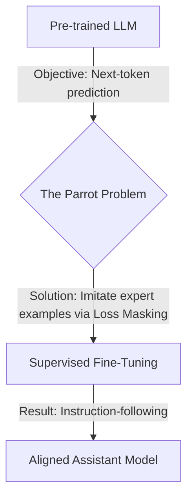

# **Title: Supervised Fine-Tuning in 30 Min**

## **Chapter 1: The Problem: Parrots, Not Assistants**

You've used models like ChatGPT or Claude. You give them an instruction, and they follow it. This behavior feels natural, but it is a carefully engineered facade. The underlying base model—fresh from its training on trillions of words—is not an assistant. It is a powerful, alien-like **text-completion engine**. Its sole objective is to predict the next word in a sequence with statistical accuracy.

This singular focus creates the **Parrot Problem**: the model becomes a master of mimicry without any concept of user intent.

Let's make this concrete. You prompt a raw, pre-trained base model (like the original GPT-3) with a question.

**Your Prompt:**
```
What is the primary cause of Earth's seasons?
```

**An Assistant's Expected Response:**
```
The primary cause of Earth's seasons is the tilt of the Earth's axis, which is about 23.5 degrees...
```

**The Base Model's Likely Response:**
```
What is the primary cause of Earth's seasons?
A) The Earth's distance from the sun.
B) The tilt of the Earth's axis relative to its orbital plane.
C) The speed of the Earth's rotation.
D) Ocean currents and wind patterns.
```

The model did not answer your question. It continued your text by formatting it into a multiple-choice question. Why? Because its pre-training data is saturated with quizzes and tests. From a purely statistical "next-word prediction" viewpoint, this is a highly probable completion for a sentence that starts with "What is...".

The model isn't being unhelpful. It is perfectly executing its objective: **completing a pattern**. It has no concept of a "user" or an "instruction." It only sees text.

This gap between a pattern-completing parrot and a helpful assistant is closed by a process called **post-training**. The first and most crucial step is **Supervised Fine-Tuning (SFT)**.

It sounds complex, but the entire engineering challenge of SFT boils down to crafting a single, clever data transformation function.

**My promise is this: In the next 30 minutes, you will learn to write this exact function from scratch.** This is the complete logic that turns raw `(prompt, response)` pairs into trainable tensors for an LLM.

```python
import torch

def prepare_sft_batch(prompt: str, response: str, tokenizer):
    """
    This is the core engineering of SFT. It takes a prompt/response pair
    and creates the input_ids and the strategically masked labels.
    """
    # 1. Format the text with special tokens for conversation structure.
    prompt_part = f"<|user|> {prompt} <|end|> <|assistant|>"
    full_text = f"{prompt_part} {response} <|end|>"

    # 2. Tokenize to find the boundary for loss masking.
    # We only want to train the model on the assistant's response.
    prompt_ids = tokenizer.encode(prompt_part)
    mask_until_idx = len(prompt_ids)

    # 3. Tokenize the full conversation for model input.
    input_ids = tokenizer.encode(full_text)

    # 4. Create the labels tensor by cloning the input_ids.
    labels = torch.tensor(input_ids).clone()

    # 5. Apply the mask. This is the critical step.
    # We replace the prompt tokens in the labels with -100.
    labels[:mask_until_idx] = -100

    return {
        "input_ids": torch.tensor(input_ids),
        "labels": labels
    }
```
That's the entire trick. The rest is just standard model training. PyTorch's loss function is hard-coded to ignore `-100` values, so by feeding it these `labels`, we force the model to learn one thing: "When you see `<|assistant|>`, generate the expert response."

By mastering this function, you master SFT.


Our journey will take us from the problem to the complete solution.



To understand *why* this data transformation is so effective, we must first master the engine it modifies. In the next chapter, we will dissect the mathematical core of pre-training—Cross-Entropy Loss—to see exactly how the parrot learns to talk in the first place.

## **Chapter 2: The Engine of Pre-training: Cross-Entropy Loss**

Before we can teach a model to be an assistant, we must first understand how it learned to be a parrot. The vast knowledge of a base LLM is forged during its **pre-training** phase, where it is trained on a single, brutally simple objective: **next-token prediction**.

The rule is this: given a sequence of text, predict the very next token. That's it. The model is a highly sophisticated pattern-completion machine. To teach it this skill, we use the standard workhorse of deep learning classification: **Cross-Entropy Loss**.

Cross-Entropy Loss is a way to measure how "surprised" a model is by the correct answer. If the model assigns a high probability to the correct next token, the loss is low (low surprise). If it assigns a very low probability, the loss is high (high surprise).

Mathematically, this simplifies to calculating the **negative log-probability** of the correct target token.

Let's make this concrete with a minimal example that you can calculate by hand.

Imagine a tiny model with a vocabulary of only six words.

*   **Vocabulary:** `{"<pad>": 0, "The": 1, "cat": 2, "sat": 3, "on": 4, "mat": 5}`
*   **Input Sequence (`input_ids`):** "The cat sat" -> `[1, 2, 3]`
*   **Target Sequence (`labels`):** "cat sat on" -> `[2, 3, 4]`

The model processes the input and produces a vector of raw scores, or **logits**, for each possible next word at each position. Let's assume our model has produced the following logits:

| Position | Input Context | Model's Output Logits (for the next token) |
| :--- | :--- | :--- |
| 1 | `[1]` ("The") | `[0.1, 0.2, 2.0, 0.5, 0.3, 0.1]` |
| 2 | `[1, 2]` ("The cat") | `[0.1, 0.1, 0.2, 2.5, 0.4, 0.2]` |
| 3 | `[1, 2, 3]` ("The cat sat")| `[0.2, 0.1, 0.1, 0.3, 3.0, 0.5]` |

To calculate the loss, we perform three steps for each position:
1.  **Softmax:** Convert the raw logits into a probability distribution. $ \text{softmax}(z_i) = \frac{e^{z_i}}{\sum_j e^{z_j}} $.
2.  **Get Target Probability:** Find the probability the model assigned to the correct target token.
3.  **Calculate Loss:** Take the negative natural logarithm of that probability. $\text{Loss} = -\log(P_{\text{target}})$.

Let's fill out the table with the math, step-by-step.

| Step | Input Context | Target Token | Model's Logits | Softmax Probabilities | Prob. of Target Token | Loss (-log P) |
| :-- | :--- | :--- | :--- | :--- | :--- | :--- |
| **1**| "The" | `cat` (idx 2) | `[0.1,..,**2.0**,..]` | `[0.08,..,**0.593**,..]` | `0.593` | `-log(0.593) = 0.522` |
| **2**| "The cat"| `sat` (idx 3) | `[0.1,..,**2.5**,..]` | `[0.07,..,**0.793**,..]` | `0.793` | `-log(0.793) = 0.232` |
| **3**| "The cat sat"| `on` (idx 4) | `[0.2,..,**3.0**,..]` | `[0.08,..,**0.773**,..]` | `0.773` | `-log(0.773) = 0.257` |
| | | | | **Total Loss (Average)** | | | **(0.522+0.232+0.257)/3 = 0.337** |

The final loss for this sequence is the **average** of the individual token losses, which is **0.337**. This single number tells the optimizer how wrong the model was across the entire sequence, and backpropagation uses it to adjust the model's weights.

In PyTorch, this entire process is handled by a single, highly optimized function: `torch.nn.functional.cross_entropy`. The key is to format our tensors correctly.

```python
import torch
import torch.nn.functional as F

# Our model's output logits. These are the *exact same numbers* from the table.
# Shape: (Batch, Time, Vocab_size) -> (1, 3, 6)
logits = torch.tensor([[
    [0.1, 0.2, 2.0, 0.5, 0.3, 0.1],  # Logits for predicting after "The"
    [0.1, 0.1, 0.2, 2.5, 0.4, 0.2],  # Logits for predicting after "The cat"
    [0.2, 0.1, 0.1, 0.3, 3.0, 0.5]   # Logits for predicting after "The cat sat"
]])

# The correct next tokens (our labels)
# Shape: (Batch, Time) -> (1, 3)
targets = torch.tensor([[2, 3, 4]]) # "cat", "sat", "on"

# F.cross_entropy expects (N, C) and (N,)
# So we reshape our tensors to squash the Batch and Time dimensions together.
logits_flat = logits.view(-1, logits.size(-1)) # Shape: (3, 6)
targets_flat = targets.view(-1)               # Shape: (3)

loss = F.cross_entropy(logits_flat, targets_flat)

print(f"Logits shape (original): {logits.shape}")
print(f"Logits shape (flattened): {logits_flat.shape}")
print(f"Targets shape (flattened): {targets_flat.shape}")
print(f"Calculated Loss: {loss.item():.3f}")
```
**Output:**
```
Logits shape (original): torch.Size([1, 3, 6])
Logits shape (flattened): torch.Size([3, 6])
Targets shape (flattened): torch.Size([3])
Calculated Loss: 0.337
```
The result perfectly matches our manual, step-by-step calculation. This is the simple, powerful engine that drives large-scale pre-training.

Now we can see the source of the Parrot Problem with mathematical clarity. The model's sole objective is to minimize this cross-entropy loss over a massive dataset of text from the internet. It will adjust its weights to become a master of statistical mimicry because that is the most effective way to reduce the loss.

When you prompt it with `Q: What is the capital of Italy?`, it doesn't "understand" the question. It sees a sequence of tokens. It asks itself: "Across the trillions of tokens I have seen, what tokens are most likely to follow this sequence?" Since its data contains countless FAQs and quizzes formatted as `Q:...\nA:...\n\nQ:...`, completing the pattern is the path of least "surprise"—the path to the lowest possible loss.

It is a **parrot** because its training objective is **mimicry**.

To fix this, we need to change the data it learns from. We need to show it examples not of how text *is*, but of how we *want* it to be. This is the goal of Supervised Fine-Tuning, which we will build from the ground up in the next chapter.

## **Chapter 3: The SFT Solution: The Theory of Expert Imitation**

In the last chapter, we established that the pre-training objective creates a powerful but aimless parrot. Supervised Fine-Tuning (SFT) is the first and most direct solution to this problem. The idea is wonderfully simple: **if you want a model that follows instructions, you must show it a large, high-quality dataset of instructions being followed correctly.**

We shift the model's diet. Instead of training on a vast, unstructured sea of internet text, we move to a curated, structured dataset of `(prompt, response)` pairs. This is like taking the model out of a library containing every book ever written and handing it a focused curriculum of expert-written Q&A flashcards.

*   **Prompt:** "Explain the concept of gravity to a 6-year-old in a short paragraph."
*   **Response:** "Imagine the Earth is a giant magnet, but for everything! It's always gently pulling you and your toys down towards it. That's why when you jump, you always come back down. This special pulling power is called gravity!"


We can't just feed the prompt and response to the model separately. A language model only understands a single, continuous sequence of tokens. Furthermore, it needs to learn the *structure* of a conversation—who is speaking and when.

To solve this, we introduce **special tokens** and a **chat template**. A common template formats the data like this:
```
<|user|>
{prompt}
<|end|>
<|assistant|>
{response}
<|end|>
```
Our `(prompt, response)` pair is formatted into a single string, which is then tokenized into a single sequence of `input_ids`.

**Example:**
`<|user|>\nExplain gravity...<|end|>\n<|assistant|>\nImagine the Earth...<|end|>`

This template teaches the model the turn-taking format of a conversation. It learns that after seeing `<|assistant|>`, it is its turn to generate helpful text.

Now we face the critical problem. If we feed this entire formatted sequence into the standard next-token prediction objective from Chapter 2, we would be training the model to predict *the user's prompt* as well as the assistant's response.

**This is wrong and counterproductive.** We don't want the model to learn to generate user prompts. We only want to penalize the model for errors it makes when it's the assistant's turn to speak.

The solution is an elegant engineering trick called **loss masking**. We create a `labels` tensor that is a copy of our `input_ids`. Then, for every token we want the loss function to *ignore*, we replace its ID with a special value: **-100**. PyTorch's `CrossEntropyLoss` is specifically designed to completely ignore any target with this value.

Let's see this in action. Assume we have the following tokenization for a simplified example:
*   `<|user|>` -> 6, `Explain` -> 7, `gravity` -> 8, `<|end|>` -> 9, `<|assistant|>` -> 10, `Gravity` -> 11, `is` -> 12, `a` -> 13, `force` -> 14

Our single sequence is fed into the model. The `input_ids` contain the full conversation. The `labels` tensor, however, is strategically filled with `-100` to mask out everything that isn't the assistant's response.

| Token Text | `input_ids` | `labels` | Loss Calculated? |
| :--- | :--- | :--- | :--- |
| `<\|user\|>` | 6 | -100 | **No** |
| `Explain` | 7 | -100 | **No** |
| `gravity` | 8 | -100 | **No** |
| `<\|end\|>` | 9 | -100 | **No** |
| `<\|assistant\|>`| 10 | -100 | **No** |
| **`Gravity`** | 11 | 11 | **Yes** |
| **`is`** | 12 | 12 | **Yes** |
| **`a`** | 13 | 13 | **Yes** |
| **`force`** | 14 | 14 | **Yes** |
| **`<\|end\|>`** | 9 | 9 | **Yes** |

This achieves our goal perfectly. The gradients are only calculated based on the model's ability to generate the expert-written response. It learns the core rule: "When you see the token sequence `<|user|> ... <|end|> <|assistant|>`, your goal is to generate the following sequence."

The SFT loss is the same cross-entropy loss from pre-training, but with this crucial modification. The loss is averaged *only* over the non-masked, response tokens.

Given a dataset $\mathcal{D}_{\text{SFT}}$ of `(prompt, response)` pairs, $(x, y)$, the SFT objective is to minimize the negative log-probability of the response tokens, conditioned on the prompt:

$$ \mathcal{L}_{\text{SFT}}(\theta) = - \mathbb{E}_{(x, y) \sim \mathcal{D}_{\text{SFT}}} \left[ \sum_{t=1}^{|y|} \log P_{\theta}(y_t | x, y_{<t}) \right] $$

Where:
*   $P_{\theta}(y_t | x, y_{<t})$ is the probability assigned by the model $\theta$ to the correct token $y_t$ at timestep $t$ of the response.
*   The summation $\sum_{t=1}^{|y|}$ is performed **only over the tokens in the target response $y$**, not the prompt $x$. This is the formal mathematical representation of our loss masking trick.

We now have the complete theory of Supervised Fine-Tuning. We know why we need chat templates and, most importantly, we understand the critical role of loss masking.

In the next chapter, we will translate this theory directly into the Python code we promised, implementing the `prepare_sft_batch` function from start to finish.

## **Chapter 4: SFT: The PyTorch Implementation**

We have the theory: format conversations with a chat template and use loss masking to train only on the assistant's replies. Now, we will translate that theory into code.

The main engineering task in SFT is not the training loop—that's standard PyTorch. The crucial part is the **data collation**: the process of taking a batch of `(prompt, response)` pairs and converting them into the `input_ids` and `labels` tensors the model needs.

To keep things crystal clear, we will use a tiny, handcrafted vocabulary and tokenizer. This allows us to focus entirely on the SFT logic without getting lost in external libraries.

```python
import torch

# A minimal tokenizer for our example
class SimpleTokenizer:
    def __init__(self):
        self.vocab = {
            '<pad>': 0, 'The': 1, 'quick': 2, 'brown': 3, 'fox': 4,
            'jumps': 5, 'over': 6, 'lazy': 7, 'dog': 8,
            '<|user|>': 9, '<|assistant|>': 10, '<|end|>': 11,
            'What': 12, 'is': 13, 'a': 14, '?': 15
        }
        self.inv_vocab = {v: k for k, v in self.vocab.items()}

    def encode(self, text):
        # A simple split-based tokenizer, robust to punctuation
        tokens = text.replace('?', ' ?').split()
        return [self.vocab[t] for t in tokens]

    def decode(self, tensor):
        return " ".join([self.inv_vocab[i] for i in tensor.tolist()])

# Instantiate our tokenizer
tokenizer = SimpleTokenizer()

# A sample batch of data (list of dictionaries)
# Note: For simplicity, our responses are the same length.
sft_batch = [
    {"prompt": "The quick brown fox", "response": "jumps over the lazy dog"},
    {"prompt": "What is a dog ?", "response": "a lazy brown fox"},
]
```

Now for the core logic we promised. We will write a function that takes this `sft_batch` and produces the masked `labels` tensor. This function implements the theory from Chapter 3 step-by-step.

```python
def sft_data_collator(batch, tokenizer):
    all_input_ids = []
    all_labels = []

    for example in batch:
        # 1. Format the text with the chat template.
        prompt_part = f"<|user|> {example['prompt']} <|end|> <|assistant|>"
        full_text = f"{prompt_part} {example['response']} <|end|>"

        # 2. Tokenize the prompt part to find the masking boundary.
        # This tells us how many tokens to ignore in the loss calculation.
        prompt_ids = tokenizer.encode(prompt_part)
        mask_until_idx = len(prompt_ids)

        # 3. Tokenize the full text for the model's input.
        input_ids = tokenizer.encode(full_text)

        # 4. Create labels by cloning the input_ids.
        labels = torch.tensor(input_ids).clone()

        # 5. Apply the mask. This is the core SFT trick.
        # We set the label for all prompt tokens to -100.
        labels[:mask_until_idx] = -100

        all_input_ids.append(torch.tensor(input_ids))
        all_labels.append(labels)

    # In a real implementation, you'd pad all sequences to the same length here.
    return {
        "input_ids": torch.stack(all_input_ids),
        "labels": torch.stack(all_labels)
    }

# Let's process our batch
prepared_batch = sft_data_collator(sft_batch, tokenizer)
```

Let's print the prepared batch to see our loss masking in action. The table below shows the first example from our batch, connecting the theory directly to our code's output.

| Token Text | `input_ids` | `labels` | Loss Calculated? |
| :--- | :--- | :--- | :--- |
| `<\|user\|>` | 9 | -100 | **No** |
| `The` | 1 | -100 | **No** |
| `quick` | 2 | -100 | **No** |
| `brown` | 3 | -100 | **No** |
| `fox` | 4 | -100 | **No** |
| `<\|end\|>` | 11 | -100 | **No** |
| `<\|assistant\|>`| 10 | -100 | **No** |
| **`jumps`** | 5 | 5 | **Yes** |
| **`over`** | 6 | 6 | **Yes** |
| **`the`** | 1 | 1 | **Yes** |
| **`lazy`** | 7 | 7 | **Yes** |
| **`dog`** | 8 | 8 | **Yes** |
| **`<\|end\|>`** | 11 | 11 | **Yes** |

The code has perfectly executed the theory. The `labels` tensor is correctly masked, ensuring that gradients will only be computed for the assistant's response.

```python
print("--- Prepared Batch (First Example) ---")
print("Input IDs:", prepared_batch["input_ids"][0])
print("Labels:   ", prepared_batch["labels"][0])

# Let's decode to be sure
print("\n--- Decoded Labels (non-masked part) ---")
response_part = prepared_batch["labels"][0][prepared_batch["labels"][0] != -100]
print(f"Decoded: '{tokenizer.decode(response_part)}'")
```
**Output:**
```
--- Prepared Batch (First Example) ---
Input IDs: tensor([ 9,  1,  2,  3,  4, 11, 10,  5,  6,  1,  7,  8, 11])
Labels:    tensor([-100, -100, -100, -100, -100, -100, -100,    5,    6,    1,    7,    8,   11])

--- Decoded Labels (non-masked part) ---
Decoded: 'jumps over The lazy dog <|end|>'
```

With the hard work of data preparation done, the actual training step is trivial. We simply pass the `input_ids` and `labels` to our model. If the model uses `torch.nn.functional.cross_entropy` for its loss calculation (as all standard transformer models do), it will automatically handle the `-100` masking.

```python
# Assume 'policy_model' is our LLM and 'optimizer' is an AdamW optimizer.
# The model's forward pass is expected to return (logits, loss).
def sft_training_step(policy_model, optimizer, batch):
    policy_model.train()
    optimizer.zero_grad()

    # The model's forward pass automatically calculates the masked loss
    # because PyTorch's cross_entropy ignores labels with value -100.
    outputs = policy_model(
        input_ids=batch["input_ids"],
        labels=batch["labels"]
    )
    loss = outputs.loss # Assuming a Hugging Face-style model output

    loss.backward()
    optimizer.step()
    return loss.item()

# Conceptual usage:
# loss_value = sft_training_step(my_gpt_model, my_optimizer, prepared_batch)
```
We have successfully implemented the full SFT pipeline from scratch. We have taught the model *what* a helpful response looks like and how to generate it. The parrot is learning to become an assistant.

However, this method of direct imitation has a crucial weakness. All "good" responses are treated equally. We have no way to tell the model that one good response might be slightly better, more detailed, or safer than another. We've taught the model what to say, but not how to *judge*.

In the final chapter, we will explore this limitation and see where SFT fits into the broader alignment landscape.

## **Chapter 5: Beyond Imitation: The Power and Limits of SFT**

We've completed the journey. Starting with a raw, pre-trained "parrot," we have successfully implemented the theory and code for Supervised Fine-Tuning. Let's recap what we've achieved and, just as importantly, understand what we haven't.

By leveraging a structured chat template and the critical technique of loss masking, we have fundamentally altered the model's behavior. Our model is no longer just a pattern-completion engine.

1.  **It Understands Conversational Structure:** The model now recognizes the roles of `<|user|>` and `<|assistant|>` and knows that its job is to generate text after the assistant token.
2.  **It Adopts a Persona:** It has learned to imitate the style, tone, and helpfulness of the expert-written responses in its SFT dataset.
3.  **It Follows Instructions:** Within the domains covered by its training data, the model can now reliably follow instructions, answer questions, and perform tasks.

We have successfully built an **apprentice assistant**. It has learned the rules and can replicate the tasks it was shown. This is the essential first step in creating a useful and safe AI model. SFT is the bedrock upon which all modern alignment is built.

However, SFT has a profound, built-in limitation: it treats all "good" answers as equally and perfectly good. The learning process is binary—it imitates the provided response, and everything else is implicitly wrong. The real world, however, is full of nuance and "shades of gray."

Consider a user prompt: "Summarize the impact of the printing press."

*   **Response A (Good):** "The printing press, invented by Johannes Gutenberg around 1440, allowed for the mass production of books. This made information more accessible and increased literacy rates across Europe."
*   **Response B (Better):** "Gutenberg's printing press democratized knowledge by drastically lowering the cost of books. This fueled the Renaissance, the Reformation, and the Scientific Revolution by enabling the rapid spread of new ideas and challenging the information monopoly of religious and state authorities."

As humans, we can clearly state a preference: **B is better than A**. It's more insightful, detailed, and provides deeper context.

An SFT model cannot learn this **relative preference**.
*   If your SFT dataset only contains responses like A, your model will learn to be factually correct but basic.
*   If your dataset contains both A and B, the model will learn to produce an *average* of the two styles, potentially becoming generic.
*   It has no mechanism to understand that B is a more desirable output than A. It can only imitate what it is shown.

SFT teaches a model *what* to say, but not how to *judge* or *choose* between multiple good options.

To overcome this limitation, the field of AI alignment developed techniques for **preference tuning**. These methods move beyond simple imitation and teach the model to understand human judgments directly.

This requires a new kind of dataset: `(prompt, chosen_response, rejected_response)`.

Instead of just showing the model one good answer, we show it two answers and tell it which one we prefer. Algorithms like **DPO (Direct Preference Optimization)** and **RLHF (Reinforcement Learning from Human Feedback)** use this preference data to fine-tune the model further. They adjust the model's probabilities so that it learns to assign a higher likelihood to "chosen" responses and a lower likelihood to "rejected" ones.

SFT is not the end of the alignment story; it is the essential first chapter. It transforms the raw base model into something coherent and controllable, creating the perfect starting point for more sophisticated preference tuning.

You now understand the fundamental technique that turns a pattern-mimicking parrot into a true instruction-following assistant. You have mastered the theory, the math, and the code. The entire landscape of LLM alignment starts here.