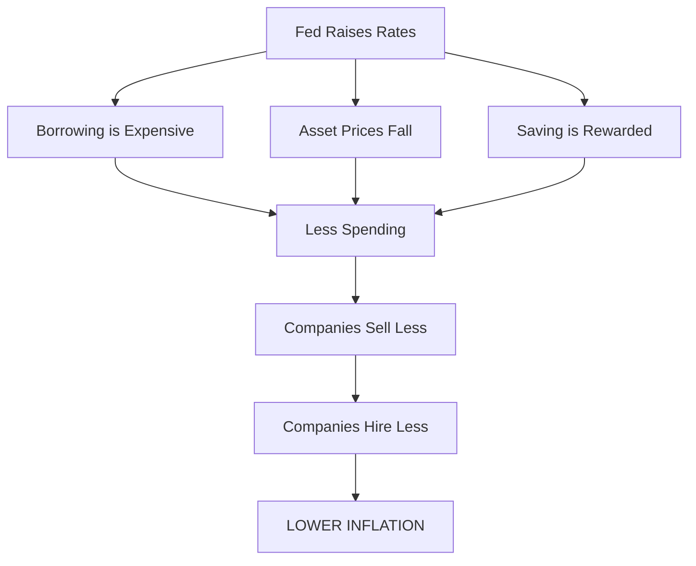

# The Physics of Money: Valuation, Employment, and the Federal Funds Rate ($r$)

## Introduction: The Algorithm of Value

Why does a 0.25% change in a generic bank rate cause the stock market to crash?
Why does this same number determine if you can buy a house or if your company cancels your yearly bonus?
Why is the entire global economy sensitive to a single variable?

The Federal Funds Rate ($r$) is the "gravity" of the financial world. It is the input variable that determines the weight of every dollar, every debt, and every asset on Earth.

### The Promise
By the end of this tutorial (approx. 40 minutes), you will understand the mechanical relationship between the Federal Reserve and your wallet. You will not just learn "high interest is bad for borrowing." You will learn the specific valuation algorithms used by Wall Street and Corporations to price the world.

You will master these formal concepts:

*   **The Master Formula:** $PV = \frac{CF}{(1+r)^n}$
*   **Discounted Cash Flow (DCF):** The math behind stock prices.
*   **Net Present Value (NPV):** The logic behind hiring and firing.
*   **Opportunity Cost:** The mathematical floor for investment.

### The Syllabus: From Math to Reality

We will break down the economy into four variables.

1.  **Your Debt (Leverage):**
    *   **Concept:** Amortization mechanics.
    *   **Reality:** Why a 4% rate increase doubles your monthly interest.
2.  **Your Assets (Valuation):**
    *   **Concept:** Discounted Cash Flow ($PV = \frac{CF}{(1+r)}$).
    *   **Reality:** Why "safe" money kills "risky" tech stocks.
3.  **Your Job (Hurdle Rates):**
    *   **Concept:** Net Present Value (NPV).
    *   **Reality:** Why companies stop hiring even if they are profitable.
4.  **Your Cash (The Thermostat):**
    *   **Concept:** Monetary Transmission Mechanism.
    *   **Reality:** How the Fed intentionally slows the economy to fight inflation.

**The core thesis:** The interest rate ($r$) is the denominator in the equation of value. As $r$ increases, the value of everything else decreases.

Let’s begin with the most direct impact: Debt.

## Section 1: Your Monthly Budget (The Price of Leverage)

The most immediate impact of the Federal Funds Rate ($r$) is on the price of **Leverage**. Most individuals and companies do not buy assets with cash; they buy them with debt.

### The Problem: The Monthly Payment Cap
You want to buy a house. You take out a **\$300,000** mortgage.
Most people think the price of the house is \$300,000. It is not. The price is the **monthly payment**.
You have a budget limit of what you can pay per month. Let's see how $r$ breaks this limit.

### Concrete Solution: 3% vs 7%
Let’s compare the interest costs in the first year.

**Case A: The Low-Rate World ($r = 3\%$)**
$$300,000 \times 0.03 = \$9,000 \text{ per year}$$
**Monthly Interest cost:** $\approx \$750$

**Case B: The High-Rate World ($r = 7\%$)**
$$300,000 \times 0.07 = \$21,000 \text{ per year}$$
**Monthly Interest cost:** $\approx \$1,750$

**The Result:**
The difference is **\$1,000 per month**. You get the exact same house, the exact same bricks, and the exact same land. But the cost of "renting the money" to buy it has more than doubled.

### Abstraction: Debt Service
This concept is called **Debt Service**.
When $r$ is low, money is cheap. You can service a large debt pile with a small income.
When $r$ is high, money is expensive. Your buying power collapses.

If your budget maxes out at \$2,000/month:
*   At 3%, you can afford the house easily.
*   At 7%, you are mathematically insolvent.

### Formalization: The Amortization Algorithm
While the simple math above is a good approximation, banks use the **Amortization Formula** to calculate the exact fixed monthly payment ($M$).

$$ M = P \frac{r(1+r)^n}{(1+r)^n - 1} $$

**Variables:**
*   $M$: Total monthly payment
*   $P$: Principal loan amount (\$300,000)
*   $r$: Monthly interest rate (Annual rate / 12)
*   $n$: Number of payments (30 years = 360 months)

**The Input/Output Table:**

| Loan Amount ($P$) | Annual Rate ($r$) | Monthly Payment ($M$) | Total Interest Paid (30 yrs) |
| :--- | :--- | :--- | :--- |
| \$300,000 | **3.0%** | **\$1,265** | \$155,332 |
| \$300,000 | **7.0%** | **\$1,996** | **\$418,527** |

Notice the last column. At 7%, you pay more in interest (\$418k) than the house is actually worth (\$300k).

### The Reality Check
We just looked at one mortgage. Now scale this to the entire economy.

When the Fed raises $r$:
1.  **Auto Loans:** A \$40,000 car becomes unaffordable.
2.  **Credit Cards:** Variable rates jump from 15% to 25%.
3.  **Housing Freeze:** People with 3% mortgages refuse to sell because they can't afford a new mortgage at 7%. Supply vanishes.

**Key Takeaway:** The Fed controls the price of entering the game. When $r$ goes up, fewer players can afford to play.

## Section 2: Your Stock Portfolio (Asset Gravity)

Why does the stock market turn red the moment the Fed announces a rate hike? Even if the companies are still making money?

It comes down to a single law of finance: **The value of an asset is the present value of its future cash flows.**

### The Problem: What is a stock worth?
Imagine a theoretical company, "CashFlow Inc."
It pays you a guaranteed dividend of **\$10 per year** forever.
What should you pay for one share of this company today?

The answer depends entirely on the Fed rate ($r$).

### Concrete Solution: The Valuation Shift
Investors use the Fed rate as the "Risk-Free Rate"—the baseline they could earn just by sitting on cash. If they buy a stock, they demand a return *higher* than the bank rate.

**Case A: The Low-Rate World ($r = 5\%$)**
You want to earn \$10 a year. The bank only pays 5%.
To get \$10 from the bank, you would need to deposit \$200 ($200 \times 0.05 = 10$).
Therefore, "CashFlow Inc." is worth **\$200**.

**Case B: The High-Rate World ($r = 10\%$)**
The Fed raises rates. Now the bank pays 10%.
To get \$10 from the bank, you only need to deposit \$100 ($100 \times 0.10 = 10$).
Therefore, "CashFlow Inc." is now only worth **\$100**.

**The Result:**
The company did not change. It still makes \$10/year. But the *price* of the stock crashed by **50%** (from \$200 to \$100) purely because $r$ doubled.

### Abstraction: The Denominator Effect
This logic applies to everything: real estate, bonds, and stocks.
As interest rates rise, the "required return" rises. Because the cash flow (\$10) is fixed, the only thing that can move is the Price.

**Rule:** Price and Rates move in opposite directions.

### Formalization: Discounted Cash Flow (DCF)
Wall Street formalizes this using the DCF model. The most basic version (for a perpetuity) is:

$$ PV = \frac{CF}{r} $$

**Variables:**
*   $PV$: Present Value (The Stock Price)
*   $CF$: Cash Flow (The Dividend/Profit)
*   $r$: The Discount Rate (Fed Rate + Risk Premium)

**Visualizing the Decay:**
If we graph the Price ($PV$) as $r$ increases, it creates a steep downward curve.

```text
Price ($)
|
| * ($200 @ 5%)
|
|      *
|         * ($100 @ 10%)
|            *
|               * ($66 @ 15%)
|____________________ Rate (r)
```

### The Reality Check
We just looked at a company paying \$10 *today*.
Real life is more volatile.

1.  **Tech Stocks (Growth):** Many tech companies (like startups) promise huge money *in the future* (10 years from now), not today.
    *   When $r$ is high, money 10 years from now is nearly worthless today.
    *   **Result:** This is why NASDAQ/Tech crashes harder than Coca-Cola when rates rise.
2.  **Real Estate:** Investors look at rental income vs. the mortgage rate. If the mortgage rate ($r$) is higher than the rental yield ($CF$), the property value ($PV$) must come down to compensate.

**Key Takeaway:** The Fed Rate is the denominator. If you increase the denominator, the resulting value **must** decrease. No exceptions.

## Section 3: Your Job Security (The Hurdle Rate)

This is where the math gets personal. Why do companies announce layoffs or hiring freezes when interest rates go up—even if the company is profitable?

It is because of **Opportunity Cost**. Companies do not invest in projects (or people) just to make a profit. They invest to make a profit *better than* what they could get for doing nothing.

### The Problem: Is this project worth it?
Imagine you work for a company. You propose a new project (or a new team hire).
*   **Cost today:** \$100 (Salaries, Equipment)
*   **Payoff in 1 year:** \$110 (Revenue)
*   **Profit:** \$10.

Is this a good idea? The answer is: **It depends on $r$.**

### Concrete Solution: The Safe Alternative
The company has a choice: Invest \$100 in your project (risky) or put \$100 in "Risk-Free" Treasury Bonds (safe).

**Scenario A: Fed Rate is Low ($r = 2\%$)**
*   **Safe Option:** \$100 grows to **\$102**.
*   **Your Project:** \$100 grows to **\$110**.
*   **Decision:** Your project beats the bank (\$110 > \$102).
*   **Result:** The company approves the budget. **You get hired.**

**Scenario B: Fed Rate is High ($r = 12\%$)**
*   **Safe Option:** \$100 grows to **\$112**.
*   **Your Project:** \$100 grows to **\$110**.
*   **Decision:** Your project LOSES to the bank (\$110 < \$112). Even though your project makes a profit, it is *inefficient*.
*   **Result:** The company kills the project. **You get laid off.**

### Abstraction: The Hurdle Rate
The Fed Rate acts as a **Hurdle Rate**.
Think of it like a high jump bar.
*   When rates are 0%, the bar is on the floor. Almost any idea gets funded (Hello, Crypto startups and unprofitable Tech unicorns).
*   When rates are 5%, the bar is set high. Only the strongest, most profitable projects clear the jump. Everything else hits the bar and fails.

### Formalization: Net Present Value (NPV)
Corporations formalize this logic using **Net Present Value**. This formula determines if an investment creates value or destroys it.

$$ NPV = \frac{R}{(1+r)} - I $$

**Variables:**
*   $I$: Initial Investment (\$100)
*   $R$: Return in one year (\$110)
*   $r$: The Interest Rate

**The Calculation:**
*   **If $r = 2\%$:**
    $$ NPV = \frac{110}{1.02} - 100 \approx 107.8 - 100 = \mathbf{+\$7.80} $$
    **(Positive NPV = GO / HIRE)**

*   **If $r = 12\%$:**
    $$ NPV = \frac{110}{1.12} - 100 \approx 98.2 - 100 = \mathbf{-\$1.80} $$
    **(Negative NPV = NO GO / FIRE)**

### The Reality Check
We just analyzed a \$100 project. Now look at the global economy.

1.  **Venture Capital:** When rates are high, VC firms stop funding "growth at all costs" startups because the math (NPV) turns negative.
2.  **Construction:** A developer won't build a new apartment complex if the loan interest is higher than the expected rent profit.
3.  **The Result:** Less construction + less funding = fewer jobs.

**Key Takeaway:** The Fed raises rates to intentionally make projects "fail" the NPV test. This forces companies to spend less and hire fewer people, cooling down the economy.

## Section 4: Your Cash & Inflation (The Thermostat)

We have seen how $r$ destroys the value of stocks and makes debts expensive. Why does the Fed inflict this pain on purpose?

They are acting as a **Thermostat**.
*   If the economy runs too hot (Inflation), they raise rates to cool it down.
*   If the economy freezes (Recession), they cut rates to heat it up.

The mechanism works by changing your incentive to spend versus save.

### The Problem: The "Hot" Economy
Inflation happens when there is "too much money chasing too few goods."
To stop prices from rising, the Fed needs you to **stop spending money**.
How do they convince you to stop spending? They pay you to wait.

### Concrete Solution: The Savings Incentive
Imagine you have **\$1,000** in cash. You can buy a new TV today, or put it in a savings account for 10 years.

**Case A: The Low-Rate World ($r = 1\%$)**
*   **Annual Interest:** $1,000 \times 0.01 = \$10$.
*   **10 Year Payoff:** You make roughly \$100 total.
*   **Your Decision:** A \$10 reward is pathetic. You buy the TV today.
*   **Macro Effect:** High spending $\rightarrow$ High demand $\rightarrow$ **High Inflation**.

**Case B: The High-Rate World ($r = 5\%$)**
*   **Annual Interest:** $1,000 \times 0.05 = \$50$.
*   **10 Year Payoff:** Thanks to compound interest, this grows significantly.
*   **Your Decision:** You realize you can turn \$1,000 into roughly \$1,600 without working. You put the money in the bank. You **do not** buy the TV.
*   **Macro Effect:** Low spending $\rightarrow$ Low demand $\rightarrow$ **Inflation Drops**.

### Abstraction: Aggregate Demand
This is the **Time Value of Money** in action.
*   **Low Rates:** Penalize savers. Encourage spending/speculation.
*   **High Rates:** Reward savers. Discourage spending.

When millions of people simultaneously decide to "wait and save" instead of "buy now," stores have fewer customers. To get customers back, stores must lower prices. **That is how inflation is cured.**

### Formalization: Future Value (FV)
We calculate the reward for waiting using the Compound Interest Formula:

$$ FV = PV (1+r)^n $$

**Variables:**
*   $FV$: Future Value (Money you have later)
*   $PV$: Present Value (Money you have now)
*   $r$: Interest Rate
*   $n$: Time (Years)

**The Difference of 4%:**
Over 10 years ($n=10$):
*   At 1%: $1,000(1.01)^{10} = \mathbf{\$1,104}$
*   At 5%: $1,000(1.05)^{10} = \mathbf{\$1,628}$

That extra \$500 is the "bribe" the Fed pays you to remove your cash from the economy.

### The Mechanism: The Feedback Loop
This brings all the previous sections together into one system. This is the **Monetary Transmission Mechanism**.



### The Reality Check
This mechanism is blunt. The Fed cannot target just "egg prices." They have to slow down the *entire* system.

1.  **The "Soft Landing":** The goal is to raise rates *just enough* to stop inflation, but not so much that everyone loses their job (Section 3).
2.  **The "Hard Landing" (Recession):** If they raise rates too high, debt becomes impossible to pay (Section 1), the stock market collapses (Section 2), and mass layoffs occur (Section 3).

**Key Takeaway:** The Fed controls inflation by manipulating your psychology. They raise rates to make you feel poorer (lower stock prices) and make saving look smarter than spending. When you close your wallet, prices fall.

## Conclusion: The Universal Denominator

By now, you should see that the Federal Funds Rate ($r$) is not just a number on a news ticker. It is the **Universal Denominator**.

In math, when you increase the denominator of a fraction, the total value of the number gets smaller.
$$ \text{Value} = \frac{\text{Cash Flow}}{\mathbf{r}} $$

Because $r$ is in the denominator of the entire global economy, the Fed has the power to resize reality.

### Summary: The Matrix of Money

Let's review the four levers we discussed. This is your cheat sheet for how the world works:

| Area of Life | The Concept | When Rates ($r$) Go Up... | The Result |
| :--- | :--- | :--- | :--- |
| **Your Debt** | **Debt Service** | Payments explode (Math: Amortization) | You can afford less house/car. |
| **Your Assets** | **DCF** | Future cash is worth less (Math: $PV = CF/r$) | Stock and Real Estate prices fall. |
| **Your Job** | **NPV / Hurdle Rate** | Projects fail the profit test | Companies hire less or layoff staff. |
| **Your Cash** | **Opportunity Cost** | Savings yield high returns | You stop spending, inflation falls. |

Now you know: **There is no such thing as a fixed price.**
A price is just a reflection of the current interest rate.

*   If you are waiting for house prices to drop, you are actually waiting for rates to rise (which makes the mortgage expensive).
*   If you are waiting for the stock market to moon, you are waiting for rates to fall (which creates inflation risk).

You now possess the source code. The next time the Fed Chair walks up to the podium, you won't just hear a percentage change. You will see the valuation variables in your own life being rewritten in real-time.