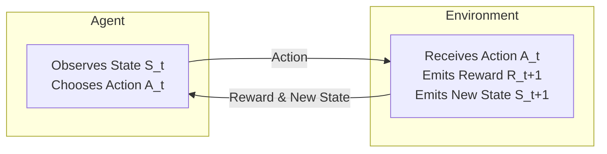
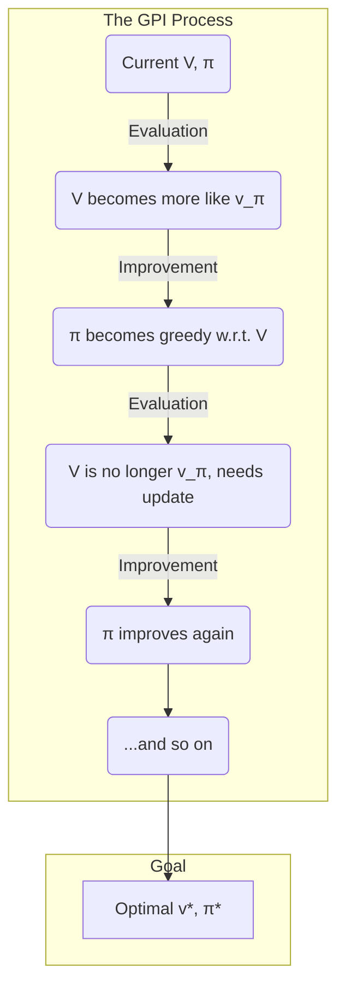

## Reinforcement Learning: Finite Markov Decision Processes

### Part 1: The Big Leap - It's About the Next Step, Not Just the Reward

In the last chapter, we explored the Multi-Armed Bandit problem. It was a great way to understand the core tension between exploration and exploitation. But it was also very simple. The action we took gave us a reward, and that was it. The game reset. Our choice didn't affect what happened next.

Now, we're ready to tackle the full Reinforcement Learning problem. Here, our actions have consequences. They don't just give us a reward; they change our situation for the future. This is a **sequential decision-making** problem.

> **Analogy:** Imagine you are a robot placed in a maze. You can move North, South, East, or West. Some squares have cheese (+1 reward), some have electrical shocks (-1 reward), and most are empty (0 reward). Your goal isn't just to get the *next* piece of cheese. It's to find a path through the maze that gets you the most cheese over the long run, while avoiding shocks.

Here, every action has two results:
1.  An immediate **reward** (or penalty).
2.  A **new situation** (a different square in the maze).

This loop of interaction between a learner (**agent**) and its world (**environment**) is the heart of Reinforcement Learning.

#### The Agent-Environment Interface

We can formalize this interaction with a simple loop that happens over and over at discrete time steps (`t = 0, 1, 2, ...`).



Let's break down the components of this loop, which together form a **Markov Decision Process (MDP)**.

*   **State (`S_t`):** A representation of the agent's situation at time `t`. In our maze, this would be the agent's (x, y) coordinates.
*   **Action (`A_t`):** A choice the agent makes from a set of possible actions. For our maze robot, the actions are `{North, South, East, West}`.
*   **Reward (`R_{t+1}`):** A numerical feedback signal the environment gives the agent. It tells the agent how good or bad its last action was. We use `R_{t+1}` to signify that the reward is a result of the action taken at time `t`.

This interaction creates a **trajectory** of experience: `S_0, A_0, R_1, S_1, A_1, R_2, S_2, ...`

#### The "Memoryless" Rule (The Markov Property)

This framework relies on one hugely important—and simplifying—assumption: **The Markov Property**.

> **The Markov Property:** The future is independent of the past, given the present.

In simple terms, this means the **state `S_t` contains all the information from the past that is relevant for making a decision about the future.**

Let's go back to our maze robot. If its state is its (x, y) coordinates, it has the Markov Property. To decide where to go next, all the robot needs to know is its current location. The path it took to *get* to that location—whether it came from the North, or zig-zagged all over the place—is irrelevant for its next move.

This is a powerful simplification. It means the agent doesn't need to remember its entire history. It just needs to look at its current state to act optimally. A problem that has this property is called a **Markov Decision Process**, or **MDP**. For the rest of this book, we will assume our problems are all MDPs.

### Part 2: Defining the Goal - What Does It Mean to "Win"?

The agent's informal goal is to get as much reward as possible over the long run. But we need to define this formally. How do we sum up a sequence of future rewards: `R_{t+1}, R_{t+2}, R_{t+3}, ...`?

There are two main types of tasks:

1.  **Episodic Tasks:** These tasks have a natural end point. Think of a game of chess or a run through a maze. The sequence of actions, states, and rewards is called an **episode**. For these tasks, we can simply sum the rewards to get our total return. The **Return** at time `t`, denoted `G_t`, is:
    `G_t = R_{t+1} + R_{t+2} + ... + R_T`
    where `T` is the final time step when the episode ends.

2.  **Continuing Tasks:** These tasks go on forever and have no end point, like a robot balancing a pole or managing a power grid. Here, we have a problem. If the agent gets a +1 reward at every step, the total sum would be infinite! An infinite goal isn't useful—you can't compare two different infinities to see which is better.

#### The Solution: Discounting

To solve the "infinite reward" problem, we introduce the concept of **discounting**. The core idea is simple:

> **A reward received sooner is better than a reward received later.**

We quantify this with a **discount rate**, or **gamma (`γ`)**, a number between 0 and 1. A reward received `k` steps in the future is multiplied by `γ^(k-1)`.

*   If `γ = 0`, the agent is "myopic." It only cares about the immediate reward `R_{t+1}`.
*   As `γ` gets closer to 1, the agent becomes more "farsighted," caring more about future rewards.

For continuing tasks, the **discounted return** is defined as:

`G_t = R_{t+1} + γ*R_{t+2} + γ²*R_{t+3} + ... = Σ_{k=0 to ∞} γ^k * R_{t+k+1}`

This elegant formula solves our problem. As long as `γ < 1` and the rewards are bounded, this infinite sum is always a **finite number**. For example, if the reward is always +1, the return is `1 / (1 - γ)`. This gives the agent a concrete, finite value it can try to maximize.

So, the agent's goal is no longer just "get a high score." It is to select actions to **maximize its expected (discounted) return.** We say "expected" because the environment might be random, so we aim for the best *average* outcome. This single concept of the return, `G_t`, is the foundation for everything that follows.

### Part 3: The Agent's "Brain" - Policies and Value Functions

We have an agent in an environment, trying to maximize its long-term discounted return (`G_t`). But how does it decide what to do? It needs a strategy, or a "brain." This is where policies and value functions come in.

#### The Policy (π): The Agent's Rulebook

A **policy**, denoted by the Greek letter **pi (π)**, is the agent's behavior. It's a rulebook that tells the agent what action to take in any given state.

Formally, a policy `π` is a mapping from states to probabilities of selecting each possible action.
`π(a|s) = P[A_t = a | S_t = s]`

In plain English: "**Given that I am in state `s`, what is the probability that I will take action `a`?**"

*   A **deterministic policy** is a simple case where for each state, there is only one action, which is chosen with 100% probability. "If in state S, *always* do A."
*   A **stochastic policy** is more general. "If in state S, take action A with 70% probability and action B with 30% probability."

The goal of reinforcement learning is to find a policy `π` that maximizes the expected return. But to improve our policy, we first need a way to measure how good it is.

#### Value Functions: How Good is My Strategy?

To figure out which policy is better, we need to evaluate it. We do this with **value functions**. A value function tells you the expected return you'll get if you start from a certain point and follow a specific policy `π` forever after.

There are two key types of value functions:

**1. The State-Value Function (`v_π(s)`)**

This function answers the question: "**How good is it to be in this state?**"

The state-value function `v_π(s)` is the expected return an agent can get starting from state `s` and then following policy `π`.

`v_π(s) = E_π[G_t | S_t = s]`

*   `E_π[...]` means "the expected value, assuming the agent follows policy `π`."
*   If `v_π(s)` is high, it means state `s` is a valuable state to be in under policy `π`, because it leads to high future rewards.

**2. The Action-Value Function (`q_π(s, a)`)**

This function answers the question: "**How good is it to take a specific action *from* this state?**"

The action-value function `q_π(s, a)` (often just called the **Q-value**) is the expected return an agent gets after starting in state `s`, taking a specific action `a`, and *then* following policy `π` from that point on.

`q_π(s, a) = E_π[G_t | S_t = s, A_t = a]`

*   If `q_π(s, a)` is high, it means that `a` is a good action to take when you are in state `s` (if you plan on sticking to policy `π` afterwards).

These two functions are the core of most RL algorithms. The agent learns by interacting with the environment and using the rewards it gets to gradually improve its estimates of `v_π(s)` and `q_π(s, a)` for its current policy. Once it has good estimates, it can use them to improve its policy. This cycle of **policy evaluation** and **policy improvement** is how the agent learns.

### Part 4: The Secret Sauce - The Bellman Equation

So, we have a policy `π` (our agent's rulebook) and we want to find its value function, `v_π(s)`. How do we actually calculate this "value"? We can't simulate every possible future path from a state—that would take forever.

The solution lies in a beautifully recursive idea named after its creator, Richard Bellman. It allows us to find the value of a state by looking just one step into the future.

> **The Core Idea:** The value of where I am now is the **average of the immediate rewards I might get**, plus the **average of the discounted values of where I might land next**.

This creates a relationship between the value of a state and the values of its potential successor states. It's a rule of self-consistency that, when applied everywhere, reveals the true long-term value of our policy.

#### A Step-by-Step Walkthrough: The World's Simplest Maze

There is no better way to understand the Bellman equation than to build it from scratch with a concrete example.

**The Setup:**
Imagine a tiny 2x2 grid world.

*   **A** is the Starting square.
*   **D** is the Goal (a diamond).
*   **C** is a Pit of lava.
*   **B** is just an empty square.

```
       +-------+-------+
       |   A   |   B   |
       +-------+-------+
       | C(Pit)| D(Goal)|
       +-------+-------+
```

**The Rules:**
*   **States & Actions:** States are `{A, B, C, D}`. Actions are `{N, S, E, W}`.
*   **Rewards:** Reaching Goal `D` is **+10**. Falling in Pit `C` is **-10**. Every other move costs **-1** (to encourage speed).
*   **Termination:** The game **ends** at `C` or `D`. The value of a terminal state is always **0**, because there are no future rewards. So, `v(C) = 0` and `v(D) = 0`.
*   **Discount Factor:** We'll use **`γ = 0.9`**.

**The Policy (`π`): The "Lost Tourist"**
Our agent is completely random. From any state, it chooses `N`, `S`, `E`, or `W` with equal probability (25% chance for each).

**Our Mission:** Calculate the true values `v(A)` and `v(B)` for this random policy.

---

#### The Bellman Logic: One Move at a Time

The value of any individual move is simple to calculate:

`Value(Move) = [Reward for that move] + γ * [Value of the square you land on]`

Let's apply this to calculate `v(A)`. The value of being in state `A` is the **average** of the values of the four possible moves the agent can take.

`v(A) = 0.25 * Value(Move North from A)`
     `+ 0.25 * Value(Move South from A)`
     `+ 0.25 * Value(Move East from A)`
     `+ 0.25 * Value(Move West from A)`

We will now calculate the value of each of these four moves.

**1. Calculate `Value(Move North from A)`**
*   **Action:** `North`.
*   **Outcome:** You hit a wall and stay in `A`.
*   **Reward:** `-1` (for taking a step).
*   **Next State's Value:** `v(A)`.
*   **Calculation:** `Value(Move North) = -1 + 0.9 * v(A)`

**2. Calculate `Value(Move West from A)`**
*   **Action:** `West`.
*   **Outcome:** You hit a wall and stay in `A`.
*   **Reward:** `-1`.
*   **Next State's Value:** `v(A)`.
*   **Calculation:** `Value(Move West) = -1 + 0.9 * v(A)`

**3. Calculate `Value(Move East from A)`**
*   **Action:** `East`.
*   **Outcome:** You move to state `B`.
*   **Reward:** `-1`.
*   **Next State's Value:** `v(B)`.
*   **Calculation:** `Value(Move East) = -1 + 0.9 * v(B)`

**4. Calculate `Value(Move South from A)`**
*   **Action:** `South`.
*   **Outcome:** You fall into the Pit (`C`).
*   **Reward:** `-10`.
*   **Next State's Value:** `v(C) = 0` (it's a terminal state).
*   **Calculation:** `Value(Move South) = -10 + 0.9 * v(C) = -10 + 0.9 * 0 = -10`

---

#### Building the System of Equations

Now we can write out the full Bellman equation for `v(A)` by plugging these four values back into our average:

`v(A) = 0.25 * [-1 + 0.9*v(A)]` (North)
     `+ 0.25 * [-1 + 0.9*v(A)]` (West)
     `+ 0.25 * [-1 + 0.9*v(B)]` (East)
     `+ 0.25 * [-10]`           (South)

This is the Bellman equation for state `A`. We can't solve it yet because `v(A)` depends on `v(B)`. So, we repeat the entire process for state `B`.

*   **Move North from B:** `Value = -1 + 0.9 * v(B)`
*   **Move East from B:** `Value = -1 + 0.9 * v(B)`
*   **Move West from B:** `Value = -1 + 0.9 * v(A)`
*   **Move South from B:** `Value = +10 + 0.9 * v(D) = +10`

The full Bellman equation for `v(B)` is:
`v(B) = 0.25 * [-1 + 0.9*v(B)]` (North)
     `+ 0.25 * [-1 + 0.9*v(B)]` (East)
     `+ 0.25 * [-1 + 0.9*v(A)]` (West)
     `+ 0.25 * [+10]`           (South)

---

#### The Punchline: Solving for the Values

After simplifying the algebra for both equations, we are left with a standard system of two linear equations with two unknowns:

1.  `v(A) = 0.45*v(A) + 0.225*v(B) - 3.25`
2.  `v(B) = 0.225*v(A) + 0.45*v(B) + 1.75`

This is the key insight. The Bellman equation doesn't give you the answer directly. It gives you a **set of relationships that must hold true**. If we solve this system of equations (using substitution, matrix algebra, or an online tool), we find the one and only solution that satisfies these relationships:

*   **`v(A) ≈ -5.57`**
*   **`v(B) ≈ -2.14`**

But what if we had thousands of states? Solving a system of thousands of linear equations is computationally very hard. This is where the real power of the Bellman equation comes in. You don't *have* to solve the system all at once. Instead, we can use an iterative approach to find the solution.

And that iterative approach has a name: **Dynamic Programming**. It is a collection of algorithms that can solve this puzzle for us. We just need to repeatedly apply the Bellman equation as an update rule, and it's **guaranteed to converge to the correct answer**.

Let's see how.

---

### Part 5: Dynamic Programming - Solving the Puzzle Iteratively

**Dynamic Programming (DP)** is our first major toolbox for solving a full MDP. It refers to a set of algorithms that can compute an optimal policy, but it has one big requirement: **you must have a perfect model of the environment.** This means you need to know all the rules of the game in advance—the transition probabilities `p(s',r|s,a)` and the rewards.

The core idea of DP is to turn the Bellman equations into simple, repeatable update steps. We will reuse our tiny maze example, but you will see that this process can be applied to any MDP, no matter how complex.

The DP process is best understood as a dance between two steps:
1.  **Policy Evaluation:** We take a policy (our rulebook) and figure out how good it is by calculating its value function `v_π`.
2.  **Policy Improvement:** We use that value function to find an even better policy.

By repeating these two steps, we can iteratively climb our way to the optimal solution.

#### Step 1: Iterative Policy Evaluation (How good is our policy?)

Let's go back to our "Lost Tourist" policy where the agent moves randomly. We want to find `v(A)` and `v(B)`. Instead of solving the system of equations at once, let's find the values iteratively.

**The Method:**
1.  Start with arbitrary initial values. Let's say `v_0(A) = 0` and `v_0(B) = 0`.
2.  Sweep through every state and update its value using the Bellman equation, but using the values from the *previous iteration* (`v_k`) to calculate the new values (`v_{k+1}`).
3.  Repeat until the values stop changing.

**Let's walk through the first two sweeps:**

**Initialization (k=0):**
`v_0(A) = 0`
`v_0(B) = 0`

---

**Sweep 1 (k=1):**
We re-calculate the value for `A` and `B` using `v_0` values on the right-hand side.

*   **Calculate new `v_1(A)`:**
    `v_1(A) = 0.25*[-1 + 0.9*v_0(A)] + 0.25*[-1 + 0.9*v_0(A)] + 0.25*[-1 + 0.9*v_0(B)] + 0.25*[-10]`
    `v_1(A) = 0.25*[-1 + 0.9*0] + 0.25*[-1 + 0.9*0] + 0.25*[-1 + 0.9*0] + 0.25*[-10]`
    `v_1(A) = 0.25*(-1) + 0.25*(-1) + 0.25*(-1) + 0.25*(-10) = -0.75 - 2.5 = **-3.25**`

*   **Calculate new `v_1(B)`:**
    `v_1(B) = 0.25*[-1 + 0.9*v_0(B)] + 0.25*[-1 + 0.9*v_0(B)] + 0.25*[-1 + 0.9*v_0(A)] + 0.25*[+10]`
    `v_1(B) = 0.25*[-1 + 0.9*0] + 0.25*[-1 + 0.9*0] + 0.25*[-1 + 0.9*0] + 0.25*[10]`
    `v_1(B) = 0.25*(-1) + 0.25*(-1) + 0.25*(-1) + 0.25*(10) = -0.75 + 2.5 = **+1.75**`

**After 1 sweep:** `v_1(A) = -3.25`, `v_1(B) = 1.75`. Our estimates have improved!

---

**Sweep 2 (k=2):**
Now we repeat, but using the `v_1` values we just found.

*   **Calculate new `v_2(A)`:**
    `v_2(A) = 0.25*[-1 + 0.9*v_1(A)] + 0.25*[-1 + 0.9*v_1(A)] + 0.25*[-1 + 0.9*v_1(B)] + 0.25*[-10]`
    `v_2(A) = 0.5*[-1 + 0.9*(-3.25)] + 0.25*[-1 + 0.9*(1.75)] - 2.5`
    `v_2(A) = 0.5*[-3.925] + 0.25*[0.575] - 2.5 = -1.96 + 0.14 - 2.5 = **-4.32**`

*   **Calculate new `v_2(B)`:**
    `v_2(B) = 0.25*[-1 + 0.9*v_1(B)] + 0.25*[-1 + 0.9*v_1(B)] + 0.25*[-1 + 0.9*v_1(A)] + 0.25*[+10]`
    `v_2(B) = 0.5*[-1 + 0.9*(1.75)] + 0.25*[-1 + 0.9*(-3.25)] + 2.5`
    `v_2(B) = 0.5*[0.575] + 0.25*[-3.925] + 2.5 = 0.29 - 0.98 + 2.5 = **+1.81**`

If we keep doing this, the values will converge to the true answer we found before: `v(A)≈-5.57` and `v(B)≈-2.14`. This iterative process is called **Policy Evaluation**.

#### Step 2: Policy Improvement (Can we do better?)

Okay, so we know our "Lost Tourist" policy is bad. How do we improve it? We use its value function to make a new, smarter, **greedy** policy.

**The Method:**
1.  For each state, look one step ahead for every possible action.
2.  Calculate the action-value `q(s,a)` for each action.
3.  Choose the action with the highest `q` value. This is our new, improved policy `π'`.

Let's do this for State `A`. We use the converged values `v(A)=-5.57` and `v(B)=-2.14`.

*   `q(A, North) = r + γ*v(A) = -1 + 0.9*(-5.57) = -6.01`
*   `q(A, West)  = r + γ*v(A) = -1 + 0.9*(-5.57) = -6.01`
*   `q(A, East)   = r + γ*v(B) = -1 + 0.9*(-2.14) = **-2.93**`  **(Best Action!)**
*   `q(A, South)  = r + γ*v(C) = -10 + 0.9*(0)   = -10.00`

The action `East` has the highest value. So, our new, improved policy for state `A` is: `π'(A) = East`. We would do this for every state to get our new policy. The **Policy Improvement Theorem** guarantees this new greedy policy is better than (or equal to) the original random one.

### Part6: Putting It All Together: The Two Main DP Algorithms

We now have our two fundamental building blocks: **Policy Evaluation** (finding the value of a policy) and **Policy Improvement** (using a value function to make a better policy). By arranging these blocks in different ways, we get the two main algorithms of Dynamic Programming.

---

#### Algorithm 1: Policy Iteration (The Patient, Two-Step Approach)

This algorithm follows the most intuitive path: first figure out exactly how good your current strategy is, then make it better. It's a two-step dance that repeats until it can't be improved any further.

Think of it as a very meticulous process:

1.  **Initialization:** Start with an arbitrary policy `π` (e.g., a completely random one).
2.  **Policy Evaluation (The `E` Step):** This is a **full, inner loop**. Take the current policy `π` and calculate its value function, `v_π`. You do this by running iterative policy evaluation (sweeping through the states and applying the Bellman equation) over and over **until the value function converges** and is stable. This step can be computationally expensive.
3.  **Policy Improvement (The `I` Step):** Now that you have an accurate `v_π`, go through every state and find the best action by looking one step ahead (i.e., act greedily with respect to `v_π`). This creates a new, improved policy, `π'`.
4.  **Repeat:** Go back to Step 2, but this time, evaluate your new policy `π'`.

This cycle, which we can represent as `π₀ → (E) → v_π₀ → (I) → π₁ → (E) → v_π₁ → ...`, continues until the policy no longer changes during the improvement step. At that point, you have found the optimal policy `π*` and its optimal value function `v*`.

*   **Key Characteristic:** Policy Iteration maintains an explicit policy at all times and waits for the value function to be fully calculated before improving it. It's thorough but can be slow if the evaluation step takes a long time.

---

#### Algorithm 2: Value Iteration (The Impatient, Combined Approach)

Policy Iteration's evaluation step can be a major bottleneck. Do we really need to wait for `v_π` to *fully converge* before we can make a small improvement?

Value Iteration answers with a definitive "No." It dramatically speeds things up by combining evaluation and improvement into a **single, powerful update rule**.

It is **not** a two-step `E -> I` loop. Instead, Value Iteration directly calculates the optimal value function, `v*`, by repeatedly applying the **Bellman Optimality Equation** as an update. There is no explicit policy during the main loop.

**The Value Iteration Update Rule:**
In each sweep, for every state, update its value by taking the **maximum** value over all possible actions:

`v_{k+1}(s) = max_a { Immediate Reward + γ * v_k(Next State) }`

Let's break this down:
*   The `max_a` part is the **Policy Improvement** idea. It's greedily selecting the best action.
*   The `r + γv_k(s')` part is the **Policy Evaluation** idea. It's calculating a value based on the next state's value.

Value Iteration merges these into one efficient step. It updates a state's value by immediately assuming you will take the best possible action from it.

**The Process:**
1.  **Initialization:** Start with an arbitrary value function `V` (e.g., all zeros).
2.  **Value Update Loop:** Sweep through every state `s` and update its value `V(s)` using the Value Iteration rule above.
3.  **Repeat:** Keep sweeping and updating the value function until it no longer changes much between iterations.
4.  **Final Extraction:** Once the loop finishes, you have the optimal value function `v*`. From this, you can easily extract the optimal policy `π*` with one final policy improvement step.

*   **Key Characteristic:** Value Iteration does not have an explicit policy during its main loop. It just iteratively improves its estimate of the optimal value function. It is often much faster than Policy Iteration because it makes progress towards optimality with every single state update.

### Part 6: The Catch, The Big Picture, and The Road Ahead

So far, we've seen that Dynamic Programming (Policy Iteration and Value Iteration) is an incredibly powerful tool. Given a perfect model of the environment, it is **guaranteed** to find the absolute best policy.

But in the real world, we're rarely so lucky. DP has two major limitations that prevent it from being the final answer to all of our problems.

#### The Catch #1: You Need a Perfect Map

DP algorithms require a "perfect model of the environment." This means you must know all the transition probabilities `p(s',r|s,a)` ahead of time.

> **Analogy:** This is like needing a perfect, detailed map of a video game, including the exact probability of every enemy's attack and every treasure chest's contents, *before you even start playing*.

For simple board games or simulated environments, this is possible. But for a real-world robot learning to walk or a program learning to trade stocks, it's impossible. We don't have the complete rulebook for the real world.

#### The Catch #2: The Curse of Dimensionality

DP algorithms require sweeping through every single state in the environment. This was easy for our 2x2 maze with 4 states.

Now, consider a game of chess. The number of possible board configurations (states) is estimated to be over 10⁴⁷. A game of Go has over 10¹⁷⁰ states.

Even if our computer could update a million states per second, it would take longer than the age of the universe to complete a single sweep. This is the **curse of dimensionality**: as the number of variables that define a state increases, the total number of states grows exponentially, making it impossible to visit them all.

These two catches mean that while DP provides the essential theoretical foundation, we need other methods for most practical, real-world problems.

---

### The Big Picture: Generalized Policy Iteration (GPI)

Despite these limitations, the *underlying idea* of DP is the engine that drives almost all of reinforcement learning. This general idea is called **Generalized Policy Iteration (GPI)**.

GPI is not a single algorithm; it's a concept. It describes the general process of two forces interacting to find the optimal solution:

1.  **The Policy Evaluation Force:** This process tries to make the value function `V` consistent with the current policy `π`. It "pulls" `V` towards the true `v_π`.
2.  **The Policy Improvement Force:** This process tries to make the policy `π` greedy with respect to the current value function `V`. It "pulls" `π` towards being the best strategy for `V`.

Imagine these two forces pulling a steel ball towards an optimal solution:



These two processes can feel like they are competing. Making the policy better (Improvement) makes the value function inaccurate for the new policy. Updating the value function (Evaluation) can reveal that the policy is no longer the best one.

But in the long run, they **cooperate**. They zigzag back and forth, but they always move closer to a single point where both are satisfied: the point where the policy is greedy with respect to its own value function. This is, by definition, the optimal solution.

*   **Policy Iteration** takes huge, complete steps. It fully satisfies the evaluation goal, then fully satisfies the improvement goal.
*   **Value Iteration** takes smaller, interwoven steps.
*   More advanced algorithms might take even finer steps.

As long as both processes continue to make progress, they are guaranteed to eventually find the optimal solution. This GPI framework is the conceptual core of everything that follows.

---

### Part 7: Summary and What's Next

Let's recap what we've learned about Markov Decision Processes:
*   **The Problem:** MDPs provide the formal language for describing sequential decision-making problems where actions have future consequences (States, Actions, Rewards, Transitions, Discount Factor).
*   **The Goal:** The agent's goal is to find a **policy (`π`)** that maximizes its expected long-term discounted **return (`G_t`)**.
*   **The Key Relationship:** The **Bellman equations** provide the crucial link between a state's value and the values of its neighboring states.
*   **The Model-Based Solution:** If we know all the rules of the environment (the model), **Dynamic Programming** (Policy Iteration and Value Iteration) gives us a guaranteed way to find the optimal policy and value function.

But the biggest takeaway is the limitation we identified: **What happens when we don't have a perfect map?**

This is the question that drives the rest of reinforcement learning. In the following chapters, we will leave the world of perfect information and dive into **model-free** methods. These are algorithms that can learn the best way to act in an environment through pure trial-and-error, without ever needing to know the underlying rules. These are the methods that power today's most exciting AI breakthroughs.