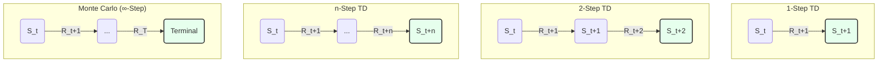
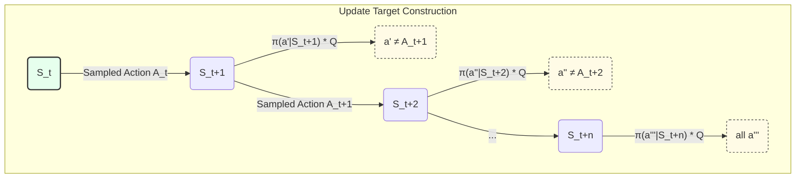

## n-Step Bootstrapping: Finding the Sweet Spot Between TD and Monte Carlo

### Part 1: The Spectrum of Learning - Beyond the Two Extremes

In our journey so far, we've met two very different kinds of model-free learners, each with its own distinct philosophy.

1.  **The Monte Carlo Learner (The Super-Patient Learner):** This agent is the ultimate purist. It completes an entire episode, from start to finish, and only then calculates the *true* final reward (`G_t`). It updates its value estimates based on this complete, real outcome. This approach is **unbiased** because it uses the real, final score, but it suffers from **high variance**. A single lucky break or a fluke mistake at the end of a long episode can dramatically swing the final score, sending a very noisy learning signal to all the states and actions that came before it.

2.  **The One-Step TD Learner (The Myopic, Impatient Learner):** This agent is the opposite. It takes a single step, collects one reward (`R_{t+1}`), and immediately updates its previous estimate using its *new guess* about the future (`V(S_{t+1})`). This is bootstrapping. This approach has **low variance** because its updates are small and based on a stable, learned estimate. However, it can be **biased**, because it's learning from a guess that might be wildly inaccurate, especially early in training.

This presents us with a classic trade-off. Do we want an accurate but noisy signal (MC), or a stable but potentially flawed one (TD)?

This begs the question: **Must we choose between these two extremes?** Is there no middle ground between waiting for the absolute end and only looking one single step ahead?

#### The Weather Forecaster Analogy

To build our intuition, let's imagine a weather forecaster trying to improve their models. Their goal is to predict the average weather for an entire week, starting from Monday.

*   **The Monte Carlo Forecaster:** On Monday, they make a prediction for the whole week. Then, they wait. On the following Sunday evening, after all seven days of weather have actually happened, they look at the complete, real data and use it to update their prediction model for what "a week starting like this Monday" looks like. This is accurate but slow, and a freak heatwave on Saturday could unfairly make them think their Monday forecast was terrible.

*   **The 1-Step TD Forecaster:** On Monday, they make a prediction for the week. On Tuesday morning, they look at what *actually* happened on Monday. They combine this single day of real data with their *new guess* for the rest of the week (Tuesday through Sunday) to immediately update their original Monday model. This is fast, but it relies heavily on another forecast, which is still just a guess.

Now, consider a more sensible approach.

*   **The n-Step Forecaster:** On Monday, they make their prediction. They wait a few days. On Thursday morning, they look at the *actual, real weather* for Monday, Tuesday, and Wednesday. This is a solid chunk of real data. They then combine this 3-day reality with their *new, updated forecast* for the rest of the week (Thursday through Sunday). They use this mix of reality and estimation to update their original Monday model.

This third approach feels more robust. It uses more real information than the 1-step method but doesn't have to wait for the entire episode to finish like the Monte Carlo method. It strikes a balance.

This is precisely the idea behind **n-step bootstrapping**. It generalizes both Monte Carlo and TD methods, turning them into two endpoints on a single spectrum. By choosing a value for `n`, we can create a "slider" or a "dial" that lets us choose exactly how many real steps of experience we want to use before we bootstrap from one of our own estimates. This gives us a powerful tool to control the bias-variance trade-off and, in many cases, learn much faster than either extreme.

### Part 2: The n-Step Return - Mixing Reality with Expectation

Now that we have the intuition, let's formalize how this "slider" works. The core of any TD method is its **update target**—the value it nudges its current estimate towards. Let's see how this target changes as we adjust `n`.

First, let's recall the targets we already know. We'll use `G` to represent the target return from a state `S_t`.

*   For **Monte Carlo**, the target is the full, actual return. It's the sum of all future discounted rewards until the episode terminates at time `T`:
    `G_t = R_{t+1} + γR_{t+2} + γ^2R_{t+3} + ... + γ^(T-t-1)R_T`
    This is 100% reality.

*   For **1-step TD**, the target is the first reward plus the *estimated* value of the next state:
    `G_{t:t+1} = R_{t+1} + γV(S_{t+1})`
    This is one step of reality (`R_{t+1}`) followed by 100% estimation (`V(S_{t+1})`).

The pattern is clear. The **n-step return** simply extends this pattern. We take `n` steps of real, observed rewards and then add the discounted *estimated* value of the state we land in after `n` steps.

The **n-step target** (`G_{t:t+n}`) is defined as:

`G_{t:t+n} = R_{t+1} + γR_{t+2} + ... + γ^(n-1)R_{t+n} + γ^n V(S_{t+n})`

This elegant formula defines the entire spectrum of algorithms:
*   If `n=1`, we get the 1-step TD target.
*   If `n` is very large (specifically, `n ≥ T-t`), the sum includes all the rewards until the end, and the `V(S_{t+n})` term becomes zero because the episode is over. This gives us the Monte Carlo target.
*   If `n` is something in between, like 2 or 5 or 10, we get a hybrid method.

This spectrum can be visualized with backup diagrams. The shaded circles are the estimates (the "guesses") we use to bootstrap.



The update rule for our state value `V(S_t)` then simply uses this new n-step target:

`V(S_t) ← V(S_t) + α * [G_{t:t+n} - V(S_t)]`

#### A Step-by-Step Example: The Advantage of a Longer View

Let's revisit our simple random walk environment to see why a longer lookahead can be so much more efficient.

```
       [Term 0] <--> A <--> B <--> C <--> D <--> E <--> [Term +1]
```

*   **Rules:** The agent moves Left or Right randomly.
*   **Rewards:** `+1` for entering the right terminal state, `0` for all other transitions.
*   **Setup:** We'll set the discount factor `γ=1` and the learning rate `α=0.1`. For simplicity, we'll initialize the value of all non-terminal states to a neutral `V(s) = 0.5`.

**An Episode Occurs:**
Imagine the agent starts in state C and has a lucky walk straight to the goal: `C → D → E → Term(+1)`.

Let's focus on the very first state, `C`. After this episode, how do we update our estimate for `V(C)`? We will look back at the experience and see what different values of `n` would tell us.

The trajectory from state `C` was:
*   `S_t = C`
*   `R_{t+1} = 0`, `S_{t+1} = D`
*   `R_{t+2} = 0`, `S_{t+2} = E`
*   `R_{t+3} = +1`, `S_{t+3} = Term(+1)` (Value is always 0)

Let's calculate the update target for `V(C)` using different `n`:

*   **1-Step Return (`n=1`)**
    *   Target `G_{t:t+1} = R_{t+1} + γV(S_{t+1}) = 0 + 1 * V(D) = 0.5`.
    *   The update would be: `V(C) ← 0.5 + 0.1 * (0.5 - 0.5) = 0.5`.
    *   **Result:** No change. The agent learned nothing about `C` because its immediate neighbor `D` still has the initial, uninformative value of 0.5.

*   **2-Step Return (`n=2`)**
    *   Target `G_{t:t+2} = R_{t+1} + γR_{t+2} + γ^2V(S_{t+2}) = 0 + 1*0 + 1^2*V(E) = 0.5`.
    *   The update would be: `V(C) ← 0.5 + 0.1 * (0.5 - 0.5) = 0.5`.
    *   **Result:** Still no change! Even looking two steps ahead only gets us to state `E`, which also has the uninformative initial value.

*   **3-Step Return (`n=3`)**
    *   Target `G_{t:t+3} = R_{t+1} + γR_{t+2} + γ^2R_{t+3} + γ^3V(S_{t+3})`
    *   Target = `0 + 1*0 + 1^2*(+1) + 1^3*V(Term) = 1 + 0 = 1`.
    *   The update would be: `V(C) ← 0.5 + 0.1 * (1 - 0.5) = 0.55`.
    *   **Result:** Success! The 3-step return was long enough to "see" the actual `+1` reward at the end of the episode. It could use this piece of *real* information to immediately update its estimate for `V(C)`, correctly identifying that `C` is more valuable than its initial guess.

This is the power of n-step methods. With 1-step TD, the reward information from the goal would have to slowly "trickle back" one state at a time over many, many episodes. But by using a larger `n`, we can propagate that credit much more rapidly, leading to significantly faster learning.

### Part 3: n-Step Control - Learning to Act with a Longer View (Revised)

So far, we've developed a powerful method for *prediction*—estimating the value of states (`V(s)`) with a flexible lookahead. But as always, prediction is only half the battle. Our ultimate goal is *control*: teaching an agent what actions to take to maximize its reward.

To do this, we need to shift our focus from state-values (`V(s)`) to action-values (`Q(s, a)`). This tells the agent how good it is to take a specific *action* from a specific *state*.

The good news is that we can apply our n-step idea directly to our on-policy control algorithm, SARSA. This gives us **n-step SARSA**. The logic is a straightforward extension of what we've just learned.

We simply redefine our n-step return in terms of Q-values. Instead of bootstrapping from the value of the state `n` steps ahead, `V(S_{t+n})`, we bootstrap from the value of the *state-action pair* `n` steps ahead, `Q(S_{t+n}, A_{t+n})`.

The **n-step SARSA target** (`G_{t:t+n}`) is:

`G_{t:t+n} = R_{t+1} + γR_{t+2} + ... + γ^(n-1)R_{t+n} + γ^n Q(S_{t+n}, A_{t+n})`

The update rule for the action-value `Q(S_t, A_t)` follows naturally:

`Q(S_t, A_t) ← Q(S_t, A_t) + α * [G_{t:t+n} - Q(S_t, A_t)]`

Notice that the target depends on `A_{t+n}`—the action the agent actually chooses `n` steps into the future according to its policy. This is why n-step SARSA is still a classic **on-policy** method. Our "cautious realist" agent is still learning the value of its own exploratory policy, but now it's doing so with a longer, more informative chunk of real-world experience. It's less myopic, but just as realistic.

#### The Power of Rapid Credit Assignment

The real magic of n-step control comes from its ability to propagate information quickly. Let's make this concrete. Imagine all `Q` values start at 0. The goal `G` gives a large reward. In its first episode, an agent happens to find the goal after a 10-step journey.

Let's represent this path abstractly:

`S₀ --(A₀)--> S₁ --(A₁)--> S₂ ... S₉ --(A₉)--> S₁₀ (Goal!)`

Here, the agent starts in state `S₀`, takes action `A₀`, gets to `S₁`, and so on, for 10 steps, finally reaching the goal at `S₁₀`.

What does each algorithm learn from this single, successful episode?

**With 1-Step SARSA:**
The algorithm updates state-action pairs one step at a time. After taking action `A₈` from state `S₈` to get to `S₉`, it then takes `A₉` and reaches the goal `S₁₀`. At this point, it uses the reward to update `Q(S₉, A₉)`. That's it. To update `Q(S₈, A₈)`, it would need another episode where it visits `S₈` and then moves to an `S₉` that *already has an improved value*. The information from the goal has to slowly "trickle back", one state at a time, over many, many episodes.

**With 10-Step SARSA:**
The algorithm's memory is much longer. Let's consider the update for the very first action, `A₀`, taken from the start state `S₀`. The 10-step algorithm collects the full sequence of 10 rewards (`R₁` through `R₁₀`) and then bootstraps from the Q-value of the state-action pair it will be in at the end, `Q(S₁₀, A₁₀)`. Because `S₁₀` is the goal, this value is directly influenced by the big reward.

This 10-step target is then used to update `Q(S₀, A₀)`. In a single stroke, the good outcome at the end of the path has directly increased the value of the very first action taken. The same logic applies to `Q(S₁, A₁)`, which uses a 9-step return, and so on. The entire path gets credit simultaneously.

Instead of a slow trickle of information, n-step learning is like a flash of lightning that illuminates the entire successful path at once. This ability to assign credit to a long chain of actions allows learning to spread through the state space much more efficiently, often resulting in a dramatic speedup in finding a good policy.

### Part 4: The Off-Policy Conundrum: Importance Sampling vs. Trees

We've successfully created a more powerful on-policy learner, n-step SARSA. It's faster and more efficient. But what about our off-policy friend, Q-learning? Can we create an n-step version of an off-policy algorithm?

This brings us to a significant challenge. The core problem is that in off-policy learning, the agent follows one policy (the exploratory *behavior* policy, `b`) while trying to learn about another (the optimal *target* policy, `π`).

Our first instinct might be to do what Q-learning does: take `n` real steps according to our behavior policy `b`, and then use the `max` operation at the end to stand in for the optimal policy `π`.

But this is not enough. The `max` operation only accounts for the decision at the *end* of the n-step sequence. It doesn't account for the `n-1` actions *in the middle* of the path, which were chosen by our exploratory policy `b`, not the optimal policy `π` we want to learn about. The path itself is "off-policy."

To solve this, we need a way to learn from an n-step trajectory generated by one policy while evaluating it according to another. There are two main approaches to this problem.

#### Approach 1: The Correction Factor (Importance Sampling)

The first approach is to ask: "How likely was this n-step journey to have happened under my target policy?" We can then use this likelihood to "correct" our update. This is done using **importance sampling**.

The idea is to calculate a weight for the entire n-step sequence. This weight, called the **importance sampling ratio (`ρ`)**, is the product of the relative probabilities of taking each action along the path.

`ρ_{t:t+n-1} = Π [ π(A_k | S_k) / b(A_k | S_k) ]` from `k=t` to `t+n-1`

Let's break this down:
*   `π(A_k | S_k)` is the probability that our **target** policy (e.g., greedy) would have taken action `A_k`.
*   `b(A_k | S_k)` is the probability that our **behavior** policy (e.g., ε-greedy) actually took action `A_k`.

We calculate this ratio for every step in our n-step window and multiply them all together.
*   If at any point our agent took an exploratory action that the greedy target policy would *never* take (`π(A_k | S_k) = 0`), the entire ratio `ρ` becomes 0. The experience is discarded, as it's irrelevant to the optimal policy.
*   We then simply multiply our n-step return by this ratio `ρ` before performing the update.

**The Downside:** While correct in theory, this approach can be very unstable. If the behavior policy takes a rare exploratory action (a very small `b(A|S)`), the ratio can explode, leading to updates with extremely **high variance**. A single, unlikely event can cause a massive, destabilizing swing in the Q-values, often slowing learning down to a crawl.

#### Approach 2: The Elegant Alternative (Tree Backup)

If correcting for the "wrong" path is so volatile, what if we could avoid the problem altogether? This is the beautiful idea behind the **Tree-Backup Algorithm**.

Instead of sampling an entire n-step path and then correcting it, the Tree-Backup algorithm mixes real samples with estimated expectations at *every single step*.

The best way to understand this is with its backup diagram.


*The diagram shows a 3-step example. The solid path is the "spine" of actions that were actually taken. The dashed "ribs" are the expected values for all the other actions that were not taken.*

Here is how it works:
1.  We start at `S_t` and take action `A_t`. This is our sample.
2.  We land in `S_{t+1}`. To form our update target, we don't just follow the next sampled action `A_{t+1}`. Instead, we do two things:
    *   We follow the branch for the action we **actually took**, `A_{t+1}`.
    *   For **all other actions** `a'` that we *didn't* take, we add their estimated values (`Q(S_{t+1}, a')`) to the target, weighted by the probability that the *target policy* `π` would have taken them.
3.  We repeat this process for `n` steps. At each state, we follow the single branch of what really happened, and we mix in the estimated values of all the other things that *could have* happened.

The final update target is a "tree" of possibilities, branching at every state. It is composed of a single path of real rewards from sampled actions, but it's constantly being blended with the expected values of the actions we didn't take.

**The Takeaway:** The Tree-Backup algorithm is a full n-step off-policy method that **completely avoids importance sampling ratios**. By mixing samples and expectations, it constructs a low-variance target. This makes it much more stable and often more data-efficient than methods that rely on correction factors. It's a different, and often better, way to solve the off-policy learning puzzle.

### Part 5: The Road Ahead - A Unified View and What's Next

In this chapter, we have bridged the gap between the two extremes of model-free learning. By introducing the concept of the **n-step return**, we've shown that Monte Carlo and 1-step TD are not fundamentally different algorithms, but are instead two points on a continuous spectrum.

Let's recap our journey:
*   We started by identifying the **bias-variance trade-off**. MC has high variance and no bias; 1-step TD has low variance but is biased by its own estimates.
*   We introduced the **n-step return** as a "slider" to control this trade-off, mixing `n` steps of real rewards with a single bootstrapped estimate.
*   We extended this idea to control with **n-step SARSA**, showing how a longer lookahead can dramatically speed up credit assignment and policy learning.
*   Finally, we tackled the difficult problem of **n-step off-policy learning**. We contrasted two powerful approaches: weighting trajectories with **Importance Sampling**, and building a mixed target with the **Tree-Backup** algorithm.

This exploration has equipped us with a much more flexible and powerful toolkit. In many practical problems, the best performance isn't found at the extremes of `n=1` or `n=∞`, but somewhere in the middle.

But as we stand at this new peak, a larger challenge comes into view. It's a limitation that has been the silent partner to *all* of our methods so far—from Monte Carlo to TD to n-step.

#### The Elephant in the Room: The Lookup Table

Every algorithm we have built shares a fundamental assumption: that we can store our `V(s)` or `Q(s, a)` values in a big table, with one entry for every single state or state-action pair.

This is fine for small worlds like grid puzzles or tic-tac-toe. But what about real problems?
*   **Chess:** Has an estimated `10^47` states.
*   **Go:** Has more states than atoms in the known universe (`>10^170`).
*   **Robotics:** A robot arm with continuous joint angles has an *infinite* number of states.
*   **Video Games:** Controlling an agent from pixel data means each screen is a state. The number of possible screens is astronomical.

This is the **scaling problem**. The lookup table approach, the very foundation of our methods, is completely non-viable for almost any problem of real-world interest. This is the Achilles' heel of the tabular approach.

This forces us to ask the most important question on our journey so far: **How can an agent make good decisions in states it has never seen before?**

The answer is that it must **generalize**. It needs to learn a compact representation of value that covers unseen states based on their similarity to states it has experienced. To do this, we must throw away the lookup table and replace it with something far more powerful: a **function approximator**.

Instead of storing a value for `V(S_t)`, we will learn the *parameters* (or weights `**w**`) of a function `v̂(s, **w**)` that can *estimate* that value. This could be a simple linear function or a complex neural network.

This is the next great leap in our journey—the move from tabular methods to approximate solution methods. It is the bridge from solving toy problems to tackling the immense complexity of the real world.