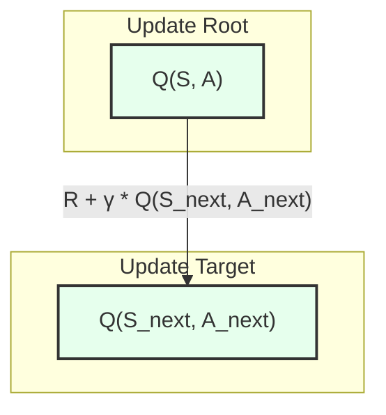
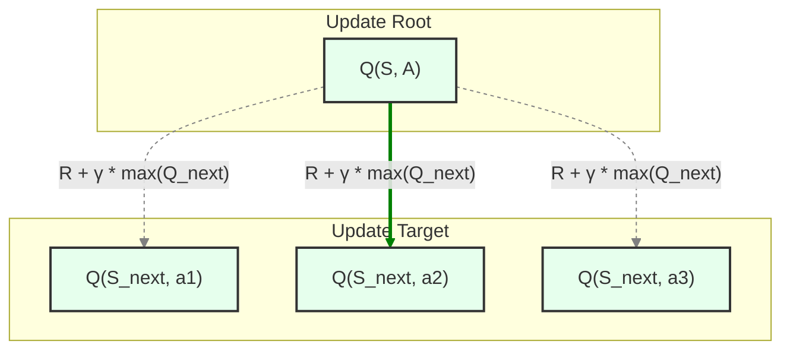

## Temporal-Difference (TD) Learning: Learning from Every Step

### Part 1: The Impatient Learner - A Better Way than Waiting

In the last chapter, we took a massive leap forward with Monte Carlo (MC) methods. We threw away the "map"—the model of the environment—and learned to find the best path simply by running the race over and over and averaging the final scores. This was our first taste of true model-free learning, a powerful approach that learns from raw experience.

However, the Monte Carlo agent has one peculiar trait: it's incredibly patient. It must wait until the entire race is over, from start to finish, before it can sit down, look at its final score, and learn anything at all from the experience.

> **Analogy:** Imagine you're learning to play a long game of chess. On move 5, you make a brilliant play that sets you up for victory. But on move 40, you make a simple, foolish blunder and lose the game.
>
> The Monte Carlo agent sees only the final outcome: "Loss." It then goes back and marks *every single move* it made—including the brilliant one on move 5—as being part of a losing strategy. It fails to give immediate credit to good moves or immediate blame to bad ones. It has to wait for the final outcome, which can be a very noisy and inefficient signal.

This delay is a huge drawback. In many real-world problems, episodes can be very long (like a full game of Go) or may never end at all (like a robot managing a datacenter). Waiting for the end is either too slow or completely impossible. This begs the question: Can we do better? Can we learn from our mistakes *as we make them*?

#### Learning from the Journey, Not Just the Destination

Let's revisit the simple task of predicting your drive home from work.

**The Monte Carlo Approach (The Patient Learner):**
1.  You leave your office and look at the clock. "Okay, based on my past 100 trips, I predict this will take **30 minutes**."
2.  You drive home. You hit some unexpected traffic, get stuck behind a slow truck, and finally arrive at your door.
3.  You check the clock. The trip actually took **43 minutes**.
4.  **Learning:** You open your notebook. "My prediction from the start state ('at the office') was 30 minutes, but the actual outcome was 43. My estimate was too low." You nudge your estimate for 'at the office' up a little. The learning only happens *after* the journey is complete.

This works, but it feels unnatural. We humans don't learn like that. Let's consider a more realistic approach.

**The Temporal-Difference Approach (The Impatient Learner):**
1.  You leave your office. "I predict this will take **30 minutes**."
2.  Five minutes later, you reach your car and notice it has started to rain heavily. You know rain slows down traffic. You don't need to wait 40 more minutes to know your initial prediction is in trouble. You update your belief *right now*.
3.  **Learning, Step 1:** "Okay, from *this* new state ('in the car, in the rain'), I predict it will take another **35 minutes**." You've just formed a new, better prediction based on new information. Your new estimate of the total time is `5 (elapsed) + 35 (new prediction) = 40 minutes`.
4.  You can now immediately compare your old prediction to your new one. You originally thought that being at the office (5 minutes ago) would lead to a 30-minute trip. But now, after one step, you believe it will lead to a 40-minute trip. Your initial estimate was too optimistic. You can use this difference—this **Temporal Difference**—to update your value for the 'at the office' state *immediately*.

This is the central idea of **Temporal-Difference (TD) Learning**. Instead of waiting for the final outcome (`G_t`), we take one step, observe the immediate reward (`R_{t+1}`), and look at the value of the state we land in (`V(S_{t+1})`). We use this new, slightly-more-informed value to update our old estimate.

TD learning is a combination of the best parts of our previous methods:
*   Like Monte Carlo, it learns directly from raw experience, with **no model** of the environment.
*   Like Dynamic Programming, it updates its value estimates based on other learned estimates (a process called **bootstrapping**). It learns step-by-step.

It's a model-free learner that can learn from every single step of the journey, without waiting to see the destination. Now, let's explore the mechanics of how this impatient learner actually works.


### Part 2: The Core of TD - Learning a Guess from a Guess

So, how does this "impatient learner" work? The secret lies in a concept called **bootstrapping**. It sounds complicated, but the idea is simple: **we update our guess using our other guesses.** Instead of waiting for the real, final outcome, we use our current best guess about the future to improve our current guess about the present.

Let's break down the exact calculation. Remember the Monte Carlo update rule:

`V(S_t) ← V(S_t) + α * [G_t - V(S_t)]`

Here, the agent updates its value for the current state, `V(S_t)`, by nudging it towards the **MC Target**: `G_t`, which is the *actual* total reward from that point until the end of the episode. To get `G_t`, you have to wait until the end.

The Temporal-Difference method, specifically the simplest version called **TD(0)**, uses a sneaky and brilliant substitute for `G_t`. The update rule looks like this:

`V(S_t) ← V(S_t) + α * [R_{t+1} + γV(S_{t+1}) - V(S_t)]`

Let's dissect the part in the brackets. This is the heart of TD learning.
*   `R_{t+1}`: The immediate reward you just received for taking a step. This is a piece of real, concrete information.
*   `γV(S_{t+1})`: The discounted value of the *next* state. This is the "bootstrapped" part—it's not a real outcome, it's our *current estimate* of what the future looks like from our new position.

The combination of these two, `R_{t+1} + γV(S_{t+1})`, is called the **TD Target**. It's the agent's new, slightly-more-informed estimate of the value of being in `S_t`.

The entire term `[R_{t+1} + γV(S_{t+1}) - V(S_t)]` is called the **TD Error (`δ_t`)**. It captures the difference between our old estimate (`V(S_t)`) and our new, better estimate (the TD Target). The agent uses this error signal to update its old value, learning from the discrepancy.

#### A Step-by-Step Example: The Simplified Walk

Let's make this concrete with a simpler problem. Imagine an agent on a line with just 3 non-terminal states (A, B, C).

```
       [Term 0] <--> A <--> B <--> C <--> [Term +1]
                            ^
                          Start
```

*   **Rules:** The episode starts in state **B**. The agent moves Left or Right with 50% probability.
*   **Rewards:** Stepping off the left end gives a reward of **0**. Stepping off the right end gives **+1**. All other steps give a reward of **0**. We'll set `γ=1`.
*   **True Values:** The true value of each state is its probability of reaching the `+1` goal. In this simplified world, the true values are:
    *   `v(A) = 0.25`
    *   `v(B) = 0.5`
    *   `v(C) = 0.75`

Let's watch how TD(0) learns. We'll initialize the value of every state to a neutral guess of `V(s) = 0.5`. We'll use a learning rate `α = 0.1`.

---

**Initial State of Knowledge:**
*   `V(A) = 0.5`
*   `V(B) = 0.5`
*   `V(C) = 0.5`

**Episode 1: A short, unlucky walk**

The episode trajectory is: `B → A → Term(0)`

1.  **Step 1: B → A**
    *   The agent is at `S_t=B`, moves to `S_{t+1}=A`. Reward `R=0`.
    *   TD Error `δ = [R + V(A)] - V(B) = [0 + 0.5] - 0.5 = 0`.
    *   The values for A and B are the same, so there's no "surprise" and no update.

2.  **Step 2: A → Term(0)**
    *   The agent is at `S_t=A`, moves to the terminal state. Reward `R=0`.
    *   The value of a terminal state is always 0. `V(Term(0)) = 0`.
    *   TD Error `δ = [R + V(Term(0))] - V(A) = [0 + 0] - 0.5 = -0.5`.
    *   **Update `V(A)`:** `V(A) ← V(A) + α*δ = 0.5 + 0.1*(-0.5) = 0.45`.

**Knowledge after Episode 1:**
*   `V(A) = 0.45`
*   `V(B) = 0.5`
*   `V(C) = 0.5`

---

**Episode 2: A short, lucky walk**

The episode trajectory is: `B → C → Term(+1)`

1.  **Step 1: B → C**
    *   `S_t=B`, `S_{t+1}=C`. Reward `R=0`.
    *   TD Error `δ = [R + V(C)] - V(B) = [0 + 0.5] - 0.5 = 0`.
    *   No update yet.

2.  **Step 2: C → Term(+1)**
    *   `S_t=C`, moves to terminal state. Reward `R=+1`.
    *   Value of terminal state is `V(Term(+1))=0`.
    *   TD Error `δ = [R + V(Term(+1))] - V(C) = [1 + 0] - 0.5 = 0.5`.
    *   **Update `V(C)`:** `V(C) ← V(C) + α*δ = 0.5 + 0.1*(0.5) = 0.55`.

**Knowledge after Episode 2:**
*   `V(A) = 0.45`
*   `V(B) = 0.5`
*   `V(C) = 0.55`

---

**Episode 3: A more interesting walk**

Now we see the magic. The agent has learned that A is a bit worse than expected and C is a bit better. Let's see how that affects its estimate for B.

The episode trajectory is: `B → C → B → A → Term(0)`

1.  **Step 1: B → C**
    *   `S_t=B`, `S_{t+1}=C`. Reward `R=0`.
    *   TD Error `δ = [R + V(C)] - V(B) = [0 + 0.55] - 0.5 = 0.05`.
    *   **Update `V(B)`:** `V(B) ← V(B) + α*δ = 0.5 + 0.1*(0.05) = 0.505`.
    *   **This is the key moment!** The agent updated its value for `B` *mid-episode*. It didn't wait for the final outcome. It used its new, slightly-more-accurate guess for `C` (`0.55`) to improve its guess for `B`. This is bootstrapping in action.

2.  **Step 2: C → B**
    *   `S_t=C`, `S_{t+1}=B`. Reward `R=0`.
    *   TD Error `δ = [R + V(B)] - V(C) = [0 + 0.505] - 0.55 = -0.045`.
    *   **Update `V(C)`:** `V(C) ← V(C) + α*δ = 0.55 + 0.1*(-0.045) = 0.5455`.

3.  **Step 3: B → A**
    *   `S_t=B`, `S_{t+1}=A`. Reward `R=0`.
    *   TD Error `δ = [R + V(A)] - V(B) = [0 + 0.45] - 0.505 = -0.055`.
    *   **Update `V(B)`:** `V(B) ← V(B) + α*δ = 0.505 + 0.1*(-0.055) = 0.4995`.

4.  **Step 4: A → Term(0)**
    *   `S_t=A`, `S_{t+1}=Term(0)`. Reward `R=0`.
    *   TD Error `δ = [R + V(Term(0))] - V(A) = [0 + 0] - 0.45 = -0.45`.
    *   **Update `V(A)`:** `V(A) ← V(A) + α*δ = 0.45 + 0.1*(-0.45) = 0.405`.

**Knowledge after Episode 3:**
*   `V(A) = 0.405` (Moving closer to true value of 0.25)
*   `V(B) = 0.4995` 
*   `V(C) = 0.5455` (Moving closer to true value of 0.75)

Notice how the information from the terminal states is slowly "trickling back" through the state-space, one step at a time. This ability to learn from every single step makes TD learning dramatically more efficient than Monte Carlo. It is the engine that will drive our more advanced control algorithms.

### Part 3: On-Policy Control - The Cautious Realist (SARSA)

In the last part, we developed a powerful new method, TD(0), for *predicting* the value of states. After running many episodes, our agent can accurately estimate how good it is to be in state A, B, or C.

This is great, but it leads us back to a familiar problem: **So what?**

Knowing that state C is more valuable than state A is useful, but it doesn't directly tell the agent what to *do* when it's in state B. To improve its policy, the agent needs to know the value of taking a specific *action* from a state. As we learned in the Monte Carlo chapter, we need to shift our focus from state-values (`V(s)`) to action-values (`Q(s,a)`).

The great news is that we can apply the exact same TD learning trick to learn Q-values. Instead of learning about transitions from state to state, we'll learn about transitions from one **state-action pair** to the next.

This brings us to our first TD-based control algorithm. It has a slightly unusual name that perfectly describes how it works: **SARSA**.

#### What's in a Name?

The name SARSA comes from the five pieces of information the agent needs to perform a single update. It's the entire sequence of events that occurs in one step of the environment:

1.  You are in a State (`S_t`).
2.  You choose an Action (`A_t`).
3.  The environment gives you a Reward (`R_{t+1}`).
4.  You end up in a new State (`S_{t+1}`).
5.  You then choose your *next* Action (`A_{t+1}`).

This quintuple of experience, `(S_t, A_t, R_{t+1}, S_{t+1}, A_{t+1})`, is all SARSA needs to learn.

The update rule is a direct adaptation of the TD(0) rule for Q-values. We simply replace every `V(s)` with `Q(s,a)`:

`Q(S_t, A_t) ← Q(S_t, A_t) + α * [R_{t+1} + γQ(S_{t+1}, A_{t+1}) - Q(S_t, A_t)]`

The TD Target is now `R_{t+1} + γQ(S_{t+1}, A_{t+1})`. We are updating the value of the *previous* action based on the reward we just got and the value of the *next* action we decide to take.

#### The Cautious Realist: Why SARSA is "On-Policy"

Look closely at that update rule. To calculate the TD Target, the algorithm needs to know `A_{t+1}`—the actual action that will be taken from the next state. This is a crucial detail. It means that the Q-values SARSA learns are directly influenced by the policy the agent is currently following.

If the agent is following an `ε-greedy` policy (where it mostly picks the best action but sometimes explores randomly), the Q-values will reflect this reality. For example, if taking a "risky" optimal action sometimes leads to an exploratory move that results in a huge negative reward, that negative outcome will be factored into the Q-value for the "risky" action.

This is why SARSA is called an **on-policy** algorithm. It learns the value of its actions *while accounting for its own current policy*. It's a "realist"—it learns how good its actions are, given the fact that it will continue to be a little bit random and exploratory in the future. It finds the best way to behave *given* its own cautious, exploratory nature.

Here is what the SARSA update looks like as a backup diagram. It's a simple, linear chain from one state-action pair to the next.



SARSA provides a solid and stable way to learn, but its realism can sometimes be a limitation. What if we don't want to account for our exploration? What if we want to learn the true optimal path, no matter what our current behavior looks like? For that, we need to be a little more optimistic.

### Part 4: Off-Policy Control - The Bold Optimist (Q-Learning)

SARSA is a fantastic algorithm, but its "realism" has a downside. By learning the value of a policy that includes exploration, it can be overly cautious. It might avoid a path with a very high reward simply because there's a small chance an exploratory move could lead to a bad outcome.

This leads to a powerful question: Can we separate the act of exploration from the act of learning? Can our agent behave cautiously (to discover new things) but learn about the true, optimal, greedy policy (as if it weren't exploring at all)?

The answer is yes, and it comes from one of the most important breakthroughs in all of reinforcement learning: **Q-learning**.

#### The Optimistic Update

Q-learning is an **off-policy** algorithm. It improves a different policy than the one it uses to act. Specifically, it improves the optimal, greedy policy while using an exploratory policy (like `ε-greedy`) to make sure it sees enough of the world.

The change required to do this is remarkably small, but its implications are profound. Look at the Q-learning update rule:

`Q(S_t, A_t) ← Q(S_t, A_t) + α * [R_{t+1} + γ * max_a Q(S_{t+1}, a) - Q(S_t, A_t)]`

The TD Target is now `R_{t+1} + γ * max_a Q(S_{t+1}, a)`.

Let's compare this directly to the SARSA target:
*   **SARSA Target:** `R_{t+1} + γ * Q(S_{t+1}, **A_{t+1}**)`
*   **Q-learning Target:** `R_{t+1} + γ * **max_a** Q(S_{t+1}, a)`

The difference is subtle but critical. SARSA uses the value of the *actual* next action, `A_{t+1}`, that its policy chose. Q-learning, on the other hand, doesn't care what action it will actually take next. It looks at all possible actions `a` from the next state `S_{t+1}` and uses the value of the **best possible action** (`max_a Q`).

This makes Q-learning a "bold optimist." When it updates the value of `Q(S, A)`, it does so under the assumption that from now on, it's only going to follow the perfect, greedy policy. It completely ignores the fact that its `ε-greedy` behavior policy might actually take a "sub-optimal" exploratory action from state `S_{t+1}`. It learns about the value of perfection, even while behaving imperfectly.

The backup diagram for Q-learning reflects this `max` operation. Instead of a simple chain, it looks at all possible next actions and takes the best one as the target.


*(The solid green arrow indicates that the update is based on the maximum value among all possible next actions.)*

This separation between behavior and learning is a cornerstone of advanced reinforcement learning. But which approach is better? The cautious realist or the bold optimist? To find out, we need to see them in action on a problem where their philosophies will lead to different outcomes.

### Part 5: The Showdown - SARSA vs. Q-Learning in the "Cliff Walking" World

We now have two powerful TD control algorithms: SARSA, the on-policy realist, and Q-learning, the off-policy optimist. To truly understand the difference, we need a test case where their worldviews will lead them to fundamentally different solutions. The classic "Cliff Walking" problem is perfect for this.

#### The Environment

Imagine a grid world where an agent must travel from a start square (`S`) to a goal square (`G`).

```
       +---+---+---+---+---+---+---+---+---+---+---+---+
       |   |   |   |   |   |   |   |   |   |   |   |   |  <-- Top Row (Safe)
       +---+---+---+---+---+---+---+---+---+---+---+---+
       |   |   |   |   |   |   |   |   |   |   |   | G |  <-- Middle Row (Risky)
       +---+---+---+---+---+---+---+---+---+---+---+---+
       | S | C | C | C | C | C | C | C | C | C | C | C |  <-- Bottom Row (The Cliff)
       +---+---+---+---+---+---+---+---+---+---+---+---+
```
*   **Actions:** The agent can move `Up` (^), `Down` (v), `Left` (<), or `Right` (>).
*   **Rewards:** Every single move costs a little bit, giving a reward of **-1**.
*   **The Catch:** The bottom row `C` is a cliff. If the agent steps into the cliff, it gets a reward of **-100** and is sent back to `S`.

There are two main strategies:
1.  **The Safe Strategy:** Go up to the top row, move all the way across, and then come down to the goal. This path is longer, resulting in a total reward of -13.
2.  **The Optimal Strategy:** Go up to the middle row and walk directly along the edge of the cliff. This path is the shortest possible, resulting in a total reward of -11. However, it's incredibly risky.

With our `ε-greedy` policy, an agent following the risky path might randomly choose to move `Down`, plunging off the cliff. Let's see how our two agents handle this trade-off.

#### The Results: Two Very Different Solutions

**1. The Q-learning Agent (The Bold Optimist)**

The Q-learning agent's `max` operator makes it focus on the highest-reward potential, ignoring the risks of exploration. It learns the Q-values for the truly optimal path, as if it would never make a mistake.

*   **Conclusion:** Q-learning determines that the shortest path along the cliff edge is best. While this policy is technically optimal, an agent following it *with exploration* will perform poorly, frequently falling off the cliff and getting a huge penalty.

**The Learned Q-Learning Policy (Optimal but Risky):**
*The arrows show the best action to take from each square according to the learned policy.*
```
       +---+---+---+---+---+---+---+---+---+---+---+---+
       |   |   |   |   |   |   |   |   |   |   |   |   |
       +---+---+---+---+---+---+---+---+---+---+---+---+
       | ^ | > | > | > | > | > | > | > | > | > | > | G |
       +---+---+---+---+---+---+---+---+---+---+---+---+
       | ^ | C | C | C | C | C | C | C | C | C | C | C |
       +---+---+---+---+---+---+---+---+---+---+---+---+
```

**2. The SARSA Agent (The Cautious Realist)**

The SARSA agent learns from its actual experience, including the disastrous outcomes of its exploratory moves. The Q-values for the risky path get "polluted" by the `-100` penalty every time it accidentally steps off the cliff.

*   **Conclusion:** SARSA learns that the path along the cliff is far too dangerous *for an agent that explores*. It finds a policy that is objectively worse in a perfect world, but much safer and more effective in reality. It chooses the longer path through the top row to avoid the cliff entirely.

**The Learned SARSA Policy (Sub-optimal but Safe):**
```
       +---+---+---+---+---+---+---+---+---+---+---+---+
       | > | > | > | > | > | > | > | > | > | > | > | v |
       +---+---+---+---+---+---+---+---+---+---+---+---+
       | ^ |   |   |   |   |   |   |   |   |   |   | G |
       +---+---+---+---+---+---+---+---+---+---+---+---+
       | ^ | C | C | C | C | C | C | C | C | C | C | C |
       +---+---+---+---+---+---+---+---+---+---+---+---+
```
*(Note: For the SARSA policy, the agent learns to avoid the middle row entirely. Once it gets to the top row, it stays there until the end.)*

#### The Takeaway

This example perfectly illustrates the on-policy vs. off-policy distinction:
*   **Q-learning** answers the question: "What is the value of the truly optimal policy, ignoring any exploration I might be doing?" It finds the best path, but can be unstable during learning if exploration is costly.
*   **SARSA** answers the question: "What is the value of my current policy, including the cost of my exploration?" It finds the best way to behave *given* that it will continue to explore.

Neither is strictly "better." They are two different tools for two different jobs. Understanding this distinction is a crucial step towards mastering reinforcement learning.

### Part 6: The Road Ahead - Beyond One-Step Decisions

We've made a tremendous leap in this chapter. We moved from the patient Monte Carlo methods, which learn only at the end of an episode, to the far more agile Temporal-Difference (TD) methods. This was a critical step, giving us algorithms that are:
*   **Model-Free:** They don't need a map or a rulebook.
*   **Online:** They learn from every single step, as it happens.
*   **Grounded in Bootstrapping:** They learn a "guess from a guess," allowing them to improve their predictions without waiting for the final outcome.

We saw this core idea manifest in two powerful control algorithms: SARSA, the on-policy realist, and Q-learning, the off-policy optimist. The "Cliff Walking" example showed just how different their learned behaviors can be.

But every new solution reveals new questions. Our TD methods are powerful, but they are also "myopic"—they only look one single step into the future to update their estimates. This brings us to a new crossroads.

#### The Myopia Problem: A New Crossroads

We have now explored two extremes for model-free learning:

1.  **Monte Carlo (The Patient Learner):** At one end, we have MC methods that wait for the *true* final return `G_t`. This estimate of the value is **unbiased** (it's the real outcome), but it can have **high variance**. A single lucky or unlucky action late in the game can dramatically swing the final score, sending a noisy signal to all the moves that came before.

2.  **TD(0) (The Impatient Learner):** At the other end, we have our one-step TD methods, which update based on the *estimated* value `R_{t+1} + γV(S_{t+1})`. This update has **low variance** because it's based on a single, stable step. However, it can be **biased**, as it relies on a `V(S_{t+1})` estimate that might be inaccurate, especially early in training.

This is a classic trade-off. Do we prefer an accurate but noisy signal, or a stable but potentially biased one?

#### The First Path Forward: Finding the Middle Ground

This trade-off naturally leads to our next question: **"Must we choose between these two extremes?"** What if we could look more than one step ahead, but not wait until the very end? The next logical step in our journey is to explore ways to unify Monte Carlo and TD learning. We can create algorithms that have a "slider," allowing us to tune them to look `n` steps into the future. This gives us a crucial knob to control the bias-variance trade-off and often leads to much faster learning.

#### The Second Path Forward: Learning Smarter, Not Harder

There's another way to improve our agent's efficiency. Right now, our agent is purely reactive. It takes one step in the real world to get one piece of experience. If real-world experience is slow, expensive, or dangerous, this is not ideal.

This leads to another fascinating question: **"What if the agent could *think* between moves?"** Could it use its past experiences to build a small, internal "map" or model of the world? It could then use this model to "imagine" or "plan" future trajectories, learning from these simulated experiences without having to take costly steps in the real world. Integrating this kind of **planning** with direct learning is another powerful way to accelerate our agent's progress.

#### The Ultimate Destination: The Scaling Problem

Finally, it's important to remember the big picture. All the methods we've discussed so far—MC, TD, and their more advanced variants—still share a fundamental assumption: that we can store our `V(s)` or `Q(s,a)` values in a big lookup table.

This is fine for small worlds like grid puzzles, but it's impossible for complex problems like Chess, Go, or controlling a robot from video input, where the number of possible states is astronomically large. This is the scaling problem, and solving it is the ultimate goal. The solution will require us to replace our lookup tables with powerful **Function Approximators**, like neural networks, that can generalize from a few experiences to all possible situations.

Our journey through TD learning has given us the fundamental engine. In the tutorials ahead, we will upgrade it, refine it, and ultimately scale it to solve truly monumental challenges.