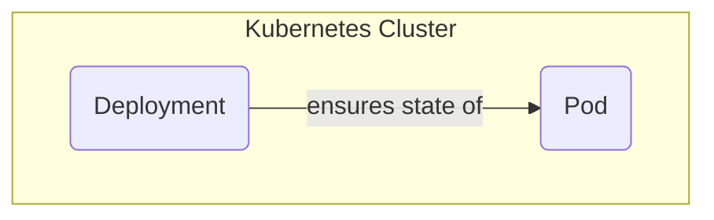
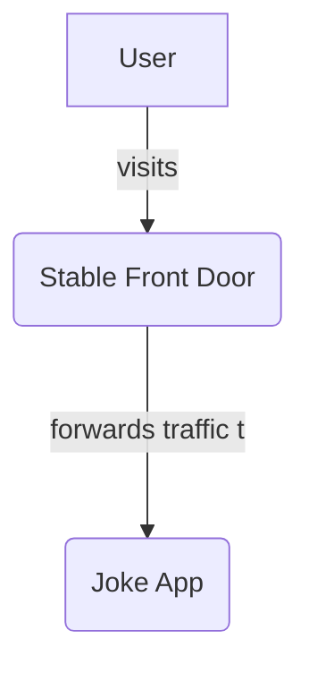
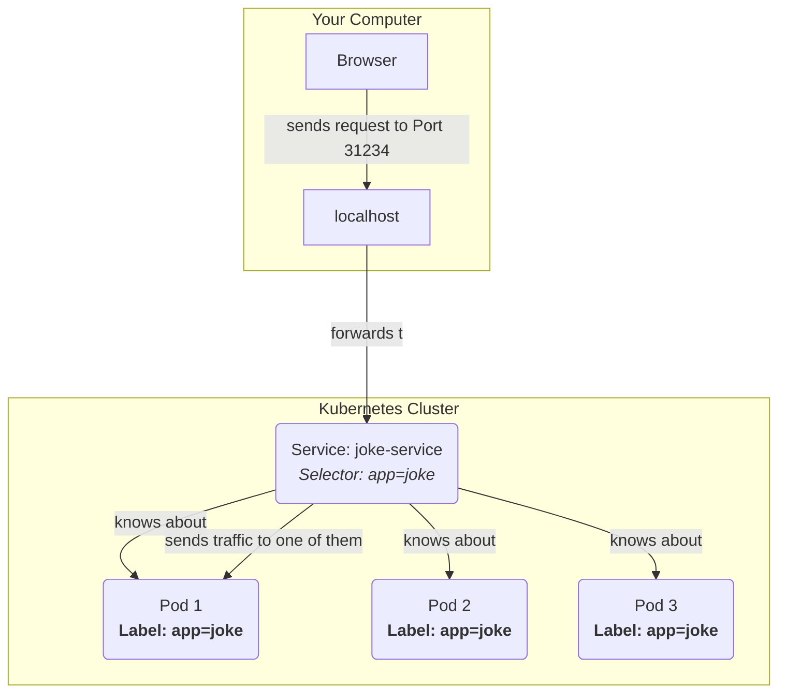
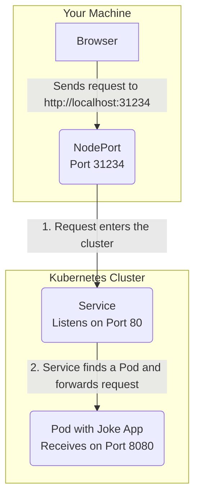
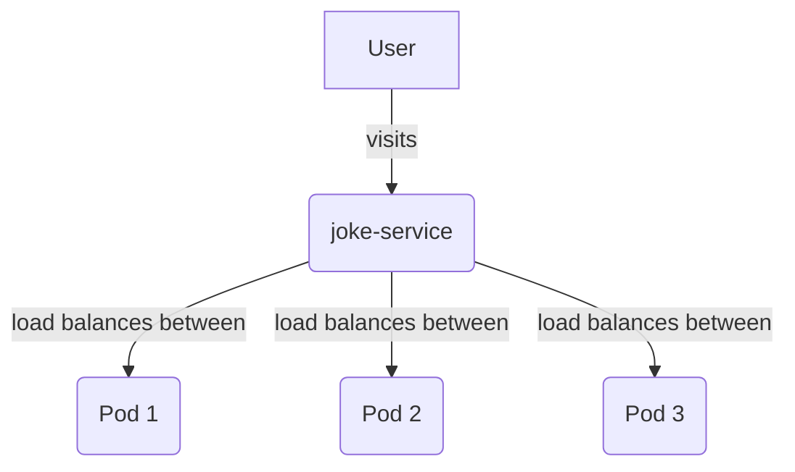
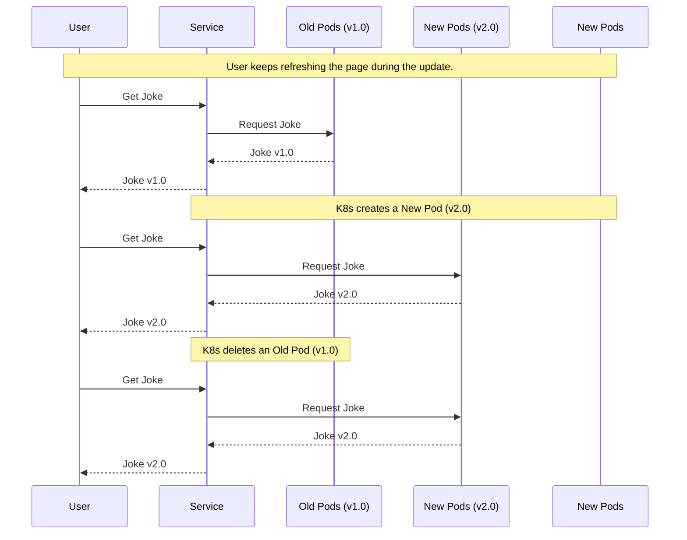

# Kubernetes Explained with a Joke App

## **Introduction: The 40-Minute Promise**

You've seen the symbols and heard the terms: **Pods**, the **`kubectl`** command, **YAML files**, **Deployments**, and **Services**. These are not just abstract buzzwords; they are the fundamental tools for running reliable, scalable software in the modern world. They answer the critical questions: What happens if my app crashes? How do I handle a sudden surge in traffic? How can I update my code without any downtime?

This tutorial is designed to answer those questions. We will demystify Kubernetes by using it to solve real-world problems for an application so simple it's almost silly: **The Joke App**. Seriously. It's a tiny web server whose only job is to tell you a random joke from a list.

**The Promise:** In the next 40 minutes, you will take this simple Python script and transform it into a robust, self-healing, and scalable service. We will not just learn the concepts; we will see them in action, solving one concrete problem at a time.

This table contains the core vocabulary of any Kubernetes professional. By the end of this tutorial, you will have a practical, hands-on understanding of every single term.

**The Kubernetes Toolkit You Will Master**

| Concept | What It Is | Why It Matters (The Problem It Solves) |
| :--- | :--- | :--- |
| **Declarative Configuration** | Defining *what* you want in a file. | You specify the "end result," not the steps. This is simple and repeatable. |
| **Pods** | The smallest running unit; a wrapper for your container. | The basic building block that Kubernetes manages. |
| **Deployments** | A manager that ensures your Pods are always running. | **Self-Healing:** Automatically replaces crashed or failed Pods. |
| **Services** | A stable, single "front door" for your application. | Provides a reliable network address so users can always find your app. |
| **Horizontal Scaling** | Increasing the number of running Pods (`replicas`). | Instantly handle more traffic by adding more copies of your app. |
| **Zero-Downtime Rolling Updates** | A strategy for updating your app one Pod at a time. | Deploy new code or features without ever interrupting users. |

By the end, you will understand that Kubernetes is not magic. It is a powerful system for maintaining a **desired state**, and you will have the skills to define and manage that state for yourself. Let's begin.

## **Section 1: The Problem - An App on a Laptop Isn't a Service**

Let's start with our application: **The Joke App**. Its only job is to show a random joke on a webpage.

Create a folder named `joke-app` and place these three files inside.

**The Application Code (`app.py`)**
```python
# app.py
import random
import socket
from flask import Flask

app = Flask(__name__)

# A simple list of completely neutral jokes.
JOKES = [
    "What has an eye, but cannot see? A needle.",
    "What kind of tree fits in your hand? A palm tree.",
    "What gets wet while drying? A towel.",
    "Why can't a bicycle stand on its own? It's two tired.",
]

@app.route("/")
def tell_a_joke():
    joke = random.choice(JOKES)
    hostname = socket.gethostname()
    return f"{joke}\n(Served by: {hostname})\n"

if __name__ == "__main__":
    app.run(host='0.0.0.0', port=8080)
```

**Test the app locally:**
```bash
python app.py
```

In another terminal, query it:
```bash
curl http://localhost:8080
```

Output:
```
What gets wet while drying? A towel.
(Served by: my-laptop)
```

#### The Problem: Why This Isn't Enough

Running this on your laptop is fine, but it is not a real service. We face several immediate problems:

1.  **Inconsistent Environments:** It works on your machine, but crashes on a server that has a different version of Python or Flask.
2.  **Not Portable:** To share it, you have to send code and a list of manual setup steps. This is slow and prone to errors.
3.  **No Isolation:** Your app might need a library version that conflicts with another app running on the same machine.

#### The Solution: The Container

A **container** solves this by packaging the application *and its entire environment* (Python, Flask, etc.) into a single, isolated box. Think of it as a lightweight, disposable virtual computer designed to run one specific task.

**The Container Blueprint (`Dockerfile`)**
This is the recipe for packaging our app.
```dockerfile
# Start from a standard Python 3 environment
FROM python:3

# Set the working directory inside the container
WORKDIR /app

# Install Flask
RUN pip install Flask

# Copy our application code into the container
COPY . .

# The command to run when the container starts
CMD ["python", "app.py"]
```

**Action: Build the Container Image**
This command reads the `Dockerfile` and builds our "box". (Requires Docker Desktop).

*   **Input:** Your `joke-app` folder.
*   **Command:**
    ```bash
    docker build -t joke-app:1.0 .
    ```
*   **Output:**
    ```
    [+] Building 2.3s (9/9) FINISHED
    => [1/4] FROM docker.io/library/python:3
    => [2/4] WORKDIR /app
    => [3/4] RUN pip install Flask
    => [4/4] COPY . .
    => exporting to image
    => => naming to docker.io/library/joke-app:1.0
    ```

**Action: Run the Container**
This command starts the application inside its isolated box.

*   **Input:** The `joke-app:1.0` image.
*   **Command:**
    ```bash
    docker run -p 8080:8080 joke-app:1.0
    ```
    *(This forwards traffic from port 8080 on your machine to port 8080 inside the container.)*
*   **Output:**
    ```
     * Serving Flask app 'app'
     * Running on http://0.0.0.0:8080
    ```

**Query the containerized app:**
```bash
curl http://localhost:8080
```

Output:
```
Why can't a bicycle stand on its own? It's two tired.
(Served by: a3f9c8b2d1e0)
```

We've solved the portability and isolation problem. But now we face a bigger one: if this container crashes or the machine reboots, the app is gone. A real service must be resilient.

This is the problem Kubernetes is designed to solve.

## **Section 2: Desired State `n=1` - The Self-Healing App**

Our containerized app is portable, but it's not resilient. We need a system that actively manages it, ensuring it stays running even if it crashes. This is our first real task for Kubernetes.

The big picture is simple: we will tell a "manager" in Kubernetes to keep one copy of our app running.



#### The Concrete Problem: Containers Don't Restart Themselves

If we run our container and it crashes for any reason (a bug, a server reboot), it stays dead. A user visiting our app would see an error. We need a system that performs this loop, 24/7:
1.  Is the Joke App running?
2.  If yes, do nothing.
3.  If no, start it immediately.

#### The Abstraction: Pods and Deployments

Kubernetes solves this with two key objects:

*   **Pod:** A Pod is the smallest unit of work in Kubernetes. Think of it as a small, specialized machine running a single instance of our app. It holds our `joke-app:1.0` container, giving it a network address and a space to run. We rarely create Pods directly.

*   **Deployment:** A Deployment is the "manager" for our Pods. Its job is to enforce our **desired state**. You tell the Deployment, "I want 1 Pod running at all times," and the Deployment works tirelessly to make that a reality. If a Pod dies, the Deployment sees that the *actual state* (0 Pods) no longer matches the *desired state* (1 Pod) and immediately creates a new one.

#### The Concrete Solution: The `deployment.yaml` File

We declare our desired state in a YAML file. Create a file named `deployment.yaml`.

```yaml
# deployment.yaml
apiVersion: apps/v1
kind: Deployment
metadata:
  name: joke-deployment
spec:
  # This is our desired state: We want 1 copy (Pod) running.
  replicas: 1
  
  selector:
    matchLabels:
      app: joke # The Deployment finds Pods with this "name tag".
  
  template: # This is the blueprint for the Pods it creates.
    metadata:
      labels:
        app: joke # Give the Pods the "name tag" to be managed.
    spec:
      containers:
      - name: joke-container
        image: joke-app:1.0
        # This tells Kubernetes to use the local image we built.
        imagePullPolicy: IfNotPresent 
```

**Action: Apply the Desired State**
This command tells Kubernetes to read our file and make it happen.

*   **Input:** The `deployment.yaml` file.
*   **Command:**
    ```bash
    kubectl apply -f deployment.yaml
    ```
*   **Expected Output:**
    ```
    deployment.apps/joke-deployment created
    ```

Now, let's verify that the Pod was created.

*   **Command:**
    ```bash
    kubectl get pods
    ```
*   **Expected Output:** (The random characters in the name will be different for you)
    ```
    NAME                               READY   STATUS    RESTARTS   AGE
    joke-deployment-5f4b676484-abcde   1/1     Running   0          12s
    ```
    The `Running` status confirms our app is live.

#### The Algorithm in Action: Simulating a Crash

Let's prove that the Deployment is doing its job. We will manually delete the Pod to simulate a crash and watch the Deployment instantly fix it.

1.  **Get the Pod's full name** (copy it from the previous command's output).

2.  **Delete the Pod:**
    *   **Command:** (Replace with your actual Pod name)
        ```bash
        kubectl delete pod joke-deployment-5f4b676484-abcde
        ```
    *   **Expected Output:**
        ```
        pod "joke-deployment-5f4b676484-abcde" deleted
        ```

3.  **Watch Kubernetes Self-Heal:** Immediately run this command to see what happens. The `-w` flag "watches" for live changes.
    *   **Command:**
        ```bash
        kubectl get pods -w
        ```
    *   **Expected Output:** You will see this happen in real-time.
        ```
        NAME                               READY   STATUS              RESTARTS   AGE
        joke-deployment-5f4b676484-abcde   1/1     Running             0          1m
        joke-deployment-5f4b676484-abcde   1/1     Terminating         0          1m2s
        joke-deployment-5f4b676484-xyzf9   0/1     ContainerCreating   0          1s
        joke-deployment-5f4b676484-xyzf9   1/1     Running             0          3s
        ```
        Notice how a new Pod (with a different random name, `...-xyzf9`) was automatically created as the old one was terminating. Kubernetes fixed the problem. (Press `Ctrl+C` to exit the watch).

This self-healing behavior is the result of the core Kubernetes control loop.

| State | Desired | Actual | Kubernetes Action |
| :--- | :--- | :--- | :--- |
| Initial | 1 Pod | 0 Pods | **CREATE 1 POD** |
| Stable | 1 Pod | 1 Pod | Do Nothing |
| Crash! | 1 Pod | 0 Pods | **CREATE 1 POD** |

We now have a resilient, self-healing application running inside our cluster. But it's isolated. How do users access it from the outside world?

## **Section 3: Creating an Entrypoint - The Public Address**

Our self-healing Pod is running reliably inside the cluster, but it's in a private, isolated network. No one from the outside world can reach it. We need to create a stable, public entrypoint.

The big picture is that we need to place a "front door" in front of our Pod that knows how to forward traffic to it.



#### The Concrete Problem: Pods Have Unstable, Internal Addresses

Every Pod gets its own internal IP address, but this address is ephemeral:
*   **It's internal:** You cannot access it from your browser directly.
*   **It's unstable:** When the Pod crashed and was recreated in the last section, it came back with a *new* internal IP address.

You can't bookmark an address that changes every time the app restarts. We need a permanent, reliable address.

#### The Abstraction: The `Service` Object

A Kubernetes **Service** provides a single, stable network endpoint for a group of Pods.

**First, what is a Service? Is it a container?**

No. A **Service** is not a container or a Pod. It doesn't run any code. Think of it as a **virtual receptionist** or a networking rule that lives inside Kubernetes. Its only job is to direct traffic. You don't need to know the direct extension of every support agent (`Pod`). You just dial the main number (`Service`), and the system connects you to an available agent. It's a stable, internal address that never changes.

**How does it find the right Pods? With Labels and Selectors.**

This is the clever part. We connect the Service to our Pods using a simple "name tag" system.

1.  **Label:** A `label` is a tag you stick on your Pods. In our `deployment.yaml`, we gave our Pods the label `app: joke`.
2.  **Selector:** A `selector` is a rule you put inside your Service. It says, "I am looking for any Pod that has the `app: joke` label."

The Service continuously scans for Pods that match its selector and automatically keeps its list of available Pods up to date.

This diagram shows the complete relationship:



The Service acts as the single, stable entrypoint. It uses the selector to discover the disposable, changing Pods.

#### The Concrete Solution: The `service.yaml` File

Now that we understand the concept, the YAML file becomes clear. We will create a Service of type `NodePort`, which makes the "receptionist" accessible from a port on our physical machine (the "Node").

Create a file named `service.yaml`.

```yaml
# service.yaml
apiVersion: v1
kind: Service
metadata:
  name: joke-service
spec:
  # This type opens a port on your machine for easy access.
  type: NodePort
  
  selector:
    # IMPORTANT: This must match the 'app: joke' label on our Pods.
    app: joke
    
  ports:
    - protocol: TCP
      # The port inside the cluster for this Service.
      port: 80
      # The port on our Pod that the traffic should be sent to.
      targetPort: 8080
```

**Action: Create the Service**
This command tells Kubernetes to create the stable entrypoint.

*   **Input:** The `service.yaml` file.
*   **Command:**
    ```bash
    kubectl apply -f service.yaml
    ```
*   **Expected Output:**
    ```
    service/joke-service created
    ```

Now, let's find out which port was opened on our machine.

*   **Command:**
    ```bash
    kubectl get service joke-service
    ```
*   **Expected Output:** (The `3xxxx` port number will be different for you)
    ```
    NAME           TYPE       CLUSTER-IP      EXTERNAL-IP   PORT(S)        AGE
    joke-service   NodePort   10.103.17.156   <none>        80:31234/TCP   10s
    ```

Let's focus on that `PORT(S)` column: `80:31234/TCP`. This string is a summary of a three-step journey. The port `8080` that our Python app uses is the final destination of that journey.

Think of it like delivering a package to an apartment:
1.  You arrive at the **Building's Street Address (Port `31234`)**.
2.  The doorman directs you to the **Recipient's Mailbox (Port `80`)**.
3.  The mailbox contains the final instruction: "Deliver to **Apartment 8080**".

This diagram shows the flow of your web request:



Here is a formal breakdown of the three ports involved, connecting them back to our `service.yaml` file:

| YAML Key | Name | Example Port | Purpose |
| :--- | :--- | :--- | :--- |
| `nodePort` | **NodePort** | `31234` | The public port on your machine that you can access from your browser. This is the main entrance. |
| `port` | **Port** | `80` | The Service's own internal port. The `NodePort` forwards traffic here. Think of it as the internal "reception desk". |
| `targetPort` | **TargetPort** | `8080` | The actual port your application container is listening on. This is the final destination. |

**Action: Access the Joke App**
Now that we understand the path, let's use the main entrance—the `NodePort`.

*   **Input:** Your unique `NodePort` number from the `get service` command.
*   **Command:** (Replace `31234` with your actual `NodePort`)
    ```bash
    curl http://localhost:31234
    ```
*   **Expected Output:**
    ```
    What kind of tree fits in your hand? A palm tree.
    (Served by: joke-deployment-5f4b676484-abcde)
    ```
    Your request successfully traveled from the `NodePort` (`31234`) to the Service (`80`) and finally to your application (`8080`).

We now have a stable, accessible, and resilient application. But what happens when our Joke App becomes a viral sensation and a single copy can't handle the traffic?

## **Section 4: Desired State `n=3` - Handling More Traffic**

Our Joke App is now stable and accessible. But it has a new problem: it's a viral sensation! A single Pod can only handle one request at a time. If many users visit at once, they have to wait in line, and the app feels slow.

The big picture is to add more copies of our app and have the Service spread the work among them. This is called **load balancing**.



#### The Concrete Problem: A Single Worker is a Bottleneck

Imagine a popular coffee shop with only one barista. No matter how fast they work, they can only serve one customer at a time. To serve more customers faster, you don't try to make that one barista superhuman; you hire more baristas and open more checkout lanes.

We need to do the same for our app: add more running copies (Pods) to handle the load.

#### The Abstraction: Declarative Horizontal Scaling

How do we add more Pods? We could create them manually, but that's inefficient. Instead, we use the declarative power of our **Deployment**.

We simply change our desired state from "I want 1 Pod" to "I want 3 Pods."

The Deployment's reconciliation loop will see the difference between the desired state (3) and the actual state (1) and will automatically create two new Pods to close the gap.

Best of all, our **Service** will automatically detect these new Pods because they have the same `app: joke` label. It will instantly start distributing traffic across all three of them.

#### The Concrete Solution: Change One Line of Code

This is one of the most powerful features of Kubernetes, and it requires changing just one number.

**Action: Update the `deployment.yaml`**
Open your `deployment.yaml` file and make this single change.

*   **File:** `deployment.yaml`
*   **Change:**
    ```diff
    # ...
    spec:
      # This is our desired state: We want 1 copy (Pod) running.
    - replicas: 1
    + replicas: 3
      selector:
    # ...
    ```

**Action: Apply the New Desired State**
Tell Kubernetes about our new goal of having three replicas.

*   **Input:** The modified `deployment.yaml` file.
*   **Command:**
    ```bash
    kubectl apply -f deployment.yaml
    ```
*   **Expected Output:**
    ```
    deployment.apps/joke-deployment configured
    ```
    *(Note: It says "configured" because we are updating an existing object, not creating a new one.)*

Now, let's verify that the new Pods were created.

*   **Command:**
    ```bash
    kubectl get pods
    ```
*   **Expected Output:** (You might see them in the `ContainerCreating` state for a few seconds before they are all `Running`)
    ```
    NAME                               READY   STATUS    RESTARTS   AGE
    joke-deployment-5f4b676484-abcde   1/1     Running   0          10m
    joke-deployment-5f4b676484-qrst1   1/1     Running   0          25s
    joke-deployment-5f4b676484-uvwxy   1/1     Running   0          25s
    ```
    You now have three identical copies of your app running.

#### The "Aha!" Moment: See Load Balancing in Action

This is where all the pieces come together. Our Service is now automatically spreading requests across these three Pods.

*   **Action:** Query the service multiple times:
    ```bash
    curl http://localhost:31234
    curl http://localhost:31234
    curl http://localhost:31234
    ```
*   **Output:**
    ```
    What has an eye, but cannot see? A needle.
    (Served by: joke-deployment-5f4b676484-abcde)

    Why can't a bicycle stand on its own? It's two tired.
    (Served by: joke-deployment-5f4b676484-qrst1)

    What gets wet while drying? A towel.
    (Served by: joke-deployment-5f4b676484-uvwxy)
    ```

Notice the `Served by` hostname changes with each request. This is visual proof of load balancing. The Service is distributing the work, allowing your application to handle three times the traffic.

#### Connecting to Reality

We just scaled our app from 1 to 3 Pods. A real-world e-commerce site might use this exact same process to scale from 50 Pods to 500 during a Black Friday sale, simply by changing that one `replicas` number. The principle is identical.

## **Section 5: Desired State `v=2.0` - Updating the Jokes**

Our app is scalable, but the jokes are getting old. We need to update the application with new code. The critical challenge is to do this **without any downtime**. We can't shut down the service, deploy the new version, and turn it back on. Users must always be able to get a joke.

The big picture is to replace the old Pods with new Pods one by one, in a carefully managed "rolling" fashion, ensuring the service is always available.



#### The Concrete Problem: Updating Code Without Downtime

How can you change the tires on a car while it's still driving down the highway? You can't. But with software, you can. We need a process that gracefully introduces the new version of our app while phasing out the old one, ensuring that at every moment, there are healthy Pods available to serve traffic.

#### The Abstraction: The `RollingUpdate` Strategy

This is the default strategy for a Kubernetes **Deployment**. When you change the desired state (for example, by specifying a new container image), the Deployment follows these steps:

1.  **Start with the new:** It creates one new Pod with the `v2.0` image.
2.  **Wait for readiness:** It waits until the new Pod is fully started and ready to accept traffic.
3.  **Remove the old:** Once the new Pod is ready, it terminates one of the old `v1.0` Pods.
4.  **Repeat:** It continues this process—adding a new Pod, then removing an old one—until all Pods are running the new `v2.0` version.

This ensures that the total number of available Pods never drops below the desired replica count, guaranteeing zero downtime.

#### The Concrete Solution: Update the Image and Apply

This is a three-step process: update our code, build a new container image, and tell our Deployment to use it.

**Step 1: Update the Application Code**
Add some new jokes to `app.py` and a "V2" marker to the output so we can see the change.

*   **File:** `app.py`
*   **Change:**
    ```python
    # ...
    # A simple list of completely neutral jokes.
    JOKES = [
        "What has an eye, but cannot see? A needle.",
        "What kind of tree fits in your hand? A palm tree.",
        "What gets wet while drying? A towel.",
        "Why can't a bicycle stand on its own? It's two tired.",
        # New jokes for V2!
        "Why did the math book look sad? It had too many problems.",
        "I'm reading a book on anti-gravity. It's impossible to put down!",
    ]

    @app.route("/")
    def tell_a_joke():
        joke = random.choice(JOKES)
        hostname = socket.gethostname()
        # Add a V2 marker to the output!
        return f"{joke}\n[V2] (Served by: {hostname})\n"
    # ...
    ```

**Step 2: Build a New Container Image**
We package our new code into a new image with a new version tag.

*   **Input:** Your updated `joke-app` folder.
*   **Command:**
    ```bash
    docker build -t joke-app:2.0 .
    ```
*   **Expected Output:** A new local image named `joke-app:2.0` is created.

**Step 3: Update the Deployment's Desired State**
Finally, edit the `deployment.yaml` to tell Kubernetes you want to run this new version.

*   **File:** `deployment.yaml`
*   **Change:**
    ```diff
    # ...
        spec:
          containers:
          - name: joke-container
    -       image: joke-app:1.0
    +       image: joke-app:2.0
            imagePullPolicy: IfNotPresent
    # ...
    ```

**Step 4: Apply the Rolling Update**

*   **Input:** The modified `deployment.yaml`.
*   **Command:**
    ```bash
    kubectl apply -f deployment.yaml
    ```
*   **Expected Output:**
    ```
    deployment.apps/joke-deployment configured
    ```

#### The "Aha!" Moment: See the Live Update

Kubernetes is now performing the rolling update. We can watch it happen from two different perspectives.

**Perspective 1: The Terminal**
In your terminal, run this command to get a live status of the rollout.

*   **Command:**
    ```bash
    kubectl rollout status deployment/joke-deployment
    ```
*   **Expected Output:** You will see the update progress in real-time.
    ```
    Waiting for deployment "joke-deployment" rollout to finish: 2 out of 3 new replicas have been updated...
    Waiting for deployment "joke-deployment" rollout to finish: 2 out of 3 new replicas have been updated...
    Waiting for deployment "joke-deployment" rollout to finish: 1 old replicas are waiting to be terminated...
    Waiting for deployment "joke-deployment" rollout to finish: 1 old replicas are waiting to be terminated...
    deployment "joke-deployment" successfully rolled out
    ```

**Perspective 2: The User's View**
**While the rollout is happening in the terminal**, quickly run `curl` multiple times in another terminal:

```bash
curl http://localhost:31234
curl http://localhost:31234
curl http://localhost:31234
curl http://localhost:31234
```

You will see the output switching between the old and new versions!

**Output:**
```
What gets wet while drying? A towel.
(Served by: joke-deployment-5f4b676484-abcde)

Why did the math book look sad? It had too many problems.
[V2] (Served by: joke-deployment-5f4b676484-xyzf9)

What has an eye, but cannot see? A needle.
(Served by: joke-deployment-5f4b676484-qrst1)

I'm reading a book on anti-gravity. It's impossible to put down!
[V2] (Served by: joke-deployment-5f4b676484-lmno2)
```

This is visual proof of a zero-downtime deployment. Both versions were running simultaneously, and the service was never interrupted. Once the rollout is complete, you will only see responses with `[V2]`.

## **Section 6: Conclusion - One Workflow to Rule Them All**

Let's recap the technical workflow we just executed. We started with a local application and finished with a resilient, scalable, and updatable service running on Kubernetes.

This process was driven entirely by changing our **desired state** in YAML files.

**The Workflow We Mastered:**

1.  **Package the Application:** We packaged our code and dependencies into a standard `container image` using a `Dockerfile`.
    *   **Result:** A portable `joke-app:1.0` image.

2.  **Define a Resilient State (`replicas: 1`):** We created a `Deployment` to manage our application's lifecycle.
    *   **Result:** A self-healing service that automatically restarts a `Pod` if it crashes.

3.  **Create a Stable Entrypoint:** We created a `Service` to provide a reliable network address for our `Deployment`.
    *   **Result:** A stable `NodePort` that directs traffic to our running `Pod` via labels and selectors.

4.  **Scale the State (`replicas: 3`):** We updated the `Deployment` to handle more traffic.
    *   **Result:** The Deployment created new `Pods`, and the Service automatically load-balanced traffic across all three.

5.  **Update the State (`image: joke-app:2.0`):** We updated the `Deployment` with a new container image version.
    *   **Result:** Kubernetes performed a zero-downtime `RollingUpdate`, gracefully replacing old Pods with new ones.

**The Core Principle Revisited:**
The same declarative workflow (`edit YAML` -> `kubectl apply`) was used to create, heal, scale, and update our application. This is the fundamental operational model for Kubernetes. The only thing that changed was the desired state we defined.

**From Joke App to Real World:**
This exact workflow is the industry standard for managing applications. The only difference between our Joke App and a large-scale production service is the complexity of the YAML files and the number of replicas. The core concepts of Deployments, Services, Pods, and declarative updates are identical.